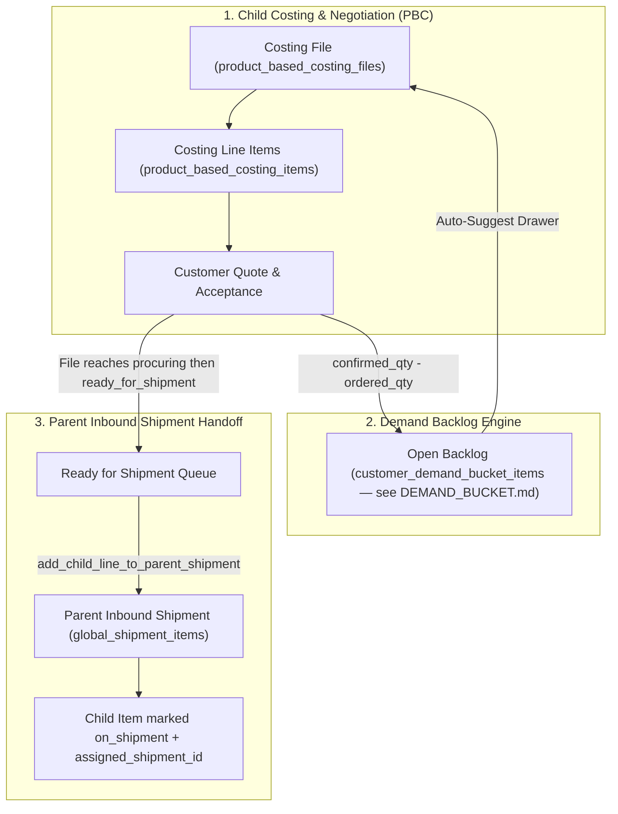
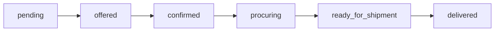

# Product-Based Costing (PBC) & Demand Backlog Module

The **Product-Based Costing (PBC)** domain manages B2B pre-order costing files, dynamic item pricing formulas, customer demand backlog tracking, and downstream demand handoff to parent procurement shipments.

---

## 1. Domain Architecture & The Demand-to-Shipment Flow

Costing files allow sister concerns (child tenants) to assemble custom product quotes for buyers, negotiate quantities, and transfer confirmed demand directly into parent inbound shipments:



---

## 2. Core Domain Engines & Business Algorithms

### 2.1 Auxiliary Costing & Markup Formula
Calculates unit costs and customer prices for overseas products (GBP $\rightarrow$ BDT):

$$\text{Item Unit Cost GBP} = \text{Web Base Price} + \text{Delivery Surcharge} + \text{Item Type Surcharge}$$

$$\text{Quoted Unit Price BDT} = (\text{Item Unit Cost GBP} \times \text{FX Transaction Rate}) \times (1 + \text{Customer Group Markup Rate})$$

### 2.2 Demand Backlog Engine
Unfulfilled customer demand automatically forms a reusable demand backlog attached to the customer's `billing_profile_id`. **Target shared model:** [`doc/shop_order/DEMAND_BUCKET.md`](../shop_order/DEMAND_BUCKET.md) (`customer_demand_bucket_items`). Until migration, PBC uses `product_based_costing_backlog_items`.

Legacy PBC-only rules (to be unified):

| Line Outcome | Item Status | Backlog Action | Eligible for Parent Shipment |
| :--- | :--- | :--- | :---: |
| **Fully Fulfilled** | `accepted` (`ordered_qty = confirmed_qty`) | Clear backlog record | **YES** (`ordered_qty`) |
| **Partially Fulfilled** | `partial` (`0 < ordered_qty < confirmed_qty`)| Upsert backlog (`confirmed_qty - ordered_qty`) | **YES** (`ordered_qty`) |
| **Out of Stock / Unavailable** | `unavailable` (`ordered_qty = 0`) | Upsert backlog (`confirmed_qty`) | **NO** |
| **Customer Rejected** | `rejected` | None | **NO** |

* **One-Click Add**: The auto-suggest drawer ([`PbcBacklogSuggestDrawer.vue`](file:///Users/daviditc/Documents/personal_projects/brandwala-wholesale-quasar-v2/web/src/modules/product_based_costing/components/PbcBacklogSuggestDrawer.vue)) enables ops staff to pull open backlog into new costing batches with zero retyping.

### 2.3 Costing file status model (`product_based_costing_files.status`)

Quote and negotiation phases are **unchanged**. Procurement phases are **aligned with catalog shop orders** ([`CATALOG_NEGOTIATION.md`](../shop_order/CATALOG_NEGOTIATION.md) §2.1).

#### Quote phase (unchanged)

| Status | Who acts | Meaning |
| :--- | :--- | :--- |
| `pending` | Staff / customer | Draft — building the quote |
| `offered` | Customer | Quote sent — customer review |
| `confirmed` | Staff | Customer accepted — procurement may start |

#### Procurement phase (shared with catalog orders)

| Status | Who acts | Meaning |
| :--- | :--- | :--- |
| `procuring` | Staff | Buying from vendor / placing order with supplier |
| `ready_for_shipment` | Staff | Procurement complete; lines eligible for parent inbound shipment pull |
| `delivered` | Staff | Goods received / file closed from customer view |
| `cancelled` | Either | Voided at any step |

```text
pending → offered → confirmed → procuring → ready_for_shipment → delivered
```

(`cancelled` can occur from any status above.)



#### Statuses to stop using (procurement only)

| Legacy status | Action |
| :--- | :--- |
| `placing_order` | Rename / migrate to `procuring` |
| `invoicing` | Remove from file workflow — billing via `global_invoices` (see [`SALES_INVOICE.md`](../sales_invoice/SALES_INVOICE.md)) |
| `ordered` | Do not use on PBC files (catalog legacy only) |

**Parent shipment pull** still requires `ready_for_shipment` (`add_child_line_to_parent_shipment`).

---

## 3. Page & Component Inventory

| Route | Main Page | Key Child Components & Dialogs |
| :--- | :--- | :--- |
| `/:tenantSlug?/app/product-based-costing` | [`ProductBasedCostingPage.vue`](file:///Users/daviditc/Documents/personal_projects/brandwala-wholesale-quasar-v2/web/src/modules/product_based_costing/pages/ProductBasedCostingPage.vue) | Status filter tabs, customer profile selector, [`ProductBasedCostingFileDialog.vue`](file:///Users/daviditc/Documents/personal_projects/brandwala-wholesale-quasar-v2/web/src/modules/product_based_costing/components/ProductBasedCostingFileDialog.vue) |
| `/:tenantSlug?/app/product-based-costing/:id` | [`ProductBasedCostingFileDetailsPage.vue`](file:///Users/daviditc/Documents/personal_projects/brandwala-wholesale-quasar-v2/web/src/modules/product_based_costing/pages/ProductBasedCostingFileDetailsPage.vue) | [`ProductBasedCostingItemsTable.vue`](file:///Users/daviditc/Documents/personal_projects/brandwala-wholesale-quasar-v2/web/src/modules/product_based_costing/components/ProductBasedCostingItemsTable.vue), [`PbcBacklogSuggestDrawer.vue`](file:///Users/daviditc/Documents/personal_projects/brandwala-wholesale-quasar-v2/web/src/modules/product_based_costing/components/PbcBacklogSuggestDrawer.vue), [`AddCostingItemsDrawer.vue`](file:///Users/daviditc/Documents/personal_projects/brandwala-wholesale-quasar-v2/web/src/modules/product_based_costing/components/AddCostingItemsDrawer.vue), [`ProductBasedCostingFileWorkflowBar.vue`](file:///Users/daviditc/Documents/personal_projects/brandwala-wholesale-quasar-v2/web/src/modules/product_based_costing/components/ProductBasedCostingFileWorkflowBar.vue) |
| `/:tenantSlug?/app/product-based-costing/:id/preview` | [`ProductBasedCostingSharedPreviewPage.vue`](file:///Users/daviditc/Documents/personal_projects/brandwala-wholesale-quasar-v2/web/src/modules/product_based_costing/pages/ProductBasedCostingSharedPreviewPage.vue) | Customer-facing exportable quote sheet (PDF / Excel download) |

---

## 4. Page to API / RPC Matrix

| Component | Action / Trigger | Hook / Endpoint | Caching Strategy |
| :--- | :--- | :--- | :--- |
| **`ProductBasedCostingPage`** | Mount / Filter Change | `useProductBasedCostingFilesQuery()` $\rightarrow$ `Table: product_based_costing_files` | `staleTime: 30s`, Key: `['productBasedCosting', 'files', params]` |
| **`ProductBasedCostingFileDialog`**| Create New Costing Batch| `useProductBasedCostingFileMutations()` $\rightarrow$ `RPC: create_costing_file` | Invalidates `['productBasedCosting', 'files']` |
| **`PbcBacklogSuggestDrawer`** | Mount / Profile Select | `usePbcBacklog()` $\rightarrow$ `Table: product_based_costing_backlog_items` | `staleTime: 15s`, Key: `['productBasedCosting', 'backlog', billingProfileId]` |
| **`PbcBacklogSuggestDrawer`** | Pull Backlog into File | `useProductBasedCostingItemMutations()` $\rightarrow$ `RPC: add_pbc_backlog_to_file` | Invalidates backlog & costing items |
| **Parent Shipment UI** | Pull PBC Lines to Cargo | `useProcurementStockMutations` $\rightarrow$ `RPC: add_child_line_to_parent_shipment` | Links `assigned_shipment_id` & marks `on_shipment` |

---

## 5. Query Keys & Server State

Server state keys are centralized in [`productBasedCostingQueryKeys.ts`](file:///Users/daviditc/Documents/personal_projects/brandwala-wholesale-quasar-v2/web/src/modules/product_based_costing/shared/queryKeys/productBasedCostingQueryKeys.ts):

* `productBasedCostingQueryKeys.files(params)` $\rightarrow$ `['productBasedCosting', 'files', params]`
* `productBasedCostingQueryKeys.fileDetails(id)` $\rightarrow$ `['productBasedCosting', 'fileDetails', id]`
* `productBasedCostingQueryKeys.fileItems(fileId)` $\rightarrow$ `['productBasedCosting', 'fileItems', fileId]`
* `productBasedCostingQueryKeys.backlog(profileId)` $\rightarrow$ `['productBasedCosting', 'backlog', profileId]`
