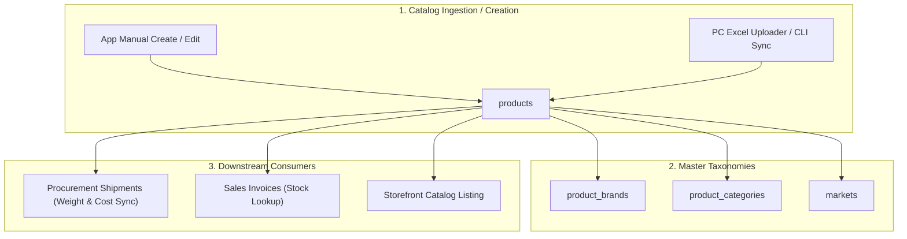

# Products & Master Catalog Module

The **Products** domain manages the master catalog of merchandise, vendor SKUs, barcodes, categories, brands, reference costing, and bulk catalog ingestion (including the Price Check Excel sync pipeline).

---

## 1. Domain Architecture & Multi-Tenant Model

### Catalog Scoping & Hierarchy
In BrandWala / TradeFlow BD, products are owned at the **Parent** warehouse tenant level, while child sister concerns read catalog items for order placement and desk sales:

```text
Product Catalog Hierarchy:
├── parent_tenant_id       = Warehouse owner (inventory boundary)
├── inserted_by_tenant_id  = Actor/tenant that imported or created the SKU
├── vendor_id / vendor_code= Supplier (e.g. Price Check, WTS, Koba)
└── market_code            = Sourcing region (GB, BD, etc.)
```



### Price Check (PC) Excel Import Engine
Bulk import pipeline (`pnpm run pc:uploader` / `pnpm run python:pc`) transforms UK Price Check spreadsheets into catalog rows:
* **Required Headers**: `DESCRIPTION` $\rightarrow$ `name`, `PRODUCT CODE` $\rightarrow$ `product_code`, `BARCODE` $\rightarrow$ `barcode`, `INNER CASE` $\rightarrow$ `minimum_order_quantity`, `PIECE PRICE £` $\rightarrow$ `list_price_amount`, `AVAILABLE UNITS` $\rightarrow$ `available_units`, `IMAGE` $\rightarrow$ `image_url`.
* **Hazardous Filtering**: Rows marked `HAZARDOUS = YES / 1` are automatically dropped from intake.
* **Auto-Taxonomy**: New brands and categories are dynamically upserted into `product_brands` and `product_categories`.

---

## 2. Page & Component Inventory

| Route | Main Page | Key Child Components & Dialogs |
| :--- | :--- | :--- |
| `/:tenantSlug?/app/products` | [`ProductsPage.vue`](file:///Users/daviditc/Documents/personal_projects/brandwala-wholesale-quasar-v2/web/src/modules/products/pages/ProductsPage.vue) | [`ProductGrid.vue`](file:///Users/daviditc/Documents/personal_projects/brandwala-wholesale-quasar-v2/web/src/modules/products/components/ProductGrid.vue), [`ProductFilterDrawer.vue`](file:///Users/daviditc/Documents/personal_projects/brandwala-wholesale-quasar-v2/web/src/modules/products/components/ProductFilterDrawer.vue), [`ProductCreateDialog.vue`](file:///Users/daviditc/Documents/personal_projects/brandwala-wholesale-quasar-v2/web/src/modules/products/components/ProductCreateDialog.vue), [`BulkImportDialog.vue`](file:///Users/daviditc/Documents/personal_projects/brandwala-wholesale-quasar-v2/web/src/modules/products/components/BulkImportDialog.vue) |
| `/:tenantSlug?/app/products/:id` | [`ProductDetailsPage.vue`](file:///Users/daviditc/Documents/personal_projects/brandwala-wholesale-quasar-v2/web/src/modules/products/pages/ProductDetailsPage.vue) | Product pricing matrix, package weight details, stock availability |
| `/:tenantSlug?/app/products/brands` | [`ProductBrandsPage.vue`](file:///Users/daviditc/Documents/personal_projects/brandwala-wholesale-quasar-v2/web/src/modules/products/pages/ProductBrandsPage.vue) | Brand catalog management & vendor association |
| `/:tenantSlug?/app/products/categories` | [`ProductCategoriesPage.vue`](file:///Users/daviditc/Documents/personal_projects/brandwala-wholesale-quasar-v2/web/src/modules/products/pages/ProductCategoriesPage.vue) | Category tree & parent hierarchy |

---

## 3. Page to API / RPC Matrix

| Component | Action / Trigger | Hook / Endpoint | Caching Strategy |
| :--- | :--- | :--- | :--- |
| **`ProductsPage`** | Mount / Filter Change | `useProductListQuery()` $\rightarrow$ `RPC: list_products_paginated` | `staleTime: 60s`, Key: `['products', 'list', params]` |
| **`ProductCreateDialog`** | Save New Product | `useCreateProductMutation()` $\rightarrow$ `Table: products` | Invalidates `['products', 'list']` |
| **`ProductDetailsPage`** | Mount / Refresh | `useProductDetailQuery()` $\rightarrow$ `Table: products` | `staleTime: 60s`, Key: `['products', 'detail', { id }]` |
| **`ProductDetailsPage`** | Update Product / Weights | `useUpdateProductMutation()` $\rightarrow$ `Table: products` | Invalidates `['products', 'detail', { id }]` & `['products', 'list']` |
| **`ProductBrandsPage`** | Mount / Filter | `useBrandsQuery()` $\rightarrow$ `Table: product_brands` | `staleTime: 5m`, Key: `['products', 'brands', params]` |
| **`ProductCategoriesPage`** | Mount / Filter | `useCategoriesQuery()` $\rightarrow$ `Table: product_categories` | `staleTime: 5m`, Key: `['products', 'categories', params]` |
| **`BulkImportDialog`** | Upload JSON / CSV Batch | `productRepository.bulkCreateProducts` $\rightarrow$ `Table: products` | Batch insert, invalidates `['products', 'list']` |

---

## 4. Query Keys & Server State

Server state keys are centralized in [`productsQueryKeys.ts`](file:///Users/daviditc/Documents/personal_projects/brandwala-wholesale-quasar-v2/web/src/modules/products/shared/queryKeys/productsQueryKeys.ts):

* `productsQueryKeys.all` $\rightarrow$ `['products']`
* `productsQueryKeys.lists()` $\rightarrow$ `['products', 'list']`
* `productsQueryKeys.list(params)` $\rightarrow$ `['products', 'list', params]`
* `productsQueryKeys.detail(id)` $\rightarrow$ `['products', 'detail', { id }]`
* `productsQueryKeys.brands(params)` $\rightarrow$ `['products', 'brands', params]`
* `productsQueryKeys.categories(params)` $\rightarrow$ `['products', 'categories', params]`
