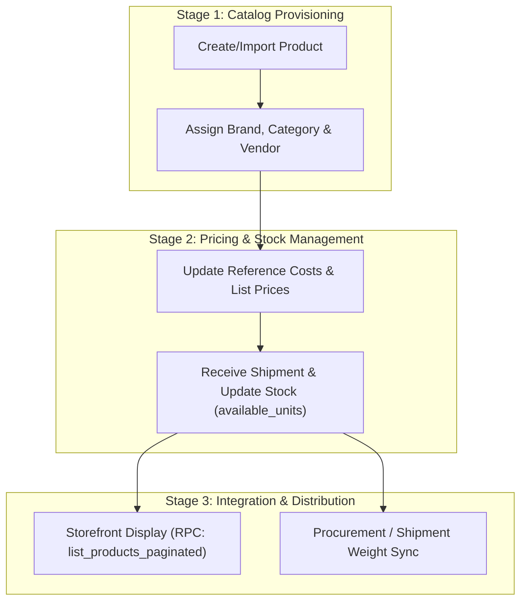

# Product Lifecycle & Workflow Specification

This document details the step-by-step business flow for product catalog management, indexing, stock synchronization, and store distribution.

---

## Lifecycle Overview

---

## Stage 1: Product Provisioning & Import

* **Action**: Tenant admin creates a single product or imports a bulk product batch.
* **Attributes**: `name`, `product_code`, `barcode`, `market_code`, `vendor_id`, `brand`, `category`.
* **API Used**:
  * **Single Create**: `supabase.from('products').insert(singleObject)`
  * **Bulk Import (Batch)**: `supabase.from('products').insert(arrayPayloads).select()` (Sends multiple items in a single HTTP batch request to the `products` table endpoint)

---

## Stage 2: Costing, Pricing & Weight Sync

* **Action**: Update reference costs, list prices, and physical package/product weights.
* **Weight Synchronization**: When processing incoming shipments, unit product weight and package weight are calculated and synced back to `products` (`product_weight`, `package_weight`).
* **API Used**: `supabase.from('products').update(...)`

---

## Stage 3: Querying & Store Distribution

* **Paginated Search & Filter**:
  * Filter catalog by brand, category, vendor code, market code, availability, or free text search.
  * **RPC Function**: `list_products_paginated`
* **Bulk Lookup**:
  * Procurement tools look up products by `product_code` or `barcode` to quickly add items to shipments or orders.
