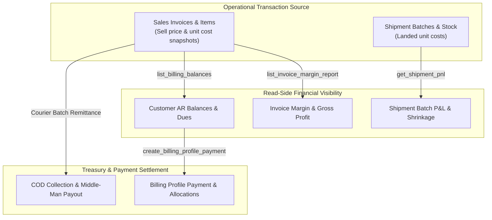

# Reports & Treasury Module

The **Reports & Treasury** domain provides parent-level financial visibility, transaction margin auditing, customer AR balance tracking, and cash collection settlements (including Courier Bulk Remittances).

**Cash in (report 1):** till view of tenant-wallet credits. Spec [`CASH_IN.md`](CASH_IN.md). RPC `get_tenant_cash_in_report`. Route `/app/wallet/cash-in`. Store credit apply is not cash in.

**Customer dues (report 2):** who owes now, aging, credit limit. Spec [`CUSTOMER_DUES.md`](CUSTOMER_DUES.md). RPC `get_customer_dues_report`. Route `/app/finance/reports/customer-dues`. Customer wallet is not the bill.

---

## 1. Domain Architecture & Financial Model

### Read-Side Margin Derivation (No Shadow Ledger)
Profit and margins are derived dynamically from live operational tables without maintaining a separate duplicate accounting ledger.

| Report | Cost source | Notes |
| :--- | :--- | :--- |
| Invoice margin (`list_invoice_margin_report`) | `sales_invoice_items.unit_cost_price` | Snapshot at invoice issue; unchanged by later shipment cost revisions |
| Shipment batch P&L (`get_shipment_pnl`) | Live `landed_cost_bdt` / `calculate_landed_unit_cost` | Reflects current stamped cost until `costs_locked` |

### 3 Core Settlement & Collection Channels

| Settlement Channel | Target Scope | Execution Mechanism |
| :--- | :--- | :--- |
| **1. Billing Profile AR Allocations** | B2B Wholesale / Resellers | Single payment recorded against a customer account and allocated across open invoices (`create_billing_profile_payment_with_allocations`). Same channel as the wholesale **Record Payment** dialog (cash + optional wallet apply). Settlement write-off is invoice-level, not a payment row. |
| **2. Recipient Direct / COD** | Retail Direct / Dropship | Cash/COD received directly from customer or courier recorded against invoice balance (`record_recipient_invoice_collection`). |
| **3. Courier Bulk Remittance** | Multi-Order Dropship Batch | Batch settlement matching total bank net deposits against dozens of delivered orders with automated variance checks. |

---

## 2. Page & Component Inventory

| Route | Main Page | Key Child Components |
| :--- | :--- | :--- |
| `/:tenantSlug?/app/finance/dashboard` | [`ParentDashboardPage.vue`](file:///Users/daviditc/Documents/personal_projects/brandwala-wholesale-quasar-v2/web/src/modules/reporting_treasury/pages/ParentDashboardPage.vue) | [`TreasuryStatGrid.vue`](file:///Users/daviditc/Documents/personal_projects/brandwala-wholesale-quasar-v2/web/src/modules/reporting_treasury/components/TreasuryStatGrid.vue), revenue vs margin trend graphs |
| `/:tenantSlug?/app/finance/invoices` | [`InvoiceMarginReportPage.vue`](file:///Users/daviditc/Documents/personal_projects/brandwala-wholesale-quasar-v2/web/src/modules/reporting_treasury/pages/InvoiceMarginReportPage.vue) | [`TreasuryFilterBar.vue`](file:///Users/daviditc/Documents/personal_projects/brandwala-wholesale-quasar-v2/web/src/modules/reporting_treasury/components/TreasuryFilterBar.vue), [`TreasuryTableWrap.vue`](file:///Users/daviditc/Documents/personal_projects/brandwala-wholesale-quasar-v2/web/src/modules/reporting_treasury/components/TreasuryTableWrap.vue) |
| `/:tenantSlug?/app/finance/invoices/:id` | [`InvoiceMarginDetailPage.vue`](file:///Users/daviditc/Documents/personal_projects/brandwala-wholesale-quasar-v2/web/src/modules/reporting_treasury/pages/InvoiceMarginDetailPage.vue) | Line-by-line item cost vs sell price margin, return deductions |
| `/:tenantSlug?/app/finance/shipments` | [`ShipmentsListPage.vue`](file:///Users/daviditc/Documents/personal_projects/brandwala-wholesale-quasar-v2/web/src/modules/reporting_treasury/pages/ShipmentsListPage.vue) | Shipment batch landed cost vs realized revenue table |
| `/:tenantSlug?/app/finance/shipments/:id`| [`ShipmentPnLDetailsPage.vue`](file:///Users/daviditc/Documents/personal_projects/brandwala-wholesale-quasar-v2/web/src/modules/reporting_treasury/pages/ShipmentPnLDetailsPage.vue) | Batch gross profit, unsold inventory value, shrinkage & damage breakdown |
| `/:tenantSlug?/app/finance/balances` | [`BillingBalancesPage.vue`](file:///Users/daviditc/Documents/personal_projects/brandwala-wholesale-quasar-v2/web/src/modules/reporting_treasury/pages/BillingBalancesPage.vue) | Customer AR due balances, credit limits, payment allocation modal |
| `/:tenantSlug?/app/finance/payments` | [`PaymentsListPage.vue`](file:///Users/daviditc/Documents/personal_projects/brandwala-wholesale-quasar-v2/web/src/modules/reporting_treasury/pages/PaymentsListPage.vue) | Received payment logs, bank references, allocation status |
| `/:tenantSlug?/app/finance/payments/:id` | [`PaymentDetailPage.vue`](file:///Users/daviditc/Documents/personal_projects/brandwala-wholesale-quasar-v2/web/src/modules/reporting_treasury/pages/PaymentDetailPage.vue) | Payment allocation breakdown across invoices |
| `/:tenantSlug?/app/finance/reports/cash-in` | [`CashInReportPage.vue`](file:///Users/david/Documents/personal_projects/brandwala-wholesale-quasar-v2/web/src/modules/reporting_treasury/pages/CashInReportPage.vue) | Till view of tenant wallet incoming credits, method breakdown, CSV export |
| `/:tenantSlug?/app/finance/investors` | [`InvestorReportsPage.vue`](file:///Users/daviditc/Documents/personal_projects/brandwala-wholesale-quasar-v2/web/src/modules/reporting_treasury/pages/InvestorReportsPage.vue) | Investor capital performance & profit share summaries |

---

## 3. Page to API / RPC Matrix

| Component | Action / Trigger | Hook / Endpoint | Caching Strategy |
| :--- | :--- | :--- | :--- |
| **`CashInReportPage`** | Mount / Filter Change | `walletReportsRepository.fetchCashInReport` $\rightarrow$ `RPC: get_tenant_cash_in_report` | `staleTime: 30s`, Key: `walletQueryKeys.cashIn` |
| **`InvoiceMarginReportPage`** | Mount / Filter Change | `treasuryRepository.listInvoiceMarginReport` $\rightarrow$ `RPC: list_invoice_margin_report` | `staleTime: 30s`, Key: `['finance', 'invoices', query]` |
| **`InvoiceMarginDetailPage`** | Mount / Refresh | `treasuryRepository.getInvoiceMarginDetail` $\rightarrow$ `RPC: get_invoice_margin_detail` | `staleTime: 30s`, Key: `['finance', 'invoice_margin', id]` |
| **`ShipmentPnLDetailsPage`** | Mount / Refresh | `treasuryRepository.getShipmentPnL` $\rightarrow$ `Table/RPC: shipment_pnl` | `staleTime: 30s`, Key: `['finance', 'shipment_pnl', id]` |
| **`BillingBalancesPage`** | Mount / Search | `treasuryRepository.listBillingBalances` $\rightarrow$ `RPC: list_billing_balances` | `staleTime: 30s`, Key: `['finance', 'balances', search]` |
| **`BillingBalancesPage`** | Settle Customer Dues | `treasuryRepository.createPaymentWithAllocations` $\rightarrow$ `RPC: create_billing_profile_payment_with_allocations` | Invalidates balances & invoice caches |
| **`PaymentsListPage`** | Mount / Refresh | `treasuryRepository.listPayments` $\rightarrow$ `Table: global_payments` | `staleTime: 30s`, Key: `['finance', 'payments', filters]` |
| **Dropship Remittance** | Record COD Remittance | `treasuryRepository.recordRecipientInvoiceCollection` $\rightarrow$ `RPC: record_recipient_invoice_collection` | Invalidates invoice dues & ledger |

