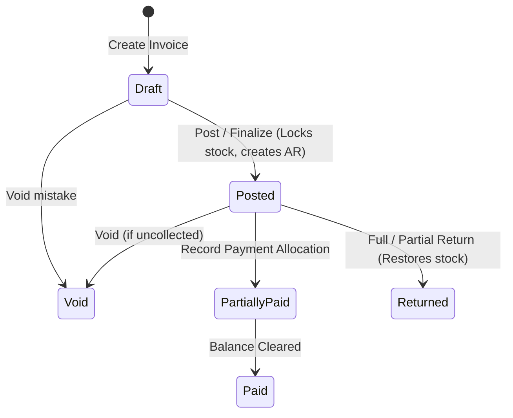
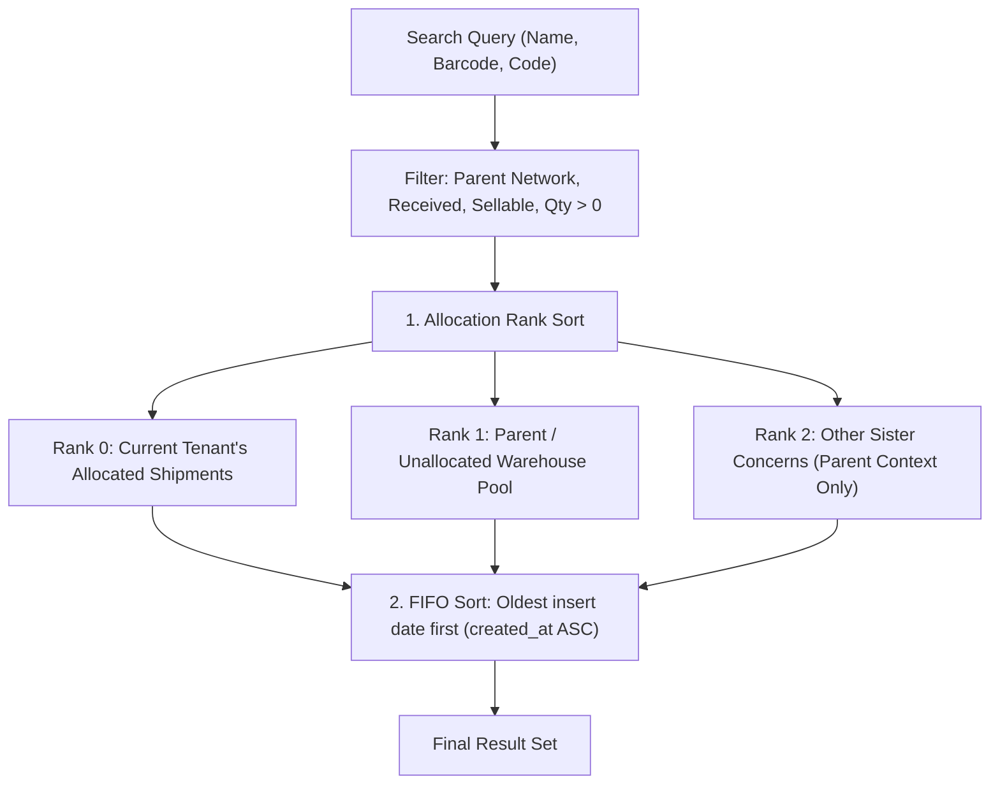
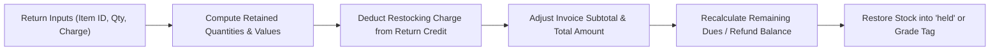

# Sales & Invoice Module

The **Sales & Invoice** domain manages desk sales, multi-channel invoice issuance (Wholesale B2B, Retail, Dropship), customer billing profiles, delivery recipient endpoints, and inventory-backed invoice returns.

---

## 1. Domain Architecture & Multi-Tenant Model

### Parent-Child Ownership Principle
In BrandWala / TradeFlow BD, inventory and accounting books are owned at the **Parent** tenant level, while sister concerns (child tenants) perform selling and desk operations:

```text
One Sale = One Row in `sales_invoices`
├── parent_tenant_id    = Owner of inventory stock and financial ledger
├── issued_by_tenant_id = Selling child tenant (controls brand header & print layout)
├── Child UI            = Operational desk view for issuing, selling & printing
└── Parent UI           = Consolidated books & margin auditing view
```

### Invoice Lifecycle & State Machine



### Multi-Channel Invoice Types

| Invoice Type | Buyer Counterparty | Financial & Delivery Model |
| :--- | :--- | :--- |
| **Wholesale** | `billing_profiles` | B2B credit sale; buyer is recipient; payment recorded against buyer AR account ledger. |
| **Retail (Account)** | `billing_profiles` | End customer recipient with delivery charges billed to a regular reseller account. |
| **Retail (Direct)** | Inline Snapshot | One-time direct walk-in customer (no billing profile required). |
| **Dropship** | Middle-Man Profile | Dual invoice: customer packing slip @ processing + B2B accounting invoice @ ready-for-pickup. |

---

## 2. Core Domain Engines & Business Algorithms

### 2.1 Stock Search & Allocation Engine (`search_sales_invoice_stock`)
Powers product selection during invoice creation, enforcing **Allocation Priority** and **Strict FIFO**:



* **Allocation Ranking**:
  * **Rank 0 (`is_allocated_to_tenant = TRUE`)**: Items allocated to `global_shipments.assigned_child_tenant_id = p_tenant_id`.
  * **Rank 1**: Items in general warehouse pool (`assigned_child_tenant_id IS NULL`).
  * **Rank 2**: Items assigned to another sister concern (visible only in parent books context).
* **FIFO Sorting**: `ORDER BY allocation_rank ASC, gs.created_at ASC, gs.id ASC` ensures aging stock is sold first.

---

### 2.2 Invoice Numbering Sequence Engine (`generate_sales_invoice_number`)
Generates daily collision-free, human-readable invoice numbers:

$$\text{INV}-\{\text{TYPE}\}-\{\text{YYYYMMDD}\}-\{\text{SEQ}\}$$

| Type | Code | Example Output | Description |
| :--- | :---: | :--- | :--- |
| **Wholesale** | `WS` | `INV-WS-20260820-0001` | B2B bulk sales billed to Customer Billing Profile |
| **Retail** | `RT` | `INV-RT-20260820-0001` | Direct retail consumer & account invoices |
| **Dropship** | `DS` | `INV-DS-20260820-0001` | Reseller / dropship fulfillment invoices |

* **Concurrency Safety**: Maintained in `sales_invoice_counters` with atomic UPSERT increments.
* **Auto-Resolution**: If `p_invoice_no` is omitted on create, the database automatically invokes this engine.

---

### 2.3 Wholesale Return & Restocking Engine (`process_wholesale_invoice_return`)
Processes full or partial invoice line returns with recalculation of retained revenue, customer dues, and inventory restock:



* **Quantity Bounding**: $0 \le \text{return\_qty} \le (\text{invoiced\_qty} - \text{previously\_returned\_qty})$.
* **Financial Recalculation**:
  $$\text{New Subtotal} = \sum (\text{Retained Qty} \times \text{Unit Sell Price} - \text{Line Discount})$$
  $$\text{New Total} = \max(\text{New Subtotal} - \text{Header Discount} + \text{Return Charge}, 0)$$
  $$\text{New Due} = \max(\text{New Total} - \text{Paid Amount}, 0)$$
  $$\text{Refund Due to Customer} = \max(\text{Paid Amount} - \text{New Total}, 0)$$
* **Inventory Restoration**: Returned physical items are restored to inventory with `held` availability for quality inspection.

---

## 3. Page & Component Inventory

| Route | Main Page | Key Child Components & Dialogs |
| :--- | :--- | :--- |
| `/:tenantSlug?/app/sales/invoices` | [`InvoiceOverviewPage.vue`](file:///Users/daviditc/Documents/personal_projects/brandwala-wholesale-quasar-v2/web/src/modules/sales_invoice/pages/InvoiceOverviewPage.vue) | High-level metrics, daily invoice counts, quick actions |
| `/:tenantSlug?/app/sales/invoices/list` | [`InvoicesListPage.vue`](file:///Users/daviditc/Documents/personal_projects/brandwala-wholesale-quasar-v2/web/src/modules/sales_invoice/pages/InvoicesListPage.vue) | Compact table toolbar, filter chips, invoice status badges |
| `/:tenantSlug?/app/sales/invoices/create-wholesale` | [`CreateWholesaleInvoicePage.vue`](file:///Users/daviditc/Documents/personal_projects/brandwala-wholesale-quasar-v2/web/src/modules/sales_invoice/pages/CreateWholesaleInvoicePage.vue) | [`NetworkStockSearchPanel.vue`](file:///Users/daviditc/Documents/personal_projects/brandwala-wholesale-quasar-v2/web/src/modules/sales_invoice/components/NetworkStockSearchPanel.vue), [`InvoiceBulkPasteDialog.vue`](file:///Users/daviditc/Documents/personal_projects/brandwala-wholesale-quasar-v2/web/src/modules/sales_invoice/components/InvoiceBulkPasteDialog.vue) |
| `/:tenantSlug?/app/sales/invoices/:id` | [`InvoiceDetailsPage.vue`](file:///Users/daviditc/Documents/personal_projects/brandwala-wholesale-quasar-v2/web/src/modules/sales_invoice/pages/InvoiceDetailsPage.vue) | [`WholesaleIssueConfirmDialog.vue`](file:///Users/daviditc/Documents/personal_projects/brandwala-wholesale-quasar-v2/web/src/modules/sales_invoice/components/WholesaleIssueConfirmDialog.vue), [`BillingProfileEditDialog.vue`](file:///Users/daviditc/Documents/personal_projects/brandwala-wholesale-quasar-v2/web/src/modules/sales_invoice/components/BillingProfileEditDialog.vue) |
| `/:tenantSlug?/app/sales/invoices/:id/return` | [`WholesaleInvoiceReturnPage.vue`](file:///Users/daviditc/Documents/personal_projects/brandwala-wholesale-quasar-v2/web/src/modules/sales_invoice/pages/WholesaleInvoiceReturnPage.vue) | Return line item table, restocking fee calculation, restock destination selector |
| `/:tenantSlug?/app/sales/invoices/:id/preview` | [`InvoicePreviewPage.vue`](file:///Users/daviditc/Documents/personal_projects/brandwala-wholesale-quasar-v2/web/src/modules/sales_invoice/pages/InvoicePreviewPage.vue) | Print-ready invoice voucher with brand logo & barcode |
| `/:tenantSlug?/app/sales/invoices/recipient-profiles` | [`RecipientProfilesPage.vue`](file:///Users/daviditc/Documents/personal_projects/brandwala-wholesale-quasar-v2/web/src/modules/sales_invoice/pages/RecipientProfilesPage.vue) | Delivery recipient addressbook |
| `/:tenantSlug?/app/sales/invoices/brands` | [`InvoiceBrandsPage.vue`](file:///Users/daviditc/Documents/personal_projects/brandwala-wholesale-quasar-v2/web/src/modules/sales_invoice/pages/InvoiceBrandsPage.vue) | Invoice print brand templates & styling |

---

## 4. Page to API / RPC Matrix

| Component | Action / Trigger | Hook / Endpoint | Caching Strategy |
| :--- | :--- | :--- | :--- |
| **`InvoicesListPage`** | Mount / Filter Change | `useQuery` $\rightarrow$ `Table: sales_invoices` | `staleTime: 30s`, Key: `['sales_invoice', 'list', parentTenantId, params]` |
| **`CreateWholesaleInvoicePage`** | Search Stock Barcode/Name | `useQuery` $\rightarrow$ `RPC: search_sales_invoice_stock` | `staleTime: 10s`, Key: `['sales_invoice', 'stock_search', tenantId, query]` |
| **`CreateWholesaleInvoicePage`** | Click "Issue Invoice" | `useMutation` $\rightarrow$ `RPC: issue_wholesale_invoice` | Invalidates `['sales_invoice', 'list']`, navigates to detail |
| **`InvoiceDetailsPage`** | Mount / Refresh | `useQuery` $\rightarrow$ `RPC: list_global_invoice_items` | `staleTime: 30s`, Key: `['sales_invoice', 'detail', invoiceId]` |
| **`InvoiceDetailsPage`** | Click "Post Invoice" | `useMutation` $\rightarrow$ `RPC: post_sales_invoice` | Invalidates `['sales_invoice', 'detail', id]` and `['sales_invoice', 'list']` |
| **`InvoiceDetailsPage`** | Click "Void Invoice" | `useMutation` $\rightarrow$ `RPC: void_sales_invoice` | Invalidates `['sales_invoice', 'detail', id]` and `['sales_invoice', 'list']` |
| **`InvoiceDetailsPage`** | Apply Settlement Discount | `useMutation` $\rightarrow$ `RPC: apply_global_invoice_settlement_discount` | Invalidates `['sales_invoice', 'detail', id]` |
| **`WholesaleInvoiceReturnPage`** | Submit Return | `useMutation` $\rightarrow$ `RPC: process_wholesale_invoice_return` | Invalidates `['sales_invoice', 'detail', id]` & stock caches |
| **`RecipientProfilesPage`** | Search Recipient Phone | `useQuery` $\rightarrow$ `RPC: get_recipient_profile_by_phone` | `staleTime: 60s`, Key: `['sales_invoice', 'recipient_phone', phone]` |

---

## 5. Query Keys & Server State

Server state keys are centralized in [`salesInvoiceQueryKeys.ts`](file:///Users/daviditc/Documents/personal_projects/brandwala-wholesale-quasar-v2/web/src/modules/sales_invoice/services/salesInvoiceQueryKeys.ts):

* `salesInvoiceQueryKeys.root` $\rightarrow$ `['sales_invoice']`
* `salesInvoiceQueryKeys.list(parentTenantId, params)` $\rightarrow$ `['sales_invoice', 'list', parentTenantId, params]`
* `salesInvoiceQueryKeys.stockSearch(tenantId, query)` $\rightarrow$ `['sales_invoice', 'stock_search', tenantId, query]`
* `salesInvoiceQueryKeys.walletBalances(tenantId)` $\rightarrow$ `['sales_invoice', 'wallet_balances', tenantId]`
* `salesInvoiceQueryKeys.brands(tenantId)` $\rightarrow$ `['sales_invoice', 'brands', tenantId]`
