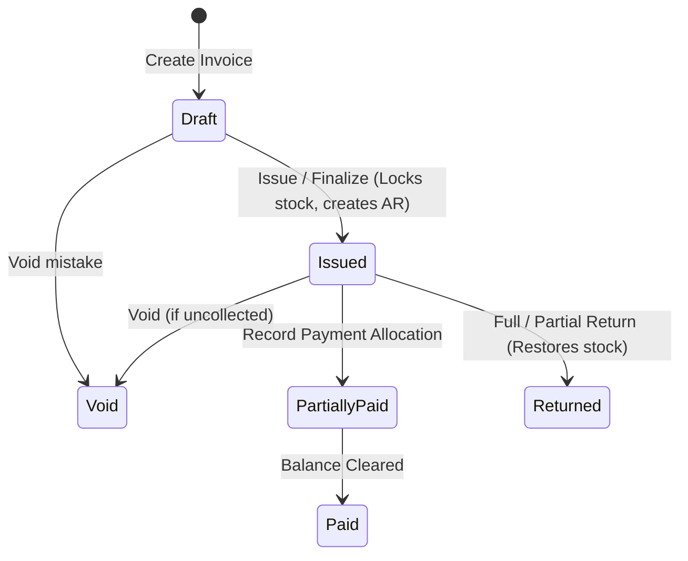
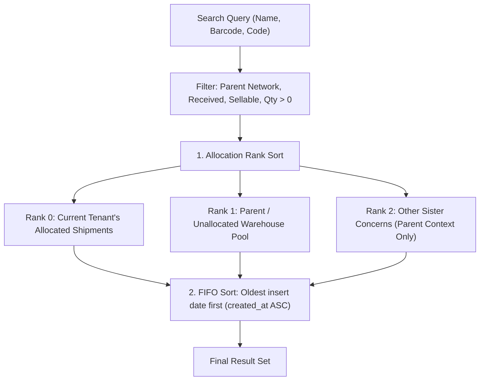
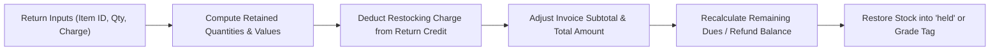
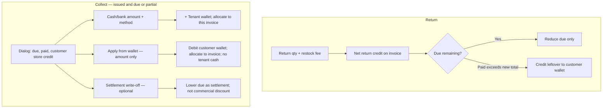

# Sales & Invoice Module

The **Sales & Invoice** domain manages desk sales, multi-channel invoice issuance (Wholesale B2B, Retail, Dropship), customer billing profiles, delivery recipient endpoints, and inventory-backed invoice returns.

---

## 1. Domain Architecture & Multi-Tenant Model

### Parent-Child Ownership Principle
In BrandWala / TradeFlow BD, inventory and accounting books are owned at the **Parent** tenant level, while sister concerns (child tenants) perform selling and desk operations:

```text
One Sale = One Row in `sales_invoices`
├── parent_tenant_id    = Owner of inventory stock and financial ledger
├── issued_by_tenant_id = Selling child tenant (controls brand header & print layout)
├── Child UI            = Operational desk view for issuing, selling & printing
└── Parent UI           = Consolidated books & margin auditing view
```

### Invoice Lifecycle & State Machine



### Multi-Channel Invoice Types

| Invoice Type | Buyer Counterparty | Financial & Delivery Model |
| :--- | :--- | :--- |
| **Wholesale** | `billing_profiles` | B2B credit sale; buyer is recipient; payment recorded against buyer AR account ledger. |
| **Retail (Account)** | `billing_profiles` | End customer recipient with delivery charges billed to a regular reseller account. |
| **Retail (Direct)** | Inline Snapshot | One-time direct walk-in customer (no billing profile required). |
| **Dropship** | Middle-Man Profile | Dual invoice: customer packing slip @ processing + B2B accounting invoice @ ready-for-pickup. |

### Proposed unified create RPC (design only)

See [`CREATE_INVOICE_FROM_PAYLOAD_RPC.md`](./CREATE_INVOICE_FROM_PAYLOAD_RPC.md) for the `create_invoice_from_payload` spec: one payload with header + items for wholesale, retail, and dropship.

Implemented as `create_sales_invoice_from_payload` — see migration `20270831410000_create_sales_invoice_from_payload.sql`.

### Unified update RPC (patch by payload)

See [`UPDATE_INVOICE_FROM_PAYLOAD_RPC.md`](./UPDATE_INVOICE_FROM_PAYLOAD_RPC.md) for `update_sales_invoice_from_payload`: send only the fields to change on draft/proforma invoices.

---

## 2. Core Domain Engines & Business Algorithms

### 2.1 Stock Search & Allocation Engine (`search_sales_invoice_stock`)
Powers product selection during invoice creation, enforcing **Allocation Priority** and **Strict FIFO**:



* **Allocation Ranking**:
  * **Rank 0 (`is_allocated_to_tenant = TRUE`)**: Items allocated to `global_shipments.assigned_child_tenant_id = p_tenant_id`.
  * **Rank 1**: Items in general warehouse pool (`assigned_child_tenant_id IS NULL`).
  * **Rank 2**: Items assigned to another sister concern (visible only in parent books context).
* **FIFO Sorting**: `ORDER BY allocation_rank ASC, gs.created_at ASC, gs.id ASC` ensures aging stock is sold first.
* **Line Item ATP Resolution (`list_global_invoice_items`)**:
  * For draft / proforma invoices, returns live available stock + the draft line's quantity:
    $$\text{available\_atp} = \text{global\_stock\_atp\_qty}(\text{global\_stock\_id}) + \text{draft\_item.quantity}$$
  * For issued / voided invoices, returns the current warehouse ATP:
    $$\text{available\_atp} = \text{global\_stock\_atp\_qty}(\text{global\_stock\_id})$$

---

### 2.2 Invoice Numbering Sequence Engine (`generate_sales_invoice_number`)
Generates daily collision-free, human-readable invoice numbers:

$$\text{INV}-\{\text{TYPE}\}-\{\text{YYYYMMDD}\}-\{\text{SEQ}\}$$

| Type | Code | Example Output | Description |
| :--- | :---: | :--- | :--- |
| **Wholesale** | `WS` | `INV-WS-20260820-0001` | B2B bulk sales billed to Customer Billing Profile |
| **Retail** | `RT` | `INV-RT-20260820-0001` | Direct retail consumer & account invoices |
| **Dropship** | `DS` | `INV-DS-20260820-0001` | Reseller / dropship fulfillment invoices |

* **Concurrency Safety**: Maintained in `sales_invoice_counters` with atomic UPSERT increments.
* **Auto-Resolution**: If `p_invoice_no` is omitted on create, the database automatically invokes this engine.

---

### 2.3 Wholesale Return & Restocking Engine (`process_wholesale_invoice_return`)
Processes full or partial invoice line returns with recalculation of retained revenue, customer dues, and inventory restock:



* **Locked document rule (industry)**: After issue, **sold `quantity` never changes**. The return is a **credit**: `return_quantity` is added on the same line. Payment status does not rewrite qty. Unpaid invoices only reduce remaining due; if paid (or credit exceeds remaining due), leftover paid becomes refund / wallet credit.
* **Quantity Bounding**: $0 \le \text{return\_qty} \le (\text{invoiced\_qty} - \text{previously\_returned\_qty})$.
* **Financial Recalculation**:
  $$\text{Original Gross Subtotal} = \sum (\text{Original Qty} \times \text{Unit Sell Price} - \text{Line Discount})$$
  $$\text{Return Deduction} = \sum (\text{Return Qty} \times \text{Unit Sell Price})$$
  $$\text{New Subtotal} = \sum (\text{Retained Qty} \times \text{Unit Sell Price} - \text{Line Discount})$$
  $$\text{New Total} = \max(\text{New Subtotal} - \text{Header Discount} + \text{Return Charge}, 0)$$
  $$\text{New Due} = \max(\text{New Total} - \text{Paid Amount}, 0)$$
  $$\text{Refund Due to Customer} = \max(\text{Paid Amount} - \text{New Total}, 0)$$
* **Transparency & Invoice Presentation**:
  - **Line Items**: Sold qty stays. When any line has a return, a read-only **Returned** column shows return qty and kept qty. Line total shows original struck through and **net after credit**.
  - **Totals Summary**: Original subtotal, **Return credit (−BDT)**, discount, **Invoice total (net)**, paid, balance due. Same on wholesale create/edit when returns exist.
  - **Returns Log Card**: Displays itemized return log history (date, item, quantity returned, note, and return restocking target).
* **Inventory Restoration**: Returned physical items are restored to inventory with `held` availability for quality inspection.
* **Restock fee vs wallet credit**:
  - Restock / return handling charge is subtracted from return credit **on the invoice**. It is not a customer-wallet debit.
  - Remaining due is reduced first. **Do not** credit the customer wallet while the invoice still has due.
  - If paid exceeds the new invoice total, leftover is **customer store credit** (`refund_method = wallet_credit`) or cash payout. That is the only return path that writes the customer wallet.
* **RPC contract (`process_wholesale_invoice_return`)**: Must not rewrite sold `quantity`. Must add `return_quantity`, persist net `line_total_amount`, recompute header total/due, and post customer-wallet credit **only** when `excess_paid > 0` and method is `wallet_credit`. `issue_wholesale_invoice` must **not** post `invoice_billed` to the customer wallet (wholesale is AR, not wallet billing).

---

### 2.4 Wholesale Collection, Store Credit & Settlement

Wholesale due lives on the **invoice AR** (`paid_amount` / `due_amount` / payment allocations). The customer wallet is **store credit**, not the wholesale bill. Tenant wallet is **operating cash**.



| Pot | Field | Wallet effect | Invoice effect |
| :--- | :--- | :--- | :--- |
| **Cash / bank** | Amount + payment method | Credit **tenant** wallet (`metadata.method` for Cash in) | Payment allocation; `paid_amount` up |
| **From credit** | Amount only (max = min(store credit, remaining due)) | Debit **customer** wallet | Payment allocation; no tenant cash |
| **Settlement** | Amount (max = leftover due after cash + credit) | None | `settlement_amount` (or equivalent) write-off; **must not** mutate header `discount_amount` |

**Atomic collect rule**: `cash + wallet_apply + settlement ≤ due`. One desk RPC (or one transaction wrapping existing treasury RPCs) so partial failure cannot credit cash without allocating the invoice.

**RPC correction (target contract)**

| RPC | Role | Required behavior |
| :--- | :--- | :--- |
| `issue_wholesale_invoice` | Issue | Stock + AR only. No customer `invoice_billed` ledger row. |
| `process_wholesale_invoice_return` | Return | Sold qty unchanged; restock fee on invoice; wallet credit only on overpayment. |
| `create_billing_profile_payment_with_allocations` | Cash / bank collect | Allocate to **this** invoice; post tenant cash via `record_ledger_transaction`. Reuse from treasury; do not invent a second payment table. |
| Wallet apply (extend collect RPC or `transfer_wallet_funds` + allocation) | Store credit | Debit customer entity wallet; allocate as payment `method = wallet_credit`. |
| `apply_global_invoice_settlement_discount` | Settlement | Persist settlement separately from commercial discount; recompute `due_amount` only. |

**History**: Payment and settlement rows render under the invoice (details page). Source of truth is `global_payments` / `invoice_payments` plus settlement audit, not a shadow list. Wallet-credit rows also appear on the customer wallet ledger (`source_type` invoice / return).

---

## 3. Page & Component Inventory

> [!NOTE]
> For the step-by-step user interaction flow, state transitions, and button visibility rules, see [`UI_FLOW.md`](file:///Users/daviditc/Documents/personal_projects/brandwala-wholesale-quasar-v2/doc/sales_invoice/UI_FLOW.md).

The Sales Invoices module uses a single unified navigation entry (`/app/sales/invoices`) that opens the **Invoice Overview Hub**. Sub-views (Invoices list, Create Wholesale, Brands, etc.) are accessed from the hub. Delivery recipients live under **Customers**.

| Route | Main Page | Key Child Components & Dialogs |
| :--- | :--- | :--- |
| `/:tenantSlug?/app/sales/invoices` | [`InvoiceOverviewPage.vue`](file:///Users/daviditc/Documents/personal_projects/brandwala-wholesale-quasar-v2/web/src/modules/sales_invoice/pages/InvoiceOverviewPage.vue) | High-level metrics, hub cards (Wholesale, Retail, Dropship, Invoices List), quick actions |
| `/:tenantSlug?/app/sales/invoices/list` | [`InvoicesListPage.vue`](file:///Users/daviditc/Documents/personal_projects/brandwala-wholesale-quasar-v2/web/src/modules/sales_invoice/pages/InvoicesListPage.vue) | Compact table toolbar, filter chips, invoice status badges |
| `/:tenantSlug?/app/sales/invoices/create-wholesale` | [`CreateWholesaleInvoicePage.vue`](file:///Users/daviditc/Documents/personal_projects/brandwala-wholesale-quasar-v2/web/src/modules/sales_invoice/pages/CreateWholesaleInvoicePage.vue) | Stock search, bulk paste, **Process Return**, **Record Payment** (issued + due/partial), collect dialog |
| `/:tenantSlug?/app/sales/invoices/:id` | [`InvoiceDetailsPage.vue`](file:///Users/daviditc/Documents/personal_projects/brandwala-wholesale-quasar-v2/web/src/modules/sales_invoice/pages/InvoiceDetailsPage.vue) | Issue confirm, collect dialog, **payment / settlement history** below the invoice, return activity |
| `/:tenantSlug?/app/sales/invoices/:id/return` | [`WholesaleInvoiceReturnPage.vue`](file:///Users/daviditc/Documents/personal_projects/brandwala-wholesale-quasar-v2/web/src/modules/sales_invoice/pages/WholesaleInvoiceReturnPage.vue) | Return line item table, restocking fee calculation, restock destination selector |
| `/:tenantSlug?/app/sales/invoices/:id/preview` | [`InvoicePreviewPage.vue`](file:///Users/daviditc/Documents/personal_projects/brandwala-wholesale-quasar-v2/web/src/modules/sales_invoice/pages/InvoicePreviewPage.vue) | Print-ready invoice voucher with brand logo & barcode |
| `/:tenantSlug?/app/sales/invoices/brands` | [`InvoiceBrandsPage.vue`](file:///Users/daviditc/Documents/personal_projects/brandwala-wholesale-quasar-v2/web/src/modules/sales_invoice/pages/InvoiceBrandsPage.vue) | Invoice print brand templates & styling |

---

## 4. Page to API / RPC Matrix

| Component | Action / Trigger | Hook / Endpoint | Caching Strategy |
| :--- | :--- | :--- | :--- |
| **`InvoicesListPage`** | Mount / Filter Change | `useQuery` $\rightarrow$ `Table: sales_invoices` | `staleTime: 30s`, Key: `['sales_invoice', 'list', parentTenantId, params]` |
| **`CreateWholesaleInvoicePage`** | Search Stock Barcode/Name | `useQuery` $\rightarrow$ `RPC: search_sales_invoice_stock` | `staleTime: 10s`, Key: `['sales_invoice', 'stock_search', tenantId, query]` |
| **`CreateWholesaleInvoicePage`** | Click "Issue Invoice" | `useMutation` $\rightarrow$ `RPC: issue_wholesale_invoice` | Invalidates `['sales_invoice', 'list']`, navigates to detail |
| **`CreateWholesaleInvoicePage` / Details** | Click "Record Payment" | `useMutation` $\rightarrow$ collect RPC (cash allocation + optional wallet apply + optional settlement) | Invalidates invoice detail, payments, customer + tenant wallet |
| **`InvoiceDetailsPage`** | Mount / Refresh | `useQuery` $\rightarrow$ `RPC: list_global_invoice_items` + payment allocations | `staleTime: 30s`, Key: `['sales_invoice', 'detail', invoiceId]` |
| **`InvoiceDetailsPage`** | Click "Issue Invoice" | `useMutation` $\rightarrow$ `RPC: issue_sales_invoice` / `issue_wholesale_invoice` | Invalidates `['sales_invoice', 'detail', id]` and `['sales_invoice', 'list']` |
| **`InvoiceDetailsPage`** | Click "Void Invoice" | `useMutation` $\rightarrow$ `RPC: void_sales_invoice` | Invalidates `['sales_invoice', 'detail', id]` and `['sales_invoice', 'list']` |
| **`InvoiceDetailsPage`** | Settlement (in collect dialog or standalone) | `useMutation` $\rightarrow$ `RPC: apply_global_invoice_settlement_discount` | Invalidates `['sales_invoice', 'detail', id]` |
| **`WholesaleInvoiceReturnPage`** | Submit Return | `useMutation` $\rightarrow$ `RPC: process_wholesale_invoice_return` | Invalidates `['sales_invoice', 'detail', id]`, stock, customer wallet if overpaid |
| **`RecipientProfilesPage`** | Search Recipient Phone | `useQuery` $\rightarrow$ `RPC: get_recipient_profile_by_phone` | `staleTime: 60s`, Key: `['sales_invoice', 'recipient_phone', phone]` |

---

## 5. Query Keys & Server State

Server state keys are centralized in [`salesInvoiceQueryKeys.ts`](file:///Users/daviditc/Documents/personal_projects/brandwala-wholesale-quasar-v2/web/src/modules/sales_invoice/services/salesInvoiceQueryKeys.ts):

* `salesInvoiceQueryKeys.root` $\rightarrow$ `['sales_invoice']`
* `salesInvoiceQueryKeys.list(parentTenantId, params)` $\rightarrow$ `['sales_invoice', 'list', parentTenantId, params]`
* `salesInvoiceQueryKeys.stockSearch(tenantId, query)` $\rightarrow$ `['sales_invoice', 'stock_search', tenantId, query]`
* `salesInvoiceQueryKeys.walletBalances(tenantId)` $\rightarrow$ `['sales_invoice', 'wallet_balances', tenantId]`
* `salesInvoiceQueryKeys.brands(tenantId)` $\rightarrow$ `['sales_invoice', 'brands', tenantId]`
