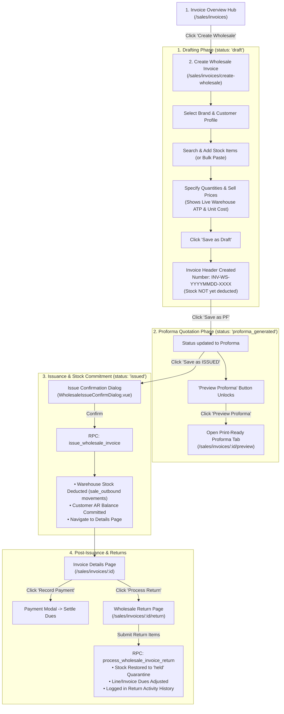

# Sales & Invoice — UI Flow & Interaction Specification

This document defines the standard user interaction flows, route navigations, state-action rules, and validation matrices for the **Sales & Invoice** module.

---

## 1. End-to-End Operator Journey

---

## 2. State & Action Matrix (UI Visibility & Rules)

| Invoice Status | Primary Actions Enabled | Inputs Editable | Action Buttons Visible | Hidden / Disabled Controls |
| :--- | :--- | :--- | :--- | :--- |
| **`draft`** | Add/Remove items, edit Qty/Price, apply discount, change Brand/Customer | All line quantities, sell prices, discounts, header notes, brand, customer | `Save as Draft`, `Save as PF`, `Save as ISSUED` | `Preview Proforma` (hidden until PF), `Record Payment`, `Process Return` |
| **`proforma_generated`** | Print/Send quote, transition to Issued or revert to Draft | Quantities, prices, and header info remain editable before final issue | `Preview Proforma`, `Saved as PF`, `Save as ISSUED`, `Save as Draft` | `Record Payment`, `Process Return` |
| **`issued`** | Record collections, process returns, view print voucher | Read-only (locked to preserve inventory and accounting audit trail) | `Preview / Print`, `RECORD PAYMENT`, `Process Return`, `Void Invoice` (if uncollected) | `Add Stock`, `Bulk Paste`, `Save as Draft` |
| **`voided`** | View history | Read-only | `Delete Voided Invoice` | All operational buttons disabled |

---

## 3. Screen & Dialog Catalog

### 3.1 Create Wholesale Invoice (`/sales/invoices/create-wholesale`)
- **Components**: [`CreateWholesaleInvoicePage.vue`](file:///Users/daviditc/Documents/personal_projects/brandwala-wholesale-quasar-v2/web/src/modules/sales_invoice/pages/CreateWholesaleInvoicePage.vue), [`NetworkStockSearchPanel.vue`](file:///Users/daviditc/Documents/personal_projects/brandwala-wholesale-quasar-v2/web/src/modules/sales_invoice/components/NetworkStockSearchPanel.vue), [`InvoiceBulkPasteDialog.vue`](file:///Users/daviditc/Documents/personal_projects/brandwala-wholesale-quasar-v2/web/src/modules/sales_invoice/components/InvoiceBulkPasteDialog.vue)
- **Rules**:
  - Requires Brand and Customer selection before saving.
  - Displays live warehouse **Available (ATP)** and **Unit Cost** per line.
  - Automatically calculates line subtotal, overall discount, and grand total.

### 3.2 Invoice Details View (`/sales/invoices/:id`)
- **Components**: [`InvoiceDetailsPage.vue`](file:///Users/daviditc/Documents/personal_projects/brandwala-wholesale-quasar-v2/web/src/modules/sales_invoice/pages/InvoiceDetailsPage.vue)
- **Rules**:
  - **Returned Items**: Highlighted with purple `Returned: X` badges and struck-through original prices.
  - **Financial Breakdown**: Displays `Gross Subtotal`, `Less Returns & Adjustments`, `Net Subtotal`, `Paid Amount`, and `Balance Due`.
  - **Return Activity History Card**: Itemized chronological logs of all returns processed on the invoice.

### 3.3 Wholesale Return Engine (`/sales/invoices/:id/return`)
- **Components**: [`WholesaleInvoiceReturnPage.vue`](file:///Users/daviditc/Documents/personal_projects/brandwala-wholesale-quasar-v2/web/src/modules/sales_invoice/pages/WholesaleInvoiceReturnPage.vue)
- **Rules**:
  - Allows selecting individual items and return quantities bounded by $(0 \le \text{return\_qty} \le \text{retained\_qty})$.
  - Restocks items into warehouse quarantine (`held` availability).
  - Automatically recalculates retained invoice totals and offsets customer due balances.
