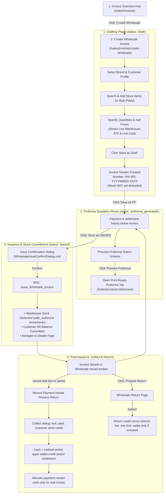

# Sales & Invoice — UI Flow & Interaction Specification

This document defines the standard user interaction flows, route navigations, state-action rules, and validation matrices for the **Sales & Invoice** module.

---

## 1. End-to-End Operator Journey

---

## 2. State & Action Matrix (UI Visibility & Rules)

| Invoice Status | Primary Actions Enabled | Inputs Editable | Action Buttons Visible | Hidden / Disabled Controls |
| :--- | :--- | :--- | :--- | :--- |
| **`draft`** | Add/Remove items, edit Qty/Price, apply discount, change Brand/Customer | All line quantities, sell prices, discounts, header notes, brand, customer | `Save as Draft`, `Save as PF`, `Save as ISSUED` | `Preview Proforma` (hidden until PF), `Record Payment`, `Process Return` |
| **`proforma_generated`** | Print/Send quote, transition to Issued or revert to Draft | Quantities, prices, and header info remain editable before final issue | `Preview Proforma`, `Saved as PF`, `Save as ISSUED`, `Save as Draft` | `Record Payment`, `Process Return` |
| **`issued`** | Record collections, process returns, view print voucher | Lines locked. Overall discount locked. | `Preview / Print`, **`Record Payment`** (only if payment status is `due` or `partial` / `partially_paid`), `Process Return`, `Void Invoice` (if uncollected and no returns) | `Record Payment` hidden when fully paid. `Add Stock`, `Bulk Paste`, `Save as Draft` |
| **`voided`** | View history | Read-only | `Delete Voided Invoice` | All operational buttons disabled |

---

## 3. Screen & Dialog Catalog

### 3.1 Create Wholesale Invoice (`/sales/invoices/create-wholesale`)
- **Components**: [`CreateWholesaleInvoicePage.vue`](file:///Users/daviditc/Documents/personal_projects/brandwala-wholesale-quasar-v2/web/src/modules/sales_invoice/pages/CreateWholesaleInvoicePage.vue), [`NetworkStockSearchPanel.vue`](file:///Users/daviditc/Documents/personal_projects/brandwala-wholesale-quasar-v2/web/src/modules/sales_invoice/components/NetworkStockSearchPanel.vue), [`InvoiceBulkPasteDialog.vue`](file:///Users/daviditc/Documents/personal_projects/brandwala-wholesale-quasar-v2/web/src/modules/sales_invoice/components/InvoiceBulkPasteDialog.vue)
- **Rules**:
  - Requires Brand and Customer selection before saving.
  - Displays live warehouse **Available (ATP)** and **Unit Cost** per line.
  - Automatically calculates line subtotal, overall discount, and grand total.
  - **Returns**: Sold qty is not rewritten. If any line has `return_quantity > 0`, a non-editable **Returned** column appears. Footer shows **Return credit** and net invoice total.
  - **Issued + due/partial**: **Record Payment** sits beside **Process Return**. Opens the collect dialog (3.4). Overall discount is not editable.

### 3.2 Invoice Details View (`/sales/invoices/:id`)
- **Components**: [`InvoiceDetailsPage.vue`](file:///Users/daviditc/Documents/personal_projects/brandwala-wholesale-quasar-v2/web/src/modules/sales_invoice/pages/InvoiceDetailsPage.vue)
- **Rules**:
  - **Returned Items**: Sold qty unchanged. Purple `Returned: X` plus kept qty; original line amount struck through; net after credit.
  - **Financial Breakdown**: Gross subtotal, return credit, restock fee, commercial discount, **settlement** (separate), paid, balance due.
  - **Payment history** (below the invoice): date, type (`cash` / `wallet_credit` / `settlement`), method, amount, reference.
  - **Return Activity History Card**: Itemized chronological logs of all returns processed on the invoice.

### 3.3 Wholesale Return Engine (`/sales/invoices/:id/return`)
- **Components**: [`WholesaleInvoiceReturnPage.vue`](file:///Users/daviditc/Documents/personal_projects/brandwala-wholesale-quasar-v2/web/src/modules/sales_invoice/pages/WholesaleInvoiceReturnPage.vue)
- **Rules**:
  - Return qty bounded by remaining returnable. Restock fee reduces return credit on the invoice.
  - Sold qty unchanged. Due reduced first. Customer wallet credit only when paid exceeds the new total (store credit), or cash payout if chosen.
  - Restock into `held`.

### 3.4 Collect Dialog (issued, due or partial)
- **Shown from**: Wholesale issued toolbar and invoice details, beside Process Return.
- **Shows**: Invoice due, already paid, **customer store credit** (not tenant cash).
- **Fields**:
  1. **Cash / bank** — amount + method. Credits **tenant** wallet. Allocates to this invoice.
  2. **From credit** — amount only. Debits customer wallet. Does **not** credit tenant wallet.
  3. **Settlement** — optional write-off. Stored as settlement, **not** overall discount.
- **Validate**: cash + credit + settlement ≤ due. Submit is one atomic collect.
