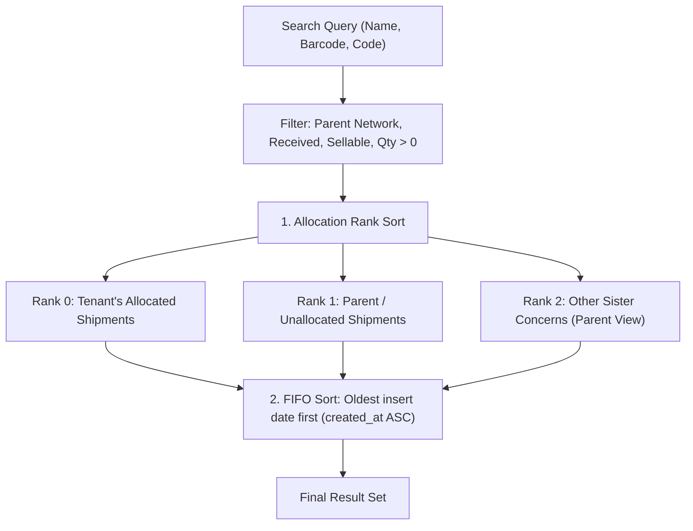

# Sales Invoice Stock Search Engine

## 1. Overview & Objective
The **Sales Invoice Stock Search Engine** powers product selection and item addition across sales invoices (Wholesale B2B, Retail, Dropship).

It guarantees that:
1. **Tenant Allocation Priority**: Stock from shipments specifically allocated to the current tenant is presented first before general parent company inventory.
2. **Strict FIFO (First-In, First-Out)**: Older inventory batches (earliest insert date) always appear at the top of search results, encouraging sales reps to deplete older batches first to minimize aging inventory.
3. **Parent Scoping**: All search operations resolve to the parent tenant's network, ensuring complete visibility while respecting access boundaries.

---

## 2. Ranking & Sorting Hierarchy

When querying stock for a given `p_tenant_id`:



### Sorting Rules:
1. **Tier 1: Allocation Rank** (`allocation_rank ASC`):
   * **Rank 0 (`is_allocated_to_tenant = TRUE`)**: Items where `global_shipments.assigned_child_tenant_id = p_tenant_id`.
   * **Rank 1**: Items where `global_shipments.assigned_child_tenant_id IS NULL` or equals parent tenant ID (General warehouse pool).
   * **Rank 2**: Items assigned to another sister concern (visible only when operating in parent tenant context).
2. **Tier 2: FIFO Order** (`gs.created_at ASC, gs.id ASC`):
   * Oldest stock received/inserted is listed at the top.

---

## 3. Database RPC Specification

### Function Signature: `public.search_sales_invoice_stock`
```sql
SELECT * FROM public.search_sales_invoice_stock(
  p_tenant_id => 2,                -- Context tenant / desk ID
  p_search => 'hoodie',            -- Search query (matches name, barcode, product_code)
  p_limit => 50,                   -- Pagination limit
  p_offset => 0                    -- Pagination offset
);
```

### Output Schema:
| Column | Type | Description |
| :--- | :---: | :--- |
| `global_stock_id` | `bigint` | Primary key of `global_stocks` table |
| `shipment_item_id` | `bigint` | Foreign key to `global_shipment_items` |
| `product_id` | `bigint` | Foreign key to master `products` catalog (if linked) |
| `name` | `text` | Item name snapshot from shipment |
| `barcode` | `text` | Item barcode |
| `product_code` | `text` | Vendor / internal product code |
| `image_url` | `text` | Primary product/item image URL |
| `quantity` | `numeric` | Total physical stock currently on hand |
| `available_atp` | `numeric` | Available-to-promise quantity (excluding held/reserved orders) |
| `unit_cost_price` | `numeric` | Landed cost per unit in BDT (or purchase price) |
| `suggested_sell_price`| `numeric` | Suggested catalog selling price in BDT |
| `shipment_id` | `bigint` | Origin shipment ID |
| `shipment_name` | `text` | Origin shipment display name |
| `holding_tenant_id` | `bigint` | Tenant ID holding/allocated this stock |
| `holding_tenant_name`| `text` | Name of the tenant allocated this stock |
| `is_allocated_to_tenant`| `boolean` | `true` if directly allocated to context tenant |
| `allocation_rank` | `integer` | `0` = Own tenant, `1` = General parent, `2` = Other sister |
| `location_id` | `bigint` | Warehouse stock location ID |
| `location_name` | `text` | Warehouse bin / shelf / room name |
| `stock_created_at` | `timestamptz` | Date/time the stock row was inserted (used for FIFO sorting) |

---

## 4. Frontend Integration Pattern

In TypeScript via `invoiceRepository.searchSalesInvoiceStock`:
```ts
import { invoiceRepository } from 'src/modules/sales_invoice/repositories/invoiceRepository';

// Query stock for active tenant
const stockResults = await invoiceRepository.searchSalesInvoiceStock({
  tenantId: activeTenantId,
  search: searchQuery.value,
  limit: 25,
});
```
