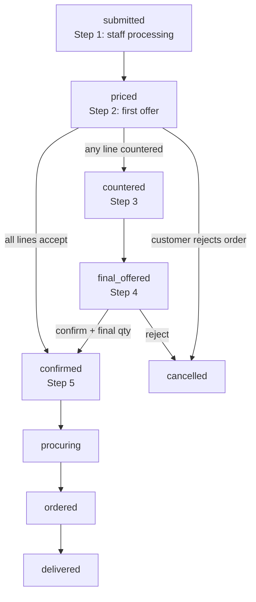

# Catalog Order Negotiation — Status Model & UX Spec

Negotiation applies to **`vendor_catalog`** shops where `shops.is_negotiable = true` and the customer group has **`can_negotiate`** on that shop. The snapshot `shop_orders.is_negotiable_snapshot` freezes this at placement.

**Related docs:** [`SHOP_ORDER.md`](./SHOP_ORDER.md) (RPCs, types) · [`UI_FLOW.md`](./UI_FLOW.md) (routes, components)

---

## 1. Business process (locked)

When negotiation is enabled, staff and customer follow five phases:

| Step | Actor | Work |
| :--- | :--- | :--- |
| **1. Processing** | Staff | Update weight, purchase price, rates; generate landed cost; set first-offer margin; prepare the offer. |
| **2. First offer** | Customer | Evaluate first offer per line: **accept**, **reject**, or **counter**. |
| **3. Final offer prep** | Staff | After a customer counter, set **final offer** prices (may differ from counter). |
| **4. Final confirmation** | Customer | Accept or reject final offer; set **final quantity** per line. |
| **5. Fulfillment** | Staff | Procurement and delivery after the deal is locked. |

Non-negotiable catalog orders skip steps 2–4 negotiation loops: staff prices → customer confirms from `priced`.

---

## 2. Order status model

### 2.1 Database statuses (`shop_order_status`)

Use these enum values for **`vendor_catalog`** negotiation. They are **system identifiers** — not shown verbatim to customers.

| Status | Maps to step | Who acts | Meaning |
| :--- | :--- | :--- | :--- |
| `submitted` | 1 | Staff | Order placed. Staff costing / first-offer preparation. Offer **not** sent yet. |
| `priced` | 2 | Customer | First offer published. Customer accept / reject / counter per line. |
| `countered` | 3 | Staff | Customer submitted at least one counter. Staff prepares final offer. |
| `final_offered` | 4 | Customer | Final offer published. Customer confirms price + final quantity. |
| `confirmed` | 5 (start) | Staff | Deal locked (`confirmed_quantity` set). Procurement may start. |
| `procuring` | 5 | Staff | Buying from vendor / internal procurement. |
| `ordered` | 5 | Staff | PO or vendor order placed. |
| `delivered` | 5 | Staff | Goods received / order closed from customer view. |
| `cancelled` | — | Either | Rejected or voided at any negotiation step. |

### 2.2 Status flow

**Negotiation path** (customer counters at least one line):

```text
submitted → priced → countered → final_offered → confirmed → procuring → ordered → delivered
```

**Happy path** (customer accepts all first-offer prices — no counter):

```text
submitted → priced → confirmed → procuring → ordered → delivered
```

Steps `countered` and `final_offered` are **skipped** when every line accepts the first offer.



### 2.3 Transition rules

| From | Trigger | To | Notes |
| :--- | :--- | :--- | :--- |
| `submitted` | Staff **Send first offer** | `priced` | RPC: `staff_price_shop_order` |
| `priced` | Customer **accept all lines** (no counter) | `confirmed` | RPC: `customer_confirm_shop_order` — **target**; today UI may still route via `countered` |
| `priced` | Customer **counter** (≥1 line) | `countered` | RPC: `customer_counter_offer` |
| `priced` | Customer **reject order** | `cancelled` | RPC TBD or status update |
| `countered` | Staff **Send final offer** | `final_offered` | RPC: `staff_finalize_catalog_prices` |
| `final_offered` | Customer **confirm** + final qty | `confirmed` | RPC: `customer_confirm_shop_order` |
| `final_offered` | Customer **reject** | `cancelled` | |
| `confirmed` | Staff **Start procurement** | `procuring` | RPC: `staff_start_catalog_procurement` |
| `procuring` | Staff marks ordered | `ordered` | |
| `ordered` | Staff marks delivered | `delivered` | |

### 2.4 Statuses to stop using in catalog flow

| Status | Action |
| :--- | :--- |
| `costing_pending` | Treat as `submitted` — costing is step 1, not a separate customer-visible step. |
| `negotiating` | Legacy non-catalog path; do not use for `vendor_catalog`. |
| Manual status chip clicks | Replace with action buttons that call the RPCs above (see §5). |

Existing rows may still carry these values until migrated or displayed via alias mapping.

---

## 3. User-facing labels (not DB values)

Customers and staff should **never** see raw enum names as primary copy. One mapping function per surface.

### 3.1 Customer labels

| DB status | Customer badge / list label | Customer action |
| :--- | :--- | :--- |
| `submitted` | **We're preparing your quote** | Wait |
| `priced` | **Review your offer** | Accept / counter / reject per line; submit response |
| `countered` | **We're reviewing your counter** | Wait (optional — can merge with `submitted` wait copy) |
| `final_offered` | **Confirm price & quantity** | Confirm order; adjust qty |
| `confirmed` | **Order confirmed** | Wait |
| `procuring` | **We're sourcing your items** | Wait |
| `ordered` | **Order placed with supplier** | Wait |
| `delivered` | **Delivered** | — |
| `cancelled` | **Cancelled** | — |

**Simplified customer journey line** (progress UI):

```text
Preparing quote → Review offer → Confirm order → Confirmed → On the way → Done
```

Map multiple DB statuses onto one progress step where helpful (e.g. `submitted` + `countered` → “Waiting on us”).

### 3.2 Staff labels

| DB status | Staff badge | Primary action (button) |
| :--- | :--- | :--- |
| `submitted` | **Costing / prepare offer** | Send first offer |
| `priced` | **Offer sent — awaiting customer** | — |
| `countered` | **Customer countered — set final offer** | Send final offer |
| `final_offered` | **Final offer sent — awaiting confirmation** | — |
| `confirmed` | **Confirmed — start procurement** | Start procurement |
| `procuring` | **Procuring** | Mark ordered |
| `ordered` | **Ordered** | Mark delivered |
| `delivered` | **Delivered** | — |
| `cancelled` | **Cancelled** | — |

### 3.3 Customer order list buckets (`p_status_bucket`)

| Bucket | Include statuses | Label |
| :--- | :--- | :--- |
| `needs_you` | `priced`, `final_offered` | Needs your action |
| `in_progress` | `submitted`, `countered`, `confirmed`, `procuring`, `ordered` | In progress |
| `done` | `delivered`, `cancelled` | Done |

Drop `negotiating` from bucket logic for catalog once legacy rows are cleared.

---

## 4. Line-item negotiation

Per `shop_order_items` during steps 2–4:

| Field / concept | Step 2 (`priced`) | Step 4 (`final_offered`) |
| :--- | :--- | :--- |
| Staff first offer | `staff_offer_amount` | — |
| Customer response | `customer_offer_amount` (accept = staff price, counter = lower/other) | — |
| Staff final offer | — | `final_price_amount` (+ currency id) |
| Final quantity | Original `quantity` (≥ 0; **0 = line rejected**) | `confirmed_quantity` (customer may reduce/increase per MOQ) |
| Decision tracking | `customer_decision_status`, `negotiation_status` | Same |

**Accept on first offer:** set `customer_offer_amount = staff_offer_amount` for that line.

**Reject a line at confirm:** set `quantity = 0` (allowed by `shop_order_items_qty_non_negative`; previously blocked by `quantity > 0`).

**Order-level submit:** customer must complete every line before one **Send my response** action (target UX). Current UI may require per-line save plus order-level submit — consolidate in implementation.

---

## 5. UI & RPC wiring (reference)

### 5.1 Routes

| Surface | Route | Page |
| :--- | :--- | :--- |
| Customer order detail | `/:tenantSlug/shop/orders/:id` | `CustomerOrderDetailPage.vue` |
| Staff order detail | `/:tenantSlug/app/shop/orders/:id` | `StaffOrderDetailPage.vue` |

### 5.2 Key RPCs

| RPC | Sets status | Step |
| :--- | :--- | :--- |
| `submit_shop_order_from_cart` | `submitted` | Place order |
| `staff_price_shop_order` | `priced` | 1 → 2 |
| `customer_counter_offer` | `countered` | 2 (counter path) |
| `customer_confirm_shop_order` | `confirmed` | 2 (accept-all) or 4 |
| `staff_finalize_catalog_prices` | `final_offered` | 3 → 4 |
| `staff_start_catalog_procurement` | `procuring` | 5 |

Supporting: `update_catalog_order_item` (line edits, qty, offers), catalog rates save on order header.

#### 5.2.1 RPC item payloads vs `shop_order_items` columns

Use **only columns that exist** on `shop_order_items`. Line costing edits (purchase price, product/package weight) go through `update_catalog_order_item` **before** Send first offer.

| RPC | JSON item keys (in) | Columns written |
| :--- | :--- | :--- |
| `staff_price_shop_order` | `id`, `staff_offer_amount`, `staff_offer_currency_id`, optional `weight_kg`, `is_first_offer_manual`, `product_weight_gm`, `package_weight_gm` | `staff_offer_amount`, `staff_offer_currency_id`, `weight_kg`, `is_first_offer_manual`, `negotiation_status`, `staff_offer_at`; syncs `products.product_weight` / `package_weight` when provided |
| `staff_finalize_catalog_prices` | `id`, `final_offer_amount`, `final_offer_currency_id` | `final_price_amount`, `final_price_currency_id`, `final_offer_at` |

**Do not use** non-existent columns: `gross_weight_kg`, `cbm`, `final_offer_amount`, `final_offer_currency_id` on `shop_order_items`. Weight is stored as **`weight_kg`** (total kg per unit). Final offer is stored as **`final_price_amount`**.

Optional order-level args on `staff_price_shop_order`: `p_profit_basis`, `p_fx_rate`, `p_cargo_rate`, `p_profit_pct` → `shop_orders.profit_basis`, `conversion_rate`, `cargo_rate`, `first_offer_rate` / `profit_rate`.

**Returns:** same nested `{ order, items }` JSON as `get_shop_order_for_staff` (one round trip — no client-side item/product updates or detail refetch).

### 5.3 Target staff UX

Replace the clickable multi-chip workflow bar (`CatalogOrderWorkflowBar.vue`) with **one primary action per phase**:

1. **Send first offer** — validates costing complete → `staff_price_shop_order`
2. **Send final offer** — after counter → `staff_finalize_catalog_prices`
3. **Start procurement** — after confirm → `staff_start_catalog_procurement`

Do **not** advance negotiation status via direct `shop_orders.status` table updates.

### 5.4 Target customer UX

| Status | Sticky footer CTA |
| :--- | :--- |
| `submitted`, `countered` | Wait message (no button) |
| `priced` | **Send my response** (accept-all → confirm; any counter → `countered`) |
| `final_offered` | **Confirm order** (with qty stepper per line) |
| `confirmed`+ | Status chip only |

---

## 6. Improvements backlog (from flow review)

Priority changes to reduce perceived steps **without** changing the business model:

| Priority | Change | Why |
| :--- | :--- | :--- |
| P0 | Accept-all at `priced` → `confirmed` (skip `countered` / `final_offered`) | Removes 2–3 steps when there is no disagreement |
| P0 | Single customer **Send my response** (batch RPC) | Removes per-line save + order submit double work |
| P1 | Merge `costing_pending` into `submitted` | One staff phase for step 1 |
| P1 | Staff action buttons instead of status chip bar | Fewer wrong clicks; enforces RPCs |
| P2 | Customer progress bar (4 labels, §3.1) | Hides internal enum names |
| P2 | Allow qty change at `priced` (not only `final_offered`) | Fewer renegotiation rounds |
| P3 | Default `final_offer_rate` = `first_offer_rate` | Staff only edits final when counter differs |

---

## 7. Non-negotiable catalog orders

When `is_negotiable_snapshot = false`:

```text
submitted → priced → confirmed → procuring → ordered → delivered
```

Customer confirms from `priced` with no counter UI. Same staff step 1 (costing + first offer).

---

## 8. Implementation checklist

- [ ] Document status labels in i18n (`shop_admin.*`, customer order strings)
- [x] Fix `staff_price_shop_order` / `staff_finalize_catalog_prices` column mapping (`weight_kg`, `final_price_amount`) — migration `20260824110000_fix_catalog_negotiation_rpc_columns.sql`
- [x] Add `customerOrderStatusLabel()` / `staffOrderStatusLabel()` helpers — `catalogOrderStatus.ts`
- [x] Update `CustomerOrderHeader` progress from mapped journey (§3.1)
- [x] Wire accept-all path in `customer_counter_offer`
- [x] Replace catalog workflow bar clicks with action RPCs — `CatalogOrderStaffActions.vue`
- [ ] Align `list_customer_shop_orders` buckets with §3.3
- [ ] Update [`UI_FLOW.md`](./UI_FLOW.md) § negotiation when UI ships
