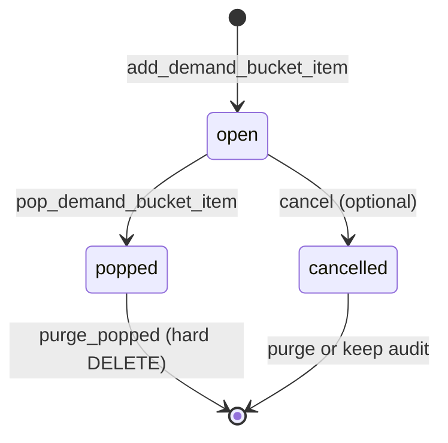

# Customer Demand Bucket

Shared **waiting list** for unfulfilled customer demand. Used when procurement takes time and the customer did not receive everything they were promised.

**Related:** [`SHOP_ORDER.md`](./SHOP_ORDER.md) · [`CATALOG_NEGOTIATION.md`](./CATALOG_NEGOTIATION.md) · [`PBC_COSTING.md`](../product_based_costing/PBC_COSTING.md)

---

## 1. Purpose

| Problem | Bucket answer |
| :--- | :--- |
| Customer ordered 100, only 75 arrived | Add a bucket item for the shortfall |
| Customer wants the missing pieces on the next order | Staff or customer **pops** open bucket items into cart / procurement |
| Customer wants to see what is still owed | List open bucket items for their `billing_profile_id` |
| Same pattern for catalog orders and PBC | One table, one API surface |

The bucket is a **queue of items**, not a quantity ledger. No aggregate `open_qty` / `allocated_qty` / `fulfilled_qty` columns on a per-product cell.

**Out of scope (phase 2):** “On the way with Shipment #88” needs shipment **allocations**, not the bucket alone. The bucket only tracks **still waiting**.

---

## 2. Mental model

```text
Shortfall happens  →  add bucket item (status: open)
Reuse on next order / wave  →  soft pop (status: popped)
Retention period ends  →  hard delete popped rows
```



---

## 3. Table: `customer_demand_bucket_items`

One table handles the full lifecycle.

```sql
CREATE TYPE demand_bucket_status AS ENUM (
  'open',       -- in the bucket, available to pop
  'popped',     -- consumed (cart, procurement wave, etc.) — kept for audit
  'cancelled'   -- voided without use
);

CREATE TYPE demand_bucket_source_type AS ENUM (
  'shop_order_item',
  'pbc_costing_item',
  'manual'
);

CREATE TABLE customer_demand_bucket_items (
  id                  bigint GENERATED ALWAYS AS IDENTITY PRIMARY KEY,
  tenant_id           bigint NOT NULL REFERENCES tenants(id) ON DELETE CASCADE,
  billing_profile_id  bigint NOT NULL REFERENCES billing_profiles(id) ON DELETE CASCADE,

  product_id          bigint NOT NULL REFERENCES products(id) ON DELETE CASCADE,

  -- Provenance (optional but recommended for staff drill-down)
  source_type         demand_bucket_source_type NOT NULL,
  source_id           bigint,  -- shop_order_items.id, product_based_costing_items.id, etc.

  -- Display snapshot (avoid joins on list screens)
  name                text NOT NULL,
  image_url           text,
  barcode             text,
  product_code        text,
  note                text,

  status              demand_bucket_status NOT NULL DEFAULT 'open',

  -- Soft pop metadata
  popped_at           timestamptz,
  popped_into_type    text,   -- e.g. shop_cart, procurement_wave, shop_order
  popped_into_id      bigint,

  created_at          timestamptz NOT NULL DEFAULT now(),
  updated_at          timestamptz NOT NULL DEFAULT now()
);

CREATE INDEX idx_demand_bucket_open_profile
  ON customer_demand_bucket_items (tenant_id, billing_profile_id)
  WHERE status = 'open';

CREATE INDEX idx_demand_bucket_popped_purge
  ON customer_demand_bucket_items (popped_at)
  WHERE status = 'popped';
```

### Design rules

| Rule | Detail |
| :--- | :--- |
| **Grain** | One row = one bucket **entry** (one product shortfall event), not one row per product aggregate |
| **No qty ledger** | Do not add `open_quantity` / `allocated_quantity` / `fulfilled_quantity` on this table |
| **Quantity** | If a line is short by multiple units, either the **source line** holds the math (`confirmed − fulfilled`) and the bucket row is a pointer, or add a single `quantity` column on the entry — pick one in implementation; this doc does not require aggregate bucket qty |
| **Duplicates** | Multiple open rows for the same `product_id` are allowed (e.g. two orders short the same SKU) |
| **Soft pop** | Row stays in DB with `status = popped`; never hard-delete `open` rows without cancel |
| **Hard delete** | Only `popped` (and optionally old `cancelled`) rows, via purge job or admin RPC |

---

## 4. RPCs

| RPC | Actor | Behavior |
| :--- | :--- | :--- |
| `add_demand_bucket_item` | Staff (system on shortfall) | Insert row with `status = open` |
| `list_demand_bucket_items` | Staff, customer | Filter by `billing_profile_id`; default `status = open` |
| `pop_demand_bucket_item` | Staff, customer checkout | Set `status = popped`, `popped_at`, `popped_into_*` |
| `pop_demand_bucket_items` | Staff, customer | Batch pop (e.g. “add selected to cart”) |
| `cancel_demand_bucket_item` | Staff | Set `status = cancelled` |
| `purge_popped_demand_bucket_items` | Staff / cron | `DELETE` where `status = popped` and `popped_at < retention_cutoff` |

### `add_demand_bucket_item` (inputs)

| Param | Required | Notes |
| :--- | :---: | :--- |
| `p_tenant_id` | ✓ | |
| `p_billing_profile_id` | ✓ | Customer account |
| `p_product_id` | ✓ | |
| `p_source_type` | ✓ | `shop_order_item` \| `pbc_costing_item` \| `manual` |
| `p_source_id` | | Link to originating line |
| `p_snapshot` | ✓ | JSON: `name`, `image_url`, `barcode`, `product_code`, `note` |

Called when:

- Catalog order: ordered &lt; confirmed, or received &lt; ordered
- PBC: costing line partially fulfilled or unavailable (replaces per-module backlog upsert)
- Manual: staff adds owed item

### `pop_demand_bucket_item` (inputs)

| Param | Required | Notes |
| :--- | :---: | :--- |
| `p_bucket_item_id` | ✓ | Must be `open` |
| `p_popped_into_type` | ✓ | Target document type |
| `p_popped_into_id` | ✓ | Target document id |

Does **not** delete the row. Caller adds lines to cart / wave / new order separately.

---

## 5. Who writes to the bucket

| Module | Trigger | `source_type` |
| :--- | :--- | :--- |
| **Catalog shop order** | Shortfall after procurement or receive | `shop_order_item` |
| **Product-based costing** | Partial / unavailable line after customer acceptance | `pbc_costing_item` |
| **Manual** | Staff correction | `manual` |

### Catalog flow (target)

```text
confirmed → procuring → ready_for_shipment → delivered
                ↓ shortfall at any fulfillment step
         add_demand_bucket_item
```

Long-term: remove `ordered_quantity` / `delivered_quantity` on `shop_order_items` as source of truth; shortfall events **add bucket items** instead.

---

## 6. UI surfaces

| Surface | Scope | Content |
| :--- | :--- | :--- |
| **Customer — Open items** | `billing_profile_id` | List `open` bucket items; “Add to cart” pops selected |
| **Customer — Checkout** | Cart | Section: **From your waiting list** (open items for profile) |
| **Staff — Order detail** | Order | Link shortfall lines to bucket entries created from that order |
| **Staff — Backlog drawer** | Profile or procurement desk | Same list API; pop into costing file / procurement wave |
| **Staff — Aggregated demand** | Parent procurement | `list_demand_bucket_items` across profiles, group by `product_id` in UI (not in schema) |

---

## 7. Consolidation from legacy tables

Today two module-specific tables exist:

| Legacy table | Target |
| :--- | :--- |
| `customer_order_backlog_items` | Migrate to `customer_demand_bucket_items` |
| `product_based_costing_backlog_items` | Migrate to `customer_demand_bucket_items` |

Migration approach:

1. Ship shared table + RPCs
2. Dual-write shortfalls to new bucket
3. Switch list/pop UI to new API
4. Deprecate legacy tables

---

## 8. What this doc does not cover

| Topic | Where |
| :--- | :--- |
| Shipment “in transit” per customer | Future `customer_demand_allocations` (or shipment allocation doc) |
| Aggregated procurement wave document | Future procurement wave spec |
| Negotiation statuses | [`CATALOG_NEGOTIATION.md`](./CATALOG_NEGOTIATION.md) |

---

## 9. Implementation checklist

- [ ] Migration: `customer_demand_bucket_items` + enums + indexes
- [ ] RPCs: add, list, pop (single + batch), cancel, purge
- [ ] RLS: tenant isolation; customer read own `billing_profile_id`; staff manage
- [ ] Catalog: shortfall → `add_demand_bucket_item` (replace backlog insert in `staff_set_catalog_ordered_qty`)
- [ ] PBC: replace `upsert_pbc_backlog_from_item` with shared add/pop
- [ ] Customer shop UI: open items page + checkout section
- [ ] Staff: backlog drawer wired to `list` / `pop`
- [ ] Purge job for old `popped` rows
- [ ] Deprecate `ordered_quantity` / `delivered_quantity` on order lines (after bucket live)
