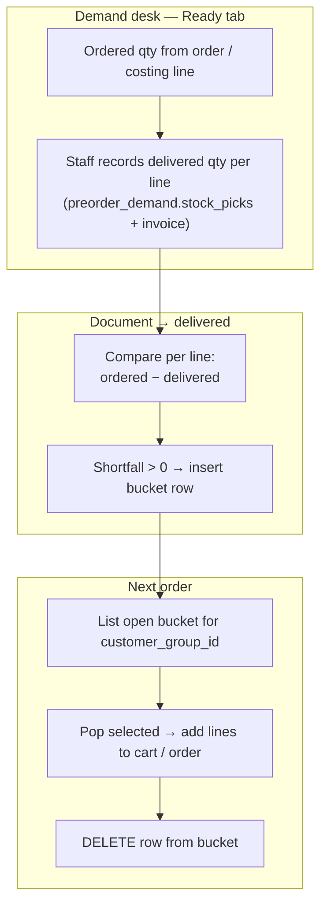
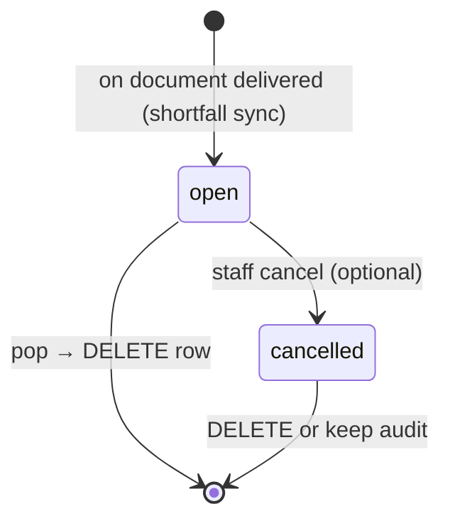

# Customer Group Backlog Bucket

**Waiting list per customer group:** products the customer **ordered** (or confirmed on a quote) but the business **could not deliver**. Staff or the customer can pull open items into the next cart, costing file, or order.

Keyed by **`customer_group_id`** — the same identity used on shop carts, shop orders, and PBC costing files.

**Related:** [`SHOP_ORDER.md`](./SHOP_ORDER.md) · [`CATALOG_NEGOTIATION.md`](./CATALOG_NEGOTIATION.md) · [`PBC_COSTING.md`](../product_based_costing/PBC_COSTING.md) · [`PROCUREMENT_DEMAND_LIST.md`](./PROCUREMENT_DEMAND_LIST.md) · [`CUSTOMER.md`](../customer/CUSTOMER.md)

---

## 1. Purpose

| Problem | Bucket answer |
| :--- | :--- |
| Customer ordered 100, only 75 delivered | Add a bucket row: `product_id` + shortfall `quantity` |
| Customer wants missing items on the next order | **Pop** open rows into cart / costing file / new order |
| Customer wants to see what is still owed | List open rows for their `customer_group_id` |
| Same pattern for catalog orders and PBC | One table, one API surface |

The bucket is a **queue of shortfall events**, not a rolling qty ledger on the product row.

**Out of scope:** “On the way with Shipment #88” needs shipment allocations — the bucket only tracks **still waiting**.

---

## 2. End-to-end flow (with Demand desk)



| Step | Where | What happens |
| :---: | :--- | :--- |
| 1 | **Demand — Ready tab** | Staff enter **delivered quantity** per line (from stock + invoice). **Ordered** qty comes from the source order / costing line (`confirmed_quantity` or need). |
| 2 | **Still on `ready_for_shipment`** | Delivered totals live in `preorder_demand` only — **no bucket row yet**. |
| 3 | **Status → `delivered`** | System compares **ordered vs delivered** per line. Any **unfulfilled** qty (`ordered − delivered`) → **`add_customer_group_backlog_bucket_item`** for that `product_id` + `customer_group_id`. |
| 4 | **Next cart / order / costing file** | Staff or customer opens **waiting list** for the group, selects rows, **pop** → lines added to the new document. |
| 5 | **Pop** | Row is **removed from the bucket** (`DELETE` — not left as history on this table). |

**Product identity** always comes from the **source line** (`shop_order_items.product_id` or `product_based_costing_items.product_id`). **Customer** comes from `shop_orders.customer_group_id` or `product_based_costing_files.customer_group_id`.

---

## 3. Mental model

```text
Delivered on Demand desk  →  fulfillments recorded
Mark document delivered   →  shortfall lines added to bucket (open)
Next order                →  pop from bucket → DELETE row
```



---

## 4. Table: `customer_group_backlog_bucket_items`

**Domain:** `shop_order` (customer-facing shortfall). **Location:** `supabase/schemas/shop_order/`.

```sql
CREATE TYPE customer_group_backlog_bucket_status AS ENUM (
  'open',       -- in the bucket, available to pop
  'cancelled'   -- voided without use (optional staff action)
);

CREATE TYPE customer_group_backlog_bucket_source_type AS ENUM (
  'shop_order_item',
  'pbc_costing_item',
  'manual'
);

CREATE TABLE public.customer_group_backlog_bucket_items (
  id                  bigint GENERATED ALWAYS AS IDENTITY PRIMARY KEY,
  tenant_id           bigint NOT NULL REFERENCES public.tenants(id) ON DELETE CASCADE,
  customer_group_id   bigint NOT NULL REFERENCES public.customer_groups(id) ON DELETE CASCADE,

  product_id          bigint NOT NULL REFERENCES public.products(id) ON DELETE CASCADE,

  -- Where the shortfall came from (drill-down)
  source_type         public.customer_group_backlog_bucket_source_type NOT NULL,
  source_id           bigint,  -- shop_order_items.id, product_based_costing_items.id, etc.

  quantity            integer NOT NULL,
  note                text,    -- optional staff note (not product data)

  status              public.customer_group_backlog_bucket_status NOT NULL DEFAULT 'open',

  created_at          timestamptz NOT NULL DEFAULT now(),
  updated_at          timestamptz NOT NULL DEFAULT now(),

  CONSTRAINT customer_group_backlog_bucket_items_quantity_check
    CHECK (quantity > 0)
);

CREATE INDEX customer_group_backlog_bucket_open_group_idx
  ON public.customer_group_backlog_bucket_items (tenant_id, customer_group_id)
  WHERE status = 'open';

CREATE INDEX customer_group_backlog_bucket_source_idx
  ON public.customer_group_backlog_bucket_items (source_type, source_id)
  WHERE source_id IS NOT NULL;
```

### Design rules

| Rule | Detail |
| :--- | :--- |
| **Grain** | One row = one shortfall **event** (product + qty we could not provide) |
| **Customer key** | `customer_group_id` — not `billing_profile_id` (finance account is derived 1:1 when the group has a profile) |
| **Product** | `product_id` only — **no** stored name, image, barcode, or code; list/pop RPCs **join `products`** for display |
| **Quantity** | Units not delivered on this event (`quantity` &gt; 0) |
| **Duplicates** | Multiple open rows for the same `product_id` are allowed (e.g. two delivered orders short the same SKU) |
| **Pop** | **`DELETE`** the row after lines are added to cart / order — bucket only holds **current** waiting items |
| **Cancel** | Optional `status = cancelled` then delete, or direct `DELETE` via cancel RPC |

### RLS

- Enable RLS; `tenant_id` matches operating child tenant **or** parent operator via `user_can_manage_parent_tenant`.
- Customer shop session: read `open` rows where `customer_group_id` matches `current_customer_group_id`.
- All writes via `SECURITY DEFINER` RPCs.

---

## 5. RPCs (target names)

| RPC | Actor | Behavior |
| :--- | :--- | :--- |
| `sync_customer_group_backlog_from_delivered_document` | System on status → `delivered` | Per line: `shortfall = ordered − delivered`; if &gt; 0, insert bucket row |
| `add_customer_group_backlog_bucket_item` | Staff (manual) | Insert `status = open` |
| `list_customer_group_backlog_bucket_items` | Staff, customer | Filter by `customer_group_id`; default `status = open`; **join `products`** for display fields |
| `pop_customer_group_backlog_bucket_item` | Staff, customer checkout | Add line to target document, then **`DELETE`** bucket row |
| `pop_customer_group_backlog_bucket_items` | Staff, customer | Batch pop + delete |
| `cancel_customer_group_backlog_bucket_item` | Staff | `DELETE` or set `cancelled` then delete |

### `add_customer_group_backlog_bucket_item` (inputs)

| Param | Required | Notes |
| :--- | :---: | :--- |
| `p_tenant_id` | ✓ | Child tenant (shop desk / sister concern) |
| `p_customer_group_id` | ✓ | Customer group owed the product |
| `p_product_id` | ✓ | Product still not provided |
| `p_quantity` | ✓ | Shortfall units |
| `p_source_type` | ✓ | `shop_order_item` \| `pbc_costing_item` \| `manual` |
| `p_source_id` | | Originating line id |
| `p_note` | | Optional staff note |

Called when:

- **Primary:** document moves to **`delivered`** — `sync_customer_group_backlog_from_delivered_document` ([`PROCUREMENT_DEMAND_LIST.md`](./PROCUREMENT_DEMAND_LIST.md) §2.5)
- Manual: staff correction

Resolve `customer_group_id` from the source document (`shop_orders.customer_group_id`, `product_based_costing_files.customer_group_id`).

### `sync_customer_group_backlog_from_delivered_document` (inputs)

| Param | Required | Notes |
| :--- | :---: | :--- |
| `p_tenant_id` | ✓ | |
| `p_document_type` | ✓ | `shop_order` \| `pbc_costing_file` |
| `p_document_id` | ✓ | |

For each line on the document:

- `ordered_qty` = `greatest(coalesce(confirmed_quantity, quantity), 0)` on the source item
- `delivered_qty` = `preorder_demand.delivered_quantity` for that `source_type` + `source_id`
- if `ordered_qty − delivered_qty > 0` → insert bucket row with that shortfall

Idempotent: do not duplicate bucket rows for the same `source_type` + `source_id` if already synced (use unique partial index or check before insert).

### `pop_customer_group_backlog_bucket_item` (inputs)

| Param | Required | Notes |
| :--- | :---: | :--- |
| `p_bucket_item_id` | ✓ | Must be `open` |
| `p_popped_into_type` | ✓ | `shop_cart` \| `shop_order` \| `pbc_costing_file` |
| `p_popped_into_id` | ✓ | Target document id |

Atomically: add line(s) to target using `product_id` + `quantity` (resolve name/image from `products` on read), then **`DELETE`** from `customer_group_backlog_bucket_items`.

---

## 6. Who writes to the bucket

| Module | Trigger | `source_type` |
| :--- | :--- | :--- |
| **Catalog shop order** | Status → `delivered` (after Ready-tab fulfillments recorded) | `shop_order_item` |
| **Product-based costing** | Status → `delivered` | `pbc_costing_item` |
| **Manual** | Staff correction | `manual` |

```text
ready_for_shipment  →  staff records delivered qty on Demand desk (fulfillments)
        ↓
    delivered  →  sync shortfall into bucket
        ↓
  next order  →  pop from bucket (DELETE row)
```

---

## 7. UI surfaces

| Surface | Scope | Content |
| :--- | :--- | :--- |
| **Customer — Open items** | `customer_group_id` | Open bucket rows; “Add to cart” pops selected |
| **Customer — Checkout** | Cart | **From your waiting list** |
| **Staff — Order / costing detail** | Document | Link shortfall lines to bucket rows |
| **Staff — PBC drawer** | `customer_group_id` | List + pop into new costing file |
| **Staff — Demand desk Ready tab** | Per line | Delivered qty + invoice only; bucket fills when document → `delivered` |

---

## 8. Retired / interim tables (do not use for new code)

| Table | Status |
| :--- | :--- |
| `customer_order_backlog_items` | **Retired** — drop |
| `product_based_costing_backlog_items` | **Retired** — drop |
| `customer_demand_bucket_items` | **Interim** — keyed by `billing_profile_id`; migrate rows to `customer_group_backlog_bucket_items` then drop |

Retired RPCs: `upsert_pbc_backlog_from_item`, `add_pbc_backlog_to_file`, `add_pbc_backlog_to_costing_file`, and interim `add_demand_bucket_item` / `list_demand_bucket_items` / `pop_demand_bucket_item` (replace with §4 RPC names after migration).

**One-off billing profiles** (`billing_profiles.customer_group_id IS NULL`) do not get bucket rows — they are invoice-only accounts with no shop group.

---

## 9. What this doc does not cover

| Topic | Where |
| :--- | :--- |
| Shipment “in transit” per customer | Future allocation doc |
| Aggregated procurement wave | Future procurement wave spec |
| Negotiation statuses | [`CATALOG_NEGOTIATION.md`](./CATALOG_NEGOTIATION.md) |

---

## 10. Implementation checklist

- [ ] Migration: `customer_group_backlog_bucket_items` + enums + indexes + RLS (§4)
- [ ] RPCs: sync on delivered, add, list, pop (DELETE on pop), cancel (§5)
- [ ] Hook: mark document `delivered` → `sync_customer_group_backlog_from_delivered_document`
- [ ] Data migration: `customer_demand_bucket_items` → `customer_group_backlog_bucket_items` (resolve `customer_group_id` via `billing_profiles.customer_group_id`)
- [ ] Drop: `customer_demand_bucket_items`, `customer_order_backlog_items`, `product_based_costing_backlog_items`
- [ ] Demand desk Ready tab: delivered qty only; bucket sync on `delivered` status
- [ ] PBC drawer: `list_customer_group_backlog_bucket_items` / pop
- [ ] Customer shop UI: open items + checkout section
- [ ] Tenant operational purge: include `customer_group_backlog_bucket_items` ([`TENANT_OPERATIONAL_DATA_RESET.md`](../tenant_auth/TENANT_OPERATIONAL_DATA_RESET.md))
