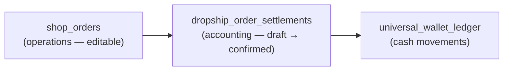
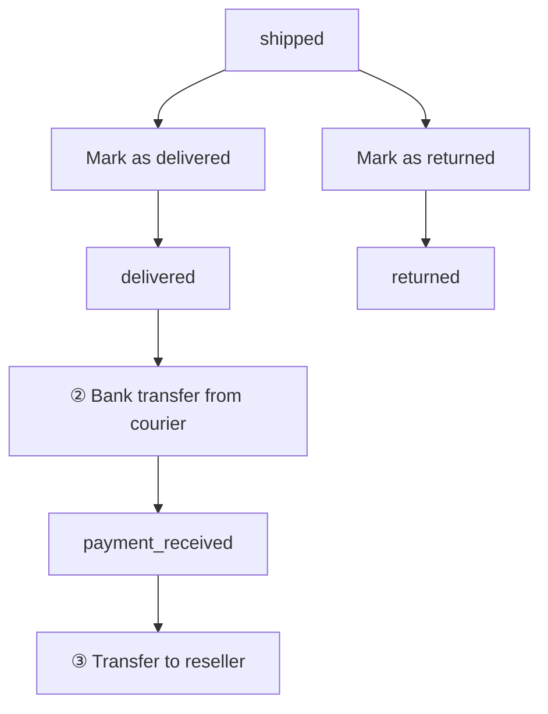
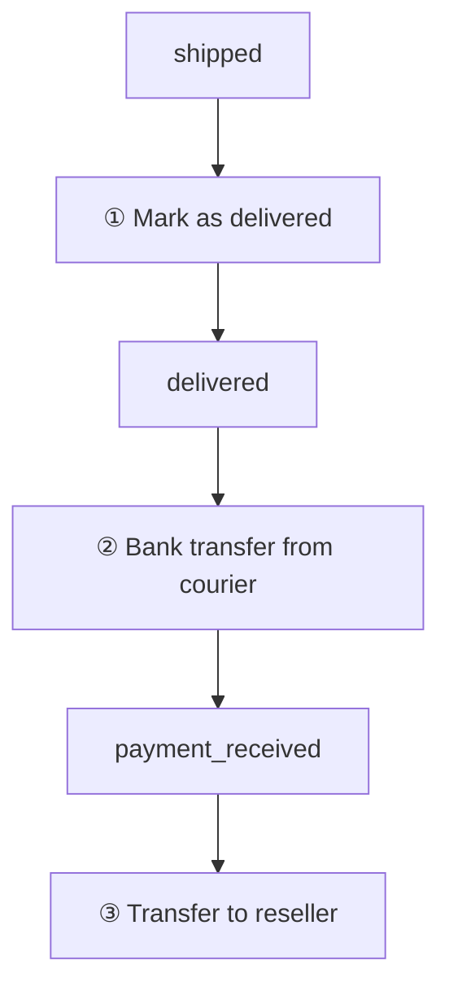
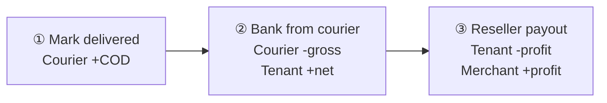

# Dropship Management Desk (v1 UI shell)

Staff-facing settlement desk for dropship orders **in transit or delivered** — i.e. after the order has left the warehouse (`shipped`) or reached the recipient (`delivered`). **List and detail pages are wired to live RPCs**; Finance Hub remains live until desk parity is verified in production.

Related: [`SHOP_ORDER.md`](./SHOP_ORDER.md) (dropship desk inventory), [`WALLET.md`](../wallet/WALLET.md) (ledger rules), existing [`DropshipFinanceHubPage`](../../web/src/modules/shop_order/pages/DropshipFinanceHubPage.vue) (3-step courier remittance flow).

---

## 1. List scope (status filter)

The list page shows **only** dropship orders where `shop_orders.status` is:

| Status | Meaning on desk |
| :--- | :--- |
| `shipped` | Courier has the parcel; COD not yet collected |
| `delivered` | Parcel delivered; staff can reconcile collected COD and costs |

**Excluded** from this desk: `submitted`, `confirmed`, `placed`, `processing`, `ready_for_pickup`, `returned`, `payment_received`, and any earlier lifecycle states.

The status dropdown on the list is a **subset filter** within that set:

| UI option | Server filter (`p_statuses`) |
| :--- | :--- |
| All statuses | `['shipped', 'delivered']` |
| Shipped | `['shipped']` |
| Delivered | `['delivered']` |

---

## 2. Routes (UI shell)

| Route | Page | Status |
| :--- | :--- | :--- |
| `/:tenantSlug?/app/shop/dropship-management` | [`DropshipManagementPage.vue`](../../web/src/modules/shop_order/pages/DropshipManagementPage.vue) | Live list + search/filter |
| `/:tenantSlug?/app/shop/dropship-management/:id` | [`DropshipManagementDetailPage.vue`](../../web/src/modules/shop_order/pages/DropshipManagementDetailPage.vue) | Live settlement form + 3-step actions |

Dummy seed data (unused by detail page): [`dropshipManagementDummyOrders.ts`](../../web/src/modules/shop_order/data/dropshipManagementDummyOrders.ts).

---

## 3. API — list page

### RPC: `list_dropship_shop_orders_for_staff`

**Status: exists and wired** — same RPC used by [`DropshipOrdersPage`](../../web/src/modules/shop_order/pages/DropshipOrdersPage.vue) and [`DropshipManagementPage`](../../web/src/modules/shop_order/pages/DropshipManagementPage.vue).

```sql
list_dropship_shop_orders_for_staff(
  p_tenant_id bigint,
  p_limit         integer default 20,
  p_offset        integer default 0,
  p_status        text    default null,   -- single status equality (legacy / ops desk tabs)
  p_search        text    default null,
  p_statuses      text[]  default null    -- multi-status filter (management desk)
) returns table (...)
```

- **Security:** `SECURITY DEFINER`; requires `is_tenant_staff(p_tenant_id)`
- **Scope:** `shop_orders` where `shop_type_snapshot = 'dropship'`
- **Status filter priority:** when `p_statuses` is non-empty, `status = any(p_statuses)`; else when `p_status` is set, single equality; else default ops-desk status set
- **Migrations:** `20261115000000_list_dropship_shop_orders_for_staff.sql`, `20270129000009_dropship_ux_order_settlement_fields.sql`, `20270831190000_list_dropship_shop_orders_p_statuses.sql`

#### Response columns (list)

| Column | Maps to UI field |
| :--- | :--- |
| `order_no` | Order name |
| `customer_group_name` | Merchant |
| `recipient_name` | Recipient |
| `courier_name` | Courier |
| `status` | Status badge |
| `cod_collect_amount` | Calculated COD (expected; confirm against invoice on detail) |
| `courier_awb_number` | AWB (detail meta) |
| `recipient_phone` | Recipient phone (detail meta) |
| `total_amount` | Line-sum fallback total |
| `payout_settlement_status` | Future: hide settled rows |

#### Frontend wiring (list)

| Layer | Name |
| :--- | :--- |
| RPC | `list_dropship_shop_orders_for_staff` |
| Repository | `shopOrderRepository.listDropshipShopOrdersForStaff(tenantId, { statuses, search, limit, offset })` |
| Service | `shopOrderService.fetchDropshipStaffOrders(...)` |
| Page | `DropshipManagementPage.vue` — passes `statuses: ['shipped','delivered']` (or single status from dropdown) |

Search (`p_search`) matches: `order_no`, `recipient_name`, `recipient_phone`, `courier_awb_number`, `courier_name`, courier service name, `customer_group_name`, `created_by_email`.

---

## 4. API — detail page

### RPC: `get_dropship_management_order`

**Status: implemented** — composes `get_dropship_order_detail_v2` + settlement draft from `dropship_order_settlements` / `dropship_settlement_charge_lines`.

```sql
get_dropship_management_order(p_tenant_id bigint, p_order_id bigint) returns jsonb
```

Returns: `order`, `fulfillment`, `computed`, `settlement`, `step_state`.

Auto-fill on first load per §118–131 (no draft row yet).

### RPC: `save_dropship_settlement_draft`

**Status: implemented** — upserts settlement header + charge lines with `status = draft`.

```sql
save_dropship_settlement_draft(p_tenant_id bigint, p_order_id bigint, p_payload jsonb) returns jsonb
```

`p_payload.charge_lines[]`: `{ charge_type, amount, payer }` for `delivery|print|packing|return`.

### Orchestration RPCs (3 footer buttons)

| RPC | Purpose | Status |
| :--- | :--- | :--- |
| `mark_dropship_order_delivered` | Step ① — save draft + `advance_dropship_order_status` + `confirm_dropship_delivered_costing` | **Implemented** |
| `record_dropship_courier_bank_transfer` | Step ② — save draft + `record_dropship_courier_remittance` | **Implemented** |
| `transfer_dropship_reseller_profit` | Step ③ — save draft + `dispense_middleman_payout_from_tenant` | **Implemented** |

### Existing RPC: `get_dropship_order_detail_v2`

**Status: exists** — used internally by `get_dropship_management_order` (not called directly from detail page).

### Field mapping — load (v1 auto-fill)

| Form field | Source on first load | Stored on save |
| :--- | :--- | :--- |
| Header / courier / AWB | `get_dropship_order_detail_v2` via `get_dropship_management_order` | — |
| Calculated COD | `computed.recipient_grand_total` | `calculated_cod_amount` (server) |
| Collected COD | `shop_orders.cod_collect_amount` or calculated COD | `collected_cod_amount` |
| Delivery / print / packing amount | `shop_orders.*_charge_amount` | `dropship_settlement_charge_lines.amount` |
| Charge payer | `deduct_*_from_margin` → recipient/merchant; return → company default | `dropship_settlement_charge_lines.payer` |
| Return cost | `shop_orders.return_charge_amount` | charge line `return` |
| Return reason | empty | `return_reason_note` |
| Discount (company pay) | `0` (not checkout discount) | `discount_company_pay` |
| Reseller purchase cost | Sum item cost × qty | `reseller_purchase_cost` |

#### Frontend wiring (detail)

| Layer | Name |
| :--- | :--- |
| Load RPC | `get_dropship_management_order` |
| Save RPC | `save_dropship_settlement_draft` |
| Actions | `mark_dropship_order_delivered`, `record_dropship_courier_bank_transfer`, `transfer_dropship_reseller_profit` |
| Query key | `shopOrderQueryKeys.dropshipManagementDetail(tenantId, orderId)` |
| Page | `DropshipManagementDetailPage.vue` + `DropshipManagementSettlementPaper.vue` |

---

## 5. Data model — three layers (no legacy settlement table)

There is **no** `dropship_settlement_snapshots` table in the database. That name was a doc placeholder only — nothing to drop or retire.

Today’s live settlement path (keep until this desk replaces it end-to-end):

| Piece | Role |
| :--- | :--- |
| `shop_orders` columns | Operational charges, COD, remittance refs, `payout_settlement_status` |
| **Finance Hub** | 3-step: delivered costing → courier remittance → merchant payout |
| `universal_wallet_ledger` | Actual money (`delivered_costing`, `courier_remittance`, `dropship_profit`) |

This desk adds a **new accounting layer** — not a replacement for an existing settlement table.



### Why not store accounting on `shop_orders`?

| Problem | Settlement table fixes it |
| :--- | :--- |
| One `cod_collect_amount` — no expected vs collected split | `calculated_cod_amount` + `collected_cod_amount` |
| `deduct_*_from_margin` = recipient vs merchant only | 3-way payer enum per charge line |
| Checkout `discount_amount` ≠ settlement “company pays discount” | `discount_company_pay` |
| Values change during processing | Immutable record after `confirmed` |
| Wallet ledger has amounts, not full charge + payer breakdown | Normalized charge lines for reports / future GL |

**Do not** add 15 accounting columns to `shop_orders`. Keep operational fields there; settlement facts live in the new tables.

### Proposed tables (migrated)

**Migration:** `20270831200000_dropship_order_settlements.sql`

#### `dropship_order_settlements` (1 row per order)

| Column | Type | Notes |
| :--- | :--- | :--- |
| `id` | bigint PK | |
| `tenant_id` | bigint | RLS scope |
| `shop_order_id` | bigint UNIQUE | FK → `shop_orders` |
| `billing_profile_id` | bigint | Merchant entity for payout |
| `currency_id` | bigint | Sell currency |
| `calculated_cod_amount` | numeric | Expected COD at settlement time |
| `collected_cod_amount` | numeric | Actual cash collected |
| `reseller_purchase_cost` | numeric | Editable override (default from item sum) |
| `discount_company_pay` | numeric | Company-paid discount |
| `return_reason_note` | text | |
| `total_cost` | numeric | Stored computed (optional) |
| `reseller_profit` | numeric | Stored computed (optional) |
| `company_profit` | numeric | Stored computed (optional) |
| `status` | text | `draft` \| `confirmed` |
| `confirmed_at` | timestamptz | Set on step ③ confirm |
| `confirmed_by` | uuid | Staff user |
| `courier_cod_booked_at` | timestamptz | Step ① complete |
| `remittance_at` | timestamptz | Step ② complete |
| `merchant_payout_at` | timestamptz | Step ③ complete |
| `wallet_ledger_batch_id` | text | Link to ledger entries |

#### `dropship_settlement_charge_lines` (child rows)

| Column | Type | Notes |
| :--- | :--- | :--- |
| `id` | bigint PK | |
| `settlement_id` | bigint FK | → `dropship_order_settlements` |
| `charge_type` | text | `delivery` \| `print` \| `packing` \| `return` \| `cod` |
| `amount` | numeric | |
| `payer` | text | `recipient` \| `merchant` \| `company` |

Unique constraint: `(settlement_id, charge_type)`.

### What stays on `shop_orders` (operational only)

- `status`, recipient, courier, AWB, `delivered_at`
- Processing-time charge defaults (`*_charge_amount`, `deduct_*_from_margin`)
- `courier_remittance_ref`, `courier_bank_trx_id`, `payout_settlement_status`
- Line-level buy/sell/resell on `shop_order_items`

---

## 6. List page fields

| Field | Source (today) | Target (live) |
| :--- | :--- | :--- |
| Order name | `name` | `shop_orders.order_no` |
| Merchant | `merchant` | Reseller / customer group display name |
| Recipient | `recipient` | Delivery contact name |
| Courier | `courierName` | Assigned courier service |
| Status | `status` | `shop_orders.status` — **`shipped` or `delivered` only** on list (§1) |
| Calculated COD | `calculatedCod` | Confirmed resell invoice total |

---

## 7. Detail page — field inventory

### Header / context

| Field | UI | Notes |
| :--- | :--- | :--- |
| Order name | Title | |
| Merchant · Recipient | Subtitle | |
| Status badge | Header | |
| Recipient phone | Meta strip | |
| Courier name | Meta strip | |
| AWB | Meta strip | |

### COD summary

| Field | Editable | Notes |
| :--- | :--- | :--- |
| **Total calculated COD** | No (auto) | Expected COD from confirmed resell invoice before delivery adjustments |
| **Total collected COD** | Yes (input) | Actual cash collected by courier at delivery |

Show variance when collected ≠ calculated.

### Cost breakdown (invoice paper summary layout)

Two columns per row — **label** on the left, **value or input** on the right. Same pattern as `DropshipOrderConfirmedInvoicePaper` summary. Auto rows show **Auto** under the label.

| Row | Right side | Notes |
| :--- | :--- | :--- |
| Total calculated COD | Amount (auto) | Expected COD from confirmed resell invoice |
| Total collected COD | Number input | Actual cash collected by courier |
| Recipient pays | Amount (auto) | Resell items total |
| Delivery | Amount input + payer toggle | Payer: recipient / merchant / company |
| Print | Amount input + payer toggle | Same pattern |
| Packing | Amount input + payer toggle | Same pattern |
| Discount (company pay) | Amount input | **Deduct from company profit** |
| Reseller purchase cost | Amount (auto) | Sum of order line sell prices |
| Company procurement cost | Amount (auto) | Landed cost total |
| Reseller profit | Amount (auto) | See §8 |
| Total cost | Amount (auto) | Procurement + all charge lines |
| Company profit | Amount (auto) | See §8 |

**Return block (bottom of form)** — red dotted border; used only when staff choose **Mark as returned** (§7.1). Not part of the successful-delivery profit rows above.

| Row | Right side | Notes |
| :--- | :--- | :--- |
| Return cost | Amount input + payer toggle | Courier return fee; payer rules TBD (§7.1) |
| Return reason note | Textarea | Required context when return cost &gt; 0 |

### Settlement actions — two outcomes from `shipped`

From **`shipped`**, staff pick **one** outcome. Successful delivery runs the 3-step wallet flow (§7.2). Return runs a separate path (§7.1).



#### §7.1 Return path (recipient refused parcel)

| What | Detail |
| :--- | :--- |
| UI | **Mark as returned** button (outline, below **Mark as delivered**); return block at **bottom** of settlement form |
| Enabled when | `status = shipped` (same gate as mark delivered today) |
| Staff fills | Return cost, payer toggle, return reason note (grade per line **before restock** — UI TBD on this desk) |
| Target backend | Wrap `save_dropship_settlement_draft` + `finalize_dropship_return` (today: processing desk + `mark_dropship_order_returned`) |
| Order | `shipped` → **`returned`** (`return_sub_state = return_finalized`) |
| Stock | Restock via `return_inbound` movement; condition / grade captured per line |
| Wallet | Reverse deliver/remittance legs when present; return fee debit when merchant pays (**company payer — TBD**) |
| Settlement desk after return | Order leaves list (§1); no steps ② / ③ |

**Status:** UI button + return block layout **done**; orchestration RPC **not wired** on this page yet.

#### §7.2 Successful delivery — 3-step wallet flow

Replace the single “payment received” button with **three gated actions**. Each step maps to wallet ledger movements ([`WALLET.md`](../wallet/WALLET.md) §2.2). Buttons wired via orchestration RPCs; enabled from server `step_state`.



| Step | Button label | Enabled when (dummy) | Wallet effect (target) | Order / invoice |
| :--- | :--- | :--- | :--- | :--- |
| **①** | **Mark as delivered** | `status = shipped` | Courier wallet **credit** = collected COD | `delivered`; post tenant B2B shipment invoice |
| **②** | **Bank transfer from courier** | `status = delivered` | Courier **debit** gross COD; tenant **credit** net; courier fee as separate line | `payment_received`; tenant invoice **paid** |
| **③** | **Transfer to reseller** | `status = delivered` or `payment_received` (dummy) | Tenant **debit**; reseller wallet **credit** = `reseller_profit` | `payout_settlement_status` → paid |

**Form fields** (COD, charges, payers, purchase cost) feed steps ① and ②. Step ③ uses computed `reseller_profit`.

**Existing RPCs to wrap (when wiring):**

| Step | Orchestration RPC (new) | Composes |
| :--- | :--- | :--- |
| Return | `mark_dropship_order_returned_from_settlement` (**planned**) | `save_dropship_settlement_draft` + `finalize_dropship_return` |
| ① | `mark_dropship_order_delivered` | `save_dropship_settlement_draft` + `advance_dropship_order_status` + `confirm_dropship_delivered_costing` + invoice create/post |
| ② | `record_dropship_courier_bank_transfer` | `record_dropship_courier_remittance` (`process_dropship_courier_remittance_uwl`) |
| ③ | `transfer_dropship_reseller_profit` | `dispense_middleman_payout_from_tenant` (order-scoped amount from settlement) |

Finance Hub remains the **live** path until this desk wires all three steps (§11).

---

## 8. Calculated formulas (locked on desk)

```
total_cost = company_procurement_cost + sum(all charge lines)

reseller_profit = items_resell_total
                - order_discount_amount
                - reseller_purchase_cost
                - sum(charges where payer = merchant)

company_profit = reseller_purchase_cost
               - company_procurement_cost
               - discount_company_pay
```

**Open questions**

1. Return fee when **company** pays — wallet debit path (§7.1).
2. Should **partial delivery / partial return** qty + grade flow from processing desk into this page?

---

## 9. Wallet flow (locked — 3 steps)

Wallet = money in/out ledger per entity (`courier`, `tenant`, `merchant`). This desk exposes the same 3-step model as Finance Hub, as **three separate buttons** — not one combined confirm.



### Step ① — Mark as delivered

| What | Detail |
| :--- | :--- |
| Trigger | Staff confirms collected COD + charge breakdown on form |
| Order | `shipped` → `delivered` |
| Courier wallet | **Credit** `collected_cod_amount` (courier holds COD owed to tenant) |
| Invoice | Create/post **tenant B2B shipment invoice** (accounting) — **product change:** move from `ready_for_pickup` to `delivered` if shipment-based accounting is adopted |
| Settlement table | Upsert `dropship_order_settlements` (`draft`); set `courier_cod_booked_at` |

### Step ② — Bank transfer from courier

| What | Detail |
| :--- | :--- |
| Trigger | Staff enters remittance ref, net amount, courier charge |
| Order | `delivered` → `payment_received` |
| Courier wallet | **Debit** gross COD (split: net to tenant + courier fee — two visible ledger lines preferred) |
| Tenant wallet | **Credit** net remitted amount |
| Invoice | `global_invoices` linked to order marked **paid** (up to amount received) |
| Settlement table | Set `remittance_at`, store bank ref |

### Step ③ — Transfer to reseller

| What | Detail |
| :--- | :--- |
| Trigger | Staff confirms `reseller_profit` from settlement form |
| Tenant wallet | **Debit** payout amount |
| Merchant / reseller wallet | **Credit** `reseller_profit` |
| Order | `payout_settlement_status` → `paid` |
| Settlement table | `status = confirmed`, `merchant_payout_at` |

### What stays on Finance Hub until desk is wired

| Finance Hub step | Maps to desk button |
| :--- | :--- |
| Delivered costing | ① Mark as delivered |
| Courier remittance | ② Bank transfer from courier |
| Merchant payout | ③ Transfer to reseller |

Retire Finance Hub for dropship **only after** all three desk buttons call the orchestration RPCs above.

---

## 10. Invoice creation

| Invoice | Page / component | When (today) | When (desk target) |
| :--- | :--- | :--- | :--- |
| Internal confirmed invoice | `DropshipOrderConfirmedInvoicePaper` | After order confirm / processing | Unchanged |
| Recipient resell invoice | Customer invoice preview | Ready for pickup / print | Unchanged |
| Tenant B2B shipment invoice | `create_dual_invoice_from_dropship_order` | **`ready_for_pickup`** (auto) | **`delivered`** (step ①) if shipment-based accounting adopted |

**Locked defaults:**

- Settlement form does **not** create a new customer-facing invoice.
- Step ② marks the existing **tenant B2B `global_invoices`** row paid when courier bank transfer is recorded.
- Accounting audit lives in **`dropship_order_settlements`** + charge lines (§5), not mutable `shop_orders` charge columns.
- Recipient-facing invoice stays unchanged.

**Open (minor):**

1. Should discount (company pay) appear as invoice line, metadata, or credit note?
2. Split courier fee into two courier ledger lines on step ② for clearer statements?

---

## 11. Next implementation steps

1. ~~Agree formulas (§8)~~ — locked in RPC + UI (`20270831320000`).
2. ~~Migration: settlement tables~~ — done (`20270831200000`).
3. ~~RPCs: get/save + 3 orchestration~~ — done (`20270831210000`, `20270831220000`).
4. Product: move B2B invoice trigger `ready_for_pickup` → `delivered` (inside step ①) if shipment-based accounting approved — **not done**.
5. ~~Wire detail form load/save + footer buttons~~ — done.
6. **Return path:** UI button + bottom return block — done; wire `mark_dropship_order_returned_from_settlement` — **pending**.
7. Verify desk parity vs Finance Hub; then retire Finance Hub dropship tabs.

---

## 12. Out of scope (v1 shell)

- Permissions beyond `shop_order_mgmt`
- Reversal / edit-after-settlement
- Multi-currency
- Integration with wholesale `global_invoices` AR
