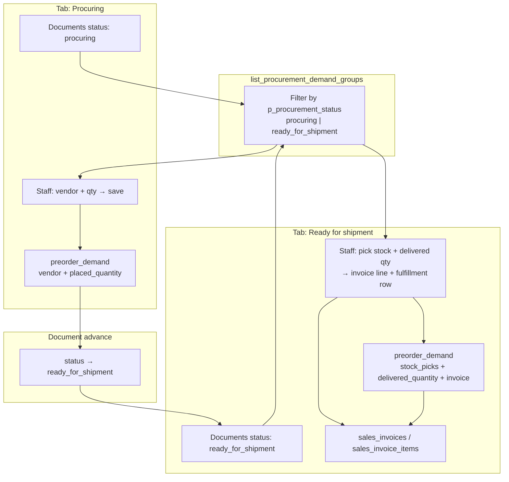

# Procurement Demand List — Aggregated Items Desk

Staff-facing **two-phase demand desk** for **catalog shop orders** and/or **PBC costing files**, grouped by source document:

1. **Procuring** — log **vendor + place order qty** on `preorder_demand.placed_quantity`.
2. **Ready for shipment** — pick **stock** into `preorder_demand.stock_picks`, set **delivered qty**, create **invoice lines**.

One aggregated queue instead of opening each order or costing file separately.

**Related:** [`CATALOG_NEGOTIATION.md`](./CATALOG_NEGOTIATION.md) (order statuses) · [`PBC_COSTING.md`](../product_based_costing/PBC_COSTING.md) (file statuses) · [`DEMAND_BUCKET.md`](./DEMAND_BUCKET.md) (customer waiting list) · [`PROCUREMENT_STOCK.md`](../procurement_stock/PROCUREMENT_STOCK.md) (inbound shipments) · [`CREATE_INVOICE_FROM_PAYLOAD_RPC.md`](../sales_invoice/CREATE_INVOICE_FROM_PAYLOAD_RPC.md) (invoice create)

---

## 1. Purpose

| Problem | This desk |
| :--- | :--- |
| Staff must open each shop order and each costing file separately | One screen unions **both sources** by procurement status |
| No shared log of vendor PO qty | **Procuring tab:** vendor + **place order qty** → `preorder_demand` |
| No single place to fulfill from stock + invoice | **Ready tab:** stock picks + **delivered qty** on same `preorder_demand` row + invoice |
| Hard to see what was ordered vs what left the warehouse | Per line: `placed_quantity` vs `delivered_quantity` on `preorder_demand` |
| Parent tenant manages multiple child concerns | Optional filter by child `tenant_id` |

**Tab 1 — `procuring`:** lines appear after the document enters procurement. Staff record what they bought from suppliers.

**Tab 2 — `ready_for_shipment`:** lines appear after staff mark the document ready (buying done, stock available). Staff pick warehouse stock, enter **delivered quantity**, and **create or extend a sales invoice** for that order / costing file customer. Each save links stock → invoice line → source line.

This is **not** the customer demand bucket (shortfalls from past orders).

---

## 2. Flow



**One row per demand line:** `preorder_demand` holds vendor PO qty (`placed_quantity`) and customer delivery (`delivered_quantity` + `stock_picks`) on the same source line (`source_type` + `source_id`). Inbound **parent shipments** (`global_shipment_items`) remain on the Shipment module when a vendor proforma exists.

Four records, one customer paper:

| Record | Table / module | Role |
| :--- | :--- | :--- |
| Customer document | `shop_orders` / `product_based_costing_files` | Status: `procuring` → `ready_for_shipment` → `delivered` |
| Vendor PO + delivery log | `preorder_demand` | Demand desk (both tabs) |
| Vendor cargo | Shipment module | Proforma, vendor invoice, receive, warehouse stock |
| Customer invoice | `sales_invoices` / `sales_invoice_items` | Created from Ready tab |

Catalog and PBC share this path after `confirmed`. In-stock (`fixed_price`) shops do **not**.

**Do not** change document status when the vendor sends a proforma or final invoice — see [`CATALOG_NEGOTIATION.md`](./CATALOG_NEGOTIATION.md) stay-procuring table. Customer copy: `procuring` → **We're sourcing your items**; `ready_for_shipment` → **On the way**.

### 2.1 Document status → Demand tab

| `p_procurement_status` | Demand tab | Staff action |
| :--- | :--- | :--- |
| `procuring` | **Procuring** | Vendor + **place order qty** → `upsert_preorder_demand` (`placed_quantity`) |
| `ready_for_shipment` | **Ready for shipment** | Stock picks + **delivered qty** → `upsert_preorder_demand` + invoice |
| `delivered` | *(not on Demand desk)* | Closed — view on order / costing file detail |

Pre-procurement (`submitted`, `priced`, `confirmed` on orders; `pending`, `offered` on PBC) **excludes** lines from this list.

**RPC:** `list_procurement_demand_groups` is called with `p_procurement_status` matching the active tab (`procuring` or `ready_for_shipment`).

**Legacy alias mapping (transition):** RPCs normalize document status before filtering so old rows still appear until backfilled:

| Legacy value | Normalized procurement status |
| :--- | :--- |
| Catalog `ordered` | `ready_for_shipment` |
| PBC `placing_order` | `procuring` |
| PBC `invoicing` | `delivered` |

Migration `20270911180000_align_demand_status_aliases.sql` backfills rows; helpers `normalize_shop_order_procurement_status` / `normalize_pbc_procurement_status` keep reads safe if any alias remains.

### 2.2 Which sources are included

| Tenant has | `meta.sources_included` |
| :--- | :--- |
| `vendor_catalog` shop orders in procurement | `shop_order` |
| `product_based_costing_files` in procurement | `pbc_costing` |
| Both | `["shop_order", "pbc_costing"]` |

Empty union → `groups: []`, `item_count: 0`.

### 2.3 Line eligibility (per item)

A line is returned when:

- Parent document status (after alias normalization) = `p_procurement_status`
- Line has **open quantity** &gt; 0 for procurement (not fully on shipment / not fully delivered)
- Shop order: `shop_type_snapshot = vendor_catalog`
- PBC: `billing_profile_id` is set (customer-scoped file)

Exact open-qty rules follow implementation migration (`confirmed_quantity` on shop order lines; PBC excludes lines with `assigned_shipment_id` set).

### 2.4 Procurement placements (vendor + ordered qty)

On the Demand desk, staff **select vendor and ordered quantity** for each line and save. This is the vendor order log **before** a proforma or inbound shipment exists.

| UI field | Stored as |
| :--- | :--- |
| Vendor (dropdown) | `vendor_id` on `preorder_demand` |
| Place order qty | `placed_quantity` on `preorder_demand` |
| Note (optional) | `notes` |

| Store here | Do **not** store here |
| :--- | :--- |
| Vendor, ordered qty, notes, who/when | `meta` on `shop_order_items` / `product_based_costing_items` |
| One row per placement (split vendors OK) | Draft `global_shipment_items` at order time |

**Need** comes from the shop order / PBC line (`need_quantity`). **Placed** is the sum of active placement rows. **Remaining** = need − placed (floor at 0). Staff repeat vendor + qty until remaining is 0 or they advance the document to **`ready_for_shipment`**.

### 2.5 Ready for shipment — delivered qty, stock, and invoice

When the document is **`ready_for_shipment`**, the Ready tab shows the same grouped lines. Staff fulfill from **warehouse stock** and bill the customer in one flow.

| UI field | Stored as |
| :--- | :--- |
| Stock rows (multi-pick) | `stock_picks` jsonb on `preorder_demand` |
| Delivered qty | `delivered_quantity` (= sum of `stock_picks[].quantity`) |
| Invoice | `sales_invoices` / `sales_invoice_items` (separate RPC on create) |

| Compare | Source |
| :--- | :--- |
| **Ordered** (reference) | `preorder_demand.placed_quantity` (capped by `need_quantity`) |
| **Delivered** | `preorder_demand.delivered_quantity` |
| **Remaining to deliver** | `greatest(placed_quantity − delivered_quantity, 0)` |

**Invoice rules (target):**

- One invoice per document group is typical — create draft via `create_sales_invoice_from_payload` on first fulfillment, then add lines on later fulfillments for the same `document_type` + `document_id`.
- `billing_profile_id` comes from the shop order or PBC costing file.
- Each fulfillment RPC adds one `sales_invoice_items` row (stock-backed: `global_stock_id`, qty, sell price from order line / costing line) and deducts stock ATP atomically with the fulfillment row.
- `links.shop_order_id` or `links.pbc_costing_file_id` on the invoice payload ties treasury back to the source document.

**Do not** store delivered qty on `shop_order_items` / `product_based_costing_items` as source of truth — same pattern as placements (separate table, linked by `source_type` + `source_id`).

**Bucket (shortfall):** when the document moves to **`delivered`**, **`sync_customer_group_backlog_from_delivered_document`** compares `placed_quantity` vs `delivered_quantity` per line; any gap is inserted into **`customer_group_backlog_bucket_items`**. See [`DEMAND_BUCKET.md`](./DEMAND_BUCKET.md) §2.

---

## 3. Schema: `preorder_demand`

**Domain:** `procurement_stock`. **Location:** `supabase/schemas/procurement/`.

Replaces **`procurement_placements`** and the planned **`procurement_fulfillments`** table. **One row per demand line** (`source_type` + `source_id` unique).

### 3.1 Enum

```sql
CREATE TYPE public.preorder_demand_source_type AS ENUM (
  'shop_order_item',
  'pbc_costing_item'
);
```

### 3.2 Table

```sql
CREATE TABLE public.preorder_demand (
  id                   bigint GENERATED ALWAYS AS IDENTITY PRIMARY KEY,
  tenant_id            bigint NOT NULL REFERENCES public.tenants(id) ON DELETE CASCADE,
  source_type          public.preorder_demand_source_type NOT NULL,
  source_id            bigint NOT NULL,
  vendor_id            bigint REFERENCES public.vendors(id) ON DELETE SET NULL,
  placed_quantity      integer NOT NULL DEFAULT 0,
  delivered_quantity   integer NOT NULL DEFAULT 0,
  stock_picks          jsonb NOT NULL DEFAULT '[]'::jsonb,
  notes                text,
  updated_by_user_id   uuid REFERENCES auth.users(id) ON DELETE SET NULL,
  created_at           timestamptz NOT NULL DEFAULT now(),
  updated_at           timestamptz NOT NULL DEFAULT now(),
  CONSTRAINT preorder_demand_source_unique UNIQUE (source_type, source_id),
  CONSTRAINT preorder_demand_placed_quantity_check CHECK (placed_quantity >= 0),
  CONSTRAINT preorder_demand_delivered_quantity_check CHECK (delivered_quantity >= 0),
  CONSTRAINT preorder_demand_delivered_lte_placed_check CHECK (delivered_quantity <= placed_quantity),
  CONSTRAINT preorder_demand_stock_picks_is_array CHECK (jsonb_typeof(stock_picks) = 'array')
);
```

| Column | UI mapping | Notes |
| :--- | :--- | :--- |
| `source_type` / `source_id` | Line key | `shop_order_item.id` or `pbc_costing_item.id` |
| `vendor_id` | Vendor column | Set on Procuring tab |
| `placed_quantity` | Place order qty | Vendor PO qty; `<= need_quantity` |
| `delivered_quantity` | Delivered qty | Sum of stock picks; `<= placed_quantity` |
| `stock_picks` | Stock pick dialog | JSON array — see §3.3 |

### 3.3 `stock_picks` JSON shape

```json
[
  { "global_stock_id": 88001, "quantity": 25, "shipment_name": "UK-2024-014", "location_name": "Main warehouse" },
  { "global_stock_id": 88002, "quantity": 10 }
]
```

| Field | Required | Notes |
| :--- | :---: | :--- |
| `global_stock_id` | ✓ | `global_stocks.id` |
| `quantity` | ✓ | Units from this stock row (`> 0`) |
| `shipment_name` / `location_name` | | Display-only snapshot for desk UI |

`delivered_quantity` is set to `sum(stock_picks[].quantity)` when `stock_picks` is saved via RPC.

### 3.4 Indexes & RLS

- `preorder_demand_source_idx` on `(source_type, source_id)`
- `preorder_demand_tenant_updated_idx` on `(tenant_id, updated_at DESC)`
- RLS: staff on `tenant_id` or parent operator; writes via `upsert_preorder_demand` only.

### 3.5 Write rules (`upsert_preorder_demand`)

1. Source line must exist; document status `procuring` or `ready_for_shipment`.
2. **`placed_quantity`** + **`vendor_id`** only when document is **`procuring`**; `placed_quantity <= need_quantity`.
3. **`stock_picks`** only when document is **`ready_for_shipment`**; `delivered_quantity = sum(picks)` and `<= placed_quantity`.
4. Upsert on `(source_type, source_id)` — partial updates (only passed fields change).

### 3.6 Retired tables

| Dropped | Replaced by |
| :--- | :--- |
| `procurement_placements` | `preorder_demand.placed_quantity` + `vendor_id` |
| `procurement_fulfillments` (never shipped) | `preorder_demand.delivered_quantity` + `stock_picks` |

Migration: `20270912100000_preorder_demand.sql` migrates active placement sums into `placed_quantity` before drop.

---

## 4. RPC: `list_procurement_demand_groups` (extended)

### 5.1 Signature

Unchanged. Extend the **existing** function body — do **not** wrap it in a new RPC.

```sql
list_procurement_demand_groups(
  p_tenant_id          bigint,
  p_procurement_status text    default 'procuring',
  p_search             text    default null,
  p_child_tenant_id    bigint  default null,
  p_limit              integer default 50,
  p_offset               integer default 0
) returns jsonb
```

| Param | Required | Notes |
| :--- | :---: | :--- |
| `p_tenant_id` | ✓ | Child tenant **or** parent context per access rule below |
| `p_procurement_status` | | `procuring` (Procuring tab) or `ready_for_shipment` (Ready tab) |
| `p_search` | | Matches product name, barcode, product_code, document label |
| `p_child_tenant_id` | | Parent-only: restrict to one sister concern |
| `p_limit` / `p_offset` | | Pagination on **groups** (documents), not flat lines |

### 5.2 Security

- **Child tenant staff:** `is_tenant_staff(p_tenant_id)` — `p_tenant_id` = child.
- **Parent operator:** `user_can_manage_parent_tenant(p_tenant_id)` — union children where `tenants.parent_id = p_tenant_id`; `p_child_tenant_id` optional narrow.

`SECURITY DEFINER`, `search_path = public`, `STABLE`.

### 5.3 SQL change (inside same function)

After `all_lines`, join `preorder_demand` per source line:

```sql
preorder_lines as (
  select
    pd.id as preorder_demand_id,
    pd.source_type::text as source_type,
    pd.source_id,
    pd.vendor_id,
    pd.placed_quantity,
    pd.delivered_quantity,
    coalesce(pd.stock_picks, '[]'::jsonb) as stock_picks
  from public.preorder_demand pd
  inner join tenant_scope ts on ts.tenant_id = pd.tenant_id
)
```

When building each item in `grouped`, left-join `preorder_lines` on `source_type` + `source_id` and emit:

- `preorder_demand_id`, `vendor_id`
- `placed_quantity`, `delivered_quantity`, `stock_picks`
- `remaining_quantity` — `greatest(need_quantity - placed_quantity, 0)`
- `remaining_to_deliver` — `greatest(placed_quantity - delivered_quantity, 0)`

**List visibility:** return a line when `need_quantity > 0` **or** `placed_quantity > 0` **or** `delivered_quantity > 0`.

### 5.4 Response (example)

Grouped by source document. Document-level `vendor` is unchanged (PBC file default vendor). **Placement** vendors are per row in `placements[]`.

```json
{
  "meta": {
    "tenant_id": 12,
    "procurement_status": "procuring",
    "sources_included": ["shop_order", "pbc_costing"],
    "group_count": 2,
    "item_count": 3,
    "total_group_count": 2,
    "limit": 50,
    "offset": 0,
    "has_more": false
  },
  "groups": [
    {
      "document_type": "shop_order",
      "document_id": 29,
      "document_status": "procuring",
      "vendor": null,
      "items": [
        {
          "source_type": "shop_order_item",
          "source_id": 101,
          "product_id": 5001,
          "name": "Wireless Earbuds Pro",
          "image_url": "https://cdn.example.com/p/5001.jpg",
          "barcode": "8801234567890",
          "product_code": "WB-PRO-01",
          "quantity": 60,
          "need_quantity": 60,
          "placed_quantity": 40,
          "remaining_quantity": 20,
          "placements": [
            {
              "id": 9001,
              "vendor_id": 7,
              "vendor_code": "UK-VENDOR-A",
              "vendor_name": "UK Vendor A",
              "quantity": 40,
              "notes": "PO-2026-0412 — call before dispatch",
              "placed_at": "2026-08-20T10:15:00+00:00",
              "placed_by_user_id": "a1b2c3d4-e5f6-7890-abcd-ef1234567890",
              "global_shipment_item_id": null
            }
          ]
        },
        {
          "source_type": "shop_order_item",
          "source_id": 102,
          "product_id": 5002,
          "name": "USB-C Cable 2m",
          "image_url": "https://cdn.example.com/p/5002.jpg",
          "barcode": "8801234567891",
          "product_code": "USB-2M",
          "quantity": 200,
          "need_quantity": 200,
          "placed_quantity": 0,
          "remaining_quantity": 200,
          "placements": []
        }
      ]
    },
    {
      "document_type": "pbc_costing_file",
      "document_id": 15,
      "document_status": "procuring",
      "vendor": {
        "id": 7,
        "code": "UK-VENDOR-A",
        "name": "UK Vendor A"
      },
      "items": [
        {
          "source_type": "pbc_costing_item",
          "source_id": 2044,
          "product_id": 3310,
          "name": "Cotton Polo Shirt",
          "image_url": "https://cdn.example.com/p/3310.jpg",
          "barcode": "8809876543210",
          "product_code": "POLO-221",
          "quantity": 120,
          "need_quantity": 120,
          "placed_quantity": 120,
          "remaining_quantity": 0,
          "placements": [
            {
              "id": 9002,
              "vendor_id": 7,
              "vendor_code": "UK-VENDOR-A",
              "vendor_name": "UK Vendor A",
              "quantity": 80,
              "notes": "First batch",
              "placed_at": "2026-08-19T14:00:00+00:00",
              "placed_by_user_id": "a1b2c3d4-e5f6-7890-abcd-ef1234567890",
              "global_shipment_item_id": null
            },
            {
              "id": 9003,
              "vendor_id": 12,
              "vendor_code": "UK-VENDOR-B",
              "vendor_name": "UK Vendor B",
              "quantity": 40,
              "notes": "Balance from alternate supplier",
              "placed_at": "2026-08-20T09:30:00+00:00",
              "placed_by_user_id": "a1b2c3d4-e5f6-7890-abcd-ef1234567890",
              "global_shipment_item_id": null
            }
          ]
        }
      ]
    }
  ]
}
```

### 5.5 Field reference

#### `meta`

| Field | Type | Description |
| :--- | :--- | :--- |
| `tenant_id` | number | Resolved tenant for the query |
| `procurement_status` | string | Echo of `p_procurement_status` |
| `sources_included` | string[] | Which document types contributed rows |
| `group_count` | number | Length of `groups` in this page |
| `item_count` | number | Total lines across all groups in this page |
| `total_group_count` | number | Total groups before pagination |
| `limit` / `offset` / `has_more` | | Pagination |

#### `groups[]`

| Field | Type | Description |
| :--- | :--- | :--- |
| `document_type` | `"shop_order"` \| `"pbc_costing_file"` | Group key |
| `document_id` | number | `shop_orders.id` or `product_based_costing_files.id` |
| `document_status` | string | Procurement status of the document |
| `vendor` | object \| null | Document-level vendor (PBC file); `null` for shop orders |
| `items` | array | Lines under this document |

#### `groups[].items[]`

| Field | Type | Description |
| :--- | :--- | :--- |
| `source_type` | `"shop_order_item"` \| `"pbc_costing_item"` | Line identity for write RPC |
| `source_id` | number | Line primary key |
| `product_id` | number \| null | `products.id` |
| `name` | string | Display name |
| `image_url` | string \| null | Thumbnail |
| `barcode` | string \| null | |
| `product_code` | string \| null | |
| `quantity` | number | **Alias of `need_quantity`** (kept for backward compat) |
| `need_quantity` | number | Open demand qty on the source line |
| `preorder_demand_id` | number \| null | `preorder_demand.id` when row exists |
| `vendor_id` | number \| null | From `preorder_demand` |
| `placed_quantity` | number | `preorder_demand.placed_quantity` (default `0`) |
| `delivered_quantity` | number | `preorder_demand.delivered_quantity` (default `0`) |
| `remaining_quantity` | number | `greatest(need_quantity - placed_quantity, 0)` |
| `remaining_to_deliver` | number | `greatest(placed_quantity - delivered_quantity, 0)` |
| `stock_picks` | array | `[{ global_stock_id, quantity, … }]` from `preorder_demand` |

#### `groups[].items[].stock_picks[]`

| Field | Type | Description |
| :--- | :--- | :--- |
| `global_stock_id` | number | `global_stocks.id` |
| `quantity` | number | Units from this stock row |
| `shipment_name` | string \| null | Optional display snapshot |
| `location_name` | string \| null | Optional display snapshot |

### 5.6 Quantity semantics

| Source | `need_quantity` = |
| :--- | :--- |
| Shop order item | `greatest(coalesce(confirmed_quantity, quantity, 0), 0)` |
| PBC item | `greatest(coalesce(confirmed_quantity, quantity), 0)` when `assigned_shipment_id IS NULL`, else `0` |

| Derived | Formula |
| :--- | :--- |
| `placed_quantity` | `preorder_demand.placed_quantity` |
| `remaining_quantity` | `greatest(need_quantity - placed_quantity, 0)` |
| `delivered_quantity` | `preorder_demand.delivered_quantity` (= sum of `stock_picks[].quantity`) |
| `remaining_to_deliver` | `greatest(placed_quantity - delivered_quantity, 0)` |

---

## 5. RPC: `upsert_preorder_demand`

```sql
upsert_preorder_demand(
  p_tenant_id        bigint,
  p_source_type      public.preorder_demand_source_type,
  p_source_id        bigint,
  p_vendor_id        bigint  default null,
  p_placed_quantity  integer default null,
  p_stock_picks      jsonb   default null,
  p_notes            text    default null
) returns public.preorder_demand
```

| Param | When | Notes |
| :--- | :--- | :--- |
| `p_vendor_id` / `p_placed_quantity` | Procuring tab | Document must be `procuring` |
| `p_stock_picks` | Ready tab | Document must be `ready_for_shipment`; sets `delivered_quantity` from pick sum |

`SECURITY DEFINER`. Upserts on `(source_type, source_id)`. Partial update — only non-null params change.

---

## 6. UI & navigation (target)

### 10.1 Module placement

| Item | Value |
| :--- | :--- |
| **Parent module** | `procurement_stock` (Procurement & Stock) — **not** standalone |
| **Submodule key** | `procurement_demand` |
| **Code location** | `web/src/modules/procurement_stock/` (page + routes alongside Shipment) |
| **Permissions** | `procurement_stock` view (same gate as Shipment) |

Do **not** add nav under `shop_order` or `product_based_costing` — this page unions both sources.

### 10.2 Sidebar

| Item | Value |
| :--- | :--- |
| **Route** | `/:tenantSlug/app/procurement/demand` |
| **Nav label** | **Demand** (or **Procurement list**) |
| **Caption** | Items to source from orders and costing files |
| **Icon** | `ph ph-list-checks` |
| **Sort order** | **Above** Shipment (`procurement/shipment`) in the Procurement & Stock group |

### 10.3 Page behavior

Two tabs on one route — status drives which RPC filter and which row actions are shown.

| Surface | Route | Behavior |
| :--- | :--- | :--- |
| **Procurement Demand Desk** | `/:tenantSlug/app/procurement/demand` | Tabs: **Procuring** · **Ready for shipment** |
| **Procuring tab** | | `p_procurement_status = procuring` |
| Filter bar | | Search; child tenant (parent operator) |
| Group header | | Document type + id, link to order / costing file detail |
| Procuring rows | | **need / placed / remaining**; vendor + place order qty → `upsert_preorder_demand` |
| **Ready for shipment tab** | | `p_procurement_status = ready_for_shipment` |
| Ready rows | | Stock pick dialog → `stock_picks` + `delivered_quantity` via `upsert_preorder_demand`; bucket sync when document → `delivered` |
| Invoice | | **Create invoice** per document group (separate RPC); stock picks feed invoice lines |
| Group action | | Link to open invoice for document when at least one fulfillment exists |

Query keys:

- `['procurementDemand', 'groups', { tenantId, procurementStatus: 'procuring', … }]`
- `['procurementDemand', 'groups', { tenantId, procurementStatus: 'ready_for_shipment', … }]`

---

## 11. Relation to other concepts

| Concept | Relationship |
| :--- | :--- |
| **`customer_group_backlog_bucket_items`** | Filled on **`delivered`** status (ordered − delivered per line); popped on next order. See [`DEMAND_BUCKET.md`](./DEMAND_BUCKET.md) |
| **`preorder_demand`** | One row per line — vendor + placed qty + stock picks + delivered qty |
| **`create_sales_invoice_from_payload`** | Creates or extends customer invoice during fulfillment |
| **`global_shipment_items`** | Parent inbound shipment (vendor proforma / cargo) — optional back-link from placement; separate from customer fulfillment. Created while document is still `procuring`. |
| **Vendor invoice vs customer invoice** | Vendor paper stays on the shipment. Customer sales invoice is created on the Ready tab only. |
| **`list_procurement_shop_order_lines`** | Legacy shop-order-only list; replace with this RPC |
| **Ordered vs delivered** | `placed_quantity` vs `delivered_quantity` on `preorder_demand` |

---

## 12. Implementation checklist

- [x] Migration: `list_procurement_demand_groups` RPC (v1 — demand only)
- [x] Web: `ProcurementDemandPage.vue` (read-only list)
- [x] Migration: `preorder_demand` table + migrate from `procurement_placements` + drop legacy tables (`20270912100000_preorder_demand.sql`)
- [x] Migration: `upsert_preorder_demand` + extend `list_procurement_demand_groups` with `preorder_demand` join
- [x] Migration: alias normalization + status backfill (`20270911180000_align_demand_status_aliases.sql`)
- [x] Web: dummy demand desk UI (`ProcurementDemandPage.vue`) — vendor, place order, stock pick, delivered qty, create invoice
- [ ] Web: wire `list_procurement_demand_groups` + `upsert_preorder_demand` on demand page
- [ ] Web: invoice create RPC integration on Ready tab
- [ ] Migration: `customer_group_backlog_bucket_items` + sync on `delivered` + pop DELETE ([`DEMAND_BUCKET.md`](./DEMAND_BUCKET.md) §10)
- [ ] Later: RPC to attach placement(s) to `global_shipment_items` when proforma is entered
- [ ] Doc: add route to [`UI_FLOW.md`](./UI_FLOW.md)
