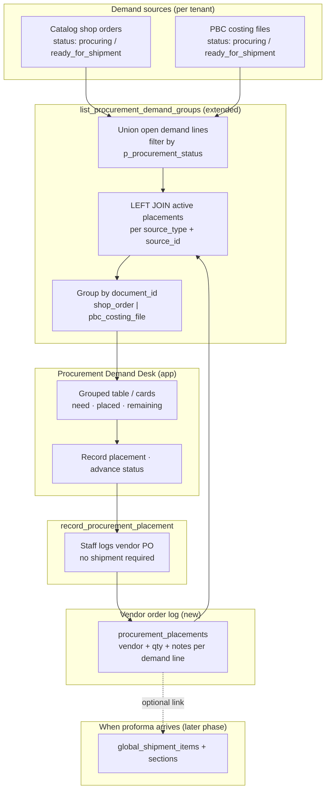

# Procurement Demand List — Aggregated Items Desk

Staff-facing **aggregated procurement list**: line items from **catalog shop orders** and/or **PBC costing files** in the same procurement phase, grouped by source document for buying and shipment planning.

**Related:** [`CATALOG_NEGOTIATION.md`](./CATALOG_NEGOTIATION.md) (order statuses) · [`PBC_COSTING.md`](../product_based_costing/PBC_COSTING.md) (file statuses) · [`DEMAND_BUCKET.md`](./DEMAND_BUCKET.md) (customer waiting list) · [`PROCUREMENT_STOCK.md`](../procurement_stock/PROCUREMENT_STOCK.md) (inbound shipments)

---

## 1. Purpose

| Problem | This desk |
| :--- | :--- |
| Staff must open each shop order and each costing file separately | One screen of **all lines** to source now |
| Parent tenant manages multiple child concerns | Optional filter by child `tenant_id` |
| Tenant uses only shop orders, only PBC, or both | RPC includes **only sources that exist** for that tenant |

This is **not** the customer demand bucket (shortfalls from past orders). It is **active demand** on documents already in procurement.

---

## 2. Flow



**Placement vs shipment:** staff record **what they ordered from the vendor** in `procurement_placements`. Inbound **shipments** are built later from the proforma — one PO may split across shipments, or one shipment may mix many POs. Do **not** create a shipment when staff only places a vendor order.

### 2.1 Shared procurement statuses (filter)

Only documents in these statuses appear (aligned across catalog orders and PBC — see negotiation / PBC docs):

| `p_procurement_status` | Meaning |
| :--- | :--- |
| `procuring` | Buying / placing order with supplier |
| `ready_for_shipment` | Ready for parent inbound shipment handoff |
| `delivered` | Optional history tab — closed lines |

Pre-procurement (`submitted`, `priced`, `confirmed` on orders; `pending`, `offered` on PBC) **excludes** lines from this list.

### 2.2 Which sources are included

| Tenant has | `meta.sources_included` |
| :--- | :--- |
| `vendor_catalog` shop orders in procurement | `shop_order` |
| `product_based_costing_files` in procurement | `pbc_costing` |
| Both | `["shop_order", "pbc_costing"]` |

Empty union → `groups: []`, `item_count: 0`.

### 2.3 Line eligibility (per item)

A line is returned when:

- Parent document `status` = `p_procurement_status`
- Line has **open quantity** &gt; 0 for procurement (not fully on shipment / not fully delivered)
- Shop order: `shop_type_snapshot = vendor_catalog`
- PBC: `billing_profile_id` is set (customer-scoped file)

Exact open-qty rules follow implementation migration (`confirmed_quantity` on shop order lines; PBC excludes lines with `assigned_shipment_id` set).

### 2.4 Procurement placements (vendor order log)

Staff need to record **where** and **how much** they ordered from a supplier **before** a proforma or inbound shipment exists.

| Store here | Do **not** store here |
| :--- | :--- |
| Vendor PO qty, vendor code/id, notes, who/when | `meta` on `shop_order_items` / `product_based_costing_items` |
| One row per placement (split vendors OK) | Draft `global_shipment_items` at order time |

**Demand** (need) stays on shop order / PBC lines. **Placed** qty is the sum of active `procurement_placements` rows for that line. **Remaining** = need − placed (floor at 0).

---

## 3. Schema: `procurement_placements`

**Domain:** `procurement_stock` (same module as shipments). **Location:** `supabase/schemas/procurement/`.

### 3.1 Enum

```sql
CREATE TYPE public.procurement_placement_source_type AS ENUM (
  'shop_order_item',
  'pbc_costing_item'
);
```

Reuse the same two source keys as the demand list RPC (`source_type` + `source_id`).

### 3.2 Table

```sql
CREATE TABLE public.procurement_placements (
  id                          bigint GENERATED ALWAYS AS IDENTITY PRIMARY KEY,
  tenant_id                   bigint NOT NULL REFERENCES public.tenants(id) ON DELETE CASCADE,
  source_type                 public.procurement_placement_source_type NOT NULL,
  source_id                   bigint NOT NULL,
  vendor_id                   bigint REFERENCES public.vendors(id) ON DELETE SET NULL,
  vendor_code                 text,                    -- snapshot / free-text when vendor not linked
  quantity                    integer NOT NULL,
  notes                       text,
  placed_by_user_id           uuid REFERENCES auth.users(id) ON DELETE SET NULL,
  placed_at                   timestamptz NOT NULL DEFAULT now(),
  status                      text NOT NULL DEFAULT 'active'
    CHECK (status IN ('active', 'cancelled')),
  global_shipment_item_id     bigint REFERENCES public.global_shipment_items(id) ON DELETE SET NULL,
  created_at                  timestamptz NOT NULL DEFAULT now(),
  updated_at                  timestamptz NOT NULL DEFAULT now(),
  CONSTRAINT procurement_placements_quantity_check CHECK (quantity > 0)
);
```

| Column | Notes |
| :--- | :--- |
| `tenant_id` | Child tenant that owns the demand line (resolved from source row on insert) |
| `vendor_id` / `vendor_code` | Optional; either or both may be null |
| `quantity` | Units ordered in **this** placement (multiple rows per line allowed) |
| `notes` | Staff note (PO ref, urgency, substitute, etc.) |
| `status` | `active` counts toward `placed_quantity`; `cancelled` is audit-only |
| `global_shipment_item_id` | **Optional**, set later when proforma line is created on inbound shipment |

### 3.3 Indexes

```sql
CREATE INDEX procurement_placements_source_active_idx
  ON public.procurement_placements (source_type, source_id)
  WHERE status = 'active';

CREATE INDEX procurement_placements_tenant_placed_at_idx
  ON public.procurement_placements (tenant_id, placed_at DESC);

CREATE INDEX procurement_placements_vendor_idx
  ON public.procurement_placements (vendor_id)
  WHERE vendor_id IS NOT NULL;
```

### 3.4 RLS

- Enable RLS; policy: `tenant_id` matches `app.current_tenant_id` **or** parent operator via `user_can_manage_parent_tenant` on parent of `tenant_id`.
- All writes via `SECURITY DEFINER` RPCs (no direct client insert).

### 3.5 Write rules (enforced in RPC)

1. Source line must exist and belong to `tenant_id`.
2. Parent document must be in `procuring` or `ready_for_shipment` (not `delivered`).
3. `sum(active.quantity) + new.quantity <= open_demand_qty` for that source line (same open-qty formula as list RPC).
4. Cancel only when `global_shipment_item_id IS NULL` (not yet on a shipment).
5. Link to `global_shipment_item_id` is a **later** RPC when building shipment from proforma — out of scope for v1 desk.

---

## 4. RPC: `list_procurement_demand_groups` (extended)

### 4.1 Signature

Unchanged. Extend the **existing** function body — do **not** wrap it in a new RPC.

```sql
list_procurement_demand_groups(
  p_tenant_id          bigint,
  p_procurement_status text    default 'procuring',
  p_search             text    default null,
  p_child_tenant_id    bigint  default null,
  p_limit              integer default 50,
  p_offset               integer default 0
) returns jsonb
```

| Param | Required | Notes |
| :--- | :---: | :--- |
| `p_tenant_id` | ✓ | Child tenant **or** parent context per access rule below |
| `p_procurement_status` | | `procuring` \| `ready_for_shipment` \| `delivered` |
| `p_search` | | Matches product name, barcode, product_code, document label |
| `p_child_tenant_id` | | Parent-only: restrict to one sister concern |
| `p_limit` / `p_offset` | | Pagination on **groups** (documents), not flat lines |

### 4.2 Security

- **Child tenant staff:** `is_tenant_staff(p_tenant_id)` — `p_tenant_id` = child.
- **Parent operator:** `user_can_manage_parent_tenant(p_tenant_id)` — union children where `tenants.parent_id = p_tenant_id`; `p_child_tenant_id` optional narrow.

`SECURITY DEFINER`, `search_path = public`, `STABLE`.

### 4.3 SQL change (inside same function)

After `all_lines`, add a CTE that aggregates **active** placements per source line:

```sql
placement_totals as (
  select
    pp.source_type::text as source_type,
    pp.source_id,
    coalesce(sum(pp.quantity), 0)::integer as placed_quantity,
    coalesce(
      jsonb_agg(
        jsonb_build_object(
          'id', pp.id,
          'vendor_id', pp.vendor_id,
          'vendor_code', nullif(trim(pp.vendor_code), ''),
          'vendor_name', v.name,
          'quantity', pp.quantity,
          'notes', pp.notes,
          'placed_at', pp.placed_at,
          'placed_by_user_id', pp.placed_by_user_id,
          'global_shipment_item_id', pp.global_shipment_item_id
        )
        order by pp.placed_at, pp.id
      ) filter (where pp.id is not null),
      '[]'::jsonb
    ) as placements
  from public.procurement_placements pp
  left join public.vendors v on v.id = pp.vendor_id
  where pp.status = 'active'
  group by pp.source_type, pp.source_id
)
```

When building each item in `grouped`, join `placement_totals` on `source_type` + `source_id` and emit:

- `need_quantity` — open demand (today’s `quantity` field; keep `quantity` as alias for backward compat **or** rename in a coordinated web types bump)
- `placed_quantity` — from `placement_totals`, default `0`
- `remaining_quantity` — `greatest(need_quantity - placed_quantity, 0)`
- `placements` — array from `placement_totals`

**List visibility:** return a line when `need_quantity > 0` **or** `placed_quantity > 0` (so partially placed lines stay visible until fully covered).

### 4.4 Response (example)

Grouped by source document. Document-level `vendor` is unchanged (PBC file default vendor). **Placement** vendors are per row in `placements[]`.

```json
{
  "meta": {
    "tenant_id": 12,
    "procurement_status": "procuring",
    "sources_included": ["shop_order", "pbc_costing"],
    "group_count": 2,
    "item_count": 3,
    "total_group_count": 2,
    "limit": 50,
    "offset": 0,
    "has_more": false
  },
  "groups": [
    {
      "document_type": "shop_order",
      "document_id": 29,
      "document_status": "procuring",
      "vendor": null,
      "items": [
        {
          "source_type": "shop_order_item",
          "source_id": 101,
          "product_id": 5001,
          "name": "Wireless Earbuds Pro",
          "image_url": "https://cdn.example.com/p/5001.jpg",
          "barcode": "8801234567890",
          "product_code": "WB-PRO-01",
          "quantity": 60,
          "need_quantity": 60,
          "placed_quantity": 40,
          "remaining_quantity": 20,
          "placements": [
            {
              "id": 9001,
              "vendor_id": 7,
              "vendor_code": "UK-VENDOR-A",
              "vendor_name": "UK Vendor A",
              "quantity": 40,
              "notes": "PO-2026-0412 — call before dispatch",
              "placed_at": "2026-08-20T10:15:00+00:00",
              "placed_by_user_id": "a1b2c3d4-e5f6-7890-abcd-ef1234567890",
              "global_shipment_item_id": null
            }
          ]
        },
        {
          "source_type": "shop_order_item",
          "source_id": 102,
          "product_id": 5002,
          "name": "USB-C Cable 2m",
          "image_url": "https://cdn.example.com/p/5002.jpg",
          "barcode": "8801234567891",
          "product_code": "USB-2M",
          "quantity": 200,
          "need_quantity": 200,
          "placed_quantity": 0,
          "remaining_quantity": 200,
          "placements": []
        }
      ]
    },
    {
      "document_type": "pbc_costing_file",
      "document_id": 15,
      "document_status": "procuring",
      "vendor": {
        "id": 7,
        "code": "UK-VENDOR-A",
        "name": "UK Vendor A"
      },
      "items": [
        {
          "source_type": "pbc_costing_item",
          "source_id": 2044,
          "product_id": 3310,
          "name": "Cotton Polo Shirt",
          "image_url": "https://cdn.example.com/p/3310.jpg",
          "barcode": "8809876543210",
          "product_code": "POLO-221",
          "quantity": 120,
          "need_quantity": 120,
          "placed_quantity": 120,
          "remaining_quantity": 0,
          "placements": [
            {
              "id": 9002,
              "vendor_id": 7,
              "vendor_code": "UK-VENDOR-A",
              "vendor_name": "UK Vendor A",
              "quantity": 80,
              "notes": "First batch",
              "placed_at": "2026-08-19T14:00:00+00:00",
              "placed_by_user_id": "a1b2c3d4-e5f6-7890-abcd-ef1234567890",
              "global_shipment_item_id": null
            },
            {
              "id": 9003,
              "vendor_id": 12,
              "vendor_code": "UK-VENDOR-B",
              "vendor_name": "UK Vendor B",
              "quantity": 40,
              "notes": "Balance from alternate supplier",
              "placed_at": "2026-08-20T09:30:00+00:00",
              "placed_by_user_id": "a1b2c3d4-e5f6-7890-abcd-ef1234567890",
              "global_shipment_item_id": null
            }
          ]
        }
      ]
    }
  ]
}
```

### 4.5 Field reference

#### `meta`

| Field | Type | Description |
| :--- | :--- | :--- |
| `tenant_id` | number | Resolved tenant for the query |
| `procurement_status` | string | Echo of `p_procurement_status` |
| `sources_included` | string[] | Which document types contributed rows |
| `group_count` | number | Length of `groups` in this page |
| `item_count` | number | Total lines across all groups in this page |
| `total_group_count` | number | Total groups before pagination |
| `limit` / `offset` / `has_more` | | Pagination |

#### `groups[]`

| Field | Type | Description |
| :--- | :--- | :--- |
| `document_type` | `"shop_order"` \| `"pbc_costing_file"` | Group key |
| `document_id` | number | `shop_orders.id` or `product_based_costing_files.id` |
| `document_status` | string | Procurement status of the document |
| `vendor` | object \| null | Document-level vendor (PBC file); `null` for shop orders |
| `items` | array | Lines under this document |

#### `groups[].items[]`

| Field | Type | Description |
| :--- | :--- | :--- |
| `source_type` | `"shop_order_item"` \| `"pbc_costing_item"` | Line identity for write RPC |
| `source_id` | number | Line primary key |
| `product_id` | number \| null | `products.id` |
| `name` | string | Display name |
| `image_url` | string \| null | Thumbnail |
| `barcode` | string \| null | |
| `product_code` | string \| null | |
| `quantity` | number | **Alias of `need_quantity`** (kept for backward compat) |
| `need_quantity` | number | Open demand qty on the source line |
| `placed_quantity` | number | Sum of active `procurement_placements.quantity` |
| `remaining_quantity` | number | `greatest(need_quantity - placed_quantity, 0)` |
| `placements` | array | Active placement rows (see below) |

#### `groups[].items[].placements[]`

| Field | Type | Description |
| :--- | :--- | :--- |
| `id` | number | `procurement_placements.id` |
| `vendor_id` | number \| null | `vendors.id` when linked |
| `vendor_code` | string \| null | Code snapshot |
| `vendor_name` | string \| null | From `vendors.name` when `vendor_id` set |
| `quantity` | number | Units in this placement |
| `notes` | string \| null | Staff note |
| `placed_at` | string (ISO) | When recorded |
| `placed_by_user_id` | string (uuid) \| null | Staff user |
| `global_shipment_item_id` | number \| null | Set when linked to inbound shipment (later) |

### 4.6 Quantity semantics

| Source | `need_quantity` = |
| :--- | :--- |
| Shop order item | `greatest(coalesce(confirmed_quantity, quantity, 0), 0)` |
| PBC item | `greatest(coalesce(confirmed_quantity, quantity), 0)` when `assigned_shipment_id IS NULL`, else `0` |

| Derived | Formula |
| :--- | :--- |
| `placed_quantity` | `sum(procurement_placements.quantity)` where `status = 'active'` |
| `remaining_quantity` | `greatest(need_quantity - placed_quantity, 0)` |

Lines omitted when `need_quantity <= 0` **and** `placed_quantity <= 0`.

---

## 5. RPC: `record_procurement_placement` (new write)

### 5.1 Signature

```sql
record_procurement_placement(
  p_tenant_id    bigint,
  p_source_type  public.procurement_placement_source_type,
  p_source_id    bigint,
  p_vendor_id    bigint  default null,
  p_vendor_code  text    default null,
  p_quantity     integer,
  p_notes        text    default null
) returns public.procurement_placements
```

| Param | Required | Notes |
| :--- | :---: | :--- |
| `p_tenant_id` | ✓ | Child tenant (or parent context — resolve source line tenant) |
| `p_source_type` | ✓ | `shop_order_item` \| `pbc_costing_item` |
| `p_source_id` | ✓ | Line id |
| `p_vendor_id` | | Optional |
| `p_vendor_code` | | Optional |
| `p_quantity` | ✓ | Must be &gt; 0 |
| `p_notes` | | Optional |

`SECURITY DEFINER`, `search_path = public`. Sets `placed_by_user_id = auth.uid()`, `placed_at = now()`.

### 5.2 Response

Returns the inserted row (Postgres composite / JSON via wrapper). Web repository maps to:

```json
{
  "id": 9004,
  "tenant_id": 12,
  "source_type": "shop_order_item",
  "source_id": 102,
  "vendor_id": 7,
  "vendor_code": "UK-VENDOR-A",
  "quantity": 50,
  "notes": "WhatsApp order confirmed",
  "placed_by_user_id": "a1b2c3d4-e5f6-7890-abcd-ef1234567890",
  "placed_at": "2026-08-25T10:30:00+00:00",
  "status": "active",
  "global_shipment_item_id": null,
  "created_at": "2026-08-25T10:30:00+00:00",
  "updated_at": "2026-08-25T10:30:00+00:00"
}
```

After success, invalidate `['procurementDemand', 'groups', …]` on the client.

---

## 6. RPC: `cancel_procurement_placement` (new write)

```sql
cancel_procurement_placement(
  p_tenant_id     bigint,
  p_placement_id  bigint
) returns public.procurement_placements
```

Sets `status = 'cancelled'`, `updated_at = now()`. Fails if `global_shipment_item_id IS NOT NULL`. Same access rules as list RPC.

---

## 7. UI & navigation (target)

### 7.1 Module placement

| Item | Value |
| :--- | :--- |
| **Parent module** | `procurement_stock` (Procurement & Stock) — **not** standalone |
| **Submodule key** | `procurement_demand` |
| **Code location** | `web/src/modules/procurement_stock/` (page + routes alongside Shipment) |
| **Permissions** | `procurement_stock` view (same gate as Shipment) |

Do **not** add nav under `shop_order` or `product_based_costing` — this page unions both sources.

### 7.2 Sidebar

| Item | Value |
| :--- | :--- |
| **Route** | `/:tenantSlug/app/procurement/demand` |
| **Nav label** | **Demand** (or **Procurement list**) |
| **Caption** | Items to source from orders and costing files |
| **Icon** | `ph ph-list-checks` |
| **Sort order** | **Above** Shipment (`procurement/shipment`) in the Procurement & Stock group |

### 7.3 Page behavior

| Surface | Route | Behavior |
| :--- | :--- | :--- |
| **Procurement Demand Desk** | `/:tenantSlug/app/procurement/demand` | Tabs: Procuring · Ready for shipment · Delivered |
| Filter bar | | Search, child tenant (parent), source type chips |
| Group header | | Document type + id, vendor badge, link to order / costing file detail |
| Line rows | | Product thumb, name, code, **need / placed / remaining** |
| Placements | | Expand row → list `placements[]`; add via dialog → `record_procurement_placement` |
| Actions (later) | | Advance document status; link placements → shipment when proforma exists |

Query key: `['procurementDemand', 'groups', { tenantId, status, search, offset }]`

---

## 8. Relation to other concepts

| Concept | Relationship |
| :--- | :--- |
| **Demand bucket** | Customer shortfalls — separate from vendor PO log |
| **`procurement_placements`** | Vendor order log between demand list and inbound shipment |
| **`global_shipment_items`** | Built from proforma; optional `global_shipment_item_id` back-link on placement |
| **`list_procurement_shop_order_lines`** | Legacy shop-order-only list; replace with this RPC |
| **Parent shipment pull** | Later: pull from placements or `ready_for_shipment` lines into shipment sections |
| **Invoice / payment** | Out of scope — handled by `global_invoices` after delivery |

---

## 9. Implementation checklist

- [x] Migration: `list_procurement_demand_groups` RPC (v1 — demand only)
- [x] Web: `ProcurementDemandPage.vue` (read-only list)
- [ ] Migration: `procurement_placement_source_type` enum + `procurement_placements` table + indexes + RLS
- [ ] Migration: extend `list_procurement_demand_groups` with placement join (§4.3)
- [ ] Migration: `record_procurement_placement` + `cancel_procurement_placement`
- [ ] `pnpm run backend:types` after schema migration
- [x] Web: placement dialog + repository methods + types on demand page
- [ ] Later: RPC to attach placement(s) to `global_shipment_items` when proforma is entered
- [ ] Doc: add route to [`UI_FLOW.md`](./UI_FLOW.md) when placement UI ships
