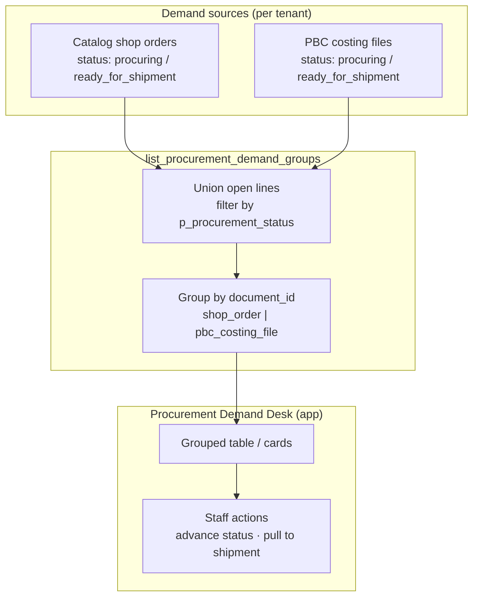

# Procurement Demand List — Aggregated Items Desk

Staff-facing **aggregated procurement list**: line items from **catalog shop orders** and/or **PBC costing files** in the same procurement phase, grouped by source document for buying and shipment planning.

**Related:** [`CATALOG_NEGOTIATION.md`](./CATALOG_NEGOTIATION.md) (order statuses) · [`PBC_COSTING.md`](../product_based_costing/PBC_COSTING.md) (file statuses) · [`DEMAND_BUCKET.md`](./DEMAND_BUCKET.md) (customer waiting list) · [`PROCUREMENT_STOCK.md`](../procurement_stock/PROCUREMENT_STOCK.md) (inbound shipments)

---

## 1. Purpose

| Problem | This desk |
| :--- | :--- |
| Staff must open each shop order and each costing file separately | One screen of **all lines** to source now |
| Parent tenant manages multiple child concerns | Optional filter by child `tenant_id` |
| Tenant uses only shop orders, only PBC, or both | RPC includes **only sources that exist** for that tenant |

This is **not** the customer demand bucket (shortfalls from past orders). It is **active demand** on documents already in procurement.

---

## 2. Flow



### 2.1 Shared procurement statuses (filter)

Only documents in these statuses appear (aligned across catalog orders and PBC — see negotiation / PBC docs):

| `p_procurement_status` | Meaning |
| :--- | :--- |
| `procuring` | Buying / placing order with supplier |
| `ready_for_shipment` | Ready for parent inbound shipment handoff |
| `delivered` | Optional history tab — closed lines |

Pre-procurement (`submitted`, `priced`, `confirmed` on orders; `pending`, `offered` on PBC) **excludes** lines from this list.

### 2.2 Which sources are included

| Tenant has | `meta.sources_included` |
| :--- | :--- |
| `vendor_catalog` shop orders in procurement | `shop_order` |
| `product_based_costing_files` in procurement | `pbc_costing` |
| Both | `["shop_order", "pbc_costing"]` |

Empty union → `groups: []`, `item_count: 0`.

### 2.3 Line eligibility (per item)

A line is returned when:

- Parent document `status` = `p_procurement_status`
- Line has **open quantity** &gt; 0 for procurement (not fully on shipment / not fully delivered)
- Shop order: `shop_type_snapshot = vendor_catalog`
- PBC: `billing_profile_id` is set (customer-scoped file)

Exact open-qty rules follow implementation migration (today may use `confirmed_quantity`, `ordered_quantity`, `assigned_shipment_id` on PBC; catalog order lines TBD when `ordered` → `ready_for_shipment` ships).

---

## 3. RPC: `list_procurement_demand_groups`

### 3.1 Signature

```sql
list_procurement_demand_groups(
  p_tenant_id         bigint,
  p_procurement_status text    default 'procuring',
  p_search            text    default null,
  p_child_tenant_id   bigint  default null,  -- parent desk: filter one child
  p_limit             integer default 50,
  p_offset            integer default 0
) returns jsonb
```

| Param | Required | Notes |
| :--- | :---: | :--- |
| `p_tenant_id` | ✓ | Child tenant **or** parent context per access rule below |
| `p_procurement_status` | | `procuring` \| `ready_for_shipment` \| `delivered` |
| `p_search` | | Matches product name, barcode, product_code, document label |
| `p_child_tenant_id` | | Parent-only: restrict to one sister concern |
| `p_limit` / `p_offset` | | Pagination on **groups** (documents), not flat lines |

### 3.2 Security

- **Child tenant staff:** `is_tenant_staff(p_tenant_id)` — `p_tenant_id` = child.
- **Parent operator:** `user_can_manage_parent_tenant(p_tenant_id)` — union children where `tenants.parent_id = p_tenant_id`; `p_child_tenant_id` optional narrow.

`SECURITY DEFINER`, `search_path = public`, `STABLE`.

### 3.3 Response

Grouped by source document. Items carry **product snapshot + quantity** only; vendor is **document-level** (PBC file vendor; shop orders `null` until vendor is modeled on order/shop).

```json
{
  "meta": {
    "tenant_id": 12,
    "procurement_status": "procuring",
    "sources_included": ["shop_order", "pbc_costing"],
    "group_count": 2,
    "item_count": 3,
    "limit": 50,
    "offset": 0,
    "has_more": false
  },
  "groups": [
    {
      "document_type": "shop_order",
      "document_id": 29,
      "document_status": "procuring",
      "vendor": null,
      "items": [
        {
          "source_type": "shop_order_item",
          "source_id": 101,
          "product_id": 5001,
          "name": "Wireless Earbuds Pro",
          "image_url": "https://cdn.example.com/p/5001.jpg",
          "barcode": "8801234567890",
          "product_code": "WB-PRO-01",
          "quantity": 60
        },
        {
          "source_type": "shop_order_item",
          "source_id": 102,
          "product_id": 5002,
          "name": "USB-C Cable 2m",
          "image_url": "https://cdn.example.com/p/5002.jpg",
          "barcode": "8801234567891",
          "product_code": "USB-2M",
          "quantity": 200
        }
      ]
    },
    {
      "document_type": "pbc_costing_file",
      "document_id": 15,
      "document_status": "procuring",
      "vendor": {
        "id": 7,
        "code": "UK-VENDOR-A",
        "name": "UK Vendor A"
      },
      "items": [
        {
          "source_type": "pbc_costing_item",
          "source_id": 2044,
          "product_id": 3310,
          "name": "Cotton Polo Shirt",
          "image_url": "https://cdn.example.com/p/3310.jpg",
          "barcode": "8809876543210",
          "product_code": "POLO-221",
          "quantity": 120
        }
      ]
    }
  ]
}
```

### 3.4 Field reference

#### `meta`

| Field | Type | Description |
| :--- | :--- | :--- |
| `tenant_id` | number | Resolved tenant for the query |
| `procurement_status` | string | Echo of `p_procurement_status` |
| `sources_included` | string[] | Which document types contributed rows |
| `group_count` | number | Length of `groups` in this page |
| `item_count` | number | Total lines across all groups in this page |
| `limit` / `offset` / `has_more` | | Pagination |

#### `groups[]`

| Field | Type | Description |
| :--- | :--- | :--- |
| `document_type` | `"shop_order"` \| `"pbc_costing_file"` | Group key |
| `document_id` | number | `shop_orders.id` or `product_based_costing_files.id` |
| `document_status` | string | Procurement status of the document |
| `vendor` | object \| null | From PBC file `vendor_id` / `vendor_code`; `null` for shop orders (v1) |
| `items` | array | Lines under this document |

#### `groups[].vendor`

| Field | Type | Description |
| :--- | :--- | :--- |
| `id` | number \| null | `vendors.id` when linked |
| `code` | string \| null | Vendor code on file |
| `name` | string \| null | Vendor display name |

#### `groups[].items[]`

| Field | Type | Description |
| :--- | :--- | :--- |
| `source_type` | `"shop_order_item"` \| `"pbc_costing_item"` | Line identity for actions |
| `source_id` | number | Line primary key |
| `product_id` | number \| null | `products.id` |
| `name` | string | Display name |
| `image_url` | string \| null | Thumbnail |
| `barcode` | string \| null | |
| `product_code` | string \| null | |
| `quantity` | number | Open qty for this procurement pass (integer) |

### 3.5 Quantity semantics

| Source | `quantity` = |
| :--- | :--- |
| Shop order item | Open procurement qty (target: `confirmed_quantity` minus qty already allocated to shipment; interim: line qty fields per migration) |
| PBC item | `coalesce(confirmed_quantity, quantity) - coalesce(ordered_quantity, 0)` minus qty already `on_shipment` |

Lines with `quantity <= 0` are omitted.

---

## 4. UI & navigation (target)

### 4.1 Module placement

| Item | Value |
| :--- | :--- |
| **Parent module** | `procurement_stock` (Procurement & Stock) — **not** standalone |
| **Submodule key** | `procurement_demand` |
| **Code location** | `web/src/modules/procurement_stock/` (page + routes alongside Shipment) |
| **Permissions** | `procurement_stock` view (same gate as Shipment) |

Do **not** add nav under `shop_order` or `product_based_costing` — this page unions both sources.

### 4.2 Sidebar

| Item | Value |
| :--- | :--- |
| **Route** | `/:tenantSlug/app/procurement/demand` |
| **Nav label** | **Demand** (or **Procurement list**) |
| **Caption** | Items to source from orders and costing files |
| **Icon** | `ph ph-list-checks` |
| **Sort order** | **Above** Shipment (`procurement/shipment`) in the Procurement & Stock group |

### 4.3 Page behavior

| Surface | Route | Behavior |
| :--- | :--- | :--- |
| **Procurement Demand Desk** | `/:tenantSlug/app/procurement/demand` | Tabs: Procuring · Ready for shipment · Delivered |
| Filter bar | | Search, child tenant (parent), source type chips |
| Group header | | Document type + id, vendor badge, link to order / costing file detail |
| Line rows | | Product thumb, name, code, qty |
| Actions (later) | | Bulk select → attach to inbound shipment; advance document status |

Query key (proposed): `['procurementDemand', 'groups', { tenantId, status, search, offset }]`

---

## 5. Relation to other concepts

| Concept | Relationship |
| :--- | :--- |
| **Demand bucket** | Past shortfalls; can be merged into this desk in a later phase |
| **`list_procurement_shop_order_lines`** | Legacy shop-order-only list; replace with this RPC |
| **Parent shipment pull** | Lines in `ready_for_shipment` groups feed `add_child_line_to_parent_shipment` |
| **Invoice / payment** | Out of scope — handled by `global_invoices` after delivery |

---

## 6. Implementation checklist

- [ ] Migration: `list_procurement_demand_groups` RPC
- [ ] Catalog: map `procuring` / `ready_for_shipment` on `shop_order_status` (replace legacy `ordered` where needed)
- [ ] PBC: migrate `placing_order` → `procuring` in data + UI
- [ ] Web: `ProcurementDemandPage.vue` in `procurement_stock` + `moduleRegistry` entry (`procurement_demand` under `procurement_stock`, above Shipment)
- [ ] Deprecate direct use of `list_procurement_shop_order_lines` in UI
- [ ] Doc: add route to [`UI_FLOW.md`](./UI_FLOW.md) when page ships
