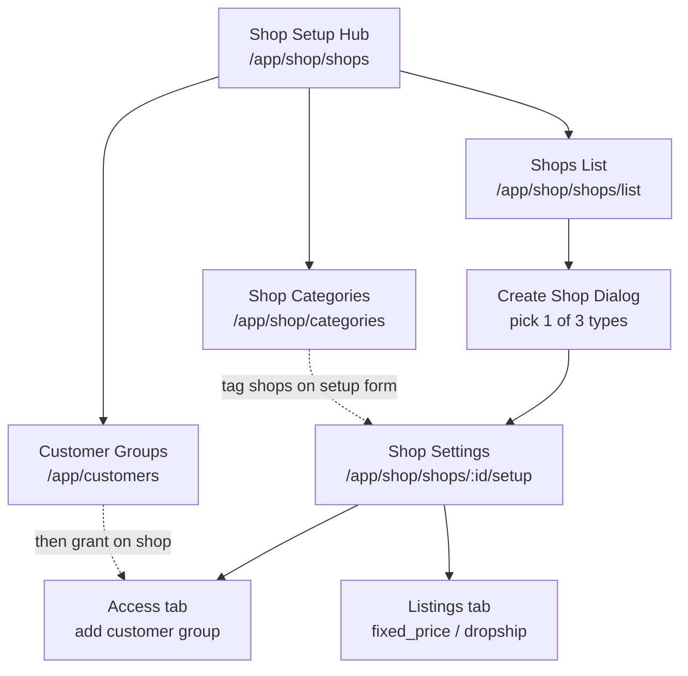
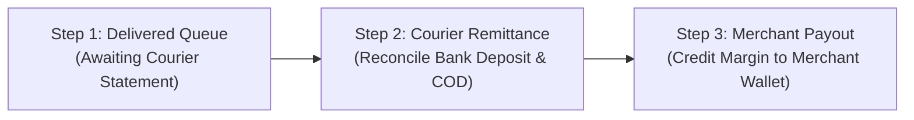

# Shop Orders & Dropship Module

The **Shop Order & Dropship** domain powers B2B storefront commerce (`shop` scope), the administrative **Shop Setup** desk (`shop_config`), and the **Dropship** fulfillment desk (`app` scope).

Customer group provisioning lives in [`CUSTOMER.md`](../customer/CUSTOMER.md). Shop hub **Customer Groups** opens that module.

**UI flows, button rules, and validation matrices:** [`UI_FLOW.md`](./UI_FLOW.md)

**Catalog negotiation (status model, labels, transitions):** [`CATALOG_NEGOTIATION.md`](./CATALOG_NEGOTIATION.md)

**Customer demand bucket (shared waiting list, add / soft pop / purge):** [`DEMAND_BUCKET.md`](./DEMAND_BUCKET.md)

**Procurement demand list (aggregated shop order + PBC lines):** [`PROCUREMENT_DEMAND_LIST.md`](./PROCUREMENT_DEMAND_LIST.md)

---

## 1. Shop Setup Operator Journey (`shop_config`)

Staff configure storefronts before orders flow. Recommended order:



### Shop types (`shop_type_enum`)

| Type | Enum | Model |
| :--- | :--- | :--- |
| **Catalog** | `vendor_catalog` | Supplier catalog; staff procures after customer order. Needs vendor(s). Negotiable. |
| **In stock** | `fixed_price` | Sells warehouse stock via allocations / listings. |
| **Dropship** | `dropship` | Reseller portal; customer price above floor; courier + dual-invoice desk. |

Create flow: name + type in [`ShopFormDialog.vue`](file:///Users/daviditc/Documents/personal_projects/brandwala-wholesale-quasar-v2/web/src/modules/shop_order/components/ShopFormDialog.vue) → `upsert_shop` → navigate to setup.

### Shop categories (`shop_categories`)

Tenant-wide labels (name, slug, icon, active). Staff manage on **Categories** page. Each shop picks one or more via `shops.category_ids` on the setup form. Active categories group shops on the **customer shop homepage** (`RPC: fetch_customer_shop_categories` — service exists; customer browse UI may still use flat shop list).

### Vendors (catalog shops only)

`vendor_catalog` shops require at least one vendor before publish. **Multi-vendor** is supported via `shops.vendor_filters` (`[{ vendor_code, brands[] }]`). Legacy single `vendor_code` is kept in sync with the first filter row. Brand picklists load from the products module (`listBrands` by vendor).

### Customer access

Per shop, staff grant **customer groups** on the **Access** tab ([`ShopAccessMatrixPage.vue`](file:///Users/daviditc/Documents/personal_projects/brandwala-wholesale-quasar-v2/web/src/modules/shop_order/pages/ShopAccessMatrixPage.vue)):

- **Add group** — pick existing group → `upsert_shop_customer_group_access`
- **Create group** — inline form → `create_customer_account` (see `CUSTOMER.md`) then grant access
- Capabilities: browse, **can see purchase price** (`unit_price`), **can see sell price** (`sell_price`), **can see resell minimum price** (`resell_minimum_price`), cart, place order, negotiate, view qty, dropship price tier, credit limit

Group-wide defaults: `customer_group_shop_profiles` via `upsert_customer_group_shop_profile`.

**Price permissions** (per group × shop):

| Toggle | RPC flag | Gates object |
| :--- | :--- | :--- |
| **Can see purchase price** | `can_see_buy_price` | `unit_price` |
| **Can see sell price** | `can_see_sell_price` | `sell_price` |
| **Can see resell minimum price** | `can_see_resell_minimum_price` | `resell_minimum_price` |

Cart/checkout sell totals still use `can_see_sell_price`.

### Price visibility (permissions)

Permissions come from `get_shop_permissions_for_customer(shop_id)` and are echoed in `meta.permissions`.

Each price is a nested object: `{ amount, currency_id, code, symbol }`. When permission is denied or not applicable for that shop type, the whole object is `null`.

| Permission | Object | `vendor_catalog` | `fixed_price` | `dropship` |
| :--- | :--- | :--- | :--- | :--- |
| `can_see_buy_price` | `unit_price` | List price | `null` | Landed cost + buy currency |
| `can_see_sell_price` | `sell_price` | `null` | Computed listing price | Listing `sell_price_amount` |
| `can_see_resell_minimum_price` | `resell_minimum_price` | `null` | `null` | Listing `minimum_sell_price_amount` |

**Summary by shop type on browse:**

- **`vendor_catalog`:** `unit_price` only
- **`fixed_price`:** `sell_price` only
- **`dropship`:** `unit_price` + `sell_price` + `resell_minimum_price` (each gated by its own permission)

Grant key: `shop_permissions` (tab) / `shop_config` (shop CRUD).

---

## 2. Domain Architecture & Dual-Track Workflows



```mermaid
flowchart TD
    subgraph Track1 ["Track 1: Storefront B2B Commerce (shop Scope)"]
        CG["Customer Group & Tier Pricing"] --> CAT["Storefront Catalog (StorefrontPage.vue)"]
        CAT --> CART["Cart & Checkout (ShopCheckoutPage.vue)"]
        CART --> CO["Customer Order Placed"]
    end

    subgraph Track2 ["Track 2: Dropship Fulfillment & Desk (app Scope)"]
        DO["Dropship Order"] --> PACK["1. Processing & Packing Slip"]
        PACK --> DUAL["2. Dual Invoice & Courier AWB"]
        DUAL --> SHIP["3. Shipped / In-Transit"]
        SHIP --> DELIV["4. Delivered"]
        DELIV --> FIN["5. Finance Hub Settlement<br/>(COD Remittance -> Wallet Payout)"]
    end
```

### Dropship 5-Stage Lifecycle & Dual-Invoice Engine

```text
Dropship Order Lifecycle:
1. placed            -> Initial merchant order created
2. processing        -> Packed; customer-facing delivery label printed
3. ready_for_pickup  -> Courier assigned; B2B accounting invoice issued
4. in_transit        -> Courier delivery tracking
5. delivered         -> COD collected -> Courier remittance -> Middleman wallet payout
```

---

## 3. Dropship Finance Hub Engine

Settlement is orchestrated via the **Finance Hub** (`DropshipFinanceHubPage.vue`) across 3 sequential settlement steps:



* **Middleman Margin Formula**:
  $$\text{Merchant Payout Spread} = \text{End-Customer Sell Price} - \text{Wholesale Base Price} - \text{Courier Charge}$$
* **Wallet Linkage**: Payout is disbursed via `dispense_middleman_payout_from_tenant` directly to the merchant's Universal Wallet account.

---

## 4. Page & Component Inventory

### Shop Setup (`shop_config` / `shop_category`)

| Route | Main Page | Notes |
| :--- | :--- | :--- |
| `/:tenantSlug?/app/shop/shops` | [`ShopSetupHubPage.vue`](file:///Users/daviditc/Documents/personal_projects/brandwala-wholesale-quasar-v2/web/src/modules/shop_order/pages/ShopSetupHubPage.vue) | Hub: Shops, Categories, Customer Groups (→ `app-customers`) |
| `/:tenantSlug?/app/shop/shops/list` | [`ShopsPage.vue`](file:///Users/daviditc/Documents/personal_projects/brandwala-wholesale-quasar-v2/web/src/modules/shop_order/pages/ShopsPage.vue) | List, search, create dialog |
| `/:tenantSlug?/app/shop/shops/:shopId/setup` | [`ShopSettingsPage.vue`](file:///Users/daviditc/Documents/personal_projects/brandwala-wholesale-quasar-v2/web/src/modules/shop_order/pages/ShopSettingsPage.vue) | Tabs: Setup, Access (`shop_permissions`), Listings (`shop_pricing`) |
| `/:tenantSlug?/app/shop/shops/:shopId/access` | [`ShopAccessMatrixPage.vue`](file:///Users/daviditc/Documents/personal_projects/brandwala-wholesale-quasar-v2/web/src/modules/shop_order/pages/ShopAccessMatrixPage.vue) | Standalone access matrix (also embedded in setup) |
| `/:tenantSlug?/app/shop/shops/:shopId/preview` | [`ShopPreviewPage.vue`](file:///Users/daviditc/Documents/personal_projects/brandwala-wholesale-quasar-v2/web/src/modules/shop_order/pages/ShopPreviewPage.vue) | Staff preview storefront |
| `/:tenantSlug?/app/shop/categories` | [`ShopCategoriesPage.vue`](file:///Users/daviditc/Documents/personal_projects/brandwala-wholesale-quasar-v2/web/src/modules/shop_order/pages/ShopCategoriesPage.vue) | CRUD `shop_categories` |
| `/:tenantSlug?/app/shop/pricing` | [`ShopPricingListPage.vue`](file:///Users/daviditc/Documents/personal_projects/brandwala-wholesale-quasar-v2/web/src/modules/shop_order/pages/ShopPricingListPage.vue) | Jump-off to per-shop listings |
| `/:tenantSlug?/app/shop/pricing/:shopId` | [`ShopPricingPage.vue`](file:///Users/daviditc/Documents/personal_projects/brandwala-wholesale-quasar-v2/web/src/modules/shop_order/pages/ShopPricingPage.vue) | Product listings & markup rules |

### Admin & Dropship Desk (`/app/*`)

| Route | Main Page | Key Child Components |
| :--- | :--- | :--- |
| `/:tenantSlug?/app/dropship/orders` | [`DropshipOrdersPage.vue`](file:///Users/daviditc/Documents/personal_projects/brandwala-wholesale-quasar-v2/web/src/modules/shop_order/pages/DropshipOrdersPage.vue) | Status filter tabs, courier quick-actions, [`ShopOrdersTable.vue`](file:///Users/daviditc/Documents/personal_projects/brandwala-wholesale-quasar-v2/web/src/modules/shop_order/components/ShopOrdersTable.vue) |
| `/:tenantSlug?/app/dropship/orders/:id` | [`DropshipOrderDetailPage.vue`](file:///Users/daviditc/Documents/personal_projects/brandwala-wholesale-quasar-v2/web/src/modules/shop_order/pages/DropshipOrderDetailPage.vue) | [`DropshipOrderStatusWorkflow.vue`](file:///Users/daviditc/Documents/personal_projects/brandwala-wholesale-quasar-v2/web/src/modules/shop_order/components/DropshipOrderStatusWorkflow.vue), [`DropshipRecipientFormCard.vue`](file:///Users/daviditc/Documents/personal_projects/brandwala-wholesale-quasar-v2/web/src/modules/shop_order/components/DropshipRecipientFormCard.vue), [`DropshipCourierCard.vue`](file:///Users/daviditc/Documents/personal_projects/brandwala-wholesale-quasar-v2/web/src/modules/shop_order/components/DropshipCourierCard.vue) |
| `/:tenantSlug?/app/dropship/finance` | [`DropshipFinanceHubPage.vue`](file:///Users/daviditc/Documents/personal_projects/brandwala-wholesale-quasar-v2/web/src/modules/shop_order/pages/DropshipFinanceHubPage.vue) | `FinanceHubKpiStrip.vue`, `FinanceHubStepDelivered.vue`, `FinanceHubStepRemittance.vue`, `FinanceHubStepPayout.vue` |
| `/:tenantSlug?/app/dropship/merchants` | [`DropshipMerchantsPage.vue`](file:///Users/daviditc/Documents/personal_projects/brandwala-wholesale-quasar-v2/web/src/modules/shop_order/pages/DropshipMerchantsPage.vue) | Merchant readiness scores, billing profile link |
| `/:tenantSlug?/app/dropship/couriers` | [`DropshipCouriersPage.vue`](file:///Users/daviditc/Documents/personal_projects/brandwala-wholesale-quasar-v2/web/src/modules/shop_order/pages/DropshipCouriersPage.vue) | Courier API credentials & charge matrices |

### Storefront Customer Surfaces (`/shop/*`)

| Route | Main Page | Key Child Components |
| :--- | :--- | :--- |
| `/:tenantSlug?/shop/dashboard` | [`CustomerDashboard.vue`](file:///Users/daviditc/Documents/personal_projects/brandwala-wholesale-quasar-v2/web/src/modules/dashboard/pages/CustomerDashboard.vue) | Resume cart, shop grid, recent orders |
| `/:tenantSlug?/shop/browse/:shopSlug` | [`StorefrontPage.vue`](file:///Users/daviditc/Documents/personal_projects/brandwala-wholesale-quasar-v2/web/src/modules/shop_order/pages/StorefrontPage.vue) | `StorefrontHeader.vue`, `StorefrontProductCard.vue`, `StorefrontFilterDrawer.vue` |
| `/:tenantSlug?/shop/browse/:shopSlug/product/:productId` | `StorefrontProductDetailPage.vue` (planned) | `ProductDetailGallery`, `ProductDetailSummary`, `ProductDetailSpecs`, `ProductDetailPricing`, `ProductDetailActionBar`, `ProductDetailRelated` (dummy v1) |
| `/:tenantSlug?/shop/cart` | [`ShopCartPage.vue`](file:///Users/daviditc/Documents/personal_projects/brandwala-wholesale-quasar-v2/web/src/modules/shop_order/pages/ShopCartPage.vue) | `ShopCartItemsList.vue`, `ShopCartSummaryCard.vue`; **`vendor_catalog`** and **`fixed_price`** place order here (no delivery form) |
| `/:tenantSlug?/shop/checkout` | [`ShopCheckoutPage.vue`](file:///Users/daviditc/Documents/personal_projects/brandwala-wholesale-quasar-v2/web/src/modules/shop_order/pages/ShopCheckoutPage.vue) | **`dropship`** only — delivery, charges, payment options |
| `/:tenantSlug?/shop/orders` | [`CustomerOrdersPage.vue`](file:///Users/daviditc/Documents/personal_projects/brandwala-wholesale-quasar-v2/web/src/modules/shop_order/pages/CustomerOrdersPage.vue) | Order tracking list with status badges |
| `/:tenantSlug?/shop/orders/wallet` | [`MerchantWalletPage.vue`](file:///Users/daviditc/Documents/personal_projects/brandwala-wholesale-quasar-v2/web/src/modules/shop_order/pages/MerchantWalletPage.vue) | Merchant wallet statement & available balance |

---

## 5. Page to API / RPC Matrix

### Shop setup & access

| Component | Action / Trigger | Hook / Endpoint | Caching Strategy |
| :--- | :--- | :--- | :--- |
| **`ShopSetupHubPage`** | Navigation only | — | — |
| **`ShopsPage`** | Mount / filter | `useShopListQuery` → `RPC: list_shops` | `staleTime: 2m`, Key: `['shopOrder', 'shops', params]` |
| **`ShopFormDialog`** | Create shop | `useSaveShopMutation` → `RPC: upsert_shop` | Invalidates `['shopOrder', 'shops']` |
| **`ShopsPage`** | Delete shop | `useDeleteShopMutation` → `RPC: delete_shop` | Invalidates `['shopOrder', 'shops']` |
| **`ShopSettingsPage`** | Load shop | `useShopDetailQuery` → `Table: shops` (single row) | Key: `['shopOrder', 'shop', { tenantId, shopId }]` |
| **`ShopSettingsForm`** | Save | `useSaveShopMutation` → `RPC: upsert_shop` + `Table: shops` (`description`, `category_ids`) | Invalidates shop detail + list |
| **`ShopSettingsForm`** | Vendors (catalog) | `vendorService.listVendors` | Key: `['vendor', 'list', { tenantId }]` |
| **`ShopSettingsForm`** | Brands per vendor | `productService.listBrands({ vendorCode })` | On-demand |
| **`ShopCategoriesPage`** | List | `useShopCategoryListQuery` → `Table: shop_categories` | Key: `['shopOrder', 'categories', { tenantId }]` |
| **`ShopCategoriesPage`** | Create / update / delete | `shopCategoryRepository` → `Table: shop_categories` | Invalidates categories key |
| **`ShopAccessMatrixPage`** | List groups | `shopPermissionsRepository.listCustomerGroups` → `Table: customer_groups` | Store cache |
| **`ShopAccessMatrixPage`** | List overrides | `listAccessOverrides` → `Table: shop_customer_group_access` | Per `shopId` |
| **`ShopAccessMatrixPage`** | Grant / edit | `upsertAccessOverride` → `RPC: upsert_shop_customer_group_access` | Invalidates access |
| **`ShopAccessMatrixPage`** | Create group inline | `createGroupMutation` → `RPC: create_customer_account` | See `CUSTOMER.md` |
| **`DropshipShopReadinessCard`** | Mount | `RPC: get_dropship_shop_readiness` | Key: `shopOrderQueryKeys.readiness(shopId)` |

### Storefront, cart & orders

| Component | Action / Trigger | Hook / Endpoint | Caching Strategy |
| :--- | :--- | :--- | :--- |
| **`CustomerDashboard`** | Mount | `useCustomerDashboardQuery` → `RPC: get_customer_dashboard_summary` | Key: `['customer', 'dashboard', { tenantId }]`; `staleTime: 60s` |
| **`StorefrontPage`** | Catalog | `browseShopCatalog` → `RPC: browse_shop_catalog_for_customer` | Key: `shopOrderQueryKeys.storefrontCatalog(...)` |
| **`ShopHeaderProductSearch`** | Typeahead | `searchShopCatalog` → `RPC: search_shop_catalog_for_customer` | Key: `shopOrderQueryKeys.catalogSearch(...)` |
| **`StorefrontProductDetailPage`** | Mount | `getShopCatalogProduct` → `RPC: get_shop_catalog_product_for_customer` | Key: `shopOrderQueryKeys.storefrontProduct(tenantId, shopSlug, productId)` |
| **`StorefrontProductDetailPage`** | Related strip (`vendor_catalog`) | `listRelatedShopCatalogProducts` → `RPC: list_related_shop_catalog_products_for_customer` | Key: `shopOrderQueryKeys.storefrontProductRelated(tenantId, shopSlug, productId)` |
| **`StorefrontPage`** | Permissions | `useCustomerShopPermissionsQuery` (seeded from browse `meta.permissions`) | Key: `customerShopPermissions(shopId)` |
| **`StorefrontPage`** | Add to cart | `add_to_shop_cart` via `useShopCartMutations` | One RPC; patches `cart` + `activeCarts` TanStack cache (no `list_customer_active_carts` refetch) |
| **`StorefrontProductDetailPage`** | Add to cart | `add_to_shop_cart` via `useShopCartMutations` | Same cache patch as storefront grid |
| **`ShopCartPage`** | Load cart + permissions | `useShopCartQuery` → `RPC: get_or_create_shop_cart` | Key: `shopOrderQueryKeys.cart(tenantId, shopId)`; items use catalog-shaped prices; no separate permissions or `global_currencies` call |
| **`ShopOrdersPage`** | Order list | `useStaffOrdersQuery` → `RPC: list_shop_orders_for_staff` | Key: `staffOrders`; filters: shop (`p_shop_id`), status (`p_status`), type (client via `list_shops`) |
| **`ShopOrdersPage`** | Shop filter options | `useShopListQuery` → `RPC: list_shops` | Loaded on mount for shop dropdown |
| **`ShopSettingsPage`** (Storefront tab) | Listings grid | `RPC: list_shop_storefront_listings_for_admin` | Key: `shopOrderQueryKeys.storefrontAdminListings(shopId, search)` |
| **`ShopSettingsPage`** (Storefront tab) | Toggle active / remove / copy grade | `upsert_shop_product_listing`, `delete_shop_product_listing` | Patches `storefrontAdminListings` cache; invalidates `pricingListings` |
| **`ShopSettingsPage`** (Storefront tab) | Calculate sell price | `get_shop_storefront_listing_price_calculation` → save `upsert_shop_product_listing` | Key: `storefrontListingPriceCalc(shopId, listingId)` |
| **`ShopPricingPage`** | Listings | `RPC: list_shop_product_listings` | Per shop |
| **`ShopPricingPage`** | Candidates | `RPC: list_listable_stock_for_shop` | Deferred until add-listing pick dialog opens |
| **`ShopCartPage`** | Add / qty / remove | `add_to_shop_cart`, `update_shop_cart_item_qty`, `remove_shop_cart_item` | Patches `cart` + `activeCarts` cache from RPC response (`useShopCartMutations`) |
| **`ShopCartPage`** | Place order (`vendor_catalog`, `fixed_price`) | `submit_shop_order_from_cart` via `orderStore.submitOrder` | Empty delivery fields; invalidates cart + active carts → `/shop/orders` |
| **`ShopCheckoutPage`** | Submit (`dropship`) | `RPC: submit_shop_order_from_cart` | Invalidates orders + cart |
| **`CustomerOrdersPage`** | List orders | `RPC: list_customer_shop_orders` | Key: `['shopOrder', 'customerOrders', { tenantId, bucket }]` |
| **`CustomerOrderDetailPage`** | Order detail | `RPC: get_customer_shop_order` | Per `orderId` |
| **`DropshipFinanceHubPage`** | Hub load | `RPC: get_dropship_finance_hub_data` | KPIs + queue + merchants in one call |

### Cart page loading (Option A)

`ShopCartPage` uses **two** RPCs on load:

| Call | When | Payload |
| :--- | :--- | :--- |
| `list_customer_active_carts` | Always on mount | Multi-shop picker + header summary; each row includes `currency_code` / `currency_symbol` |
| `get_or_create_shop_cart` | After `shopId` resolves | `cart`, `items`, live `permissions` |

`get_or_create_shop_cart` resolves `get_shop_permissions_for_customer` server-side and echoes live flags as `permissions`. Item prices use the same nested shape as `browse_shop_catalog_for_customer` — no root `currency` object (each price carries `currency_id`, `code`, `symbol`).

### Cart mutation cache (`useShopCartMutations`)

`add_to_shop_cart`, `update_shop_cart_item_qty`, `remove_shop_cart_item`, and charge/price updates all return the `get_or_create_shop_cart` shape. On success:

| Query key | Update |
| :--- | :--- |
| `cart(tenantId, shopId)` | `setQueryData` — merge `cart` + `items` (+ MOQ enrichment) |
| `activeCarts(tenantId)` | `setQueryData` — update `item_count` / `cart_total`; **upsert** shop row on first add when caller passes `shopMeta`; **remove** shop row when cart becomes empty |

Storefront add passes `shopMeta` from browse `meta.shop` so the header badge (`ShopLayout`) updates without calling `list_customer_active_carts`. Qty/remove reuse the same patch path.

See **§ RPC: `get_or_create_shop_cart`** below for the response contract.

### Dropship desk

| Component | Action / Trigger | Hook / Endpoint | Caching Strategy |
| :--- | :--- | :--- | :--- |
| **`DropshipOrdersPage`** | Mount / Tab Change | `RPC: list_dropship_shop_orders_for_staff` | `staleTime: 30s` |
| **`DropshipOrderDetailPage`** | Process Next Stage | `RPC: advance_dropship_order_status` | Invalidates order detail |
| **`DropshipOrderDetailPage`** | Issue invoice | `RPC: create_dropship_invoice` | Invalidates invoice & order |
| **`FinanceHubStepRemittance`** | Log remittance | `RPC: record_dropship_courier_remittance` | Invalidates finance hub |
| **`FinanceHubStepPayout`** | Disburse payout | `RPC: dispense_middleman_payout_from_tenant` | Invalidates wallet |
| **`MerchantWalletPage`** | Summary / ledger | `get_my_dropship_wallet_summary`, `list_my_dropship_wallet_ledger` | `staleTime: 30s` |

---

## 6. Query Keys & Server State

[`shopOrderQueryKeys.ts`](file:///Users/daviditc/Documents/personal_projects/brandwala-wholesale-quasar-v2/web/src/modules/shop_order/shared/queryKeys/shopOrderQueryKeys.ts):

* `shopOrderQueryKeys.shopsList(params)` → `['shopOrder', 'shops', params]`
* `shopOrderQueryKeys.shopDetail(tenantId, shopId)` → `['shopOrder', 'shop', { tenantId, shopId }]`
* `shopOrderQueryKeys.categories(tenantId)` → `['shopOrder', 'categories', { tenantId }]`
* `shopOrderQueryKeys.customerShops(tenantId)` → `['shopOrder', 'customerShops', { tenantId }]`
* `shopOrderQueryKeys.cart(tenantId, shopId)` → `['shopOrder', 'cart', { tenantId, shopId }]`
* `shopOrderQueryKeys.activeCarts(tenantId)` → `['shopOrder', 'activeCarts', { tenantId }]` — loaded in `ShopLayout` / cart picker; **patched** on cart mutations (not refetched on add/qty/remove)
* `shopOrderQueryKeys.storefrontAdminListings(shopId, search)` → admin storefront tab cache
* `shopOrderQueryKeys.storefrontListingPriceCalc(shopId, listingId)` → calculate sell price drawer
* `shopOrderQueryKeys.storefrontCatalog(...)` → browse cache
* `shopOrderQueryKeys.storefrontProduct(tenantId, shopSlug, productId)` → product detail cache
* `shopOrderQueryKeys.storefrontProductRelated(tenantId, shopSlug, productId)` → related products strip
* `shopOrderQueryKeys.readiness(shopId)` → dropship readiness

[`dropshipFinanceQueryKeys.ts`](file:///Users/daviditc/Documents/personal_projects/brandwala-wholesale-quasar-v2/web/src/modules/shop_order/shared/queryKeys/dropshipFinanceQueryKeys.ts):

* `dropshipFinanceQueryKeys.summary(tenantId)` → `['dropshipFinance', 'summary', { tenantId }]`
* `dropshipFinanceQueryKeys.queue(step, tenantId)` → `['dropshipFinance', 'queue', { step, tenantId }]`

---

---

## 7b. RPC: `list_shop_storefront_listings_for_admin`

Staff **Storefront** tab on shop settings (`ShopSettingsPage`, `?tab=storefront`). Returns customer-style catalog rows for admin curation (grade chip, actual/display qty, avg cost, sell price, active state).

### Signature

```sql
list_shop_storefront_listings_for_admin(
  p_shop_id   bigint,
  p_search    text    default null,
  p_limit     integer default 200,
  p_offset    integer default 0
) returns jsonb
```

### Auth

Active tenant membership on the shop tenant (or parent), or superadmin. Returns empty `data` for `vendor_catalog` shops.

### Response shape

```json
{
  "data": [
    {
      "listing_id": 8842,
      "product_id": 1001,
      "product_name": "Premium Cotton T-Shirt — Navy Blue",
      "product_image_url": null,
      "product_barcode": "8901234567890",
      "product_code": "TSH-NVY-001",
      "product_brand": "BrandWala",
      "product_category": "Apparel",
      "vendor_code": "BW",
      "is_available": true,
      "minimum_order_quantity": 1,
      "global_stock_id": 5001,
      "global_stock_allocation_id": null,
      "real_available_units": 120,
      "display_quantity_override": 100,
      "available_units": 100,
      "listing_status": "active",
      "stock_grade": { "slug": "standard", "label": "Standard", "color": "#22c55e" },
      "unit_price": null,
      "sell_price": { "amount": 620, "currency_id": 1, "code": "BDT", "symbol": "৳" },
      "resell_minimum_price": null,
      "avg_cost": { "amount": 418.5, "currency_id": 1, "code": "BDT", "symbol": "৳" },
      "show_quantity": true,
      "sell_price_amount": 620,
      "sell_price_currency_id": 1,
      "minimum_sell_price_amount": null,
      "minimum_sell_price_currency_id": null
    }
  ],
  "meta": {
    "total": 1,
    "page": 1,
    "page_size": 200,
    "total_pages": 1,
    "shop": {
      "id": 42,
      "name": "Dhaka Wholesale Shop",
      "slug": "dhaka-wholesale",
      "shop_type": "dropship",
      "sell_currency_id": 1,
      "buy_currency_id": 1,
      "pricing_method": "markup",
      "markup_percentage": 15,
      "quantity_display_mode": "original"
    }
  }
}
```

### Frontend wiring

| Layer | Name |
| :--- | :--- |
| Repository | `shopStorefrontAdminRepository.listStorefrontAdminListings` |
| Query | `useShopStorefrontAdminListingsQuery` |
| Mutations | `useToggleShopStorefrontListingMutation`, `useDeleteShopStorefrontListingMutation`, `useCopyShopStorefrontGradeMutation`, `useSaveShopStorefrontListingPricingMutation` |
| Type | `ShopStorefrontAdminListing` in `web/src/modules/shop_order/types/index.ts` |
| Query key | `shopOrderQueryKeys.storefrontAdminListings(shopId, search)` |
| UI | `ShopSettingsPage` Storefront tab → `StorefrontProductCard` (admin props) |

`list_listable_stock_for_shop` rows now include optional `stock_grade` for copy-grade and add-product flows.

---

## 7c. RPC: `get_shop_storefront_listing_price_calculation`

Powers the **Calculate sell price** drawer (`ShopStorefrontCalculateSellPriceDrawer`). Aggregates shipment landed costs for the listing’s **product + grade** across received sellable child-tenant stock. Avg cost is **quantity-weighted** across shipment rows.

### Signature

```sql
get_shop_storefront_listing_price_calculation(
  p_shop_id    bigint,
  p_listing_id bigint
) returns jsonb
```

### Save

Drawer **Save** calls existing `upsert_shop_product_listing` (`display_quantity_override`, sell/min resell, `is_price_locked = true`).

### Frontend wiring

| Layer | Name |
| :--- | :--- |
| Repository | `shopStorefrontAdminRepository.getStorefrontListingPriceCalculation` |
| Query | `useShopStorefrontListingPriceCalcQuery` |
| Mutation | `useSaveShopStorefrontListingPricingMutation` |
| Type | `ShopStorefrontListingPriceCalculation` |
| Query key | `shopOrderQueryKeys.storefrontListingPriceCalc(shopId, listingId)` |

---

## 7. RPC: `browse_shop_catalog_for_customer`

Customer storefront catalog (`StorefrontPage`). Returns paginated product rows plus `meta.shop` and `meta.permissions`.

### Signature

```sql
browse_shop_catalog_for_customer(
  p_tenant_id   bigint,
  p_shop_slug   text,
  p_search      text    default null,
  p_category    text    default null,
  p_brand       text    default null,
  p_limit       integer default 20,
  p_offset      integer default 0
) returns jsonb
```

### Product visibility (all shop types)

Every row in `data` must satisfy:

| Rule | SQL |
| :--- | :--- |
| Available | `products.is_available = true` |
| Not hazardous | `coalesce(products.hazardous, false) = false` |

`null` hazardous is treated as not hazardous. Hazardous products never appear in browse or product-detail catalog RPCs.

Additional scope (not request filters):

- **`vendor_catalog`:** parent tenant + shop vendor / `vendor_filters`
- **`fixed_price` / `dropship`:** active listing, received stock, shop listing rules

### Request filters (optional args)

| Arg | Matches |
| :--- | :--- |
| `p_search` | `name`, `product_code`, `barcode` (case-insensitive) |
| `p_category` | exact `category` (case-insensitive) |
| `p_brand` | exact `brand` (case-insensitive) |

`p_limit` clamped 1–200; `p_offset` for pagination.

### Price visibility (permissions)

See §1 for the permission × shop-type matrix. On browse:

| Object | Permission |
| :--- | :--- |
| `unit_price` | `can_see_buy_price` |
| `sell_price` | `can_see_sell_price` |
| `resell_minimum_price` | `can_see_resell_minimum_price` |

### Response shape

Non-price fields are unchanged: `product_id`, `product_name`, `product_image_url`, `product_barcode`, `product_code`, `product_brand`, `product_category`, `vendor_code`, `is_available`, `available_units`, `global_stock_allocation_id`, `global_stock_id`, `minimum_order_quantity`.

```jsonc
{
  "data": [
    {
      "product_id": 456,
      "product_name": "Wireless Earbuds",
      "product_image_url": "https://…",
      "product_barcode": "890…",
      "product_code": "WE-001",
      "product_brand": "Sony",
      "product_category": "Electronics",
      "vendor_code": "V001",
      "is_available": true,
      "unit_price": {
        "amount": 850.00,
        "currency_id": 1,
        "code": "BDT",
        "symbol": "৳"
      },
      "sell_price": {
        "amount": 1200.00,
        "currency_id": 1,
        "code": "BDT",
        "symbol": "৳"
      },
      "resell_minimum_price": {
        "amount": 1000.00,
        "currency_id": 1,
        "code": "BDT",
        "symbol": "৳"
      },
      "available_units": 42,
      "global_stock_allocation_id": 789,
      "global_stock_id": 789,
      "minimum_order_quantity": 1
    }
  ],
  "meta": {
    "total": 120,
    "page": 1,
    "page_size": 20,
    "total_pages": 6,
    "shop": {
      "id": 12,
      "name": "My Dropship Shop",
      "slug": "my-dropship",
      "shop_type": "dropship",
      "vendor_code": null,
      "order_mode": "checkout_fixed",
      "is_negotiable": false,
      "show_stock_quantity": true,
      "default_currency_id": 1,
      "is_active": true,
      "buy_currency_id": 1,
      "sell_currency_id": 1,
      "pricing_method": null,
      "markup_percentage": null,
      "quantity_display_mode": "original",
      "vendor_filters": null
    },
    "permissions": {
      "can_browse": true,
      "can_see_buy_price": true,
      "can_see_sell_price": true,
      "can_see_resell_minimum_price": true,
      "can_add_to_cart": true,
      "can_place_order": true,
      "can_negotiate": false,
      "can_view_quantity": true,
      "can_set_dropship_price": true
    }
  }
}
```

`vendor_catalog` / `fixed_price` rows: only the applicable price object(s) are populated; others are `null` (see §1 matrix).

---

## 7b. RPC: `search_shop_catalog_for_customer`

Cross-shop product search for the **shop scope header** (typeahead). User must **click a result** to open the product detail page — no submit-on-Enter behavior.

### Signature

```sql
search_shop_catalog_for_customer(
  p_tenant_id   bigint,
  p_search      text    default null,
  p_limit       integer default 20,
  p_offset      integer default 0
) returns jsonb
```

### Visibility (same as browse)

- Customer must have `can_browse` on the shop
- `products.is_available = true`
- `coalesce(products.hazardous, false) = false`
- `vendor_catalog`: parent-tenant vendor scope + `vendor_filters`
- `fixed_price` / `dropship`: active listing + received stock

### Search

Matches `p_search` against `name`, `product_code`, `barcode` (case-insensitive). Empty/blank search returns an empty list.

### Dedupe

One row per `product_id`. If the same product appears in multiple shops, keep the row from the **first shop** (`shop_name`, then `shop_id`).

### Response `data[]` fields

Each hit includes `shop_id`, `shop_slug`, `shop_name`, product fields, and `unit_price_*` (`null` when `can_see_buy_price` is false for that shop). No `minimum_sell_price_*` on search hits.

---

## 7c. RPC: `get_or_create_shop_cart`

Loads or creates the active cart for one shop. Used by `ShopCartPage`, checkout, and cart mutations (all return this shape).

### Signature

```sql
get_or_create_shop_cart(p_shop_id bigint) returns jsonb
```

### Access

- Shop must be active; caller must belong to a customer group with access (`can_customer_access_shop`).
- Live permissions from `get_shop_permissions_for_customer` are echoed as `permissions`.

### Item price gating (same rules as browse)

Prices are snapshotted on `shop_cart_items` at add-to-cart time; the RPC gates **display** with live permissions.

| `shop_type` | `unit_price` | `sell_price` | `resell_minimum_price` |
| :--- | :--- | :--- | :--- |
| `vendor_catalog` | `can_see_buy_price` → snap `unit_list_price_*` | `null` | `null` |
| `fixed_price` | `null` | `can_see_sell_price` → snap `unit_sell_price_*` | `null` |
| `dropship` | `can_see_buy_price` → snap `unit_list_price_*` | `can_see_sell_price` → snap `customer_sell_price_*` else `unit_sell_price_*` | `can_see_resell_minimum_price` → snap `unit_minimum_sell_price_*` |

Nested price object (or `null`):

```json
{ "amount": 120.0, "currency_id": 1, "code": "BDT", "symbol": "৳" }
```

No root `currency` — formatting uses the nested object on each line (same as catalog). Header/picker currency comes from `list_customer_active_carts`.

### Response shape

```jsonc
{
  "cart": {
    "id": 55,
    "tenant_id": 12,
    "shop_id": 8,
    "customer_group_id": 3,
    "status": "active",
    "shop_type": "vendor_catalog",
    "allow_delivery": true,
    "default_print_charge_amount": 0,
    "default_packing_charge_amount": 0,
    "deduct_charges_from_margin": false,
    "deduct_print_from_margin": false,
    "deduct_packing_from_margin": false,
    "created_at": "…",
    "updated_at": "…"
  },
  "items": [
    {
      "id": 101,
      "cart_id": 55,
      "product_id": 9001,
      "global_stock_id": null,
      "global_stock_allocation_id": null,
      "quantity": 2,
      "minimum_quantity": 1,
      "minimum_order_quantity": 1,
      "name": "Widget A",
      "image_url": "https://…",
      "unit_price": { "amount": 120.0, "currency_id": 1, "code": "BDT", "symbol": "৳" },
      "sell_price": null,
      "resell_minimum_price": null
    }
  ],
  "permissions": {
    "can_browse": true,
    "can_see_buy_price": true,
    "can_see_sell_price": false,
    "can_see_resell_minimum_price": false,
    "can_add_to_cart": true,
    "can_place_order": true,
    "can_negotiate": true,
    "can_view_quantity": true,
    "can_set_dropship_price": false
  }
}
```

Charges (COD, delivery, print, packing, discount) remain on the `shop_carts` row in the DB; expose on `cart` when the checkout flow needs them.

---

## 8. RPC: `get_shop_catalog_product_for_customer`

Single-product fetch for the customer product detail page. Mirrors pricing, stock, and permission rules from `browse_shop_catalog_for_customer` for one `product_id` in a shop.

**UI spec:** [`UI_FLOW.md`](./UI_FLOW.md) §12

### Signature

```sql
get_shop_catalog_product_for_customer(
  p_tenant_id   bigint,
  p_shop_slug   text,
  p_product_id  bigint
) returns jsonb
```

- **Security:** `SECURITY DEFINER`, same access checks as browse (`current_customer_group_id`, `get_shop_permissions_for_customer`, `can_browse`)
- **Shop types:** `vendor_catalog`, `fixed_price`, `dropship` — same row logic as browse list, filtered to one product
- **Errors:** `tenant required`, `access denied`, `shop not found or inactive`, `product not found` (when product not in shop catalog)

### Response shape

```jsonc
{
  "data": {
    // All ShopCatalogItem fields from browse, plus detail-only fields:
    "product_id": 123,
    "product_name": "Protein Bar 60g",
    "product_image_url": "https://…",
    "product_barcode": "890…",
    "product_code": "ABC-123",
    "product_brand": "Nike",
    "product_category": "Snacks",
    "vendor_code": null,              // internal; omit from UI unless needed later
    "is_available": true,
    "country_of_origin": "UK",        // NEW — from products.country_of_origin
    "expire_date": "2027-01-31",      // NEW — from products.expire_date (text)
    "unit_price_amount": 125.00,      // null when can_see_buy_price = false
    "unit_price_currency_id": 1,
    "unit_price_currency_code": "BDT",
    "unit_price_currency_symbol": "৳",
    "minimum_sell_price_amount": null, // dropship only; null when can_see_sell_price = false; always null for vendor_catalog
    "minimum_sell_price_currency_id": null,
    "minimum_sell_price_currency_code": null,
    "minimum_sell_price_currency_symbol": null,
    "available_units": 240,           // null when can_view_quantity false or catalog shop
    "global_stock_allocation_id": 456,
    "global_stock_id": 456,
    "minimum_order_quantity": 12
  },
  "meta": {
    "shop": { /* same shop object as browse meta.shop */ },
    "permissions": { /* same permissions object as browse meta.permissions */ }
  }
}
```

### Field rules (same as browse)

| Field | Rule |
| :--- | :--- |
| Product visibility | Same as browse: `is_available = true` and `coalesce(hazardous, false) = false` |
| `unit_price_amount`, `unit_price_currency_*` | `vendor_catalog` / `dropship`: `null` when `can_see_buy_price = false`. `fixed_price`: `null` when `can_see_sell_price = false` |
| `minimum_sell_price_*` | Only when `shop_type = dropship` and `can_see_sell_price = true`; **never** returned for `vendor_catalog` |
| `available_units` | `null` when `can_view_quantity = false` or shop hides qty; catalog shops return `null` |
| `country_of_origin`, `expire_date` | From `products`; return `null` when empty |
| Cost / landed cost / `reference_cost_*` | **Never exposed** |
| `tariff_code` | **Dropped** — do not return |

### Frontend wiring (planned)

| Layer | Name |
| :--- | :--- |
| Repository | `shopOrderRepository.getShopCatalogProduct(tenantId, shopSlug, productId)` |
| Service | `shopOrderService.getShopCatalogProduct(...)` |
| Composable | `useShopProductDetailQuery(shopSlug, productId)` |
| Query key | `shopOrderQueryKeys.storefrontProduct(tenantId, shopSlug, productId)` |
| Type | Extend `ShopCatalogItem` → `ShopCatalogProductDetail` with `country_of_origin`, `expire_date` |

### Related products

See §9 — separate RPC; not embedded in this response.

---

## 9. RPC: `list_related_shop_catalog_products_for_customer`

Category-based related products for the product detail page. **v1 scope:** `vendor_catalog` shops only; other shop types return an empty list.

### Signature

```sql
list_related_shop_catalog_products_for_customer(
  p_tenant_id   bigint,
  p_shop_slug   text,
  p_product_id  bigint,
  p_limit       integer DEFAULT 4
) returns jsonb
```

- **Security:** `SECURITY DEFINER`, same access checks as browse/detail (`current_customer_group_id`, `get_shop_permissions_for_customer`, `can_browse`)
- **Match rule:** same shop catalog scope as browse, **same category** (case-insensitive exact match on `products.category`), **exclude** `p_product_id`
- **Skip when:** current product has no category, blank category, or category text starts with `=` (Excel formula junk)
- **Order:** `name asc`, `id asc`
- **Limit:** `greatest(1, least(coalesce(p_limit, 4), 12))`
- **Row shape:** same as `browse_shop_catalog_for_customer` `data[]` items (`ShopCatalogItem`)

### Response shape

```jsonc
{
  "data": [ /* ShopCatalogItem[] */ ],
  "meta": {
    "category": "Snacks"   // null when no category match attempted
  }
}
```

### Frontend wiring

| Layer | Name |
| :--- | :--- |
| Repository | `shopOrderRepository.listRelatedShopCatalogProducts(tenantId, shopSlug, productId, limit?)` |
| Service | `shopOrderService.listRelatedShopCatalogProducts(...)` |
| Composable | `useShopProductRelatedQuery(shopSlug, productId)` |
| Query key | `shopOrderQueryKeys.storefrontProductRelated(tenantId, shopSlug, productId)` |
| UI | `StorefrontProductDetailPage` — related strip when `shop_type = vendor_catalog` and `data.length > 0`; “View all” → catalog with `?category=` |

---

## 10. RPC: `list_shop_orders_for_staff`

Staff order list (`ShopOrdersPage`). One row per order for tenant staff.

### Signature

```sql
list_shop_orders_for_staff(
  p_tenant_id bigint,
  p_limit         integer default 20,
  p_offset        integer default 0,
  p_search        text    default null,
  p_status        text    default null,
  p_shop_id       bigint  default null
) returns table (...)
```

- **Security:** `SECURITY DEFINER`; requires `is_tenant_staff(p_tenant_id)`
- **No `total_amount`:** list is a lightweight index; monetary totals and currency formatting live on `StaffOrderDetailPage` via `get_shop_order_for_staff`.

### Response columns

| Column | Type | Notes |
| :--- | :--- | :--- |
| `id` | bigint | Order id |
| `tenant_id` | bigint | Tenant |
| `shop_id` | bigint | Shop |
| `shop_name` | text | From `shops.name` |
| `customer_group_id` | bigint | Customer group |
| `customer_group_name` | text | From `customer_groups.name` |
| `order_no` | text | Display reference |
| `name` | text | Order label |
| `status` | `shop_order_status` | Current workflow status |
| `created_at` | timestamptz | Order created |
| `updated_at` | timestamptz | Last update |
| `item_count` | bigint | Count of `shop_order_items` rows |

### Frontend wiring

| Layer | Name |
| :--- | :--- |
| Repository | `shopOrderRepository.listShopOrdersForStaff(tenantId, opts)` |
| Composable | `useStaffOrdersQuery` |
| Type | `ShopOrder` (list subset) in `web/src/modules/shop_order/types/index.ts` |
| UI | `ShopOrdersPage` → `ShopOrdersTable` (no total column; no `global_currencies` call) |

---

## 10.1 RPC: `get_shop_order_for_staff`

Staff order detail (`StaffOrderDetailPage`, `DropshipOrderDetailPage`, dropship invoice preview). One nested JSON payload replaces separate `shop_orders`, `shop_order_items`, and `global_currencies` reads.

### Signature

```sql
get_shop_order_for_staff(
  p_tenant_id bigint,
  p_order_id  bigint
) returns jsonb
```

- **Security:** `SECURITY DEFINER`; requires `is_tenant_staff(p_tenant_id)` and order `tenant_id` match
- **Top-level keys:** `{ order, items }` only (no separate `currencies` array)

### Nested `order` groups

| Group | Contents |
| :--- | :--- |
| `shop` | `id`, `name`, `type`, `order_mode`, `is_negotiable`, `sell_currency`, `buy_currency` |
| `customer` | `group_id`, `group_name` |
| `status` | `value`, `negotiate_round` |
| `rates` | catalog pricing knobs (`cargo`, `conversion`, `profit`, …) |
| `recipient` | delivery / billing contact |
| `charges` | line charges + `deduct_from_margin` flags |
| `totals` | `item_count`, `amount`, `currency` |
| `courier` / `pickup` / `payout` / `parcel` / `return_info` | dropship operational fields |
| `links` | `invoices: [{ id }]`, `shipments: [{ id }]` — v1 IDs only; v2 adds invoice/shipment detail inline |

### Nested `items[]` groups

| Group | Contents |
| :--- | :--- |
| `product` | `sku`, `brand`, `barcode`, weights, `minimum_order_quantity` |
| `pricing` | `cost`, `list`, `sell`, `minimum_sell` — each `{ amount, currency: { id, code, symbol } }` |
| `negotiation` | offers, decision status, `weight_kg`, `confirmed_quantity` |
| `fulfillment` | `procuring`, `ready_for_shipment`, `delivered`, `returned`, `procurement_pulled` |
| `stock` | `global_stock_id`, `shipment_item_id`, `shipment_id` (null when not stock-backed) |

### Example (abbreviated)

```jsonc
{
  "order": {
    "id": 29,
    "order_no": "SO-2026-0042",
    "shop": {
      "id": 5,
      "name": "Vendor Catalog Shop",
      "type": "vendor_catalog",
      "sell_currency": { "id": 1, "code": "BDT", "symbol": "৳" },
      "buy_currency": { "id": 2, "code": "CNY", "symbol": "¥" }
    },
    "customer": { "group_id": 12, "group_name": "Dhaka Retailers" },
    "status": { "value": "negotiating", "negotiate_round": 2 },
    "rates": { "cargo": 850, "conversion": 1, "profit": 12.5 },
    "totals": {
      "item_count": 2,
      "amount": 15420,
      "currency": { "id": 1, "code": "BDT", "symbol": "৳" }
    },
    "links": {
      "invoices": [{ "id": 501 }],
      "shipments": [{ "id": 88 }, { "id": 91 }]
    }
  },
  "items": [
    {
      "id": 101,
      "quantity": 10,
      "product": { "id": 5001, "sku": "WB-PRO-01" },
      "pricing": {
        "cost": { "amount": 820, "currency": { "id": 2, "code": "CNY", "symbol": "¥" } }
      },
      "stock": { "global_stock_id": 4402, "shipment_id": 88 }
    }
  ]
}
```

### Frontend wiring

| Layer | Name |
| :--- | :--- |
| RPC | `get_shop_order_for_staff` |
| Types | `StaffShopOrderDetailResponse` in `types/staffShopOrderDetail.ts` |
| Mapper | `mapStaffShopOrderDetailToFlat()` → existing `ShopOrder` / `ShopOrderItem` for UI |
| Repository | `shopOrderRepository.getShopOrderById(tenantId, orderId)` |
| Composable | `useShopOrderDetailQuery` |
| UI | `StaffOrderDetailPage` — no `useThriftCurrenciesQuery`; symbols from `order.shop.sell_currency` / `buy_currency` via flat mapper |

---

## 11. RPC: `list_customer_shop_orders`

Customer order list across all shops (`CustomerOrdersPage`). One row per order for the logged-in customer group.

### Signature

```sql
list_customer_shop_orders(
  p_tenant_id     bigint,
  p_limit         integer default 20,
  p_offset        integer default 0,
  p_status_bucket text    default null   -- 'needs_you' | 'in_progress' | 'done' | null
) returns table (...)
```

- **Security:** `SECURITY DEFINER`; scoped to `current_customer_group_id(p_tenant_id)`
- **Excludes:** `draft` orders
- **`p_status_bucket`:** optional filter — `needs_you` (priced / negotiating / countered / final_offered), `in_progress` (everything else active), `done` (fulfilled / delivered / payment_received / cancelled / returned)

### Order snapshots vs live shop data

| Field source | What it is |
| :--- | :--- |
| `shop_type_snapshot` | Frozen on `shop_orders` at placement (`submit_shop_order_from_cart`). Does not change if shop type is edited later. |
| `can_see_buy_price` | Whether this customer may see wholesale / buy-side amounts for that order's shop. |
| `can_see_sell_price` | Whether this customer may see sell-side amounts and order totals. See rules below. |
| `sell_currency_id`, `currency_symbol` | Checkout currency from the **live** `shops` row (same shop as `shop_id`). Symbol is the display helper for `sell_currency_id`. |
| `total_amount` | Sum of line totals from `shop_order_items`; **null when `can_see_sell_price = false`**. |

`shop_orders` does **not** yet store price-permission snapshots. Until those columns exist, `can_see_buy_price` / `can_see_sell_price` are resolved at read time (see below). Long-term: copy both flags from the cart into `shop_orders` at submit so historical orders stay stable.

### Price permission resolution (list row)

Same mental model as storefront / cart:

| Condition | `can_see_buy_price` | `can_see_sell_price` |
| :--- | :--- | :--- |
| `shop_type_snapshot = dropship` | `true` (always) | `true` (always) |
| Linked cart exists (`shop_orders.cart_id` → `shop_carts` snapshots) | `can_see_buy_price_snapshot` | `can_see_sell_price_snapshot` |
| Otherwise | live `get_shop_permissions_for_customer(shop_id)` | same RPC |

UI must hide `total_amount` (and any currency-formatted sell total) when `can_see_sell_price = false`, matching `StorefrontProductCard` and `ShopCartSummaryCard`.

### Response columns

| Column | Type | Notes |
| :--- | :--- | :--- |
| `id` | bigint | Order id |
| `shop_id` | bigint | Shop |
| `shop_name` | text | From `shops.name` |
| `shop_slug` | text | From `shops.slug` |
| `shop_type_snapshot` | `shop_type_enum` | `vendor_catalog` \| `fixed_price` \| `dropship` at placement |
| `order_no` | text | Display reference |
| `status` | `shop_order_status` | Current workflow status |
| `item_count` | bigint | Count of `shop_order_items` rows |
| `can_see_buy_price` | boolean | Customer may view buy / wholesale amounts |
| `can_see_sell_price` | boolean | Customer may view sell amounts and order totals |
| `sell_currency_id` | bigint | Shop checkout currency (`shops.sell_currency_id`) |
| `currency_symbol` | text | Symbol for `sell_currency_id` (e.g. `৳`) |
| `total_amount` | numeric \| null | Line subtotal; **null when `can_see_sell_price = false`** |
| `created_at` | timestamptz | Order created |

`total_amount` uses the first non-null per line: `final_price_amount` → `customer_offer_amount` → `unit_sell_price_amount` → `unit_list_price_amount`, times `quantity`.

### Example row

```jsonc
{
  "id": 42,
  "shop_id": 7,
  "shop_name": "Acme Catalog",
  "shop_slug": "acme",
  "shop_type_snapshot": "vendor_catalog",
  "order_no": "ORD-20260823-00421",
  "status": "submitted",
  "item_count": 3,
  "can_see_buy_price": false,
  "can_see_sell_price": false,
  "sell_currency_id": 1,
  "currency_symbol": "৳",
  "total_amount": null,
  "created_at": "2026-08-23T06:30:00Z"
}
```

When `can_see_sell_price = true`, `total_amount` is a number (may be `0`).

### Frontend wiring

| Layer | Name |
| :--- | :--- |
| Repository | `shopOrderRepository.listCustomerShopOrders(tenantId, opts)` |
| Service | `shopOrderService.listCustomerShopOrders(...)` |
| Type | `CustomerOrderListItem` in `web/src/modules/shop_order/types/index.ts` |
| UI | `CustomerOrdersPage` — show total only when `order.can_see_sell_price`; format with `order.currency_symbol`; copy button beside `order_no` |

### Related: `get_customer_shop_order`

Order **detail** RPC already returns `shop_sell_currency_id`, `shop_buy_currency_id`, and currency symbols on the `order` object. It should gain the same buy/sell permission rules and null out price fields on items / `total_amount` when `can_see_sell_price = false` (aligned with this list contract).

---

## 12. Schema

Live SQL: [`supabase/schemas/shop_order/`](file:///Users/daviditc/Documents/personal_projects/brandwala-wholesale-quasar-v2/supabase/schemas/shop_order/) (`01_types.sql` → `04_rls.sql`).

Core tables: `shops`, `shop_categories`, `shop_customer_group_access`, `customer_group_shop_profiles`, `shop_product_listings`, `shop_pricing_rules`, `shop_carts`, `shop_cart_items`, `shop_orders`, `shop_order_items`, `shop_stock_reservations`.
