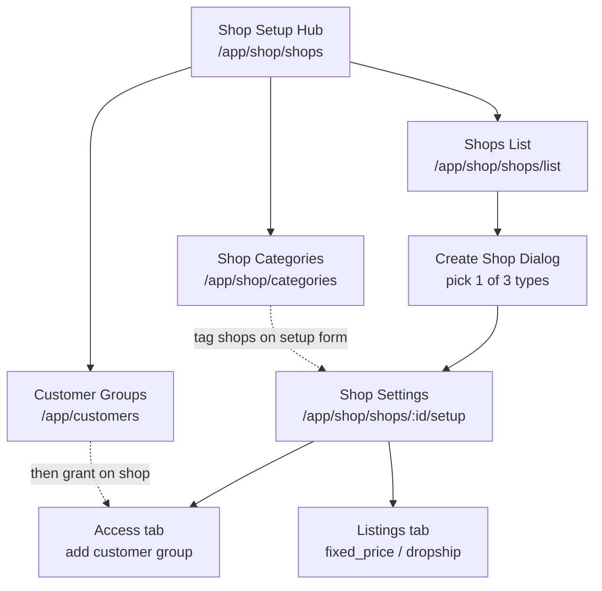
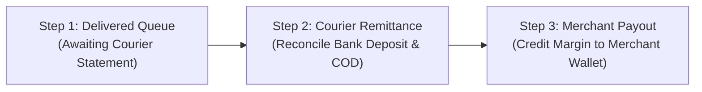

# Shop Orders & Dropship Module

The **Shop Order & Dropship** domain powers B2B storefront commerce (`shop` scope), the administrative **Shop Setup** desk (`shop_config`), and the **Dropship** fulfillment desk (`app` scope).

Customer group provisioning lives in [`CUSTOMER.md`](../customer/CUSTOMER.md). Shop hub **Customer Groups** opens that module.

---

## 1. Shop Setup Operator Journey (`shop_config`)

Staff configure storefronts before orders flow. Recommended order:



### Shop types (`shop_type_enum`)

| Type | Enum | Model |
| :--- | :--- | :--- |
| **Catalog** | `vendor_catalog` | Supplier catalog; staff procures after customer order. Needs vendor(s). Negotiable. |
| **In stock** | `fixed_price` | Sells warehouse stock via allocations / listings. |
| **Dropship** | `dropship` | Reseller portal; customer price above floor; courier + dual-invoice desk. |

Create flow: name + type in [`ShopFormDialog.vue`](file:///Users/daviditc/Documents/personal_projects/brandwala-wholesale-quasar-v2/web/src/modules/shop_order/components/ShopFormDialog.vue) → `upsert_shop` → navigate to setup.

### Shop categories (`shop_categories`)

Tenant-wide labels (name, slug, icon, active). Staff manage on **Categories** page. Each shop picks one or more via `shops.category_ids` on the setup form. Active categories group shops on the **customer shop homepage** (`RPC: fetch_customer_shop_categories` — service exists; customer browse UI may still use flat shop list).

### Vendors (catalog shops only)

`vendor_catalog` shops require at least one vendor before publish. **Multi-vendor** is supported via `shops.vendor_filters` (`[{ vendor_code, brands[] }]`). Legacy single `vendor_code` is kept in sync with the first filter row. Brand picklists load from the products module (`listBrands` by vendor).

### Customer access

Per shop, staff grant **customer groups** on the **Access** tab ([`ShopAccessMatrixPage.vue`](file:///Users/daviditc/Documents/personal_projects/brandwala-wholesale-quasar-v2/web/src/modules/shop_order/pages/ShopAccessMatrixPage.vue)):

- **Add group** — pick existing group → `upsert_shop_customer_group_access`
- **Create group** — inline form → `create_customer_account` (see `CUSTOMER.md`) then grant access
- Capabilities: browse, see price, cart, place order, negotiate, view qty, dropship price tier, credit limit

Group-wide defaults: `customer_group_shop_profiles` via `upsert_customer_group_shop_profile`.

Grant key: `shop_permissions` (tab) / `shop_config` (shop CRUD).

---

## 2. Domain Architecture & Dual-Track Workflows



```mermaid
flowchart TD
    subgraph Track1 ["Track 1: Storefront B2B Commerce (shop Scope)"]
        CG["Customer Group & Tier Pricing"] --> CAT["Storefront Catalog (StorefrontPage.vue)"]
        CAT --> CART["Cart & Checkout (ShopCheckoutPage.vue)"]
        CART --> CO["Customer Order Placed"]
    end

    subgraph Track2 ["Track 2: Dropship Fulfillment & Desk (app Scope)"]
        DO["Dropship Order"] --> PACK["1. Processing & Packing Slip"]
        PACK --> DUAL["2. Dual Invoice & Courier AWB"]
        DUAL --> SHIP["3. Shipped / In-Transit"]
        SHIP --> DELIV["4. Delivered"]
        DELIV --> FIN["5. Finance Hub Settlement<br/>(COD Remittance -> Wallet Payout)"]
    end
```

### Dropship 5-Stage Lifecycle & Dual-Invoice Engine

```text
Dropship Order Lifecycle:
1. placed            -> Initial merchant order created
2. processing        -> Packed; customer-facing delivery label printed
3. ready_for_pickup  -> Courier assigned; B2B accounting invoice issued
4. in_transit        -> Courier delivery tracking
5. delivered         -> COD collected -> Courier remittance -> Middleman wallet payout
```

---

## 3. Dropship Finance Hub Engine

Settlement is orchestrated via the **Finance Hub** (`DropshipFinanceHubPage.vue`) across 3 sequential settlement steps:



* **Middleman Margin Formula**:
  $$\text{Merchant Payout Spread} = \text{End-Customer Sell Price} - \text{Wholesale Base Price} - \text{Courier Charge}$$
* **Wallet Linkage**: Payout is disbursed via `dispense_middleman_payout_from_tenant` directly to the merchant's Universal Wallet account.

---

## 4. Page & Component Inventory

### Shop Setup (`shop_config` / `shop_category`)

| Route | Main Page | Notes |
| :--- | :--- | :--- |
| `/:tenantSlug?/app/shop/shops` | [`ShopSetupHubPage.vue`](file:///Users/daviditc/Documents/personal_projects/brandwala-wholesale-quasar-v2/web/src/modules/shop_order/pages/ShopSetupHubPage.vue) | Hub: Shops, Categories, Customer Groups (→ `app-customers`) |
| `/:tenantSlug?/app/shop/shops/list` | [`ShopsPage.vue`](file:///Users/daviditc/Documents/personal_projects/brandwala-wholesale-quasar-v2/web/src/modules/shop_order/pages/ShopsPage.vue) | List, search, create dialog |
| `/:tenantSlug?/app/shop/shops/:shopId/setup` | [`ShopSettingsPage.vue`](file:///Users/daviditc/Documents/personal_projects/brandwala-wholesale-quasar-v2/web/src/modules/shop_order/pages/ShopSettingsPage.vue) | Tabs: Setup, Access (`shop_permissions`), Listings (`shop_pricing`) |
| `/:tenantSlug?/app/shop/shops/:shopId/access` | [`ShopAccessMatrixPage.vue`](file:///Users/daviditc/Documents/personal_projects/brandwala-wholesale-quasar-v2/web/src/modules/shop_order/pages/ShopAccessMatrixPage.vue) | Standalone access matrix (also embedded in setup) |
| `/:tenantSlug?/app/shop/shops/:shopId/preview` | [`ShopPreviewPage.vue`](file:///Users/daviditc/Documents/personal_projects/brandwala-wholesale-quasar-v2/web/src/modules/shop_order/pages/ShopPreviewPage.vue) | Staff preview storefront |
| `/:tenantSlug?/app/shop/categories` | [`ShopCategoriesPage.vue`](file:///Users/daviditc/Documents/personal_projects/brandwala-wholesale-quasar-v2/web/src/modules/shop_order/pages/ShopCategoriesPage.vue) | CRUD `shop_categories` |
| `/:tenantSlug?/app/shop/pricing` | [`ShopPricingListPage.vue`](file:///Users/daviditc/Documents/personal_projects/brandwala-wholesale-quasar-v2/web/src/modules/shop_order/pages/ShopPricingListPage.vue) | Jump-off to per-shop listings |
| `/:tenantSlug?/app/shop/pricing/:shopId` | [`ShopPricingPage.vue`](file:///Users/daviditc/Documents/personal_projects/brandwala-wholesale-quasar-v2/web/src/modules/shop_order/pages/ShopPricingPage.vue) | Product listings & markup rules |

### Admin & Dropship Desk (`/app/*`)

| Route | Main Page | Key Child Components |
| :--- | :--- | :--- |
| `/:tenantSlug?/app/dropship/orders` | [`DropshipOrdersPage.vue`](file:///Users/daviditc/Documents/personal_projects/brandwala-wholesale-quasar-v2/web/src/modules/shop_order/pages/DropshipOrdersPage.vue) | Status filter tabs, courier quick-actions, [`ShopOrdersTable.vue`](file:///Users/daviditc/Documents/personal_projects/brandwala-wholesale-quasar-v2/web/src/modules/shop_order/components/ShopOrdersTable.vue) |
| `/:tenantSlug?/app/dropship/orders/:id` | [`DropshipOrderDetailPage.vue`](file:///Users/daviditc/Documents/personal_projects/brandwala-wholesale-quasar-v2/web/src/modules/shop_order/pages/DropshipOrderDetailPage.vue) | [`DropshipOrderStatusWorkflow.vue`](file:///Users/daviditc/Documents/personal_projects/brandwala-wholesale-quasar-v2/web/src/modules/shop_order/components/DropshipOrderStatusWorkflow.vue), [`DropshipRecipientFormCard.vue`](file:///Users/daviditc/Documents/personal_projects/brandwala-wholesale-quasar-v2/web/src/modules/shop_order/components/DropshipRecipientFormCard.vue), [`DropshipCourierCard.vue`](file:///Users/daviditc/Documents/personal_projects/brandwala-wholesale-quasar-v2/web/src/modules/shop_order/components/DropshipCourierCard.vue) |
| `/:tenantSlug?/app/dropship/finance` | [`DropshipFinanceHubPage.vue`](file:///Users/daviditc/Documents/personal_projects/brandwala-wholesale-quasar-v2/web/src/modules/shop_order/pages/DropshipFinanceHubPage.vue) | `FinanceHubKpiStrip.vue`, `FinanceHubStepDelivered.vue`, `FinanceHubStepRemittance.vue`, `FinanceHubStepPayout.vue` |
| `/:tenantSlug?/app/dropship/merchants` | [`DropshipMerchantsPage.vue`](file:///Users/daviditc/Documents/personal_projects/brandwala-wholesale-quasar-v2/web/src/modules/shop_order/pages/DropshipMerchantsPage.vue) | Merchant readiness scores, billing profile link |
| `/:tenantSlug?/app/dropship/couriers` | [`DropshipCouriersPage.vue`](file:///Users/daviditc/Documents/personal_projects/brandwala-wholesale-quasar-v2/web/src/modules/shop_order/pages/DropshipCouriersPage.vue) | Courier API credentials & charge matrices |

### Storefront Customer Surfaces (`/shop/*`)

| Route | Main Page | Key Child Components |
| :--- | :--- | :--- |
| `/:tenantSlug?/shop/dashboard` | [`CustomerDashboard.vue`](file:///Users/daviditc/Documents/personal_projects/brandwala-wholesale-quasar-v2/web/src/modules/dashboard/pages/CustomerDashboard.vue) | Resume cart, shop grid, recent orders |
| `/:tenantSlug?/shop/browse/:shopSlug` | [`StorefrontPage.vue`](file:///Users/daviditc/Documents/personal_projects/brandwala-wholesale-quasar-v2/web/src/modules/shop_order/pages/StorefrontPage.vue) | `StorefrontHeader.vue`, `StorefrontProductCard.vue`, `StorefrontFilterDrawer.vue` |
| `/:tenantSlug?/shop/cart` | [`ShopCartPage.vue`](file:///Users/daviditc/Documents/personal_projects/brandwala-wholesale-quasar-v2/web/src/modules/shop_order/pages/ShopCartPage.vue) | `ShopCartItemsList.vue`, `ShopCartSummaryCard.vue` |
| `/:tenantSlug?/shop/checkout` | [`ShopCheckoutPage.vue`](file:///Users/daviditc/Documents/personal_projects/brandwala-wholesale-quasar-v2/web/src/modules/shop_order/pages/ShopCheckoutPage.vue) | Delivery address selector, payment options |
| `/:tenantSlug?/shop/orders` | [`CustomerOrdersPage.vue`](file:///Users/daviditc/Documents/personal_projects/brandwala-wholesale-quasar-v2/web/src/modules/shop_order/pages/CustomerOrdersPage.vue) | Order tracking list with status badges |
| `/:tenantSlug?/shop/orders/wallet` | [`MerchantWalletPage.vue`](file:///Users/daviditc/Documents/personal_projects/brandwala-wholesale-quasar-v2/web/src/modules/shop_order/pages/MerchantWalletPage.vue) | Merchant wallet statement & available balance |

---

## 5. Page to API / RPC Matrix

### Shop setup & access

| Component | Action / Trigger | Hook / Endpoint | Caching Strategy |
| :--- | :--- | :--- | :--- |
| **`ShopSetupHubPage`** | Navigation only | — | — |
| **`ShopsPage`** | Mount / filter | `useShopListQuery` → `RPC: list_shops` | `staleTime: 2m`, Key: `['shopOrder', 'shops', params]` |
| **`ShopFormDialog`** | Create shop | `useSaveShopMutation` → `RPC: upsert_shop` | Invalidates `['shopOrder', 'shops']` |
| **`ShopsPage`** | Delete shop | `useDeleteShopMutation` → `RPC: delete_shop` | Invalidates `['shopOrder', 'shops']` |
| **`ShopSettingsPage`** | Load shop | `useShopDetailQuery` → `RPC: list_shops` (by id) | Key: `['shopOrder', 'shop', { tenantId, shopId }]` |
| **`ShopSettingsForm`** | Save | `useSaveShopMutation` → `RPC: upsert_shop` + `Table: shops` (`description`, `category_ids`) | Invalidates shop detail + list |
| **`ShopSettingsForm`** | Vendors (catalog) | `vendorService.listVendors` | Key: `['vendor', 'list', { tenantId }]` |
| **`ShopSettingsForm`** | Brands per vendor | `productService.listBrands({ vendorCode })` | On-demand |
| **`ShopCategoriesPage`** | List | `useShopCategoryListQuery` → `Table: shop_categories` | Key: `['shopOrder', 'categories', { tenantId }]` |
| **`ShopCategoriesPage`** | Create / update / delete | `shopCategoryRepository` → `Table: shop_categories` | Invalidates categories key |
| **`ShopAccessMatrixPage`** | List groups | `shopPermissionsRepository.listCustomerGroups` → `Table: customer_groups` | Store cache |
| **`ShopAccessMatrixPage`** | List overrides | `listAccessOverrides` → `Table: shop_customer_group_access` | Per `shopId` |
| **`ShopAccessMatrixPage`** | Grant / edit | `upsertAccessOverride` → `RPC: upsert_shop_customer_group_access` | Invalidates access |
| **`ShopAccessMatrixPage`** | Create group inline | `createGroupMutation` → `RPC: create_customer_account` | See `CUSTOMER.md` |
| **`DropshipShopReadinessCard`** | Mount | `RPC: get_dropship_shop_readiness` | Key: `shopOrderQueryKeys.readiness(shopId)` |

### Storefront, cart & orders

| Component | Action / Trigger | Hook / Endpoint | Caching Strategy |
| :--- | :--- | :--- | :--- |
| **`CustomerDashboard`** | Shops | `useCustomerShopsQuery` → `RPC: list_customer_shops` | Key: `['shopOrder', 'customerShops', { tenantId }]` |
| **`StorefrontPage`** | Catalog | `browseShopCatalog` → `RPC: browse_shop_catalog_for_customer` | Key: `shopOrderQueryKeys.storefrontCatalog(...)` |
| **`StorefrontPage`** | Permissions | `RPC: get_shop_permissions_for_customer` | Per shop |
| **`ShopCartPage`** | Load cart | `RPC: get_or_create_shop_cart` | Key: `shopOrderQueryKeys.cart(tenantId, shopId)` |
| **`ShopCartPage`** | Add / qty / remove | `add_to_shop_cart`, `update_shop_cart_item_qty`, `remove_shop_cart_item` | Optimistic + invalidate cart |
| **`ShopCheckoutPage`** | Submit | `RPC: submit_shop_order_from_cart` | Invalidates orders + cart |
| **`ShopPricingPage`** | Listings | `RPC: list_shop_product_listings`, `list_listable_stock_for_shop` | Per shop |
| **`ShopPricingPage`** | Upsert listing / markup | `upsert_shop_product_listing`, `bulk_apply_shop_markup` | Invalidates pricing keys |

### Dropship desk

| Component | Action / Trigger | Hook / Endpoint | Caching Strategy |
| :--- | :--- | :--- | :--- |
| **`DropshipOrdersPage`** | Mount / Tab Change | `RPC: list_dropship_shop_orders_for_staff` | `staleTime: 30s` |
| **`DropshipOrderDetailPage`** | Process Next Stage | `RPC: advance_dropship_order_status` | Invalidates order detail |
| **`DropshipOrderDetailPage`** | Issue invoice | `RPC: create_dropship_invoice` | Invalidates invoice & order |
| **`FinanceHubStepRemittance`** | Log remittance | `RPC: record_dropship_courier_remittance` | Invalidates finance hub |
| **`FinanceHubStepPayout`** | Disburse payout | `RPC: dispense_middleman_payout_from_tenant` | Invalidates wallet |
| **`MerchantWalletPage`** | Summary / ledger | `get_my_dropship_wallet_summary`, `list_my_dropship_wallet_ledger` | `staleTime: 30s` |

---

## 6. Query Keys & Server State

[`shopOrderQueryKeys.ts`](file:///Users/daviditc/Documents/personal_projects/brandwala-wholesale-quasar-v2/web/src/modules/shop_order/shared/queryKeys/shopOrderQueryKeys.ts):

* `shopOrderQueryKeys.shopsList(params)` → `['shopOrder', 'shops', params]`
* `shopOrderQueryKeys.shopDetail(tenantId, shopId)` → `['shopOrder', 'shop', { tenantId, shopId }]`
* `shopOrderQueryKeys.categories(tenantId)` → `['shopOrder', 'categories', { tenantId }]`
* `shopOrderQueryKeys.customerShops(tenantId)` → `['shopOrder', 'customerShops', { tenantId }]`
* `shopOrderQueryKeys.cart(tenantId, shopId)` → `['shopOrder', 'cart', { tenantId, shopId }]`
* `shopOrderQueryKeys.storefrontCatalog(...)` → browse cache
* `shopOrderQueryKeys.readiness(shopId)` → dropship readiness

[`dropshipFinanceQueryKeys.ts`](file:///Users/daviditc/Documents/personal_projects/brandwala-wholesale-quasar-v2/web/src/modules/shop_order/shared/queryKeys/dropshipFinanceQueryKeys.ts):

* `dropshipFinanceQueryKeys.summary(tenantId)` → `['dropshipFinance', 'summary', { tenantId }]`
* `dropshipFinanceQueryKeys.queue(step, tenantId)` → `['dropshipFinance', 'queue', { step, tenantId }]`

---

## 7. Schema

Live SQL: [`supabase/schemas/shop_order/`](file:///Users/daviditc/Documents/personal_projects/brandwala-wholesale-quasar-v2/supabase/schemas/shop_order/) (`01_types.sql` → `04_rls.sql`).

Core tables: `shops`, `shop_categories`, `shop_customer_group_access`, `customer_group_shop_profiles`, `shop_product_listings`, `shop_pricing_rules`, `shop_carts`, `shop_cart_items`, `shop_orders`, `shop_order_items`, `shop_stock_reservations`.
