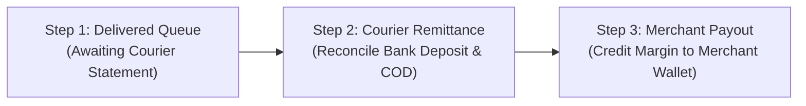

# Shop Orders & Dropship Module

The **Shop Order & Dropship** domain powers both the B2B storefront commerce experience (`shop` scope) and the administrative Dropship Desk (`app` scope) for managing reseller orders, courier logistics, and merchant finance settlement.

---

## 1. Domain Architecture & Dual-Track Workflows

```mermaid
flowchart TD
    subgraph Track1 ["Track 1: Storefront B2B Commerce (shop Scope)"]
        CG["Customer Group & Tier Pricing"] --> CAT["Storefront Catalog (StorefrontPage.vue)"]
        CAT --> CART["Cart & Checkout (ShopCheckoutPage.vue)"]
        CART --> CO["Customer Order Placed"]
    end

    subgraph Track2 ["Track 2: Dropship Fulfillment & Desk (app Scope)"]
        DO["Dropship Order"] --> PACK["1. Processing & Packing Slip"]
        PACK --> DUAL["2. Dual Invoice & Courier AWB"]
        DUAL --> SHIP["3. Shipped / In-Transit"]
        SHIP --> DELIV["4. Delivered"]
        DELIV --> FIN["5. Finance Hub Settlement<br/>(COD Remittance -> Wallet Payout)"]
    end
```



### Dropship 5-Stage Lifecycle & Dual-Invoice Engine

```text
Dropship Order Lifecycle:
1. placed            -> Initial merchant order created
2. processing        -> Packed; customer-facing delivery label printed
3. ready_for_pickup  -> Courier assigned; B2B accounting invoice issued
4. in_transit        -> Courier delivery tracking
5. delivered         -> COD collected -> Courier remittance -> Middleman wallet payout
```

---

## 2. Dropship Finance Hub Engine

Settlement is orchestrated via the **Finance Hub** (`DropshipFinanceHubPage.vue`) across 3 sequential settlement steps:



* **Middleman Margin Formula**:
  $$\text{Merchant Payout Spread} = \text{End-Customer Sell Price} - \text{Wholesale Base Price} - \text{Courier Charge}$$
* **Wallet Linkage**: Payout is disbursed via `dispense_middleman_payout_from_tenant` directly to the merchant's Universal Wallet account.

---

## 3. Page & Component Inventory

### Admin & Dropship Desk Surfaces (`/app/*`)
| Route | Main Page | Key Child Components |
| :--- | :--- | :--- |
| `/:tenantSlug?/app/dropship/orders` | [`DropshipOrdersPage.vue`](file:///Users/daviditc/Documents/personal_projects/brandwala-wholesale-quasar-v2/web/src/modules/shop_order/pages/DropshipOrdersPage.vue) | Status filter tabs, courier quick-actions, [`ShopOrdersTable.vue`](file:///Users/daviditc/Documents/personal_projects/brandwala-wholesale-quasar-v2/web/src/modules/shop_order/components/ShopOrdersTable.vue) |
| `/:tenantSlug?/app/dropship/orders/:id` | [`DropshipOrderDetailPage.vue`](file:///Users/daviditc/Documents/personal_projects/brandwala-wholesale-quasar-v2/web/src/modules/shop_order/pages/DropshipOrderDetailPage.vue) | [`DropshipOrderStatusWorkflow.vue`](file:///Users/daviditc/Documents/personal_projects/brandwala-wholesale-quasar-v2/web/src/modules/shop_order/components/DropshipOrderStatusWorkflow.vue), [`DropshipRecipientFormCard.vue`](file:///Users/daviditc/Documents/personal_projects/brandwala-wholesale-quasar-v2/web/src/modules/shop_order/components/DropshipRecipientFormCard.vue), [`DropshipCourierCard.vue`](file:///Users/daviditc/Documents/personal_projects/brandwala-wholesale-quasar-v2/web/src/modules/shop_order/components/DropshipCourierCard.vue) |
| `/:tenantSlug?/app/dropship/finance` | [`DropshipFinanceHubPage.vue`](file:///Users/daviditc/Documents/personal_projects/brandwala-wholesale-quasar-v2/web/src/modules/shop_order/pages/DropshipFinanceHubPage.vue) | `FinanceHubKpiStrip.vue`, `FinanceHubStepDelivered.vue`, `FinanceHubStepRemittance.vue`, `FinanceHubStepPayout.vue` |
| `/:tenantSlug?/app/dropship/merchants` | [`DropshipMerchantsPage.vue`](file:///Users/daviditc/Documents/personal_projects/brandwala-wholesale-quasar-v2/web/src/modules/shop_order/pages/DropshipMerchantsPage.vue) | Merchant readiness scores, billing profile link |
| `/:tenantSlug?/app/dropship/couriers` | [`DropshipCouriersPage.vue`](file:///Users/daviditc/Documents/personal_projects/brandwala-wholesale-quasar-v2/web/src/modules/shop_order/pages/DropshipCouriersPage.vue) | Courier API credentials & charge matrices |
| `/:tenantSlug?/app/shops` | [`ShopsPage.vue`](file:///Users/daviditc/Documents/personal_projects/brandwala-wholesale-quasar-v2/web/src/modules/shop_order/pages/ShopsPage.vue) | Storefront management, domain settings |
| `/:tenantSlug?/app/shops/pricing` | [`ShopPricingPage.vue`](file:///Users/daviditc/Documents/personal_projects/brandwala-wholesale-quasar-v2/web/src/modules/shop_order/pages/ShopPricingPage.vue) | Customer tier pricing rules, bulk discount matrices |

### Storefront Customer Surfaces (`/shop/*`)
| Route | Main Page | Key Child Components |
| :--- | :--- | :--- |
| `/:tenantSlug?/shop` | [`StorefrontPage.vue`](file:///Users/daviditc/Documents/personal_projects/brandwala-wholesale-quasar-v2/web/src/modules/shop_order/pages/StorefrontPage.vue) | `StorefrontHeader.vue`, `StorefrontProductCard.vue`, `StorefrontFilterDrawer.vue` |
| `/:tenantSlug?/shop/cart` | [`ShopCartPage.vue`](file:///Users/daviditc/Documents/personal_projects/brandwala-wholesale-quasar-v2/web/src/modules/shop_order/pages/ShopCartPage.vue) | `ShopCartItemsList.vue`, `ShopCartSummaryCard.vue` |
| `/:tenantSlug?/shop/checkout` | [`ShopCheckoutPage.vue`](file:///Users/daviditc/Documents/personal_projects/brandwala-wholesale-quasar-v2/web/src/modules/shop_order/pages/ShopCheckoutPage.vue) | Delivery address selector, payment options |
| `/:tenantSlug?/shop/orders` | [`CustomerOrdersPage.vue`](file:///Users/daviditc/Documents/personal_projects/brandwala-wholesale-quasar-v2/web/src/modules/shop_order/pages/CustomerOrdersPage.vue) | Order tracking list with status badges |
| `/:tenantSlug?/shop/wallet` | [`MerchantWalletPage.vue`](file:///Users/daviditc/Documents/personal_projects/brandwala-wholesale-quasar-v2/web/src/modules/shop_order/pages/MerchantWalletPage.vue) | Merchant wallet statement & available balance |

---

## 4. Page to API / RPC Matrix

| Component | Action / Trigger | Hook / Endpoint | Caching Strategy |
| :--- | :--- | :--- | :--- |
| **`DropshipOrdersPage`** | Mount / Tab Change | `useQuery` $\rightarrow$ `RPC: list_shop_orders_paginated` | `staleTime: 30s`, Key: `['shopOrder', 'orders', params]` |
| **`DropshipOrderDetailPage`** | Process Next Stage | `useMutation` $\rightarrow$ `RPC: process_dropship_order_status` | Invalidates `['shopOrder', 'orders']` & order detail |
| **`DropshipOrderDetailPage`** | Issue Dual Invoices | `useMutation` $\rightarrow$ `RPC: create_dual_invoice_from_dropship_order` | Invalidates invoice & order states |
| **`FinanceHubStepRemittance`**| Log Courier Batch | `useMutation` $\rightarrow$ `RPC: record_courier_bulk_remittance` | Invalidates finance hub queues & wallet ledger |
| **`FinanceHubStepPayout`** | Disburse Merchant Payout| `useMutation` $\rightarrow$ `RPC: dispense_middleman_payout_from_tenant` | Invalidates payout queue & wallet balances |
| **`StorefrontPage`** | Mount / Category Select | `useQuery` $\rightarrow$ `RPC: list_storefront_products` | `staleTime: 60s`, Key: `['shopOrder', 'storefront', shopId, filters]` |
| **`ShopCartPage`** | Add / Update Quantity | `useMutation` $\rightarrow$ `Table: shop_cart_items` | Optimistic cart update |
| **`MerchantWalletPage`** | Mount / Refresh | `merchantWalletRepository.getMySummary` $\rightarrow$ `RPC: get_my_dropship_wallet_summary` | `staleTime: 30s`, Key: `['shopOrder', 'merchant_wallet', tenantId]` |

---

## 5. Query Keys & Server State

Server state keys are centralized in [`shopOrderQueryKeys.ts`](file:///Users/daviditc/Documents/personal_projects/brandwala-wholesale-quasar-v2/web/src/modules/shop_order/shared/queryKeys/shopOrderQueryKeys.ts) and [`dropshipFinanceQueryKeys.ts`](file:///Users/daviditc/Documents/personal_projects/brandwala-wholesale-quasar-v2/web/src/modules/shop_order/shared/queryKeys/dropshipFinanceQueryKeys.ts):

* `shopOrderQueryKeys.orders(params)` $\rightarrow$ `['shopOrder', 'orders', params]`
* `shopOrderQueryKeys.orderDetail(id)` $\rightarrow$ `['shopOrder', 'orderDetail', { id }]`
* `dropshipFinanceQueryKeys.summary(tenantId)` $\rightarrow$ `['dropshipFinance', 'summary', { tenantId }]`
* `dropshipFinanceQueryKeys.queue(step, tenantId)` $\rightarrow$ `['dropshipFinance', 'queue', { step, tenantId }]`
