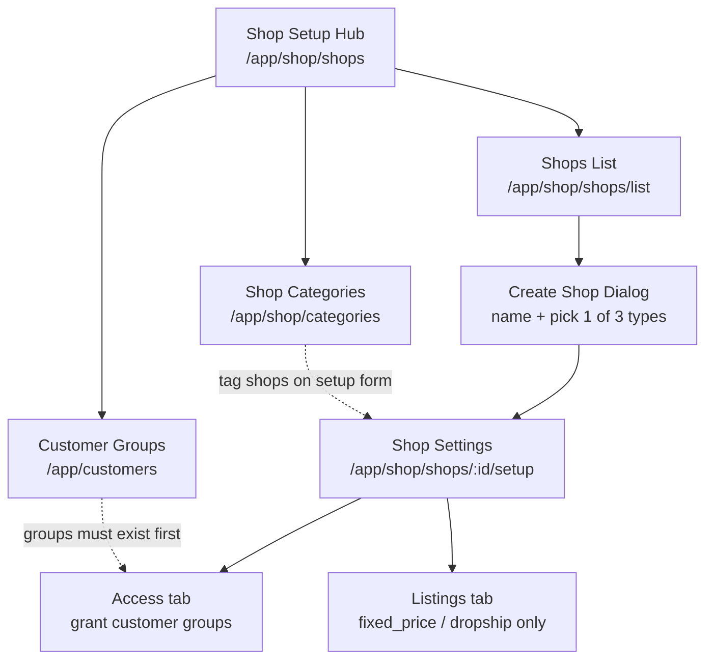
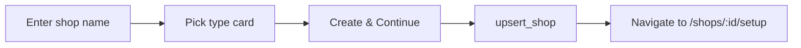
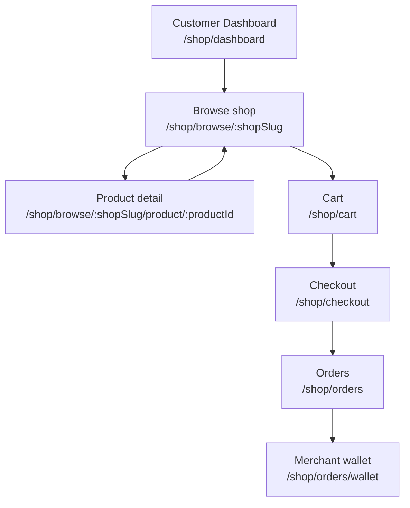
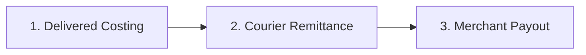

# Shop Order — UI Flow & Interaction Specification

This document defines user interaction flows, route navigation, button visibility rules, and validation matrices for the **Shop Order** module.

For RPC/API contracts and query keys, see [`SHOP_ORDER.md`](./SHOP_ORDER.md). Customer group creation is in [`CUSTOMER.md`](../customer/CUSTOMER.md).

---

## 1. Shop Setup Operator Journey (`shop_config`)

Recommended order for staff configuring a new storefront:



| Step | Route | Grant key | Primary action |
| :--- | :--- | :--- | :--- |
| Hub | `/:tenantSlug/app/shop/shops` | `shop_config` | Navigate to Shops, Categories, or Customer Groups |
| Categories | `/:tenantSlug/app/shop/categories` | `shop_category` | CRUD `shop_categories` |
| Shops list | `/:tenantSlug/app/shop/shops/list` | `shop_config` | Search, filter, create shop |
| Shop settings | `/:tenantSlug/app/shop/shops/:shopId/setup` | `shop_config` | Save setup, access, listings (tabbed) |
| Staff preview | `/:tenantSlug/app/shop/shops/:shopId/preview` | `shop_config` | Open storefront as staff |

---

## 2. Shop Settings — Tabs & Actions

[`ShopSettingsPage.vue`](file:///Users/daviditc/Documents/personal_projects/brandwala-wholesale-quasar-v2/web/src/modules/shop_order/pages/ShopSettingsPage.vue) uses `?tab=` query sync.

| Tab | Visible when | Header actions | Embedded page |
| :--- | :--- | :--- | :--- |
| **Setup** | Always | **Save** (calls `ShopSettingsForm.buildPayload` → `upsert_shop`) | `ShopSettingsForm` + danger zone |
| **Access** | `shop_permissions` grant | None (actions inside matrix) | `ShopAccessMatrixPage` (`embedded`) |
| **Listings** | `shop_pricing` grant **and** shop type ≠ `vendor_catalog` | None (actions inside pricing page) | `ShopPricingPage` (`embedded`) |

### Danger zone (Setup tab only)

Delete is **not** on the page header or shops list menu for settings — it lives at the bottom of the Setup tab.

| Field | Rule |
| :--- | :--- |
| Keyword | Must type exactly `DELETE` |
| Shop name | Must match shop name exactly (trimmed) |
| Delete button | Disabled until both match; no confirmation dialog |
| On success | Toast + redirect to shops list |

> **Note:** [`ShopsPage.vue`](file:///Users/daviditc/Documents/personal_projects/brandwala-wholesale-quasar-v2/web/src/modules/shop_order/pages/ShopsPage.vue) row menu still uses a simple confirm dialog for quick delete from the list.

---

## 3. Publish & Save Rules (`ShopSettingsForm`)

Shop type is **immutable** after create. Draft shops (`is_active = false`) can save with only name + slug. Turning **Public** on enforces full publish blockers.

| Shop type | Listings tab | Publish blockers (when `is_active = true`) |
| :--- | :--- | :--- |
| **`vendor_catalog`** | Hidden | Name, slug, buy/sell currency, **at least one vendor** |
| **`fixed_price`** | Shown (if `shop_pricing`) | Name, slug, buy/sell currency; if pricing method = markup → markup ≥ 0 |
| **`dropship`** | Shown (if `shop_pricing`) | Name, slug, buy/sell currency; readiness card shown on Setup tab |

| Control | Rule |
| :--- | :--- |
| **Public toggle** | Disabled when publish blockers exist **and** shop is currently draft |
| **Save** | Validates name + slug always; full publish validation only when `is_active = true` |
| **Vendor pickers** | Catalog only; multi-vendor via `vendor_filters[]`; brands load on focus |
| **Categories** | Multi-select from active `shop_categories` (+ already-selected inactive) |

---

## 4. Create Shop Dialog

[`ShopFormDialog.vue`](file:///Users/daviditc/Documents/personal_projects/brandwala-wholesale-quasar-v2/web/src/modules/shop_order/components/ShopFormDialog.vue)



| Type card | Enum | Post-create defaults |
| :--- | :--- | :--- |
| Catalog | `vendor_catalog` | `order_mode = procurement_intent`, negotiable |
| In stock | `fixed_price` | Stock-backed listings flow |
| Dropship | `dropship` | `order_mode = checkout_fixed`, courier checkout |

**Validation:** name required, type required, global currencies must load (sets buy/sell currency from tenant defaults).

---

## 5. Customer Access Matrix

[`ShopAccessMatrixPage.vue`](file:///Users/daviditc/Documents/personal_projects/brandwala-wholesale-quasar-v2/web/src/modules/shop_order/pages/ShopAccessMatrixPage.vue) — standalone route or embedded in Setup tab.

| Action | Trigger | Result |
| :--- | :--- | :--- |
| **Add group** | Pick existing group from tenant | Opens edit drawer → `upsert_shop_customer_group_access` |
| **Create group** | Inline dialog | `create_customer_account` → auto-grant on this shop |
| **Edit row** | Click granted group | Toggle capabilities + credit limit |
| **Copy login URL** | Top-right button | Copies `/:tenantSlug/shop` login link |

### Capability toggles (per group × shop)

| Toggle | Default (new grant) | Effect on storefront |
| :--- | :--- | :--- |
| Browse catalog | `true` | Can open `StorefrontPage` |
| View quantity | `true` | Stock/qty visible when shop allows |
| See price | `true` | Prices shown (else hidden) |
| Add to cart | `true` | Add-to-cart actions enabled |
| Place order | `true` | Checkout submit allowed |
| Negotiate | `false` | Counter-offer UI (catalog shops) |
| Set dropship price | `false` | Customer can set sell price above floor (dropship) |

**Add group** button disabled when every tenant group is already granted.

---

## 6. Customer Storefront Journey (`shop` scope)



| Screen | Grant key | Key rules |
| :--- | :--- | :--- |
| **Catalog entry** | `shop_storefront` | Redirect hub before slug browse |
| **Storefront** | `shop_storefront` | Permissions from `get_shop_permissions_for_customer`; product card respects browse/price/cart flags |
| **Product detail** | `shop_storefront` | `get_shop_catalog_product_for_customer`; same permission gates as catalog; shareable URL |
| **Cart** | `shop_cart` | Per-shop cart via `get_or_create_shop_cart` |
| **Checkout** | `shop_cart` | See §7 |
| **Orders** | `shop_order_mgmt` | Customer order list + detail |
| **Wallet** | `shop_order_mgmt` | Dropship merchant ledger |

---

## 7. Checkout — Validation & Submit

[`ShopCheckoutPage.vue`](file:///Users/daviditc/Documents/personal_projects/brandwala-wholesale-quasar-v2/web/src/modules/shop_order/pages/ShopCheckoutPage.vue)

| Shop type | Delivery form | Place order disabled when |
| :--- | :--- | :--- |
| **`vendor_catalog`** / **`fixed_price`** | Optional (`requestDelivery` off by default) | Delivery requested but name, phone (`01[3-9]########`), or address missing |
| **`dropship`** | **Required** (auto-enabled) | Same delivery fields required |

**On submit (`submit_shop_order_from_cart`):**

1. Validate delivery form when `requestDelivery = true`
2. Dropship: each line `customer_sell_price_amount` ≥ `unit_minimum_sell_price_amount`
3. Success → invalidate cart + orders queries → navigate to order confirmation / orders list

**Phone blur:** looks up saved recipient profile by phone and prefills name, address, district/thana/postcode.

---

## 8. Staff Orders Desk (`shop_order_mgmt`)

[`ShopOrdersPage.vue`](file:///Users/daviditc/Documents/personal_projects/brandwala-wholesale-quasar-v2/web/src/modules/shop_order/pages/ShopOrdersPage.vue)

| Filter | Source | Effect |
| :--- | :--- | :--- |
| Status | Tab / dropdown | Filters order list |
| Shop type | `?shopType=dropship` query | Filters by `shop_type_snapshot` (legacy `/app/shop/dropship` redirects here) |

Row click → `StaffOrderDetailPage` (B2B) or `DropshipOrderDetailPage` (dropship URL under `/app/shop/dropship/:id`).

---

## 9. Dropship Order Status Workflow

[`DropshipOrderStatusWorkflow.vue`](file:///Users/daviditc/Documents/personal_projects/brandwala-wholesale-quasar-v2/web/src/modules/shop_order/components/DropshipOrderStatusWorkflow.vue) — clickable status chips on order detail.

**Happy path (left → right):**

`confirmed` → `processing` → `ready_for_pickup` → `shipped` → `delivered` → `payment_received`

**Side branch:** `returned` (separate chip, not on happy-path strip)

| UI behavior | Rule |
| :--- | :--- |
| Current status | Filled chip with type color |
| Passed statuses | Grey filled (progress shading) |
| Future statuses | Grey outline |
| Click chip | Emits `update-status` → parent calls `advance_dropship_order_status` |

Off-strip statuses (e.g. `submitted`, `cancelled`) show as a badge above the strip.

---

## 10. Dropship Finance Hub

[`DropshipFinanceHubPage.vue`](file:///Users/daviditc/Documents/personal_projects/brandwala-wholesale-quasar-v2/web/src/modules/shop_order/pages/DropshipFinanceHubPage.vue) — grant: `shop_shipping`



| Step | Component | RPC |
| :--- | :--- | :--- |
| 1. Delivered costing | `FinanceHubStepDelivered` | Review delivered orders awaiting costing |
| 2. Courier remittance | `FinanceHubStepRemittance` | `record_dropship_courier_remittance` |
| 3. Merchant payout | `FinanceHubStepPayout` | `dispense_middleman_payout_from_tenant` |

**Deep links:** `?step=courier_remittance|middleman_payout|delivered_costing`, `?orderId=`, `?merchantId=` (opens payout step with merchant preselected).

Legacy courier-remittance URLs redirect to this hub with `step=courier_remittance`.

---

## 11. Screen & Dialog Catalog

### 11.1 Shop Setup Hub (`/app/shop/shops`)
- **Page:** `ShopSetupHubPage.vue`
- **Cards:** Shops list, Categories, Customer Groups (external module)
- **No data mutations** — navigation only

### 11.2 Shops List (`/app/shop/shops/list`)
- **Page:** `ShopsPage.vue`
- **Toolbar:** Search (debounced), filter pills (All / Public / Draft), **New shop**
- **Row click:** → shop settings
- **Row menu:** Setup, Delete (simple `$q.dialog` confirm)

### 11.3 Shop Settings (`/app/shop/shops/:shopId/setup`)
- **Page:** `ShopSettingsPage.vue`
- **Tabs:** Setup · Access · Listings (see §2)
- **Dropship only:** `DropshipShopReadinessCard` above form on Setup tab

### 11.4 Shop Categories (`/app/shop/categories`)
- **Page:** `ShopCategoriesPage.vue`
- **Actions:** Create, edit name/slug/icon, toggle active, delete

### 11.5 Shop Pricing (`/app/shop/pricing` and `/app/shop/shops/:shopId/pricing`)
- **Pages:** `ShopPricingListPage.vue`, `ShopPricingPage.vue`, `AddShopListingsPage.vue`
- **Actions:** List stock-backed listings, upsert price/qty overrides, bulk markup

### 11.6 Storefront (`/shop/browse/:shopSlug`)
- **Page:** `StorefrontPage.vue`
- **Components:** `StorefrontHeader`, `StorefrontProductCard`, `StorefrontFilterDrawer`
- **Product card click / quick view** → product detail route (see §12)
- **Cart FAB / header link** → `/shop/cart`

### 11.7 Product detail (`/shop/browse/:shopSlug/product/:productId`)
- **Page:** `StorefrontProductDetailPage.vue` (planned)
- **Components:** `ProductDetailGallery`, `ProductDetailSummary`, `ProductDetailSpecs`, `ProductDetailPricing`, `ProductDetailActionBar`, `ProductDetailRelated` (dummy v1)
- **RPC:** `get_shop_catalog_product_for_customer` — see [`SHOP_ORDER.md`](./SHOP_ORDER.md) §8
- **Entry points:** product card click, quick-view “View details”, direct URL, copy-link share

### 11.8 Dropship Order Detail (`/app/shop/dropship/:id`)
- **Page:** `DropshipOrderDetailPage.vue`
- **Cards:** `DropshipRecipientFormCard`, `DropshipCourierCard`, status workflow
- **Actions:** Advance status, issue dual invoice, print packing slip / recipient invoice preview

---

## 12. Product Detail Page (`shop` scope)

**Route:** `/:tenantSlug?/shop/browse/:shopSlug/product/:productId`  
**Layout:** `ShopLayout` (header search, cart, profile)

### Page structure

```text
StorefrontProductDetailPage
├── Breadcrumbs: Shop › {category} › {product_name}
├── ProductDetailHero (desktop: 2-col | mobile: stack)
│   ├── ProductDetailGallery        — main image (SmartImage), placeholder if missing
│   └── ProductDetailSummary
│       ├── brand (caption)
│       ├── name (h1)
│       ├── copy-link button
│       ├── ProductDetailSpecs        — dl rows (see field table below)
│       ├── ProductDetailPricing      — unit price + currency symbol (see_price)
│       └── ProductDetailStock        — available badge (can_view_quantity)
├── ProductDetailRelated              — dummy placeholder cards (v1; real query later)
└── ProductDetailActionBar (sticky)   — qty stepper + Add to cart / Update cart
```

### Field visibility

| Field / block | Source | Show when |
| :--- | :--- | :--- |
| Image | `product_image_url` | Always (placeholder if null) |
| Name | `product_name` | Always |
| Brand | `product_brand` | When non-null |
| Category | `product_category` | When non-null |
| Country of origin | `country_of_origin` | When non-null |
| Expire date | `expire_date` | When non-null |
| MOQ | `minimum_order_quantity` | Always; banner when > 1 |
| Product code | `product_code` | When non-null |
| Barcode | `product_barcode` | When non-null |
| Unit price | `unit_price_amount` | `permissions.see_price` |
| Currency symbol | `unit_price_currency_symbol` | With unit price |
| Min sell price | `minimum_sell_price_amount` | `see_price` **and** `shop.shop_type = dropship` |
| Stock | `available_units` | `can_view_quantity` and value not null |
| Qty stepper + cart CTA | — | `can_add_to_cart`; disabled when `available_units = 0` |
| Copy link | current URL | Always |
| Related products | dummy data | Always (placeholder grid; logic TBD) |

### Interactions

| Action | Trigger | Result |
| :--- | :--- | :--- |
| **Open detail** | Product card click or quick-view link | Navigate to `/shop/browse/:shopSlug/product/:productId` |
| **Copy link** | Link icon in summary | Copy `window.location.href` → toast “Link copied” |
| **Back to catalog** | Breadcrumb or browser back | Return to `StorefrontPage` (preserve `?search=` / filter query when possible) |
| **Add to cart** | Sticky action bar | `add_to_shop_cart` with selected qty; toast; optional badge update |
| **Update cart** | When line already in cart | `update_shop_cart_item_qty` |
| **Related card click** | Placeholder card (v1) | No-op or navigate to same page with different id (deferred) |

### Shop-type notes

| Shop type | Pricing label | Stock |
| :--- | :--- | :--- |
| `vendor_catalog` | List price | Usually hidden (`available_units` null) |
| `fixed_price` | Sell price | ATP when listing + permissions allow |
| `dropship` | Wholesale price + min sell floor | Same as fixed_price |

### Error states

| State | UI |
| :--- | :--- |
| Loading | Page skeleton (image + spec rows) |
| Product not found / no browse access | `q-banner` + link back to catalog |
| `see_price = false` | Hide price block; specs and add-to-cart still shown if allowed |
| Out of stock | Stock badge red; Add to cart disabled |
