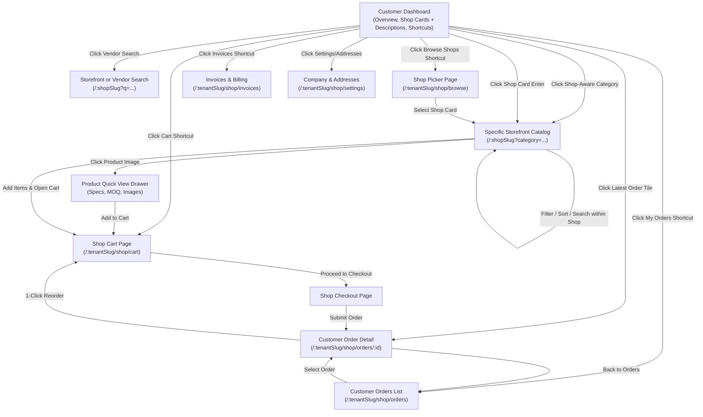

# Shop Scope UX, Navigation & Dynamic Category Master Plan

**Document Version**: 3.6.0  
**Domain**: Shop Scope (B2B Customer Storefront & Order Management Portal)  
**Author**: Senior Product Manager & UX Lead  
**Standards Compliance**: [PAGE_HEADER.md](../docs/PAGE_HEADER.md) (Locked), [UI_CONSISTENCY.md](../docs/UI_CONSISTENCY.md), WCAG 2.1 AA Accessibility  
**Related Documents**: [SHOP_ORDER.md](SHOP_ORDER.md), [SHOP_ORDER_DROPSHIP.md](SHOP_ORDER_DROPSHIP.md), [SHOP_ORDER_DROPSHIP_REVIEW.md](SHOP_ORDER_DROPSHIP_REVIEW.md), [APP_SCOPES_AND_ACCESS.md](APP_SCOPES_AND_ACCESS.md), [MASTER_PLAN.md](MASTER_PLAN.md)

---

## Executive Summary

The **Shop Scope** is the dedicated B2B wholesale portal in TradeFlow / Brandwala Wholesale. It serves child-tenant B2B customers, dropshippers, and wholesale buyers. The goal of this UX plan is to **eliminate purchasing friction**, ensure seamless inter-page navigation, eliminate hardcoded UI placeholders and fallback traps (e.g., blindly defaulting search/categories to the first shop `shops[0]`), enforce 100% compliance with locked UI standards from `docs/PAGE_HEADER.md` and `docs/UI_CONSISTENCY.md`, mandate complete **i18n internationalization (English & Bangla)**, and guarantee **mobile-first optimization & WCAG 2.1 AA accessibility** using native Quasar utilities to minimize custom CSS.

This updated specification addresses core navigational, mobile, accessibility, and localization requirements:
1. **Mobile-First Optimization (Phone Priority)**: As over 80% of wholesale buyers and dropshippers operate on smartphones, all Shop Scope pages feature mobile-optimized single-column stacks, sticky bottom action bars, bottom sheet filter drawers, and touch-friendly tap targets ($\ge 44\text{px}$).
2. **Native Quasar Utilities (Minimal Custom CSS)**: Leverages Quasar's built-in flex grid (`col-xs-12 col-sm-6 col-md-4`), visibility classes (`xs-only`, `gt-xs`), adaptive screen helpers (`$q.screen.lt.sm`), and native mobile components (`q-dialog position="bottom"`, `q-page-sticky position="bottom"`) to avoid custom CSS bloat.
3. **Cross-Device Accessibility (WCAG 2.1 AA)**: High contrast ratios ($\ge 4.5:1$), full keyboard focusability (`:focus-visible`), explicit ARIA attributes (`aria-label`, `aria-expanded`), and screen reader support across phone, tablet, and desktop viewports.
4. **Shop-Specific Admin Category Mapping**: Admin assigns categories (Category 1, 2, 3, etc.) when configuring a shop, ensuring categories on the dashboard link directly to the specific shop offering those products.
5. **Shop-Scoped Product Search**: Replaces generic single-shop redirects with shop/vendor-aware search that respects the user's accessible vendor scope.
6. **Frictionless Quick Navigation & Shortcuts**: Correctly wires all dashboard shortcut tiles (Shop Picker, Orders, Cart, Documentation, Latest Order) without hardcoded index assumptions.
7. **Shop Descriptions & Visual Cards**: Features rich shop cards with admin-defined shop descriptions, vendor badges, and category tags to clarify shop specializations.
8. **Uniformed & Customer-Friendly Shop Scope Navigation**: Standardizes sidebar drawer links exclusively for the Shop Scope with plain terms ("Dashboard", "Wholesale Shops", "Cart", "My Orders") and zero internal admin clutter.
9. **Full i18n Internationalization (English & Bangla)**: Mandates full `$t()` translation coverage across all navigation labels, headers, shop cards, status workflow strips, checkout fields, and error notifications.
10. **B2B Frictionless Expansion (Lackings Addressed)**: Closes critical B2B functional gaps by introducing Product Quick View drawers (to avoid page navigation), dedicated Invoices & Billing management, Company Address Books, and 1-Click Reorder workflows.

---

## 1. UX Goals, Mobile-First Design & Accessibility Principles

### 1.1 Mobile-First Optimization Principles (Phone Priority)

Because the majority of B2B customers place orders and check delivery status from mobile phones:

1. **Touch-Friendly Tap Targets**:
   - Every clickable element (buttons, category cards, quantity steppers, filter chips) MUST have a minimum tap target size of **$44\text{px} \times 44\text{px}$** with generous touch padding.
2. **Single-Column Mobile Stack**:
   - Layouts use Quasar's responsive grid system (`col-xs-12 col-sm-6 col-md-4`). On mobile screens ($<600\text{px}$), elements collapse cleanly into single-column vertical stacks without horizontal overflow or clipping.
3. **Bottom Sheet Filter Drawers on Phone**:
   - On mobile phones, catalog filter panels convert from side drawers to **Mobile Bottom Sheets** (`q-dialog position="bottom" max-height="85vh"`), placing filter toggles within easy thumb reach.
4. **Sticky Mobile Action Bars**:
   - Cart item summaries and checkout submit buttons render in a **sticky bottom action bar** (`position: sticky; bottom: 0; z-index: 100;`) on phone viewports so primary CTAs are always accessible without scrolling.
5. **Swipeable Horizontal Workflow Strips**:
   - The Status Workflow Strip and category filter chips support smooth horizontal momentum scrolling on touchscreens (`overflow-x: auto; -webkit-overflow-scrolling: touch; scrollbar-width: none;`).

---

### 1.2 Cross-Device Accessibility Standards (WCAG 2.1 AA)

1. **High Contrast Color Palette**:
   - Text contrast ratios must meet or exceed **4.5:1** against backgrounds (e.g. `text-grey-9` `#212121` on white surface `#ffffff`, `text-primary` `#1976d2` on light blue `#e3f2fd`).
2. **Keyboard Navigation & Focus Rings**:
   - Every interactive control (category card, order item, workflow button) must be reachable via `Tab` key and display a visible primary focus ring (`:focus-visible { outline: 2px solid var(--q-primary); outline-offset: 2px; }`).
3. **Screen Reader Semantics & ARIA**:
   - Use native semantic tags (`<header>`, `<main>`, `<nav>`, `<article>`, `<button>`).
   - Add explicit `aria-label` to icon-only buttons (e.g., `<q-btn icon="arrow_back" aria-label="Go back to dashboard" />`).
   - Dynamic badges and carts include `aria-live="polite"` to announce quantity changes automatically.
4. **Dynamic Text & Font Scaling**:
   - Layouts support browser font scaling up to 200% without overlapping text or broken containers.

---

### 1.3 Quasar Native Mobile Optimization & Utility Standards (Minimal Custom CSS)

To maintain clean code quality and leverage built-in framework capabilities, developers MUST maximize native Quasar components and utility classes while writing custom CSS **only where strictly necessary**:

| Requirement | Native Quasar Utility / Component | Avoid Custom CSS |
| :--- | :--- | :--- |
| **Responsive Grid** | Use `col-xs-12 col-sm-6 col-md-4` and `q-col-gutter-sm` | Do NOT write custom `@media (max-width: 600px)` layout CSS |
| **Flex Alignment** | Use `row items-center justify-between` or `column q-gutter-y-sm` | Do NOT write custom flex containers |
| **Device Visibility** | Use `gt-xs`, `xs-only`, `gt-sm`, `lt-md` | Do NOT write custom display toggle classes |
| **Adaptive Screen Switch** | Use `$q.screen.lt.sm` or `$q.screen.xs` in template conditionals | Do NOT create duplicate desktop/mobile HTML structures |
| **Mobile Card Table** | Use `<q-table :grid="$q.screen.lt.sm">` to auto-transform tables to cards | Do NOT write custom mobile table wrapper CSS |
| **Mobile Bottom Sheet** | Use `<q-dialog position="bottom">` | Do NOT build custom bottom slide overlays |
| **Sticky Action Bar** | Use `<q-page-sticky position="bottom">` or `<q-footer>` | Do NOT build custom fixed position wrappers |

#### Strict Rules for Custom CSS Usage:
* **Allowed Custom CSS**:
  - Minimum tap target enforcement (`min-height: 44px`).
  - Lift-on-hover micro-interactions (`.card-hover { transform: translateY(-2px); }`).
  - Theme variable bindings (`var(--bw-theme-surface)`).
  - Smooth horizontal touch scrollbar hiding (`overflow-x: auto; -webkit-overflow-scrolling: touch;`).
* **Forbidden Custom CSS**:
  - Re-implementing grid columns, breakpoints, margins (`q-ma-*`), paddings (`q-pa-*`), font sizes (`text-h5`, `text-subtitle2`), or colors (`text-grey-9`, `bg-blue-1`) that already exist natively in Quasar.

---

## 2. Information Architecture & Navigation Hierarchy

### 2.1 Page Map & Route Structure

```
Shop Scope (/:tenantSlug/shop)
├── Dashboard (/:tenantSlug/shop/dashboard) [CustomerDashboard.vue]
├── Shops Picker (/:tenantSlug/shop/browse) [ShopPickerPage.vue]
├── Storefront Catalog (/:tenantSlug/shop/browse/:shopSlug) [StorefrontPage.vue]
├── Cart (/:tenantSlug/shop/cart) [ShopCartPage.vue]
├── Checkout (/:tenantSlug/shop/checkout) [ShopCheckoutPage.vue]
├── Customer Orders (/:tenantSlug/shop/orders) [CustomerOrdersPage.vue]
└── Order Detail (/:tenantSlug/shop/orders/:id) [CustomerOrderDetailPage.vue]
```

### 2.2 Navigational Flow Diagram



### 2.3 Shop Scope Sidebar Navigation Specification

The sidebar navigation for the **Shop Scope** (`/:tenantSlug/shop/...`) is strictly designed for B2B buyers and customer group members. It enforces clean, uniformed, and customer-friendly labels while excluding internal admin complexity.

| Sidebar Item Title | i18n Title Key | i18n Caption Key | Icon | Route | Allowed Roles |
| :--- | :--- | :--- | :--- | :--- | :--- |
| **Dashboard** | `navigation.dashboard` | `navigation.dashboard_caption` | `space_dashboard` | `/:tenantSlug/shop/dashboard` | `customer_admin`, `customer_negotiator`, `customer_staff` |
| **Wholesale Shops** | `navigation.wholesale_shops` | `navigation.browse_caption` | `storefront` | `/:tenantSlug/shop/browse` | `customer_admin`, `customer_negotiator`, `customer_staff` |
| **Cart** | `navigation.cart` | `navigation.cart_caption` | `shopping_cart` | `/:tenantSlug/shop/cart` | `customer_admin`, `customer_negotiator`, `customer_staff` |
| **My Orders** | `navigation.my_orders` | `navigation.my_orders_caption` | `receipt_long` | `/:tenantSlug/shop/orders` | `customer_admin`, `customer_negotiator`, `customer_staff` |
| **Invoices** | `navigation.invoices` | `navigation.invoices_caption` | `request_quote` | `/:tenantSlug/shop/invoices` | `customer_admin`, `customer_negotiator`, `customer_staff` |
| **Settings** | `navigation.settings` | `navigation.settings_caption` | `settings` | `/:tenantSlug/shop/settings` | `customer_admin`, `customer_negotiator` |

#### Shop Scope Navigation Rules:
1. **Zero Admin Jargon**: Internal admin terms (e.g. *Fulfillment Bridge*, *Stock Allocations*, *Global Inventory*) must NEVER appear in the Shop Scope navigation.
2. **Standardized Icons & Subtitles**: All items feature standard Quasar icons (`space_dashboard`, `storefront`, `shopping_cart`, `receipt_long`) with 1-line descriptive captions powered by i18n.
3. **Tenant Context Retention**: All route generators must maintain active tenant context (`/:tenantSlug/shop/...`) so navigation never breaks session state.

---

## 3. Deep Dive: Page-by-Page UI Specification & Mobile/Accessibility Rules

Every page in the Shop Scope is designed to strictly conform to `docs/PAGE_HEADER.md`, `docs/UI_CONSISTENCY.md`, and WCAG 2.1 AA accessibility.

### 3.1 Customer Dashboard (`CustomerDashboard.vue`)
* **Page Type**: Scope Pulse & Discovery View
* **Page DNA**: `.theme-shop`, `q-page.q-pa-md`, `div.q-gutter-y-md`
* **Header Specification**:
  - Overline: `<div class="text-overline text-primary">{{ $t('shop.portal_overline') }}</div>`
  - Title: `<h1 class="text-h5 text-weight-bold q-my-none">{{ $t('shop.welcome_customer', { name: customerName }) }}</h1>`
  - Search Hero Bar: Integrated `.soft-input` search control with vendor/shop scope selector dropdown. Min height $44\text{px}$, explicit `aria-label="Search wholesale catalog"`.
* **Mobile-First Layout**:
  - Hero banner adjusts padding (`q-pa-md` on phone, `q-pa-xl` on desktop). Hero graphic hides on mobile (`gt-sm` only) to preserve vertical screen space.
  - KPI cards render as 3 stacked full-width cards on phone (`col-xs-12`), 3 horizontal columns on desktop (`col-md-4`).
* **Accessible Wholesale Shops Grid (with Shop Descriptions)**:
  - Display accessible shops as rich `<q-card flat bordered class="shop-card card-hover q-pa-md" tabindex="0" role="article">`.
  - **Header Row**: Shop Name, Shop Type badge (`Fixed Price`, `Vendor Catalog`, `Dropship`), Last Visited indicator (`$t('shop.last_visited')`).
  - **Description Body**: Admin-configured shop description (`shop.description`). High contrast text (`text-grey-9`).
  - **CTA**: `<q-btn color="primary" unelevated no-caps class="pill-btn full-width q-mt-sm" style="min-height: 44px" :label="$t('shop.enter_storefront')" @click="openShop(shop)" />`.
* **Shop-Aware Category Sourcing Grid**:
  - Category cards rendered as touch-friendly tiles (`min-height: 100px`, `col-xs-6 col-sm-4 col-md-2`).
  - Screen reader accessible with `aria-label` announcing category name and target shop.

---

### 3.2 Wholesale Shops Picker (`ShopPickerPage.vue`)
* **Page Type**: List Page (LOCKED LIST Pattern)
* **Page DNA**: `q-page.q-pa-md`, `div.q-gutter-y-md`
* **Header Specification**:
  - Overline: `<div class="text-overline text-primary">{{ $t('shop.scope_overline') }}</div>`
  - Title: `<h1 class="text-h5 text-weight-bold q-my-none">{{ $t('shop.select_shop_title') }}</h1>`
  - Primary CTA: `<q-btn color="primary" unelevated no-caps class="pill-btn" style="min-height: 44px" :label="$t('shop.view_all_products')" @click="goBrowseAll" />`
* **Mobile Optimization**:
  - Shop filter search bar and type dropdown stack vertically on mobile (`col-xs-12 col-sm-6`).
  - Cards feature full-width $44\text{px}$ touch targets for entering storefronts.

---

### 3.3 Storefront Product Catalog (`StorefrontPage.vue`)
* **Page Type**: Catalog List Page (LOCKED LIST Pattern)
* **Page DNA**: `q-page.q-pa-md`, `div.q-gutter-y-md`
* **Header Specification**:
  - Back Button: `<q-btn flat dense icon="arrow_back" color="grey-7" aria-label="Back to Dashboard" @click="goDashboard" />`
  - Overline: `<div class="text-overline text-primary">{{ $t('shop.wholesale_storefront') }}</div>`
  - Title: `<h1 class="text-h5 text-weight-bold q-my-none">{{ shopName }}</h1>`
  - Subtitle: `<p class="text-body2 text-grey-7 q-mt-xs q-mb-none">{{ shopDescription }}</p>`
  - Right CTA Slot (`col-auto`): Floating Cart Icon `<q-btn color="primary" flat round icon="shopping_cart" aria-label="Open Cart">` with `<q-badge color="negative" floating rounded aria-live="polite">` item count.
* **Mobile Bottom Sheet Filter**:
  - Desktop: Slide-out side drawer filter panel.
  - Mobile Phone ($<600\text{px}$): Converted to a **Mobile Bottom Sheet** (`<q-dialog position="bottom" max-height="85vh">`).
* **Catalog Grid & Touch Targets**:
  - Product grid: `col-xs-6 col-sm-4 col-md-3` on phone. Quantity buttons and "Add to Cart" buttons have min $44\text{px}$ height and touch feedback.

---

### 3.4 Customer Cart (`ShopCartPage.vue`)
* **Page Type**: Operational Processing View
* **Page DNA**: `q-page.q-pa-md`, `div.q-gutter-y-md`
* **Header Specification**:
  - Overline: `<div class="text-overline text-primary">{{ $t('shop.cart') }}</div>`
  - Title: `<h1 class="text-h5 text-weight-bold q-my-none">{{ $t('shop.cart_title_with_qty', { qty: itemQuantity }) }}</h1>`
  - Back Button: `<q-btn flat dense icon="arrow_back" color="grey-7" aria-label="Back to Storefront" @click="goStorefront" />`
* **Sticky Mobile Action Bar**:
  - On phone viewports, the Order Summary CTA ("Proceed to Checkout") renders via `<q-page-sticky position="bottom">` or sticky bottom bar on phone viewports so primary CTAs are always accessible without scrolling.

---

### 3.5 Shop Checkout (`ShopCheckoutPage.vue`)
* **Page Type**: Transactional Detail Form Page
* **Page DNA**: `q-page.q-pa-md`, `div.q-gutter-y-md`
* **Header Specification**:
  - Overline: `<div class="text-overline text-primary">{{ $t('shop.checkout') }}</div>`
  - Title: `<h1 class="text-h5 text-weight-bold q-my-none">{{ $t('shop.complete_order_title') }}</h1>`
  - Back Button: `<q-btn flat dense icon="arrow_back" color="grey-7" aria-label="Back to Cart" @click="goCart" />`
  - Primary CTA (`col-auto`): `<q-btn color="primary" unelevated no-caps style="min-height: 44px" :label="$t('shop.place_order')" :loading="submitting" @click="submitOrder" />`.
* **Mobile Form Optimization**:
  - Form fields (Address, Recipient Name, Phone, BD Address dropdowns) render full-width with min $44\text{px}$ inputs (`outlined dense stack-label`) and clear validation messages.

---

### 3.6 Customer Orders List (`CustomerOrdersPage.vue`)
* **Page Type**: List Page (LOCKED LIST Pattern)
* **Page DNA**: `q-page.q-pa-md`, `div.q-gutter-y-md`
* **Header Specification**:
  - Overline: `<div class="text-overline text-primary">{{ $t('shop.orders') }}</div>`
  - Title: `<h1 class="text-h5 text-weight-bold q-my-none">{{ $t('shop.my_orders') }}</h1>`
  - Primary CTA: `<q-btn color="primary" unelevated no-caps class="pill-btn" style="min-height: 44px" :label="$t('shop.browse_shops')" @click="goBrowse" />`
* **Quasar Table Grid Switch**:
  - Table view automatically transforms into clean mobile card stacks on small screens via `<q-table :grid="$q.screen.lt.sm">`.

---

### 3.7 Customer Order Details (`CustomerOrderDetailPage.vue`)
* **Page Type**: Detail Page (LOCKED DETAIL Pattern & Status Workflow Strip)
* **Page DNA**: `q-page.q-pa-md`, `div.q-gutter-y-md`
* **Header Specification**:
  - Right CTA Slot (`col-auto`): `<q-btn color="secondary" outline icon="replay" :label="$t('shop.reorder')" aria-label="1-Click Reorder" @click="handleReorder" />` (Critical B2B feature for repeating past purchases).
* **Status Workflow Button Strip (Touch & Screen Reader Accessible)**:
  - `<q-card flat bordered class="q-pa-sm">`
  - Mobile Horizontally Scrollable Strip: `overflow-x: auto; -webkit-overflow-scrolling: touch; scrollbar-width: none;` allowing easy swipe gestures on phone screens.
  - Linear status buttons (`Pending` -> `Negotiating` -> `Approved` -> `Shipped` -> `Delivered`) feature $44\text{px}$ touch targets, `aria-current="step"` on active state, and high contrast active colors.

---

### 3.8 Product Quick View (Side Drawer / Modal)
* **Page Type**: Context-Preserving Detail View
* **Goal**: Eliminate B2B friction by preventing full page navigations away from the catalog grid.
* **UI Specification**:
  - Desktop: Slides out as a `<q-drawer side="right">` or `<q-dialog position="right">`.
  - Mobile: Renders as a `<q-dialog position="bottom" max-height="90vh">` (Bottom Sheet).
  - Content: Carousel of high-res images, explicit Minimum Order Quantity (MOQ) warnings, tiered pricing breakdown tables, and a sticky "Add to Cart" action bar.

---

### 3.9 Invoices & Billing (`CustomerInvoicesPage.vue`)
* **Page Type**: Financial List Page (LOCKED LIST Pattern)
* **Goal**: Allow B2B buyers to self-serve their financial records and track pending payments.
* **Header Specification**:
  - Overline: `<div class="text-overline text-primary">{{ $t('shop.financials') }}</div>`
  - Title: `<h1 class="text-h5 text-weight-bold q-my-none">{{ $t('shop.my_invoices') }}</h1>`
* **Features**: Table with status chips (Paid, Overdue, Pending), bulk PDF download checkboxes, and statement generation.

---

### 3.10 Company & Address Book (`CustomerSettingsPage.vue`)
* **Page Type**: Configuration / Settings Form
* **Goal**: Remove checkout friction by managing saved addresses and company profiles.
* **Features**: Cards for default Shipping & Billing addresses. Modal for adding/editing locations.

---

## 4. Self-Contained Phased Implementation Roadmap

---

### Phase 1: Shop Schema Enhancement & Service Layer Integration
- **Goal**: Add support for shop descriptions and admin-configured shop categories (Category 1, 2, 3) in `shopOrderService.ts` and `shopOrderRepository.ts`.
- **Status**: [Completed]

---

### Phase 2: Customer Dashboard (`CustomerDashboard.vue`) & Shortcuts Refactoring
- **Goal**: Upgrade `CustomerDashboard.vue` layout to `q-page.q-pa-md` + `div.q-gutter-y-md`, add Accessible Shop Cards with descriptions, category-to-shop navigation, shop-scoped search, wire all shortcuts without `shops[0]` fallback bugs, and ensure mobile-first $44\text{px}$ tap targets + native Quasar classes + i18n.
- **Status**: [Completed]

---

### Phase 3: Wholesale Shops Picker (`ShopPickerPage.vue`) & Storefront (`StorefrontPage.vue`)
- **Goal**: Align Shop Picker & Storefront pages with locked LIST header DNA (`PAGE_HEADER.md`), display shop descriptions, support native Quasar mobile bottom sheet filters (`q-dialog position="bottom"`), $44\text{px}$ touch targets, and i18n translation.
- **Status**: [Completed]

---

### Phase 4: Cart (`ShopCartPage.vue`) & Checkout (`ShopCheckoutPage.vue`) Refactoring
- **Goal**: Refactor Cart and Checkout views to conform to standard page stack, header DNA, native Quasar sticky mobile action bars, $44\text{px}$ inputs, and full i18n translation coverage.
- **Status**: [Completed]

---

### Phase 5: Orders List (`CustomerOrdersPage.vue`) & Order Detail (`CustomerOrderDetailPage.vue`) Status Workflow Strip
- **Goal**: Update Orders List to list DNA, support `<q-table :grid="$q.screen.lt.sm">` mobile card fallback, and migrate Customer Order Detail to locked horizontal Status Workflow Strip with touch swipe support, screen reader ARIA roles, and full i18n translation.
- **Status**: [Completed]

---

### Phase 6: B2B Frictionless Expansion (Lackings & Gaps Resolution)
- **Goal**: Implement the missing crucial B2B flows: **Product Quick View Drawer** in the Storefront to prevent context loss, **Invoices & Billing** list page for financial self-service, **Company & Address Book** settings page to reduce checkout friction, and the **1-Click Reorder** feature in Order Details.
- **Status**: [Pending]

---

## 5. Complete i18n Internationalization & Localization Architecture (English & Bangla)

All text rendered in the Shop Scope MUST be powered by Vue I18n translation keys stored in `web/src/i18n/en-US/index.ts` and `web/src/i18n/bn/index.ts`.

### 5.1 English Translation Dictionary (`web/src/i18n/en-US/index.ts`)

```typescript
export default {
  navigation: {
    dashboard: 'Dashboard',
    dashboard_caption: 'Current orders, approvals, and next actions',
    wholesale_shops: 'Wholesale Shops',
    browse_caption: 'Browse available shops and products',
    cart: 'Cart',
    cart_caption: 'Review and manage your shop cart',
    my_orders: 'My Orders',
    my_orders_caption: 'Track your placed and pending orders',
    invoices: 'Invoices & Billing',
    invoices_caption: 'View and download past invoices',
    settings: 'Company Settings',
    settings_caption: 'Manage addresses and profile',
  },
  shop: {
    reorder: 'Reorder',
    financials: 'Financials',
    my_invoices: 'My Invoices',
    portal_overline: 'Shop Portal',
    scope_overline: 'Shop Scope',
    welcome_customer: 'Welcome, {name}',
    enter_storefront: 'Enter Storefront',
    active_shops: 'Active Shops',
    recent_orders: 'Recent Orders',
    active_value: 'Active Outlay Value',
    browse_categories: 'Browse Wholesale Categories',
    quick_shortcuts: 'Quick Navigation & Shortcuts',
    last_visited: 'Last Visited',
    select_shop_title: 'Select Wholesale Shop',
    view_all_products: 'View All Products',
    wholesale_storefront: 'Wholesale Storefront',
    cart_title_with_qty: 'Your Cart ({qty} items)',
    complete_order_title: 'Complete Wholesale Order',
    customer_order: 'Customer Order',
    placed_on: 'Placed on {date} • {shop}',
    download_invoice: 'Download Invoice',
    browse_shops: 'Browse Wholesale Shops',
    status: {
      pending: 'Pending',
      negotiating: 'Negotiating',
      approved: 'Approved',
      shipped: 'Shipped',
      delivered: 'Delivered',
      cancelled: 'Cancelled',
    },
  },
};
```

### 5.2 Bangla Translation Dictionary (`web/src/i18n/bn/index.ts`)

```typescript
export default {
  navigation: {
    dashboard: 'ড্যাশবোর্ড',
    dashboard_caption: 'বর্তমান অর্ডার, অনুমোদন এবং পরবর্তী কাজ',
    wholesale_shops: 'পাইকারি শপসমূহ',
    browse_caption: 'উপলব্ধ শপ ও পণ্য ব্রাউজ করুন',
    cart: 'কার্ট',
    cart_caption: 'আপনার শপ কার্ট পর্যালোচনা ও পরিচালনা করুন',
    my_orders: 'আমার অর্ডারসমূহ',
    my_orders_caption: 'আপনার দেওয়া ও মুলতুবি অর্ডার ট্র্যাক করুন',
    invoices: 'ইনভয়েস ও বিলিং',
    invoices_caption: 'অতীতের ইনভয়েস দেখুন ও ডাউনলোড করুন',
    settings: 'কোম্পানি সেটিংস',
    settings_caption: 'ঠিকানা ও প্রোফাইল পরিচালনা করুন',
  },
  shop: {
    reorder: 'পুনরায় অর্ডার করুন',
    financials: 'আর্থিক তথ্য',
    my_invoices: 'আমার ইনভয়েসসমূহ',
    portal_overline: 'শপ পোর্টাল',
    scope_overline: 'শপ স্কোপ',
    welcome_customer: 'স্বাগতম, {name}',
    enter_storefront: 'স্টোরফ্রন্টে প্রবেশ করুন',
    active_shops: 'সক্রিয় শপসমূহ',
    recent_orders: 'সাম্প্রতিক অর্ডারসমূহ',
    active_value: 'মোট সক্রিয় মূল্য',
    browse_categories: 'পাইকারি ক্যাটাগরি ব্রাউজ করুন',
    quick_shortcuts: 'দ্রুত নেভিগেশন ও শর্টকাট',
    last_visited: 'সর্বশেষ পরিদর্শিত',
    select_shop_title: 'পাইকারি শপ নির্বাচন করুন',
    view_all_products: 'সব পণ্য দেখুন',
    wholesale_storefront: 'পাইকারি স্টোরফ্রন্ট',
    cart_title_with_qty: 'আপনার কার্ট ({qty} টি আইটেম)',
    complete_order_title: 'পাইকারি অর্ডার সম্পন্ন করুন',
    customer_order: 'গ্রাহক অর্ডার',
    placed_on: 'তারিখ: {date} • {shop}',
    download_invoice: 'ইনভয়েস ডাউনলোড করুন',
    browse_shops: 'পাইকারি শপ ব্রাউজ করুন',
    status: {
      pending: 'মুলতুবি',
      negotiating: 'আলোচনাধীন',
      approved: 'অনুমোদিত',
      shipped: 'পাঠানো হয়েছে',
      delivered: 'ডেলিভারি সম্পন্ন',
      cancelled: 'বাতিল',
    },
  },
};
```

---

## 6. Verification & Acceptance Criteria

1. **Mobile-First & Touch Optimization (Phone Priority)**:
   - All interactive controls (buttons, category tiles, filter chips) have a minimum tap target of $44\text{px} \times 44\text{px}$.
   - Mobile screens ($<600\text{px}$) stack cleanly into single-column layouts with sticky bottom action bars and mobile bottom sheet filters.
2. **Native Quasar Utility Usage (Zero Custom CSS Waste)**:
   - Layouts maximize native Quasar grid utilities (`col-xs-12 col-sm-6 col-md-4`), visibility classes (`xs-only`, `gt-xs`), adaptive screen helpers (`$q.screen.lt.sm`), and native Quasar components (`<q-table :grid="...">`, `<q-dialog position="bottom">`).
   - Custom CSS is strictly limited to tap target height (`min-height: 44px`), lift transitions (`.card-hover`), theme variables, and scrollbar hiding.
3. **WCAG 2.1 AA Accessibility**:
   - All text contrast ratios meet or exceed 4.5:1.
   - Interactive elements feature explicit `aria-label`, `aria-live`, or `aria-current` attributes and visible keyboard focus rings (`:focus-visible`).
4. **Category-to-Shop Authenticity**:
   - Customer Dashboard categories are linked to their specific shop (`shopSlug`).
   - Clicking a category card navigates directly to `StorefrontPage.vue?category={name}` for that specific shop without falling back to `shops[0]`.
5. **Shop Descriptions & Transparency**:
   - Shop cards on Dashboard and Shop Picker display admin-configured shop descriptions and category tags (Category 1, 2, 3).
6. **No Hardcoded `shops[0]` Trap**:
   - Quick navigation shortcuts, search triggers, and category clicks evaluate total accessible shops and route intelligently to `/browse` or the specific shop storefront.
7. **Uniformed Shop Navigation**:
   - The Shop Scope sidebar strictly displays uniformed customer links (`Dashboard`, `Wholesale Shops`, `Cart`, `My Orders`) with zero admin clutter.
8. **Complete i18n Internationalization**:
   - 100% of text elements in the Shop Scope are rendered using Vue I18n `$t()` translation keys in English and Bangla.
9. **PAGE_HEADER.md Compliance**:
   - Every page uses `q-page class="q-pa-md"` and `div class="q-gutter-y-md"`.
   - List pages use `pill-btn` primary CTAs; detail pages use square `unelevated` primary CTAs.
   - Detail page lifecycle status is displayed as the locked horizontal Status Workflow Strip.
10. **Build & Type Health**:
   - `pnpm --filter web type-check` completes with 0 errors.
