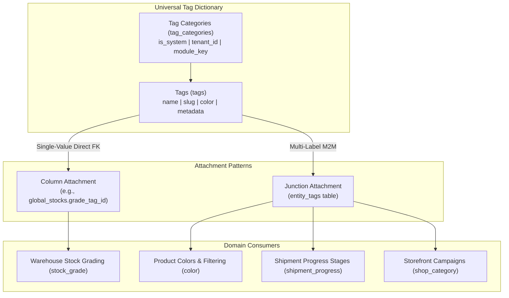

# Universal Tagging System Module

The **Universal Tagging System** provides a centralized, platform-wide taxonomy and vocabulary dictionary for categorizing entities across all BrandWala modules without duplicating tag tables.

---

## 1. Domain Architecture & Governance Model

### Identity vs Classification Rule (Locked Architectural Principle)

| Concern | Permitted Mechanism | Can Tags Be Used? |
| :--- | :--- | :---: |
| **Money / Wallet Balances** | Universal Wallet Ledger (`entity_type` + `entity_id`) | **NEVER** |
| **Order & Shipment Lifecycle** | Database Status Enums (`status` column) | **NEVER** |
| **Access Control & Permissions**| Role Grants & RBAC (`memberships`) | **NEVER** |
| **Stock Sell Gate (ATP)** | `stock_availability` (`sellable`, `held`, `unsellable`) | **NEVER** |
| **Stock Quality Grading** | `tags.id` via `global_stocks.grade_tag_id` | **YES (FK column)** |
| **Visual Colors & Badges** | `tags` (`module_key = 'color'`) | **YES** |
| **Multi-label Campaign Tags** | `entity_tags` junction table | **YES** |

> **The Golden Rule**: *If removing a tag would break financial balances, inventory counts, or access security, it was never a tag — use a database column or status enum instead.*

---

## 2. System Presets & Seed Catalogs

System presets (`is_system = true`, `tenant_id = NULL`) are seeded at the platform level. Tenants read and select presets; they do not alter system tags.

### 2.1 Stock Grade Presets (`module_key = 'stock_grade'`)
Points to the `warehouse` grading category for electronics, apparel, and general merchandise:

| Tag Slug | Display Name | Metadata Mapping | Resulting Stock State |
| :--- | :--- | :--- | :--- |
| `standard` | Standard | `{"maps_to_availability": "sellable"}` | Sellable (Default intake grade) |
| `open_box` | Open box | `{"maps_to_availability": "sellable"}` | Sellable |
| `box_damage` | Box damage | `{"maps_to_availability": "sellable"}` | Sellable |
| `box_less` | Box less | `{"maps_to_availability": "sellable"}` | Sellable |
| `badly_damaged` | Badly damaged | `{"maps_to_availability": "unsellable"}` | Quarantined / Unsellable |

### 2.2 Color Presets (`module_key = 'color'`)
Standardized color swatch dictionary with 14 curated system colors (`black` `#111827`, `white` `#F9FAFB`, `grey` `#6B7280`, `red` `#DC2626`, `blue` `#2563EB`, `green` `#16A34A`, `navy` `#1E3A5F`, etc.).

---

## 3. Data Access & RPC Matrix

Client operations are encapsulated in [`tagRepository.ts`](file:///Users/daviditc/Documents/personal_projects/brandwala-wholesale-quasar-v2/web/src/modules/tag/repositories/tagRepository.ts):

| Method / Action | Backend Endpoint | Parameter Scope | Caching Strategy |
| :--- | :--- | :--- | :--- |
| **List Categories** | `RPC: list_tag_categories` | `p_module_key?: string` | `staleTime: 10m` (Static taxonomy) |
| **List Tags in Category** | `RPC: list_tags_for_category` | `p_category_id?`, `p_module_key?`, `p_code?` | `staleTime: 10m` (Cached per module) |
| **Lookup Tag by Slug** | `RPC: get_tag_by_slug` | `p_slug`, `p_module_key?`, `p_code?` | `staleTime: 10m` |

---

## 4. Query Keys & Server State

* `['tags', 'categories', moduleKey]` $\rightarrow$ Cached category list for the given module
* `['tags', 'list', { moduleKey, code }]` $\rightarrow$ Filtered tag items (e.g. stock grades, colors)
