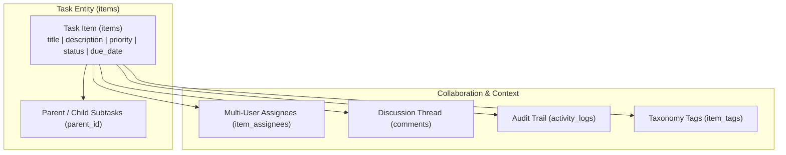

# Tasks & Internal Ticketing Module

The **Tasks** domain provides internal task management, team ticketing, Kanban tracking, subtask nesting, audit logs, and collaboration threads for operational staff.

---

## 1. Domain Architecture & Data Model

### Task Status Lifecycle & Priority Matrix

| Dimension | Values | Description |
| :--- | :--- | :--- |
| **Status** | `todo`, `in_progress`, `review`, `completed`, `cancelled` | Progress stage with automatic KPI counts in table headers. |
| **Priority** | `low`, `medium`, `high`, `urgent` | Operational urgency for sorting and triage. |
| **Hierarchy** | `parent_id` self-referencing FK | Allows subtask breakdowns beneath a primary operational milestone. |

---

## 2. Page & Component Inventory

| Route | Main Page | Key Child Components & Dialogs |
| :--- | :--- | :--- |
| `/:tenantSlug?/app/tasks` | [`TasksPage.vue`](file:///Users/daviditc/Documents/personal_projects/brandwala-wholesale-quasar-v2/web/src/modules/tasks/pages/TasksPage.vue) | Filter drawer, status chips, [`TaskFormDialog.vue`](file:///Users/daviditc/Documents/personal_projects/brandwala-wholesale-quasar-v2/web/src/modules/tasks/components/TaskFormDialog.vue), [`TaskDetailsDialog.vue`](file:///Users/daviditc/Documents/personal_projects/brandwala-wholesale-quasar-v2/web/src/modules/tasks/components/TaskDetailsDialog.vue), [`TagManagerDialog.vue`](file:///Users/daviditc/Documents/personal_projects/brandwala-wholesale-quasar-v2/web/src/modules/tasks/components/TagManagerDialog.vue) |

---

## 3. Page to API / RPC Matrix

| Component | Action / Trigger | Hook / Endpoint | Caching Strategy |
| :--- | :--- | :--- | :--- |
| **`TasksPage`** | Mount / Filter Change | `tasksRepository.fetchItems` $\rightarrow$ `RPC: list_items_paginated` | Pinia `useTasksStore` / TanStack query |
| **`TaskFormDialog`** | Create / Update Task | `tasksRepository.createItem` / `updateItem` $\rightarrow$ `Table: items` | Refetches `list_items_paginated` |
| **`TaskDetailsDialog`** | Post Comment | `tasksRepository.addComment` $\rightarrow$ `Table: comments` | Appends to live conversation thread |
| **`TaskDetailsDialog`** | Assign / Unassign User| `tasksRepository.assignUser` $\rightarrow$ `Table: item_assignees` | Refetches assignees |

---

## 4. Query Keys & State

* `['tasks', 'list', filters]` $\rightarrow$ Paginated task list and status count metrics
* `['tasks', 'detail', id]` $\rightarrow$ Full item view with comments and activity timeline
