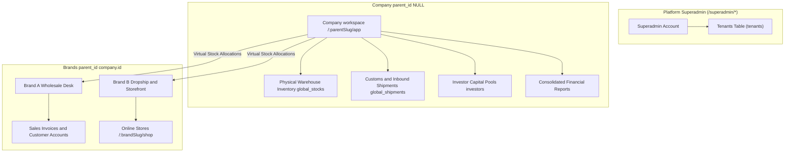
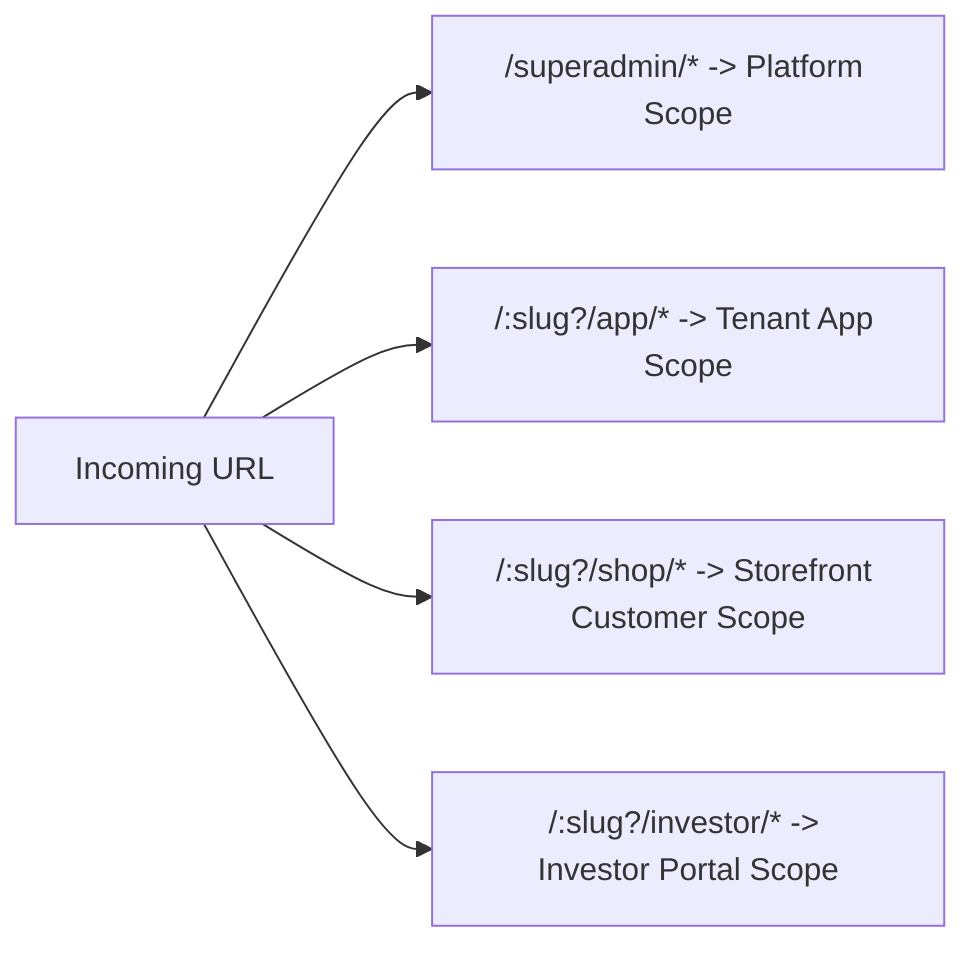
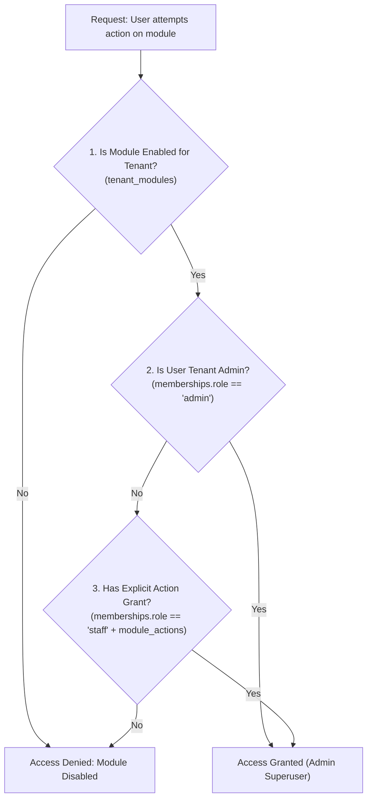
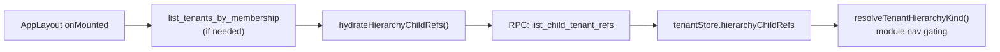

# Multi-Tenancy, Authentication & Permission Governance

The **Tenant & Auth** foundation establishes TradeFlow BD's multi-tenant organizational structure, URL routing scopes, OAuth authentication lifecycle, and granular Role-Based Access Control (RBAC).

### Product vocabulary (UI vs database)

| UI label | Database | `parent_id` | Notes |
| :--- | :--- | :--- | :--- |
| **Company** | Parent tenant row in `tenants` | `NULL` | App sidebar nav **Company** (was Tenants). Header workspace switcher lists **companies only** — staff work from the parent workspace, not by switching into a brand. |
| **Brand** | Child tenant row in `tenants` | `= company.id` | Selling desk under a company. Owns invoices, shop orders, and storefront URLs (`/:brandSlug/shop`). |
| **Parent tenant** | Same as company on forms | `NULL` on parent rows | Kept on create/edit forms (e.g. “Parent Tenant” field when adding a brand). |
| **Store** | `shops` row | — | Shop scope unchanged. Stores attach to a **brand** tenant; store naming in shop UI is not renamed. |

Code, RPCs, and columns keep names like `parent_id`, `child tenant`, and `list_child_tenant_refs`. Docs below use **Company** / **Brand** for product language and **parent tenant** / **child tenant** when referring to schema or RPCs.

**Invoice print brands** (`invoice_brands`) are a separate sales-invoice concept (header/logo on PDFs). They are not the same as a company **Brand** tenant.

---

## 1. Multi-Tenant Organizational Model



### Hierarchy Rules & Tenant Types

| Tenant Type | `parent_id` | Primary Responsibilities | Data Ownership |
| :--- | :--- | :--- | :--- |
| **Company** (parent tenant) | `NULL` | International procurement, warehouse physical stock, cargo clearance, investor capital management. | Owns `global_stocks`, `global_shipments`, `cargo_companies`, `investors`, `customer_groups` (`parent_tenant_id`), `billing_profiles` (`parent_tenant_id`; group optional). |
| **Brand** (child tenant) | `= company.id` | Wholesale sales desk, dropship reseller network, B2B storefront commerce. | Owns `global_invoices`, `shop_orders`. Grants shops to parent-owned groups. Reads allocated parent stock. |
| **Standalone tenant** | `NULL` (no children) | Single-business operations combining procurement and sales. | Owns physical stock with `parent_tenant_id = tenant_id`. |

* **Single-Tier Hierarchy Lock**: Hierarchy is strictly 1-level deep. A brand cannot have child tenants, and a company with brands cannot be assigned a parent.

---

## 2. The 4 Application Scopes & URL Routing



| Scope | Route Prefix | User Identity | Primary Capabilities |
| :--- | :--- | :--- | :--- |
| **Platform** | `/superadmin/*` | Superadmin | Global tenant provisioning, global reference data, platform health. |
| **App** | `/:slug?/app/*` | Tenant Admin & Staff (`memberships`) | Backoffice ERP: procurement, stock, invoices, finance, settings. |
| **Shop** | `/:slug?/shop/*` | Resellers & B2B Customers (`customer_group_members`) | Storefront catalog browsing, cart checkout, customer order tracking, merchant wallet. |
| **Investor** | `/:slug?/investor/*` | External Capital Partners (`role = investor`) | Read-only shipment batch profitability, capital statements, yield performance. |

---

## 3. Permission Governance & RBAC Architecture

### 3-Layer Access Evaluation Flow
When a user accesses any protected route or triggers a business mutation, the permission guard evaluates access in 3 sequential steps:



### Module Keys & Core Action Grants

```text
Action Grant Hierarchy:
├── view    -> Read-only table listing and detail viewing
├── create  -> Add new records (invoices, products, customers)
├── edit    -> Modify existing drafts and configurations
├── delete  -> Move records to Trash (soft delete)
├── manage  -> Administrative actions (settings, voiding, overrides)
└── order   -> Customer cart placement (shop scope)
```

---

## 4. Authentication Lifecycle & Navigation Guards

* **Session Management**: Supabase Auth OAuth (Google) / Password credentials stored securely with automatic token refresh.
* **Tenant Context Resolution**:
  1. Route slug parameter (`getTenantSlugFromRoute`).
  2. Public domain hostname matching (`public_domain` for custom storefront domains).
  3. Last active selected **company** persisted in Pinia `tenantStore` / `useAuthStore`.
  Shop login does **not** pick a workspace. The brand stays on the URL / hostname. If the buyer belongs to more than one customer group on that brand, they pick the group; the client sends `x-selected-customer-group-id`.
* **App workspace switcher**: Lists **companies** (`parent_id IS NULL`) only. Users do not switch into a brand to work; operational screens run in the parent company context. If login or a bookmark lands on a brand slug, the app resolves to the parent company when the user has company access.
* **Dynamic Navigation Filtration**: Navigation menu items and dashboard slots are filtered dynamically via `useModulePermissions().hasModuleAccess(moduleKey, action)`.

---

## 5. Page & Component Inventory

| Route | Main Page | Key Components |
| :--- | :--- | :--- |
| `/login` | `AdminLoginPage.vue` | Google OAuth login, company switch picker |
| `/shop/login` | `ShopLoginPage.vue` | Storefront customer password / OTP login |
| `/:tenantSlug?/app/settings/members` | `MembersPage.vue` | Staff invitation modal, role selector (`admin` vs `staff`), granular module action toggle matrix |
| `/:tenantSlug?/app/tenants` | `AdminTenantPage.vue` | Company tree, brand list, portal links |
| `/superadmin/tenants` | `TenantPage.vue` | Platform-wide company provisioning and domain setup |

---

## 6. Workspace hierarchy bootstrap (app layout)

On `/:slug/app/*` load, `AppLayout` ensures the Pinia `tenantStore` knows which workspaces are **companies** vs **brands** vs **standalone**. That drives nav filtering (`modulePermissions.ts`) — e.g. hiding shop-order modules when the active workspace is classified as a company parent.

The header switcher shows **companies only** (`availableAdminTenants` filtered to `parent_id IS NULL`). Full membership rows (including brands) remain in `tenantStore.items` for platform trees and brand-scoped data.

### Data flow



| Step | Source | Notes |
| :--- | :--- | :--- |
| Membership tenants | `list_tenants_by_membership` | Tenants the user belongs to; each row has `parent_id`. |
| Brand refs | `list_child_tenant_refs` | **One batched call** for all company (`parent_id IS NULL`) workspaces in the membership list. |
| Store field | `tenantStore.hierarchyChildRefs` | `{ id: brandTenantId, parent_id: companyTenantId }[]` |
| Consumer | `resolveTenantHierarchyKind()` | Merges membership tenants + brand refs to classify workspace as `parent` (company) \| `child` (brand) \| `standalone`. |

`AppLayout` calls `hydrateHierarchyChildRefs()` when tenants are already cached but `hierarchyChildRefs` is empty. `fetchTenantsByMembership` also calls it after loading tenants.

### RPC: `list_child_tenant_refs`

Replaces N parallel `list_child_tenant_ids(parent_id)` calls on layout boot.

```sql
list_child_tenant_refs(p_parent_tenant_ids bigint[])
returns table (id bigint, parent_id bigint)
```

- **Security:** `SECURITY DEFINER`, `STABLE`
- **Input:** distinct root tenant ids from the user's admin workspace list (parents only)
- **Output:** every brand (child tenant) row whose `parent_id` is in the input array
- **Legacy:** `list_child_tenant_ids(bigint)` remains for single-company lookups; the web app uses the batch RPC only

### Frontend wiring

| Layer | Name |
| :--- | :--- |
| Repository | `tenantRepository.listChildTenantRefs(parentTenantIds)` |
| Store | `tenantStore.hydrateHierarchyChildRefs()` |
| Layout | `AppLayout.vue` (on mount) |
| Permissions | `modulePermissions.ts` → `resolveWorkspaceTenantKind()` |

### Why a separate RPC (not only membership)

`list_tenants_by_membership` returns tenants the user **belongs to**. A user may belong only to a **company**, not each brand. Brand refs are still needed so the company workspace is classified as `parent` (has brands) and module rules like `isBlockedOnParentCompany` apply correctly.

If the user belongs only to a **brand**, the switcher resolves the parent company when possible so they land in company context instead of an empty picker.
