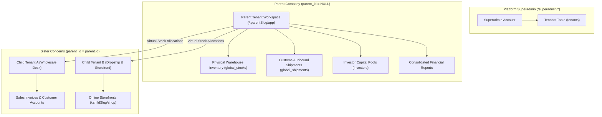
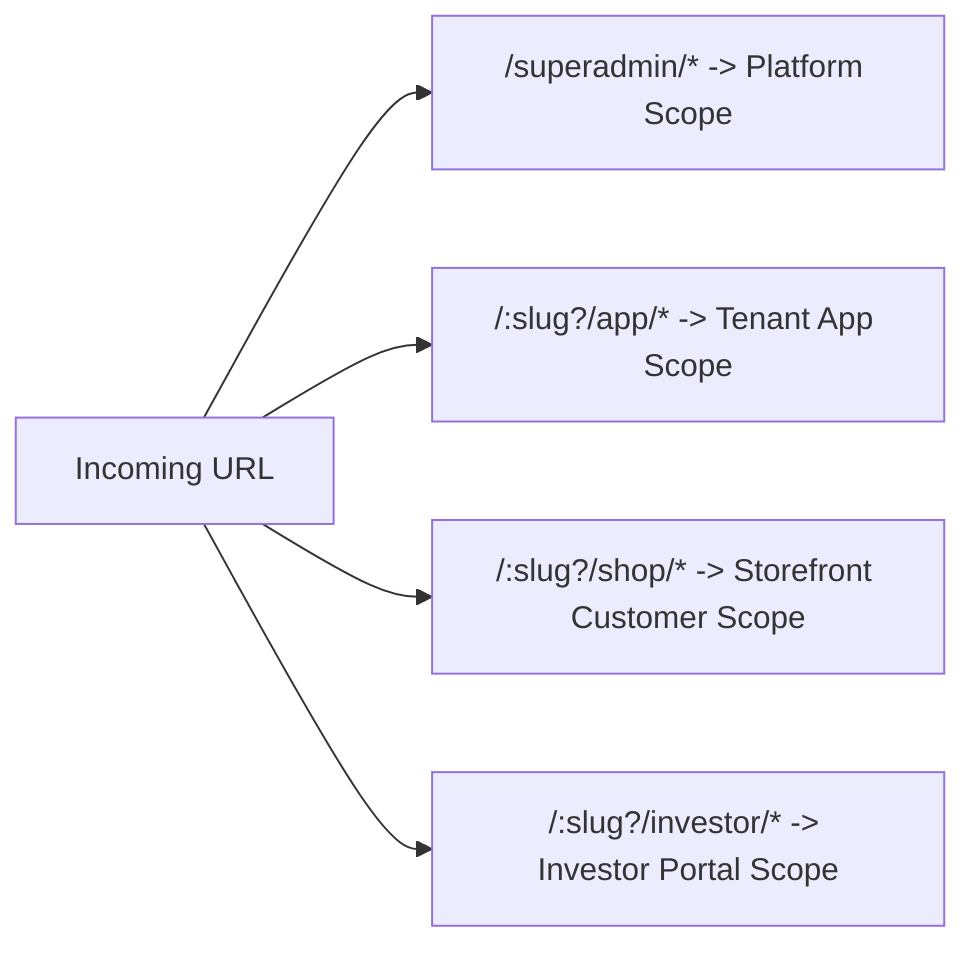
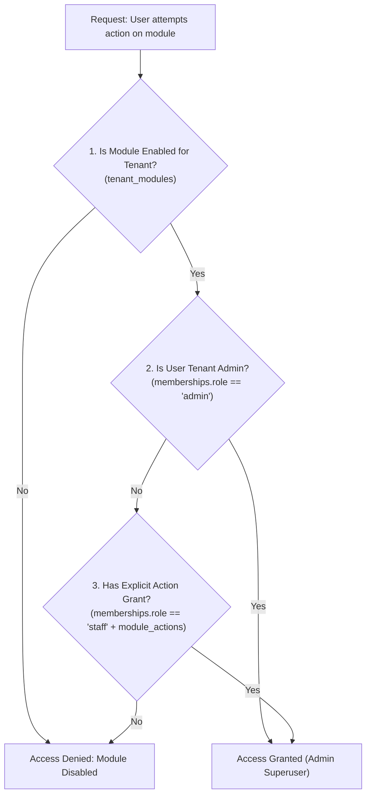

# Multi-Tenancy, Authentication & Permission Governance

The **Tenant & Auth** foundation establishes BrandWala's multi-tenant organizational structure, URL routing scopes, OAuth authentication lifecycle, and granular Role-Based Access Control (RBAC).

---

## 1. Multi-Tenant Organizational Model



### Hierarchy Rules & Tenant Types

| Tenant Type | `parent_id` | Primary Responsibilities | Data Ownership |
| :--- | :--- | :--- | :--- |
| **Parent Company** | `NULL` | International procurement, warehouse physical stock, cargo clearance, investor capital management. | Owns `global_stocks`, `global_shipments`, `cargo_companies`, `investors`. |
| **Child Tenant (Sister Concern)** | `= parent.id` | Wholesale sales desk, dropship reseller network, B2B storefront commerce. | Owns `global_invoices`, `shop_orders`, `billing_profiles`, `customer_groups`. Reads allocated parent stock. |
| **Standalone Tenant** | `NULL` (no children) | Single-business operations combining procurement and sales. | Owns physical stock with `parent_tenant_id = tenant_id`. |

* **Single-Tier Hierarchy Lock**: Hierarchy is strictly 1-level deep. A child tenant cannot have child tenants, and a parent with children cannot be assigned a parent.

---

## 2. The 4 Application Scopes & URL Routing



| Scope | Route Prefix | User Identity | Primary Capabilities |
| :--- | :--- | :--- | :--- |
| **Platform** | `/superadmin/*` | Superadmin | Global tenant provisioning, global reference data, platform health. |
| **App** | `/:slug?/app/*` | Tenant Admin & Staff (`memberships`) | Backoffice ERP: procurement, stock, invoices, finance, settings. |
| **Shop** | `/:slug?/shop/*` | Resellers & B2B Customers (`customer_group_members`) | Storefront catalog browsing, cart checkout, customer order tracking, merchant wallet. |
| **Investor** | `/:slug?/investor/*` | External Capital Partners (`role = investor`) | Read-only shipment batch profitability, capital statements, yield performance. |

---

## 3. Permission Governance & RBAC Architecture

### 3-Layer Access Evaluation Flow
When a user accesses any protected route or triggers a business mutation, the permission guard evaluates access in 3 sequential steps:



### Module Keys & Core Action Grants

```text
Action Grant Hierarchy:
├── view    -> Read-only table listing and detail viewing
├── create  -> Add new records (invoices, products, customers)
├── edit    -> Modify existing drafts and configurations
├── delete  -> Move records to Trash (soft delete)
├── manage  -> Administrative actions (settings, voiding, overrides)
└── order   -> Customer cart placement (shop scope)
```

---

## 4. Authentication Lifecycle & Navigation Guards

* **Session Management**: Supabase Auth OAuth (Google) / Password credentials stored securely with automatic token refresh.
* **Tenant Context Resolution**:
  1. Route slug parameter (`getTenantSlugFromRoute`).
  2. Public domain hostname matching (`public_domain` for custom storefront domains).
  3. Last active selected tenant persisted in Pinia `useAuthStore`.
* **Dynamic Navigation Filtration**: Navigation menu items and dashboard slots are filtered dynamically via `useModulePermissions().hasModuleAccess(moduleKey, action)`.

---

## 5. Page & Component Inventory

| Route | Main Page | Key Components |
| :--- | :--- | :--- |
| `/login` | `AdminLoginPage.vue` | Google OAuth login, tenant switch picker |
| `/shop/login` | `ShopLoginPage.vue` | Storefront customer password / OTP login |
| `/:tenantSlug?/app/settings/members` | `MembersPage.vue` | Staff invitation modal, role selector (`admin` vs `staff`), granular module action toggle matrix |
| `/:tenantSlug?/app/settings/tenants` | `TenantsPage.vue` | Child tenant creation, module enablement checklist |
| `/superadmin/tenants` | `SuperadminTenantsPage.vue` | Platform-wide tenant provisioning and domain setup |
