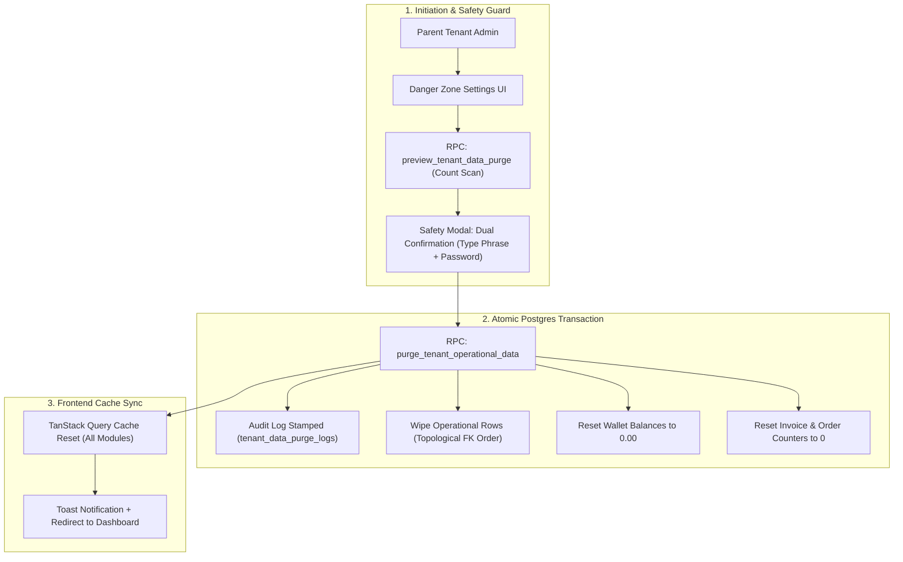
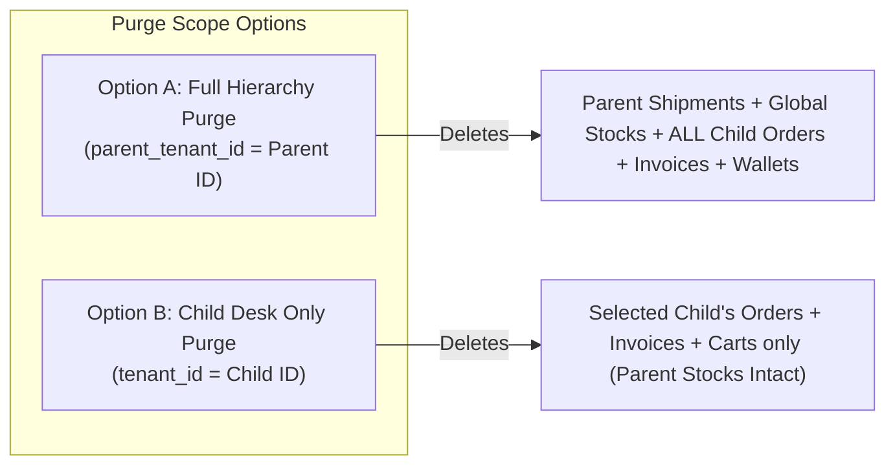
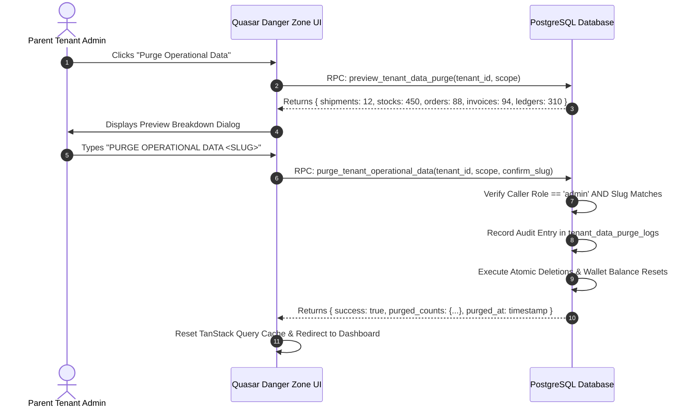

# Tenant Operational Data Purge & Reset Engine (Clean Slate)

The **Tenant Operational Data Purge & Reset Engine** provides Parent Tenant administrators (and Platform Superadmins) the capability to permanently wipe all transactional and operational data—such as inbound shipments, warehouse stock, sales invoices, shop orders, carts, and ledger transactions—while strictly preserving master catalog configurations, physical bin hierarchies, customer and vendor registries, user memberships, and organizational settings.

---

## 1. Executive Summary & Value Proposition

### The Problem
During tenant onboarding, UAT testing, or seasonal/demo resets, business owners and warehouse operators create dozens of test shipments, stock receipts, mock POS invoices, customer orders, and ledger movements. Once testing is complete or before official "Go-Live", they need a clean operational slate. Rebuilding the tenant from scratch forces them to re-enter hundreds of products, categories, tags, vendor profiles, warehouse locations, and staff permissions.

### The Solution
An atomic, transactional PostgreSQL purge engine that wipes all volatile operational activity rows in topological dependency order while resetting financial wallet balances and document counters back to zero, without deleting structural master data.



---

## 2. Data Boundary Matrix (Purge vs. Preserve)

To ensure zero collateral damage to business configurations, the purge boundary is defined with strict table-level isolation:

| Domain | ❌ Operational / Transactional Data (PURGED) | 🔒 Master & Configuration Data (STRICTLY PRESERVED) |
| :--- | :--- | :--- |
| **Procurement & Warehouse Stock** | • `global_shipment_items`<br>• `global_shipment_boxes`<br>• `global_shipment_sections`<br>• `global_shipment_cost_entries`<br>• `global_shipments`<br>• `global_stock_items`<br>• `global_stock_boxes`<br>• `global_stocks`<br>• `stock_movements`, `global_stock_movements`<br>• `costing_files`, `product_based_costing_files`<br>• `product_based_costing_backlog_items`<br>• `shipment_investments` | • `stock_locations` (warehouses, bays, shelves, bins)<br>• `global_stock_types` (Grading presets, A/B/C conditions)<br>• `vendors` / Suppliers & cargo carriers<br>• `products`, `product_variants`, `product_categories`, `product_tags`, `product_attributes`<br>• `thrift_items` master catalog entries |
| **Orders, POS & B2B Commerce** | • `shop_order_items`<br>• `shop_order_status_history`<br>• `shop_orders`<br>• `shop_cart_items`<br>• `shop_carts`<br>• `customer_demand_bucket_items`<br>• `dropship_order_settlements` | • `shops` (child tenant store configurations)<br>• `shop_categories`, `shop_pricing_rules`<br>• `shop_product_listings` (quantities reset to 0)<br>• Customer accounts & store memberships |
| **Sales Invoices & Billing** | • `global_invoice_items`<br>• `global_invoices`<br>• `global_return_items`<br>• `global_returns`<br>• `sales_invoices`, `sales_invoice_items`<br>• **Reset `sales_invoice_counters` to 0** | • `billing_profiles`<br>• `recipient_profiles`<br>• `customers` / Customer groups<br>• `invoice_brands` |
| **Financial Ledger & Wallets** | • `universal_ledger_transactions`<br>• `universal_wallet_transactions`<br>• `ledger_transactions`<br>• `wallet_transactions`<br>• `payouts`, `deposits`, `expenses`<br>• **Reset `universal_wallets.balance = 0.00`**<br>• **Reset `wallets.balance = 0.00`** | • `universal_wallets` rows (records preserved for FK stability)<br>• `wallets` rows<br>• `investors` profiles & capital entity configs |
| **Trash & Activity Logs** | • `trash_entries` (operational entity references)<br>• `activity_logs` (transaction-related actions) | • Audit trail for master data<br>• `tenant_data_purge_logs` (permanent wipe audit record) |
| **Tenant & Authentication** | *Nothing deleted* | • `tenants` (Parent and Child sister concerns)<br>• `users`, `profiles`, `user_tenants`<br>• `tenant_roles`, `role_module_grants`, `tenant_features` |

---

## 3. Multi-Tenant Scope & Hierarchy Handling

Brandwala uses a strict single-tier hierarchy where a Parent Company (`parent_id = NULL`) owns the physical warehouse pool and cargo shipments, while Child Sister Concerns (`parent_id = parent.id`) operate sales desks and storefront commerce.



### Scope Definitions:
1. **`all_hierarchy` (Full Organization Wipe):**
   * Target: Parent Tenant ID.
   * Action: Wipes all global shipments, physical global stocks, and cascades across all sister concerns to wipe their shop orders, POS invoices, carts, and ledger lines. All tenant and child wallets are reset to zero balance.
2. **`child_only` (Single Sister Concern Desk Wipe):**
   * Target: Specific Child Tenant ID.
   * Action: Wipes only local shop orders, local sales invoices, and local carts belonging to that child desk. Parent physical warehouse stock, supplier shipments, and other sister concerns remain completely untouched.

---

## 4. Deletion Topological Order (FK Dependency Graph)

To execute the purge cleanly without foreign key constraint violations or cascading deadlock, the deletion sequence follows a strict bottom-up order:

```text
1. Dependent Items & Bridge Records:
   ├── global_return_items
   ├── global_returns
   ├── global_invoice_items
   ├── global_invoices
   ├── sales_invoice_items
   ├── sales_invoices
   ├── dropship_order_settlements
   ├── shop_order_items
   ├── shop_order_status_history
   ├── shop_orders
   ├── shop_cart_items
   ├── shop_carts
   ├── customer_demand_bucket_items
   └── costing_file_items / product_based_costing_backlog_items

2. Financial Ledger & Transactions:
   ├── universal_ledger_transactions
   ├── universal_wallet_transactions
   ├── ledger_transactions
   ├── wallet_transactions
   ├── shipment_investments
   ├── payouts / deposits / expenses
   └── UPDATE universal_wallets & wallets SET balance = 0.00, updated_at = now()

3. Stock & Shipment Tracking:
   ├── stock_movements & global_stock_movements
   ├── global_stock_items
   ├── global_stock_boxes
   ├── global_stocks
   ├── global_shipment_cost_entries
   ├── global_shipment_items
   ├── global_shipment_boxes
   ├── global_shipment_sections
   ├── global_shipments
   └── costing_files & product_based_costing_files

4. Sequence & Trash Cleanup:
   ├── DELETE FROM trash_entries WHERE tenant_id IN (...)
   └── UPDATE sales_invoice_counters SET current_number = 0 WHERE tenant_id IN (...)
```

---

## 5. Security Guardrails & Safety Architecture

Because operational data purging is permanent and irreversible, 4 security barriers prevent accidental execution:



### Safety Rules:
1. **Parent Admin Authorization:** Caller must have `role = 'admin'` for the targeted parent tenant or be a platform `superadmin`. Staff members are hard-blocked by RLS and RPC assertion.
2. **Exact Confirmation Phrase:** Requires typing `PURGE OPERATIONAL DATA <TENANT_SLUG>` in uppercase.
3. **Immutable Audit Trail:** An audit row is inserted into `tenant_data_purge_logs` before transaction commit containing the executor's user ID, IP address, timestamp, scope, and snapshot of deleted counts.
4. **Testing Mode Tag (Optional Toggle):** Can be restricted to tenants with `is_testing_mode = true` in staging environments, with superadmin override for production tenants.

---

## 6. Database Schema & RPC Specifications

### 6.1 Audit Table: `tenant_data_purge_logs`

```sql
CREATE TABLE IF NOT EXISTS public.tenant_data_purge_logs (
    id UUID PRIMARY KEY DEFAULT gen_random_uuid(),
    parent_tenant_id BIGINT NOT NULL REFERENCES public.tenants(id) ON DELETE CASCADE,
    target_tenant_id BIGINT NOT NULL REFERENCES public.tenants(id) ON DELETE CASCADE,
    scope TEXT NOT NULL CHECK (scope IN ('all_hierarchy', 'child_only')),
    executed_by UUID NOT NULL REFERENCES auth.users(id),
    executor_email TEXT NOT NULL,
    confirmation_phrase TEXT NOT NULL,
    deleted_counts JSONB NOT NULL DEFAULT '{}'::jsonb,
    created_at TIMESTAMPTZ NOT NULL DEFAULT now()
);

CREATE INDEX idx_tenant_data_purge_logs_parent ON public.tenant_data_purge_logs(parent_tenant_id);
```

### 6.2 RPC: `preview_tenant_data_purge`

```sql
CREATE OR REPLACE FUNCTION public.preview_tenant_data_purge(
    p_tenant_id BIGINT,
    p_scope TEXT DEFAULT 'all_hierarchy'
)
RETURNS JSONB
LANGUAGE plpgsql
SECURITY DEFINER
SET search_path = public
AS $$
DECLARE
    v_target_tenant_ids BIGINT[];
    v_counts JSONB;
BEGIN
    -- 1. Authorization check (admin or superadmin)
    IF NOT public.is_tenant_admin(p_tenant_id) THEN
        RAISE EXCEPTION 'Unauthorized: Only tenant administrators can preview data purges.';
    END IF;

    -- 2. Resolve target tenant IDs
    IF p_scope = 'all_hierarchy' THEN
        SELECT array_agg(id) INTO v_target_tenant_ids
        FROM public.tenants
        WHERE id = p_tenant_id OR parent_id = p_tenant_id;
    ELSE
        v_target_tenant_ids := ARRAY[p_tenant_id];
    END IF;

    -- 3. Calculate counts across operational tables
    SELECT jsonb_build_object(
        'global_shipments', (SELECT count(*) FROM public.global_shipments WHERE parent_tenant_id = p_tenant_id),
        'global_stocks', (SELECT count(*) FROM public.global_stocks WHERE parent_tenant_id = p_tenant_id),
        'global_invoices', (SELECT count(*) FROM public.global_invoices WHERE parent_tenant_id = p_tenant_id),
        'shop_orders', (SELECT count(*) FROM public.shop_orders WHERE tenant_id = ANY(v_target_tenant_ids)),
        'shop_carts', (SELECT count(*) FROM public.shop_carts WHERE tenant_id = ANY(v_target_tenant_ids)),
        'ledger_transactions', (SELECT count(*) FROM public.universal_ledger_transactions WHERE parent_tenant_id = p_tenant_id),
        'wallets_to_reset', (SELECT count(*) FROM public.universal_wallets WHERE parent_tenant_id = p_tenant_id)
    ) INTO v_counts;

    RETURN v_counts;
END;
$$;
```

### 6.3 RPC: `purge_tenant_operational_data`

```sql
CREATE OR REPLACE FUNCTION public.purge_tenant_operational_data(
    p_tenant_id BIGINT,
    p_scope TEXT,
    p_confirmation_slug TEXT
)
RETURNS JSONB
LANGUAGE plpgsql
SECURITY DEFINER
SET search_path = public
AS $$
DECLARE
    v_tenant_slug TEXT;
    v_target_tenant_ids BIGINT[];
    v_counts JSONB;
    v_user_id UUID := auth.uid();
    v_user_email TEXT;
BEGIN
    -- 1. Authorization & Slug Confirmation
    SELECT slug INTO v_tenant_slug FROM public.tenants WHERE id = p_tenant_id;
    IF v_tenant_slug IS NULL THEN
        RAISE EXCEPTION 'Tenant not found.';
    END IF;

    IF UPPER(TRIM(p_confirmation_slug)) <> UPPER(TRIM(v_tenant_slug)) THEN
        RAISE EXCEPTION 'Confirmation slug mismatch. Operation aborted.';
    END IF;

    IF NOT public.is_tenant_admin(p_tenant_id) THEN
        RAISE EXCEPTION 'Unauthorized: Administrative privileges required.';
    END IF;

    SELECT email INTO v_user_email FROM auth.users WHERE id = v_user_id;

    -- 2. Target tenant array resolution
    IF p_scope = 'all_hierarchy' THEN
        SELECT array_agg(id) INTO v_target_tenant_ids
        FROM public.tenants
        WHERE id = p_tenant_id OR parent_id = p_tenant_id;
    ELSE
        v_target_tenant_ids := ARRAY[p_tenant_id];
    END IF;

    -- 3. Capture preview counts for audit record
    v_counts := public.preview_tenant_data_purge(p_tenant_id, p_scope);

    -- 4. Delete dependent sales and return items
    DELETE FROM public.global_return_items WHERE parent_tenant_id = p_tenant_id;
    DELETE FROM public.global_returns WHERE parent_tenant_id = p_tenant_id;
    DELETE FROM public.global_invoice_items WHERE parent_tenant_id = p_tenant_id;
    DELETE FROM public.global_invoices WHERE parent_tenant_id = p_tenant_id;
    DELETE FROM public.sales_invoice_items WHERE tenant_id = ANY(v_target_tenant_ids);
    DELETE FROM public.sales_invoices WHERE tenant_id = ANY(v_target_tenant_ids);

    -- 5. Delete shop orders, carts, settlements
    DELETE FROM public.dropship_order_settlements WHERE tenant_id = ANY(v_target_tenant_ids);
    DELETE FROM public.shop_order_items WHERE tenant_id = ANY(v_target_tenant_ids);
    DELETE FROM public.shop_order_status_history WHERE tenant_id = ANY(v_target_tenant_ids);
    DELETE FROM public.shop_orders WHERE tenant_id = ANY(v_target_tenant_ids);
    DELETE FROM public.shop_cart_items WHERE tenant_id = ANY(v_target_tenant_ids);
    DELETE FROM public.shop_carts WHERE tenant_id = ANY(v_target_tenant_ids);
    DELETE FROM public.customer_demand_bucket_items WHERE tenant_id = ANY(v_target_tenant_ids);

    -- 6. Delete ledger transactions & reset wallets
    DELETE FROM public.universal_ledger_transactions WHERE parent_tenant_id = p_tenant_id;
    DELETE FROM public.universal_wallet_transactions WHERE parent_tenant_id = p_tenant_id;
    DELETE FROM public.ledger_transactions WHERE tenant_id = ANY(v_target_tenant_ids);
    DELETE FROM public.wallet_transactions WHERE tenant_id = ANY(v_target_tenant_ids);
    UPDATE public.universal_wallets SET balance = 0.00, updated_at = now() WHERE parent_tenant_id = p_tenant_id;
    UPDATE public.wallets SET balance = 0.00, updated_at = now() WHERE tenant_id = ANY(v_target_tenant_ids);

    -- 7. If full hierarchy, wipe parent stock & procurement
    IF p_scope = 'all_hierarchy' THEN
        DELETE FROM public.stock_movements WHERE tenant_id = ANY(v_target_tenant_ids);
        DELETE FROM public.global_stock_items WHERE parent_tenant_id = p_tenant_id;
        DELETE FROM public.global_stock_boxes WHERE parent_tenant_id = p_tenant_id;
        DELETE FROM public.global_stocks WHERE parent_tenant_id = p_tenant_id;

        DELETE FROM public.global_shipment_cost_entries WHERE parent_tenant_id = p_tenant_id;
        DELETE FROM public.global_shipment_items WHERE parent_tenant_id = p_tenant_id;
        DELETE FROM public.global_shipment_boxes WHERE parent_tenant_id = p_tenant_id;
        DELETE FROM public.global_shipment_sections WHERE parent_tenant_id = p_tenant_id;
        DELETE FROM public.global_shipments WHERE parent_tenant_id = p_tenant_id;

        DELETE FROM public.costing_files WHERE tenant_id = ANY(v_target_tenant_ids);
        DELETE FROM public.product_based_costing_backlog_items WHERE tenant_id = ANY(v_target_tenant_ids);
        DELETE FROM public.product_based_costing_files WHERE tenant_id = ANY(v_target_tenant_ids);
    END IF;

    -- 8. Clean trash entries and reset invoice counters
    DELETE FROM public.trash_entries WHERE tenant_id = ANY(v_target_tenant_ids);
    UPDATE public.sales_invoice_counters SET current_number = 0 WHERE tenant_id = ANY(v_target_tenant_ids);

    -- 9. Insert permanent audit log
    INSERT INTO public.tenant_data_purge_logs (
        parent_tenant_id,
        target_tenant_id,
        scope,
        executed_by,
        executor_email,
        confirmation_phrase,
        deleted_counts
    ) VALUES (
        p_tenant_id,
        p_tenant_id,
        p_scope,
        v_user_id,
        v_user_email,
        p_confirmation_slug,
        v_counts
    );

    RETURN jsonb_build_object(
        'success', true,
        'purged_counts', v_counts,
        'purged_at', now()
    );
END;
$$;
```

---

## 7. Frontend UI / UX & Integration Specifications

### 7.1 Page Placement & Navigation
The Purge feature lives under **Tenant Settings $\rightarrow$ Danger Zone** at:
* Route: `/:tenantSlug/app/settings/danger-zone` or tab within `AdminTenantPreferencesPage.vue`.
* Permission: Accessible only when `authStore.isAdmin` is true.

### 7.2 UI Components Inventory
| Component | Path | Purpose |
| :--- | :--- | :--- |
| `TenantDangerZoneSection.vue` | `src/modules/tenant/components/TenantDangerZoneSection.vue` | Warning surface with action button "Reset Operational Data" |
| `TenantPurgePreviewModal.vue` | `src/modules/tenant/components/TenantPurgePreviewModal.vue` | Interactive 2-step modal displaying table counts, scope radio toggle, and dual confirmation form |
| `TenantPurgeAuditHistory.vue` | `src/modules/tenant/components/TenantPurgeAuditHistory.vue` | Compact table showing past purge operations for transparency |

### 7.3 TanStack Query State Management
```typescript
// Query Key Factory
export const tenantPurgeKeys = {
  all: ['tenant-purge'] as const,
  preview: (tenantId: number, scope: string) => [...tenantPurgeKeys.all, 'preview', tenantId, scope] as const,
  logs: (tenantId: number) => [...tenantPurgeKeys.all, 'logs', tenantId] as const,
};

// Mutation with Full Cache Reset
export function usePurgeTenantOperationalData() {
  const queryClient = useQueryClient();
  const $q = useQuasar();
  const router = useRouter();

  return useMutation({
    mutationFn: async (payload: { tenantId: number; scope: 'all_hierarchy' | 'child_only'; confirmationSlug: string }) => {
      return tenantRepository.purgeOperationalData(payload);
    },
    onSuccess: (data) => {
      // Invalidate all operational queries across the entire web application
      queryClient.clear();
      $q.notify({
        type: 'positive',
        message: 'Operational data successfully wiped. System reset to clean state.',
        icon: 'check_circle',
      });
      router.push({ name: 'admin-dashboard' });
    },
    onError: (err: any) => {
      $q.notify({
        type: 'negative',
        message: err?.message || 'Failed to purge operational data.',
      });
    },
  });
}
```

---

## 8. Implementation & Verification Plan

### Phase 1: Database Migration & Schema Setup
- [ ] Create `supabase/schemas/tenants/02_tables.sql` table: `tenant_data_purge_logs`.
- [ ] Add `preview_tenant_data_purge` RPC in `supabase/schemas/tenants/03_rpcs.sql`.
- [ ] Add `purge_tenant_operational_data` RPC in `supabase/schemas/tenants/03_rpcs.sql`.
- [ ] Add RLS policies for `tenant_data_purge_logs` (admin read-only).
- [ ] Run `pnpm run backend:reset` and `pnpm run backend:types`.

### Phase 2: Frontend Repository & Composables
- [ ] Add `previewPurgeData` and `purgeOperationalData` to `src/modules/tenant/repositories/tenantRepository.ts`.
- [ ] Create `useTenantPurge.ts` composable with TanStack Query hooks.

### Phase 3: Quasar UI & Danger Zone Modal
- [ ] Implement `TenantDangerZoneSection.vue` and `TenantPurgePreviewModal.vue`.
- [ ] Wire dual confirmation validation (slug typing + password re-authentication).
- [ ] Integrate into `AdminTenantPreferencesPage.vue`.

### Phase 4: Quality & Safety Verification
- [ ] Test with sample dummy shipments, stocks, orders, and invoices.
- [ ] Verify that master products, vendors, categories, locations, and user accounts remain 100% intact.
- [ ] Verify that universal wallet balances reset to 0.00 and invoice counters reset to 0.
- [ ] Confirm no dangling orphan records or foreign key violations occur.
