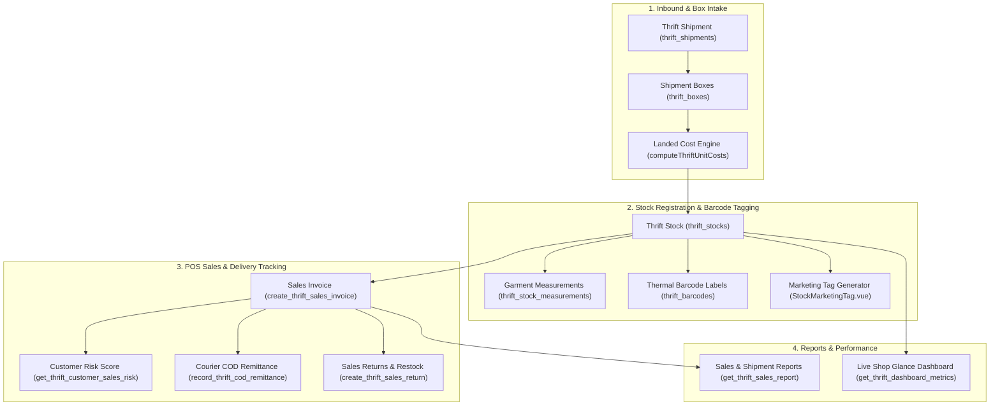

# Thrift Vertical Module

The **Thrift** vertical is an independent, tenant-scoped end-to-end retail management system for second-hand, vintage, and one-off merchandise. It operates with its own inbound shipment processing, barcode generation, garment measurement tracking, landed costing engine, POS invoicing desk, post-delivery returns, and financial reports.

---

## 1. Domain Architecture & Full Lifecycle

---

## 2. Core Domain Engines & Business Algorithms

### 2.1 Landed Cost & Retail Pricing Engine
Calculates the landed unit cost and suggested retail price for one-off thrift items:

$$\text{Total Cargo Allocation} = \frac{\text{Item Gross Weight}}{\sum \text{Shipment Weight}} \times \text{Total Shipment Cargo Cost}$$

$$\text{Landed Unit Cost (BDT)} = \text{Origin Price} + \text{Extra Origin Cost} + \text{Cargo Allocation} + \text{Packaging/Tag Cost} + \text{Additional Charges}$$

$$\text{Auto-Listed Sell Price} = \text{Ceil}_{\text{preset}}\left(\text{Landed Unit Cost} \times (1 + \text{Markup Rate})\right)$$

* **Pure Function Implementation**: Implemented in [`computeThriftUnitCosts.ts`](file:///Users/daviditc/Documents/personal_projects/brandwala-wholesale-quasar-v2/web/src/modules/thrift/shared/utils/computeThriftUnitCosts.ts) and [`ceilThriftRetailPrice.ts`](file:///Users/daviditc/Documents/personal_projects/brandwala-wholesale-quasar-v2/web/src/modules/thrift/shared/utils/ceilThriftRetailPrice.ts).

### 2.2 Garment Measurement Engine
Captures physical garment dimensions (in inches) attached to unique SKU items:
* **Tops**: Chest width, body length, shoulder width, sleeve length.
* **Bottoms**: Waist, inseam, outseam, rise, thigh, leg opening.
* **Fit Visualizer**: Interactive measurement guide diagrams embedded in [`ThriftMeasurementGuideDialog.vue`](file:///Users/daviditc/Documents/personal_projects/brandwala-wholesale-quasar-v2/web/src/modules/thrift/stock/components/ThriftMeasurementGuideDialog.vue).

### 2.3 Thermal Barcode & Marketing Tag Generator
* **Barcodes (`thrift_barcodes`)**: Unique Code-128 sequence generator for instant scanner lookup at the sales desk.
* **Marketing Hang-Tags**: Generates printable PDF tags displaying brand name, size, category, measurements, barcode, and retail price.

### 2.4 Sales Invoicing, Risk Scoring & Returns
* **Atomic POS Invoice Creation**: Single RPC (`create_thrift_sales_invoice`) validates stock availability, deducts stock status (`sold`), and creates invoice lines.
* **Customer Courier Risk Scoring**: `get_thrift_customer_sales_risk` checks phone delivery history, return rates, and past cancellations across couriers before dispatch.
* **Post-Delivery Returns**: Processes customer returns, calculates restocking deductions, and restores stock status (`registered` vs `damaged`).

---

## 3. Page & Component Inventory

| Route | Main Page | Key Child Components & Dialogs |
| :--- | :--- | :--- |
| `/:tenantSlug?/app/thrift/stock` | [`ThriftStockPage.vue`](file:///Users/daviditc/Documents/personal_projects/brandwala-wholesale-quasar-v2/web/src/modules/thrift/stock/pages/ThriftStockPage.vue) | [`ThriftStockTable.vue`](file:///Users/daviditc/Documents/personal_projects/brandwala-wholesale-quasar-v2/web/src/modules/thrift/stock/components/ThriftStockTable.vue), [`ThriftStockToolbar.vue`](file:///Users/daviditc/Documents/personal_projects/brandwala-wholesale-quasar-v2/web/src/modules/thrift/stock/components/ThriftStockToolbar.vue), [`ThriftStockRegisterDialog.vue`](file:///Users/daviditc/Documents/personal_projects/brandwala-wholesale-quasar-v2/web/src/modules/thrift/stock/components/ThriftStockRegisterDialog.vue), [`ThriftStockMeasurementsDialog.vue`](file:///Users/daviditc/Documents/personal_projects/brandwala-wholesale-quasar-v2/web/src/modules/thrift/stock/components/ThriftStockMeasurementsDialog.vue) |
| `/:tenantSlug?/app/thrift/stock/tag-print` | [`ThriftStockTagPrintPage.vue`](file:///Users/daviditc/Documents/personal_projects/brandwala-wholesale-quasar-v2/web/src/modules/thrift/stock/pages/ThriftStockTagPrintPage.vue) | [`StockMarketingTag.vue`](file:///Users/daviditc/Documents/personal_projects/brandwala-wholesale-quasar-v2/web/src/modules/thrift/stock/components/StockMarketingTag.vue), batch tag layout preview |
| `/:tenantSlug?/app/thrift/barcodes` | [`ThriftBarcodePage.vue`](file:///Users/daviditc/Documents/personal_projects/brandwala-wholesale-quasar-v2/web/src/modules/thrift/barcode/pages/ThriftBarcodePage.vue) | [`BarcodeRenderer.vue`](file:///Users/daviditc/Documents/personal_projects/brandwala-wholesale-quasar-v2/web/src/modules/thrift/barcode/components/BarcodeRenderer.vue), barcode roll print preview |
| `/:tenantSlug?/app/thrift/shipments` | [`ThriftShipmentPage.vue`](file:///Users/daviditc/Documents/personal_projects/brandwala-wholesale-quasar-v2/web/src/modules/thrift/shipment/pages/ThriftShipmentPage.vue) | Inbound shipment batch list, box count indicators |
| `/:tenantSlug?/app/thrift/shipments/:id` | [`ThriftShipmentDetailsPage.vue`](file:///Users/daviditc/Documents/personal_projects/brandwala-wholesale-quasar-v2/web/src/modules/thrift/shipment/pages/ThriftShipmentDetailsPage.vue) | [`ThriftShipmentCostInputsCard.vue`](file:///Users/daviditc/Documents/personal_projects/brandwala-wholesale-quasar-v2/web/src/modules/thrift/shipment/components/ThriftShipmentCostInputsCard.vue), [`ThriftShipmentItemsTable.vue`](file:///Users/daviditc/Documents/personal_projects/brandwala-wholesale-quasar-v2/web/src/modules/thrift/shipment/components/ThriftShipmentItemsTable.vue) |
| `/:tenantSlug?/app/thrift/sales` | [`ThriftSalesPage.vue`](file:///Users/daviditc/Documents/personal_projects/brandwala-wholesale-quasar-v2/web/src/modules/thrift/sales/pages/ThriftSalesPage.vue) | [`ThriftSalesInvoiceStatusTracks.vue`](file:///Users/daviditc/Documents/personal_projects/brandwala-wholesale-quasar-v2/web/src/modules/thrift/sales/components/ThriftSalesInvoiceStatusTracks.vue), invoice search toolbar |
| `/:tenantSlug?/app/thrift/sales/create` | [`ThriftCreateSalesInvoicePage.vue`](file:///Users/daviditc/Documents/personal_projects/brandwala-wholesale-quasar-v2/web/src/modules/thrift/sales/pages/ThriftCreateSalesInvoicePage.vue) | Barcode scanner input, stock search modal, customer risk badge |
| `/:tenantSlug?/app/thrift/sales/:id` | [`ThriftSalesInvoiceDetailsPage.vue`](file:///Users/daviditc/Documents/personal_projects/brandwala-wholesale-quasar-v2/web/src/modules/thrift/sales/pages/ThriftSalesInvoiceDetailsPage.vue) | Line item details, courier consignment tracker, return trigger |
| `/:tenantSlug?/app/thrift/sales/returns` | [`ThriftSalesReturnsPage.vue`](file:///Users/daviditc/Documents/personal_projects/brandwala-wholesale-quasar-v2/web/src/modules/thrift/sales/pages/ThriftSalesReturnsPage.vue) | Return dispute logs, restocking approval actions |
| `/:tenantSlug?/app/thrift/reports` | [`ThriftReportsPage.vue`](file:///Users/daviditc/Documents/personal_projects/brandwala-wholesale-quasar-v2/web/src/modules/thrift/reports/pages/ThriftReportsPage.vue) | Profitability cards, monthly revenue charts, COD pending summaries |
| `/:tenantSlug?/app/thrift/shelf` | [`ThriftShelfPage.vue`](file:///Users/daviditc/Documents/personal_projects/brandwala-wholesale-quasar-v2/web/src/modules/thrift/shelf/pages/ThriftShelfPage.vue) | Physical warehouse rack & shelf layout manager |

---

## 4. Page to API / RPC Matrix

| Component | Action / Trigger | Hook / Endpoint | Caching Strategy |
| :--- | :--- | :--- | :--- |
| **`ThriftStockPage`** | Mount / Filter Change | `useThriftStocksQuery()` $\rightarrow$ `RPC: list_thrift_stocks_paginated` | `staleTime: 30s`, Key: `['thriftStocks', 'list', params]` |
| **`ThriftStockRegisterDialog`** | Register New Garment | `useThriftStockMutations()` $\rightarrow$ `RPC: register_thrift_stock_from_app` | Invalidates `['thriftStocks']` |
| **`ThriftStockToolbar`** | Bulk Update Shelves | `useThriftStockMutations()` $\rightarrow$ `RPC: bulk_update_thrift_stock_locations` | Optimistic update + invalidation |
| **`ThriftBarcodePage`** | Generate Barcode Batch | `useThriftBarcodeMutations()` $\rightarrow$ `RPC: generate_thrift_barcodes` | Invalidates `['thriftBarcodes']` |
| **`ThriftShipmentDetailsPage`**| Save Shipment Costs | `useThriftShipmentMutations()` $\rightarrow$ `RPC: update_thrift_shipment_costs` | Invalidates shipment & stock cost caches |
| **`ThriftCreateSalesInvoicePage`**| Search Available Stock | `useThriftSalesQuery()` $\rightarrow$ `RPC: search_thrift_available_stocks_for_sale`| Debounced search |
| **`ThriftCreateSalesInvoicePage`**| Check Customer Phone | `useThriftSalesQuery()` $\rightarrow$ `RPC: get_thrift_customer_sales_risk` | `staleTime: 5m`, Key: `['thriftSales', 'customer_risk', phone]` |
| **`ThriftCreateSalesInvoicePage`**| Complete Sale | `useThriftSalesMutations()` $\rightarrow$ `RPC: create_thrift_sales_invoice` | Invalidates sales & stock lists |
| **`ThriftSalesReturnsPage`** | Process Restock Return | `useThriftSalesMutations()` $\rightarrow$ `RPC: create_thrift_sales_return` | Invalidates returns, sales & stock |
| **`ThriftReportsPage`** | Mount / Date Change | `useThriftReportsQuery()` $\rightarrow$ `RPC: get_thrift_sales_report` | `staleTime: 60s`, Key: `['thriftReports', 'sales', filters]` |
| **`ThriftInsightsPanel`** | Periodic Poll | `useThriftReportsQuery()` $\rightarrow$ `RPC: get_thrift_dashboard_metrics` | `staleTime: 30s`, Key: `['thriftReports', 'dashboard', tenantId]` |

---

## 5. Query Keys & Server State

Server state keys are centralized across the thrift domain composables:

* `['thriftStocks', 'list', params]` $\rightarrow$ Paginated inventory list
* `['thriftShipments', 'detail', id]` $\rightarrow$ Inbound shipment details & cost breakdown
* `['thriftBarcodes', 'list', params]` $\rightarrow$ Barcode serial pool
* `['thriftSales', 'invoices', params]` $\rightarrow$ Sales invoices & returns
* `['thriftReports', 'dashboard', tenantId]` $\rightarrow$ Real-time shop glance KPI metrics
