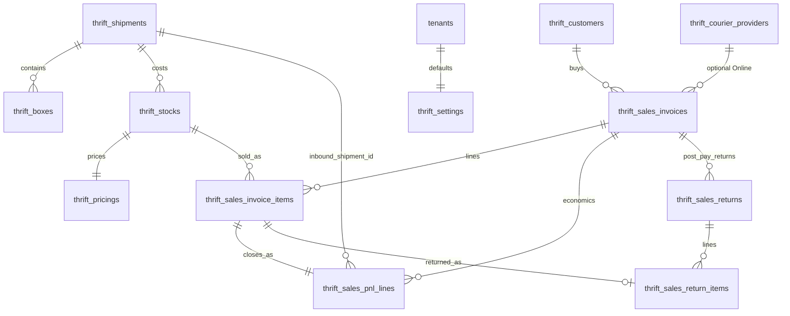

# Thrift Database Schema (index)

Standalone thrift vertical. Currencies: [`global_reference`](../global_reference/schema.md).

**Canonical field detail** is in domain `schema.md` files.

| Domain | Tables |
| :--- | :--- |
| [settings](./settings/schema.md) | `thrift_settings` |
| [catalog](./catalog/schema.md) | `thrift_categories`, `thrift_types`, `thrift_shelves` |
| [inbound](./inbound/schema.md) | `thrift_shipments`, `thrift_boxes` — **do not change for sales redesign** |
| [barcode](./barcode/schema.md) | `thrift_barcodes` |
| [stock](./stock/schema.md) | `thrift_stocks`, `thrift_pricings`, … — **do not change for sales redesign** |
| [sales](./sales/schema.md) | `thrift_customers`, `thrift_sales_invoices`, `thrift_sales_invoice_items`, `thrift_invoice_counters`, **`thrift_courier_providers`**, **`thrift_sales_pnl_lines`**, **`thrift_sales_returns`**, **`thrift_sales_return_items`** |
| [ledger](./ledger/schema.md) | `thrift_accounting_ledger` |
| [reports](./reports/schema.md) | read models over PnL lines + live COGS + ledger |

Landed cost: [stock/costing.md](./stock/costing.md).  
Scenarios: [sales/scenarios.md](./sales/scenarios.md).

## Enums / text conventions

| Enum / field | Values |
| :--- | :--- |
| `thrift_section` | `MALE`, `FEMALE`, `UNISEX`, `KIDS`, `HOME` |
| `thrift_condition` | `NEW_WITH_TAGS`, `EXCELLENT`, `GOOD`, `FAIR` |
| `thrift_stock_type` | `SINGLE`, `BULK` |
| `thrift_stock_status` | `AVAILABLE`, `RESERVED`, `OUT_OF_STOCK`, `DAMAGED`, `STOLEN`, `SOLD` |
| `thrift_ledger_type` | `REVENUE`, `EXPENSE`, `REFUND`, `LOSS` |
| `thrift_ledger_source` | `INVOICE`, `SHIPMENT`, `OPERATIONAL` |
| PnL `outcome` | `DELIVERED`, `RTO`, `CUSTOMER_RETURN` |
| Invoice `status` | `ACTIVE`, `PARTIALLY_RETURNED`, `RETURNED` |
| Invoice `close_reason` | `RTO`, `CUSTOMER_RETURN` (null if open/partial) |
| Return item `condition` | `SELLABLE`, `DAMAGED` |
| Payment | `PAID`, `COD_PENDING`, `PARTIALLY_REFUNDED`, `REFUNDED`, `WRITTEN_OFF` |

Also: barcode `status`; `sale_channel`; fee payers; `delivery_status`.

## Relationships

## Sales economics (summary)

| Layer | Responsibility |
| :--- | :--- |
| Invoice + items | Sell, fees, COD, delivery, courier provider snapshot; **RTO** no-pickup |
| `thrift_courier_providers` | Global **system** BD seed (`is_system`, immutable) + per-tenant customs |
| Return docs | Post-pay **partial or full** returns |
| `thrift_sales_pnl_lines` | Recognized sell + allocated shop logistics per line |
| Inbound shipment via stock | Live COGS |
| Ledger | Money events only |
