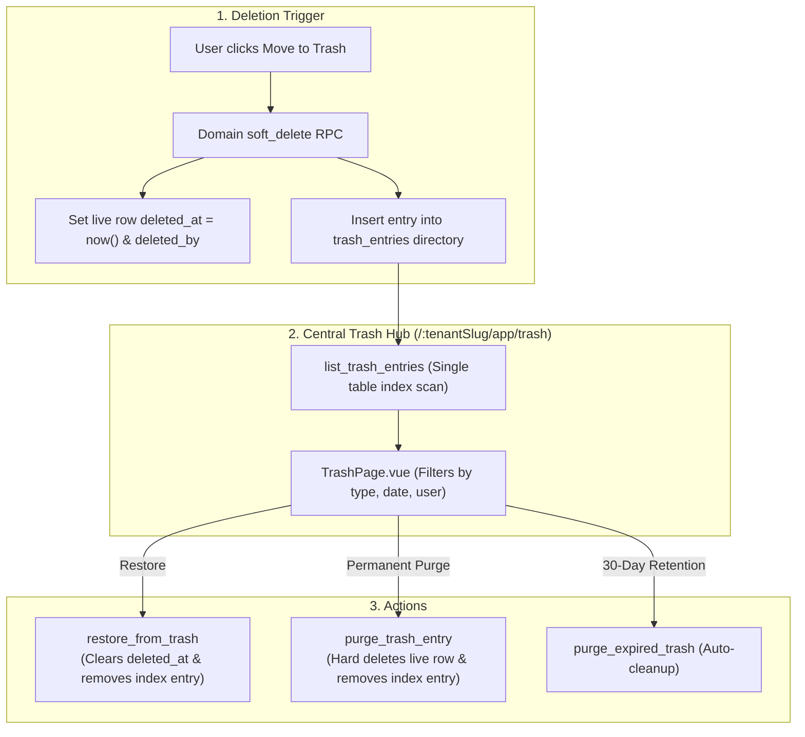
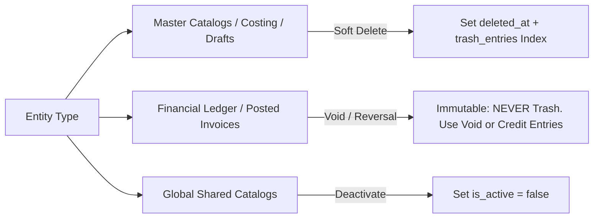

# Soft Delete & Central Trash Module

The **Trash & Soft Delete** domain establishes tenant-scoped soft-deletion across all master catalogs and business entities, preventing accidental data loss through a centralized `trash_entries` directory index and a dedicated recovery hub at `/:tenantSlug/app/trash`.

---

## 1. Domain Architecture & Indexing Strategy

### Why `trash_entries` Directory Index?
Rather than executing expensive `UNION ALL` queries across 30+ business tables to populate the trash page, the database maintains a single lightweight pointer table:

| Column | Type | Purpose |
| :--- | :--- | :--- |
| `id` | `uuid` PK | Unique trash record identifier. |
| `tenant_id` | `bigint` FK | Tenant boundary for RLS filtering. |
| `entity_type` | `text` | Target entity table (e.g. `vendor`, `product`, `shop_order`). |
| `entity_id` | `text` | Primary key of the soft-deleted row. |
| `label` | `text` | Human-readable title (e.g., product name, order number). |
| `module_key` | `text` | Associated module key for permission gating. |
| `deleted_at` | `timestamptz` | Timestamp when deletion occurred. |
| `deleted_by` | `text` | Email / user ID of the actor. |
| `payload` | `jsonb` | Lightweight display snapshot (display only, not restore truth). |

---

## 2. Entity Deletion Governance & Special Paths

| Domain / Table | Deletion Mechanism | Trash Policy |
| :--- | :--- | :--- |
| **Masters (Vendors, Products, Brands, Categories, Shops)** | `deleted_at` + `deleted_by` | **YES** $\rightarrow$ Appears in central Trash UI |
| **Costing Files & Items** | `deleted_at` (Parent covers items) | **YES** $\rightarrow$ One parent trash entry |
| **Draft Shop Orders** | `deleted_at` | **YES** $\rightarrow$ Allowed prior to fulfillment |
| **Fulfilled / Shipped Orders** | Order Cancellation | **NO** $\rightarrow$ Use order cancel flow |
| **Posted Sales Invoices** | Voiding (`void_global_invoice`) | **NO** $\rightarrow$ Immutable audit trail; void only |
| **Universal Wallet Ledger** | Reversal Transaction | **NO** $\rightarrow$ Append-only immutable ledger |
| **Global References (Currencies, Payment Methods)** | `is_active = false` | **NO** $\rightarrow$ Platform deactivation only |

---

## 3. Page & Component Inventory

| Route | Main Page | Key Child Components |
| :--- | :--- | :--- |
| `/:tenantSlug?/app/trash` | [`TrashPage.vue`](file:///Users/daviditc/Documents/personal_projects/brandwala-wholesale-quasar-v2/web/src/modules/trash/pages/TrashPage.vue) | Compact table toolbar, entity-type filter tabs, date range filter, restore modal, purge confirmation dialog |

---

## 4. Page to API / RPC Matrix

| Component | Action / Trigger | Hook / Endpoint | Caching Strategy |
| :--- | :--- | :--- | :--- |
| **`TrashPage`** | Mount / Filter Change | `useQuery` $\rightarrow$ `RPC: list_trash_entries` | `staleTime: 30s`, Key: `['trash', 'list', filters]` |
| **`TrashPage`** | Restore Item | `useMutation` $\rightarrow$ `RPC: restore_from_trash` | Invalidates `['trash', 'list']` and target domain lists |
| **`TrashPage`** | Permanent Purge | `useMutation` $\rightarrow$ `RPC: purge_trash_entry` | Optimistic removal from Trash list |
| **Backend Service / Cron**| Daily Scheduled Job | `RPC: purge_expired_trash` | Purges items older than 30 days |

---

## 5. Query Keys & Server State

* `['trash', 'list', { tenantId, entityType, dateRange, search }]` $\rightarrow$ Filtered trash directory entries
* `['trash', 'types', tenantId]` $\rightarrow$ List of entity types with active trash records
