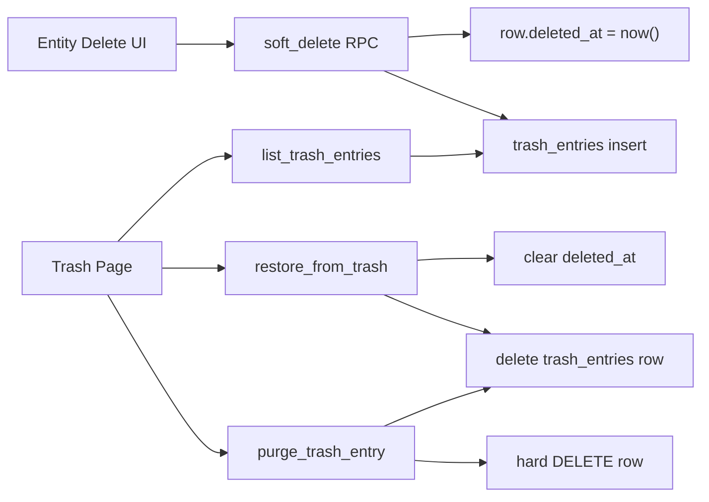

# Soft Delete + Central Trash Module

> **Single Source of Truth** for tenant-scoped soft delete and the central Trash UI. Hard deletes on business entities are replaced with `deleted_at` where feasible; financial truth uses void / reverse, not Trash.

**Related:** [PERMISSION_SYSTEM.md](../PERMISSION_SYSTEM.md) · [UNIVERSAL_WALLET_LEDGER.md](../wallet/UNIVERSAL_WALLET_LEDGER.md) · [MASTER_PLAN.md](../MASTER_PLAN.md)

---

## 1. Executive summary

Accidental hard deletes are irreversible and cascade across stock, orders, and masters. Brandwala adopts:

1. **Soft delete** on feasible business tables (`deleted_at` + `deleted_by`).
2. **`trash_entries`** — a tenant-scoped pointer index so one Trash page can list everything without `UNION` across 30+ tables.
3. **Central Trash module** at `/:tenantSlug/app/trash` — list, restore, purge.
4. **Special paths** for invoices (void), non-draft orders (cancel), and wallet ledger (immutable / reverse only).

**Locked rules**

| Concern | Rule |
| :--- | :--- |
| Soft-delete signal | `deleted_at` + `deleted_by` on the live row |
| Central list | Read `trash_entries` only |
| Restore source of truth | Clear `deleted_at` on the live row — **not** `payload` |
| `is_active` | Deactivate ≠ Trash; Delete → soft delete |
| Wallet / ledger | Never soft- or hard-delete; reverse with new entries |
| Posted invoices / capital investments | Void / reverse — not Trash |
| Retention | Manual purge with `trash.delete`; auto-purge after **30 days** |

---

## 2. Why `trash_entries` exists

Soft delete on each table is enough for that module’s lists (`WHERE deleted_at IS NULL`).

A **central** Trash UI needs one list of everything deleted in the tenant. Without an index:

```sql
SELECT ... FROM vendors WHERE deleted_at IS NOT NULL
UNION ALL
SELECT ... FROM products WHERE ...
-- × every soft-deleted table
```

That forces every new entity into the Trash RPC, breaks uniform filters/pagination, and complicates RLS.

`trash_entries` is a **directory of trash**, not a blob recycle bin:

| Stores | Does not store |
| :--- | :--- |
| `entity_type` + `entity_id` | Full restore graph as truth |
| `label`, `module_key` | Replacement for the live vendor/product/… row |
| `tenant_id`, `deleted_at`, `deleted_by` | Wallet / invoice history |



---

## 3. Data model

### 3.1 `trash_entries`

| Column | Type | Notes |
| :--- | :--- | :--- |
| `id` | `uuid` PK | |
| `tenant_id` | `bigint` FK → `tenants` | RLS + list filter |
| `entity_type` | `text` | e.g. `vendor`, `product`, `shop_order` |
| `entity_id` | `text` | Stringified PK (bigint or uuid) |
| `label` | `text` | Human title for the list (name / order #) |
| `module_key` | `text` | Filter / context |
| `deleted_at` | `timestamptz` | |
| `deleted_by` | `text` | Email |
| `payload` | `jsonb` | Optional display snapshot only — **not** restore truth |

### 3.2 Soft-delete columns on domain tables

On each soft-deleteable table:

- `deleted_at timestamptz null`
- `deleted_by text null`

List RPCs / queries filter `WHERE deleted_at IS NULL`. Prefer partial indexes supporting active lists.

### 3.3 Shared SQL helpers / RPCs

| Helper / RPC | Role | Auth |
| :--- | :--- | :--- |
| Soft-delete helper | Set columns + upsert `trash_entries` | Called from domain soft-delete RPCs |
| `list_trash_entries(...)` | Paginated Trash list | `trash.view` |
| `restore_from_trash(id)` | Clear `deleted_at`, drop index row | `trash.restore` |
| `purge_trash_entry(id)` | Hard delete live row + index | `trash.delete` |
| `purge_expired_trash(...)` | 30-day cutoff | Service / cron |

Parent soft-delete RPCs (e.g. shipment, costing file) soft-delete **children in the same transaction** and write **one** trash entry for the parent; restore restores the tree.

---

## 4. Soft-delete matrix

### 4.1 YES — soft delete + Trash

**Masters / catalogs**

| Table | Current delete | Notes |
| :--- | :--- | :--- |
| `vendors` | hard `.delete` | High use |
| `products` | hard | |
| `product_brands` | hard | |
| `product_categories` | hard | |
| `billing_profiles` | hard | Soft hide; wallet ledger stays |
| `recipient_profiles` | hard | |
| `invoice_brands` | hard | |
| `courier_services` | hard (has `is_active`) | |
| `merchant_profiles` | hard (has `is_active`) | |
| `shops` | `delete_shop` RPC | Soft instead of cascade wipe |
| `shop_categories` | hard | |
| `shop_product_listings` | RPC hard delete | Soft / hide from storefront |
| `customer_groups` / `customer_group_members` | hard | Prefer soft over wipe |
| `markets` | hard | |
| `memberships` | hard (has `is_active`) | Soft-delete in Trash wave |

**Costing**

| Table | Notes |
| :--- | :--- |
| `costing_files` / `costing_file_items` | Parent trash entry covers children |
| `product_based_costing_files` / items | Same |

**Procurement / stock**

| Table | Constraint |
| :--- | :--- |
| `global_shipments` | Soft only if no posted invoice / sell-through; else block |
| `global_shipment_items` / `global_shipment_boxes` | Same lock rules |
| `global_stocks` | Soft; block if allocated / sold |
| `global_stock_allocations` | Soft |
| `global_stock_types` | Soft if unused |

**Thrift (later wave)**

`thrift_stocks`, `thrift_shipments`, `thrift_boxes`, `thrift_shelves`, `thrift_categories`, `thrift_types`, `thrift_barcodes`.

**Tasks**

- `items` — stop hard delete; use `deleted_at` (or align archive + trash policy).
- `comments` — column `deleted_at` already exists; wire delete to set it.

### 4.2 SPECIAL — not Trash

| Entity | Action |
| :--- | :--- |
| `global_invoices` | Remove hard delete from UI; **void only** (`void_global_invoice`) |
| `global_invoice_items` | Draft remove OK (hard); posted → void parent |
| `shop_orders` | Soft-delete **draft / pre-fulfillment only**; otherwise **cancel** |
| `shipment_investments` | Capital reverse / unlink |
| Wallet ledger / remittance rebuild rows | Immutable / internal |
| `tenants` | Platform `is_active` only — out of tenant Trash |

### 4.3 Hard delete remains OK

Cart items, junction rows (`item_tags`, assignees, grants), thrift image/measurement replace rows, grant revoke rows.

### 4.4 Global reference with `is_active`

`global_currencies`, `payment_methods`, `units_of_measure` — Delete → `is_active = false`. Platform-global rows stay deactivate-only (not tenant Trash).

---

## 5. Central Trash UI (tenant module)

### 5.1 Registration

| Piece | Value |
| :--- | :--- |
| `module_key` | `trash` |
| Path | `/:tenantSlug/app/trash` |
| Folder | `web/src/modules/trash/` |
| Key files | `pages/TrashPage.vue`, `routes/index.ts`, `repositories/trashRepository.ts`, `composables/useTrashQuery.ts` |
| Nav | [`moduleRegistry.ts`](../../web/src/modules/navigation/moduleRegistry.ts) — `ModuleKey` + `MODULE_REGISTRY` |
| Routes | Wire via [`web/src/router/routes.ts`](../../web/src/router/routes.ts) |
| Guard | `createAccessGuard({ requiredScope: 'app', requireTenantContext: true, requiredModule: 'trash' })` |
| Icon | `ph ph-trash` |

### 5.2 Permissions

| Action | Meaning |
| :--- | :--- |
| `view` | See Trash list |
| `restore` | Undelete |
| `delete` | Permanent purge |

Seed `modules` + `module_actions` (same pattern as shop category seed). Staff template: `view` + `restore`. Purge admin-only by default. Update [PERMISSION_SYSTEM.md](../PERMISSION_SYSTEM.md) §19.

### 5.3 UI requirements (`TrashPage.vue`)

- Filters: entity type, date range, deleted_by, search on `label`
- Table: label, entity type, deleted_at, deleted_by, actions
- Row / bulk: Restore, Purge (`requestConfirmation`)
- Empty + skeleton states per UI consistency
- No deep edit of `payload`; Restore returns the entity to normal lists

### 5.4 Domain delete UX

Replace hard-delete confirm copy with **Move to Trash**. Optional success Undo → restore when grant allows.

---

## 6. Implementation phases

| Phase | Scope | Status |
| :--- | :--- | :--- |
| **0 — Foundation** | `trash_entries` + RLS + helpers + list/restore/purge RPCs; seed `trash` module; registry + empty Trash page | pending |
| **1 — Masters** | Soft-delete: vendors, products (+ brands/categories), billing/recipient/invoice brands, couriers, merchants, shops, shop categories/listings | pending |
| **2 — Costing + draft commerce** | Costing + PBC soft delete; draft `shop_orders` soft delete + cancel otherwise; invoices void-only (remove hard delete) | pending |
| **3 — Procurement / stock** | Shipments / stocks / allocations / types with sold/allocated block rules | pending |
| **4 — Thrift + tasks + access** | Thrift entities; tasks/comments; memberships / customer groups | pending |
| **5 — Retention** | `purge_expired_trash` (30 days); UI purge already gated by `trash.delete` | pending |

---

## 7. Out of scope

- Platform-wide recycle bin across tenants
- Soft-deleting wallet ledger rows
- Restoring arbitrary cascade graphs beyond what the parent soft-delete RPC soft-deleted together
- Changing Thrift composable architecture
