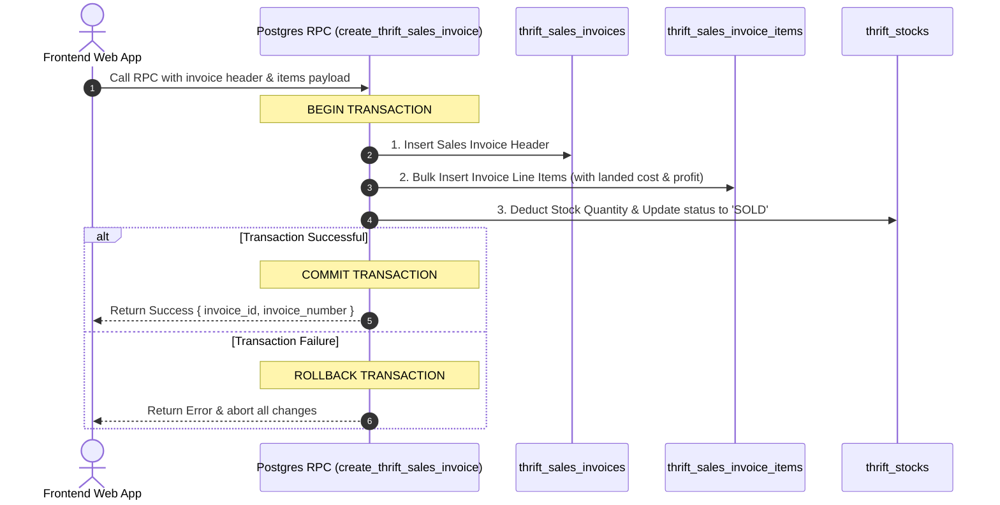

# RPC: `create_thrift_sales_invoice`

Executes the creation of a **Thrift Sales Invoice**, inserts all invoice line items, records landed costs and net profit snapshots, and updates/deducts stock quantities inside a single **Postgres Atomic Transaction**.

---

## 1. Architectural Overview & Transaction Principles

To adhere to the project's **API & Network Optimization Rules** and guarantee **ACID Data Integrity**, this operation is handled via a single Supabase RPC function instead of client-side sequential API calls.

* **Single Network Request**: Executed via a single HTTP POST request to `/rest/v1/rpc/create_thrift_sales_invoice`.
* **Atomic Transaction (`BEGIN ... COMMIT`)**: All database operations execute within one isolated transaction block. If an error occurs during stock deduction or item insertion, Postgres automatically **rolls back** every change (reverting invoice header creation and stock status updates).
* **Race Condition Prevention**: Prevents concurrent counter sales from double-selling the same physical thrift stock item.

---

## 2. Step-by-Step Transaction Workflow



---

## 3. RPC Signature & Payload Specification

```typescript
supabase.rpc('create_thrift_sales_invoice', {
  p_tenant_id: 15,
  p_invoice_number: "INV-2026-8492",
  p_customer_name: "John Doe",
  p_customer_phone: "+8801700000000",
  p_payment_method: "cash",
  p_payment_status: "paid",
  p_notes: "Counter walk-in customer",
  p_inserted_by: "cashier@brandwala.com",
  p_items: [
    {
      stock_id: 1042,
      sell_price: 1500.00,
      discount_amount: 100.00,
      final_price: 1400.00,
      landed_unit_cost: 650.00,
      quantity: 1,
      net_profit: 750.00
    },
    {
      stock_id: 1089,
      sell_price: 800.00,
      discount_amount: 0.00,
      final_price: 800.00,
      landed_unit_cost: 320.00,
      quantity: 1,
      net_profit: 480.00
    }
  ]
});
```

---

## 4. Internal Table Operations Executed in Transaction

### Step 1: Insert Header into `thrift_sales_invoices`
Calculates total invoice amount as $\sum \text{final\_price}$ and inserts header record:
```json
{
  "tenant_id": 15,
  "invoice_number": "INV-2026-8492",
  "customer_name": "John Doe",
  "customer_phone": "+8801700000000",
  "payment_method": "cash",
  "payment_status": "paid",
  "total_invoice_amount": 2200.00,
  "notes": "Counter walk-in customer",
  "inserted_by": "cashier@brandwala.com"
}
```

### Step 2: Bulk Insert Items into `thrift_sales_invoice_items`
For each item in `p_items`, attaches the generated `invoice_id` and records pricing snapshots:
```json
[
  {
    "invoice_id": 42,
    "tenant_id": 15,
    "stock_id": 1042,
    "sell_price": 1500.00,
    "discount_amount": 100.00,
    "final_price": 1400.00,
    "landed_unit_cost_at_sale": 650.00,
    "quantity": 1,
    "net_profit": 750.00
  },
  {
    "invoice_id": 42,
    "tenant_id": 15,
    "stock_id": 1089,
    "sell_price": 800.00,
    "discount_amount": 0.00,
    "final_price": 800.00,
    "landed_unit_cost_at_sale": 320.00,
    "quantity": 1,
    "net_profit": 480.00
  }
]
```

### Step 3: Update Target Items in `thrift_stocks`
For each sold `stock_id`:
* Decrements stock quantity: `quantity = quantity - sold_qty`.
* Updates status: `status = 'SOLD'` when `quantity <= 0`.
