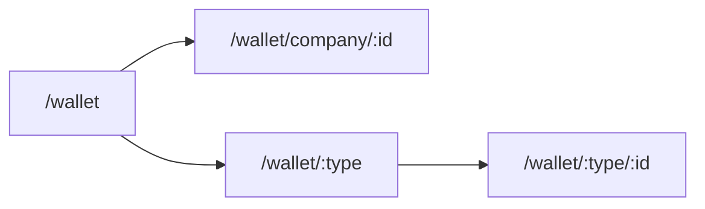

# Universal Wallet — Implementation Order

Simple build sequence for the Wallet module redesign (picker flow). Spec details live in linked docs — not duplicated here.

**Canon:** [schema.md](./schema.md) · [workflow_flow.md](./workflow_flow.md) · [UNIVERSAL_WALLET_FEATURE.md](./UNIVERSAL_WALLET_FEATURE.md) · [UNIVERSAL_WALLET_LEDGER.md](./UNIVERSAL_WALLET_LEDGER.md)

**Slugs:** `company` `customers` `suppliers` `cargo` `couriers` `investors`
**Labels:** Our company · Customers · Suppliers · Cargo · Couriers · Investors

Cargo vs Couriers stay separate. `cargo` uses `entity_type = cargo_company`, `entity_id = cargo_companies.id`.

---

## Work Units (WUs)

| # | Focus | Outcome | Status |
|:-:|:---|:---|:---:|
| **WU1** | **Docs & Spec updates** | Create `IMPLEMENTATION_ORDER.md` and update `schema.md`, `workflow_flow.md`, `UNIVERSAL_WALLET_FEATURE.md`, `UNIVERSAL_WALLET_LEDGER.md`, `wallet_account_api.md` with `cargo_company` entity type and picker flow. | Done |
| **WU2** | **Types & list data** | Add `cargo_company` to `UniversalWalletEntityType` in `index.ts`, define slug ↔ type map, add `listAccountsByType(tenantId, entityType)` in `walletAccountRepository.ts`. | Done |
| **WU3** | **Home picker page** | Create `WalletHomePage.vue` + skeleton. Title: *Wallets*, Subtitle: *Whose money do you want to see?* 6 grid cards (`bw-entity-grid`). Route `/wallet` -> Home. | Done |
| **WU4** | **Name list page** | Create `WalletEntityListPage.vue` + skeleton. Route `/wallet/:type`. Title: `{Type} wallets`, Subtitle: *Pick a name to open their wallet*. Search + balances join + cargo support. | Done |
| **WU5** | **Slim wallet detail page** | Refactor `UniversalWalletPage.vue` to `:walletType/:entityId` detail view. Default view: `SimplifiedWalletView.vue` with back button to list/home. Hide accountant view behind link. | Done |
| **WU6** | **Nav, help guide & deep links** | Update nav title/caption in `moduleRegistry.ts`, update guide in `universalWallet.ts`, and update `VendorWalletDialog.vue` to push `/wallet/suppliers/:id`. | Done |

---

## Agent Rule

Work **one row** (WU1 → WU2 → WU3 → WU4 → WU5 → WU6) per session. Read canon for that row; stop after completion.
