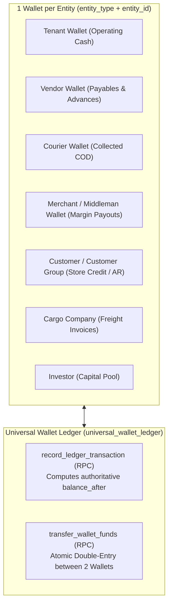
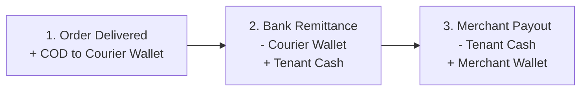

# Universal Multi-Currency Wallet & Ledger Module

The **Universal Wallet** domain is BrandWala's centralized, immutable financial ledger. It tracks money, receivables, payables, advances, and payouts across all entity types (Tenants, Vendors, Couriers, Merchants, Customers, Cargo Companies, Investors) without fragmented accounting tables.

**Implementation plan (parent books migration):** [`WALLET_PARENT_BOOKS_IMPLEMENTATION.md`](./WALLET_PARENT_BOOKS_IMPLEMENTATION.md)  
**RPC specs:** [`LIST_WALLET_ENTITIES_RPC.md`](./LIST_WALLET_ENTITIES_RPC.md) (directory list), [`UNIVERSAL_WALLET_DETAIL_RPC.md`](./UNIVERSAL_WALLET_DETAIL_RPC.md) (detail + manual tx), [`RECORD_LEDGER_SYSTEM_RPC_MIGRATION.md`](./RECORD_LEDGER_SYSTEM_RPC_MIGRATION.md) (upgrade existing invoice / order / procurement writers), [`WALLET_LEGACY_RETIREMENT.md`](./WALLET_LEGACY_RETIREMENT.md) (drop zombie RPCs + dead UI)

---

## 1. Domain Architecture & The One-Wallet Rule

### 1.1 Parent–child books (target model)

Wallet books follow the same rule as [`sales_invoices`](./../sales_invoice/SALES_INVOICE.md) and treasury reports:

```text
One wallet row / ledger line
├── parent_tenant_id     = Books owner (resolve_parent_tenant_id). Parent reports & wallet UI scope.
├── operating_tenant_id  = Child desk where the event happened (shop_orders.tenant_id). Audit / drill-down.
├── entity_type          = Party kind (tenant, courier, customer, vendor, …)
└── entity_id            = Party id within that type (not “who ran the order”)
```

| Tenant shape | `parent_tenant_id` | `operating_tenant_id` |
| :--- | :--- | :--- |
| **Parent company** | `tenants.id` | same as parent |
| **Child sister concern** | `tenants.parent_id` | child `tenants.id` |
| **Standalone** (no parent) | `tenants.id` | same as id |

Helper (RPC + UI):

```text
wallet_books_tenant_id(p_tenant_id) := resolve_parent_tenant_id(p_tenant_id)
```

**Company cash (`entity_type = 'tenant'`):** one pool per books — `entity_id = parent_tenant_id`. Do not use child id for tenant cash unless a future “per-child till” mode is explicitly enabled.

### 1.2 One wallet per party

Every distinct business entity is assigned exactly **ONE** wallet identified by:

```text
(parent_tenant_id, entity_type, entity_id, currency_code)
```

### 1.3 `entity_type` + `entity_id` mapping

| `entity_type` | `entity_id` | Notes |
| :--- | :--- | :--- |
| `tenant` | Parent tenant id | Operating company cash (one pool per books). |
| `courier` | `courier_services.wallet_entity_id` | Not `courier_services.id` (UUID). Shared under parent book. |
| `customer` | `billing_profiles.id` | Reseller AR, store credit, dropship collections. |
| `middleman` | `billing_profiles.id` | Legacy alias; prefer `customer` where possible. |
| `vendor` | `vendors.id` | Supplier payables & advances. |
| `cargo_company` | `cargo_companies.id` | Freight payables. |
| `investor` | `investors.id` | Capital pool. |

“Under whom the transaction happened” is **`operating_tenant_id`** (and `source_type` / `source_id`), not `entity_id`.

### 1.4 Current production gap (pre-migration)

| Layer | Books tenant used today | Result |
| :--- | :--- | :--- |
| Dropship wallet RPCs | Child `shop_orders.tenant_id` | Rows keyed on child id (e.g. `11`) |
| Wallet UI (`useWalletAccounts`, `useWalletQuery`) | `parent_id ?? id` | Reads parent book |
| **Mismatch** | Child write vs parent read | UI balances **0** despite ledger data on child |

Until migration ships, do not “fix” only the UI without aligning writers — pick one books rule. Target: **parent book** everywhere (see [`WALLET_PARENT_BOOKS_IMPLEMENTATION.md`](./WALLET_PARENT_BOOKS_IMPLEMENTATION.md), §Existing data).

---

## 1.5 Architecture diagram (target)



### Answering Business Questions via Wallets

| Business Question | Ledger Query | Typical Meaning |
| :--- | :--- | :--- |
| **"What cash do we have?"** | `entity_type = 'tenant'` balance | Operating liquid balance in bank/cash drawers. |
| **"Who owes us money?"** | `entity_type IN ('courier', 'customer')` balance | Courier holding unremitted COD cash or customer on credit. |
| **"Who do we owe?"** | `entity_type IN ('vendor', 'merchant', 'cargo_company')` balance | Pending payable dues to suppliers, freight agents, or middleman margins. |
| **"What have we spent?"** | Sum of `debit` entries on Tenant wallet | Operating expenses, payouts, and purchase outflows. |

---

## 2. Core Ledger Engine & Atomic Operations

### 2.1 Immutable Ledger Principles
* **Append-Only**: Ledger rows are permanent. `universal_wallet_ledger` rows are **NEVER** updated, soft-deleted, or purged.
* **Corrections via Reversals**: Mistakes are corrected by inserting opposite reversing transactions with reference metadata.
* **Authoritative Balance**: The `balance_after` column is calculated deterministically inside the database transaction lock during `record_ledger_transaction`.

### 2.2 Dropship 3-Step Wallet Flow



### 2.4 Wholesale invoice vs customer store credit

Wholesale invoices **do not** bill the customer wallet on issue. Due is invoice AR.

| Event | Customer wallet | Tenant wallet |
| :--- | :--- | :--- |
| Issue wholesale | No write | No write |
| Collect cash/bank on invoice | No write | **Credit** (cash in). `metadata.method` set for Cash in report. |
| Apply store credit to invoice | **Debit** | No write |
| Return leftover after due is zero (overpaid) | **Credit** (store credit) | No write unless cash payout |
| Settlement write-off | No write | No write |

See [`doc/sales_invoice/SALES_INVOICE.md`](file:///Users/daviditc/Documents/personal_projects/brandwala-wholesale-quasar-v2/doc/sales_invoice/SALES_INVOICE.md) §2.4.

See [`doc/reporting_treasury/CASH_IN.md`](file:///Users/david/Documents/personal_projects/brandwala-wholesale-quasar-v2/doc/reporting_treasury/CASH_IN.md). RPC `get_tenant_cash_in_report` and UI at `/:tenantSlug?/app/finance/reports/cash-in` are **Live**.


---

## 3. Page & Component Inventory

| Route | Main Page | Key Child Components & Dialogs |
| :--- | :--- | :--- |
| `/:tenantSlug?/app/wallet` | [`WalletHomePage.vue`](file:///Users/daviditc/Documents/personal_projects/brandwala-wholesale-quasar-v2/web/src/modules/wallet/pages/WalletHomePage.vue) | Entity picker cards |
| `/:tenantSlug?/app/wallet/:walletType` | [`WalletEntityListPage.vue`](file:///Users/daviditc/Documents/personal_projects/brandwala-wholesale-quasar-v2/web/src/modules/wallet/pages/WalletEntityListPage.vue) | Directory list — [`LIST_WALLET_ENTITIES_RPC.md`](./LIST_WALLET_ENTITIES_RPC.md) |
| `/:tenantSlug?/app/wallet/company/:tenantId` | [`UniversalWalletPage.vue`](file:///Users/daviditc/Documents/personal_projects/brandwala-wholesale-quasar-v2/web/src/modules/wallet/pages/UniversalWalletPage.vue) | Detail + ledger + manual tx — [`UNIVERSAL_WALLET_DETAIL_RPC.md`](./UNIVERSAL_WALLET_DETAIL_RPC.md) |
| `/:tenantSlug?/app/wallet/:walletType/:entityId` | [`UniversalWalletPage.vue`](file:///Users/daviditc/Documents/personal_projects/brandwala-wholesale-quasar-v2/web/src/modules/wallet/pages/UniversalWalletPage.vue) | Same detail RPCs |
| `/:tenantSlug?/shop/wallet` | [`MerchantWalletPage.vue`](file:///Users/daviditc/Documents/personal_projects/brandwala-wholesale-quasar-v2/web/src/modules/shop_order/pages/MerchantWalletPage.vue) | Storefront merchant earnings statement & payout withdrawal requests |
| Modal Embeds | In-Context Dialogs | [`VendorWalletDialog.vue`](file:///Users/daviditc/Documents/personal_projects/brandwala-wholesale-quasar-v2/web/src/modules/vendor/components/VendorWalletDialog.vue), [`CustomerGroupWalletDialog.vue`](file:///Users/daviditc/Documents/personal_projects/brandwala-wholesale-quasar-v2/web/src/modules/shop_order/components/CustomerGroupWalletDialog.vue) |

---

## 4. Page to API / RPC Matrix

| Component | Action / Trigger | Hook / Endpoint | Caching Strategy |
| :--- | :--- | :--- | :--- |
| **`WalletEntityListPage`** | Load directory list | `RPC: list_wallet_entities_for_staff` — [`LIST_WALLET_ENTITIES_RPC.md`](./LIST_WALLET_ENTITIES_RPC.md) | Key: `['wallet', 'entityDirectory', …]` |
| **`UniversalWalletPage`** | Load detail header + balances | `RPC: get_wallet_detail_for_staff` — [`UNIVERSAL_WALLET_DETAIL_RPC.md`](./UNIVERSAL_WALLET_DETAIL_RPC.md) | Key: `['wallet', 'detail', …]` |
| **`UniversalWalletPage`** | Transaction history | `RPC: list_wallet_ledger_for_staff` | Key: `['wallet', 'ledger', …]` |
| **`WalletActionModal`** | Pay / Deposit / Credit / Withdraw | `RPC: record_wallet_manual_transaction_for_staff` | Invalidates detail + ledger |
| **`UniversalWalletLedgerTable`** | Revert row | `RPC: reverse_wallet_ledger_entry_for_staff` | Invalidates detail + ledger |
| **`UniversalWallet`** | Mount / Entity Select | `useWalletQuery.ledgerList` $\rightarrow$ **migrate to** `list_wallet_ledger_for_staff` | `staleTime: 30s` |
| **`UniversalWallet`** | Fetch Running Balance | `useWalletQuery.balance` $\rightarrow$ `walletRepository.fetchLatestBalance` | `staleTime: 15s`, Key: `['wallet', 'balance', params]` |
| **`WalletDepositModal`** | Record Deposit / Inflow | `useWalletMutations` $\rightarrow$ `RPC: record_ledger_transaction` | Invalidates ledger & balance caches |
| **`WalletWithdrawModal`** | Record Payout / Outflow | `useWalletMutations` $\rightarrow$ `RPC: record_ledger_transaction` | Invalidates ledger & balance caches |
| **`WalletTransferModal`** | Transfer between Wallets| `useWalletMutations` $\rightarrow$ `RPC: transfer_wallet_funds` | Invalidates both entity wallet caches |
| **`MerchantWalletPage`** | Storefront Statement | `merchantWalletRepository` $\rightarrow$ `RPC: get_my_dropship_wallet_summary` | `staleTime: 30s`, Key: `['shopOrder', 'merchant_wallet', tenantId]` |

---

## 5. Query Keys & Server State

Server state keys are centralized in [`walletQueryKeys.ts`](file:///Users/daviditc/Documents/personal_projects/brandwala-wholesale-quasar-v2/web/src/modules/wallet/shared/queryKeys/walletQueryKeys.ts):

**Target params** (after parent-books migration):

* `parentTenantId` — `wallet_books_tenant_id(selectedTenant)`
* `operatingTenantId` — optional filter for child-scoped ledger views
* `entityType`, `entityId` — wallet party

* `walletQueryKeys.ledgerList(params)` $\rightarrow$ `['wallet', 'ledgerList', { parentTenantId, operatingTenantId?, entityType, entityId }]`
* `walletQueryKeys.balance(params)` $\rightarrow$ `['wallet', 'balance', { parentTenantId, entityType, entityId }]`
* `walletQueryKeys.accountBalances(params)` $\rightarrow$ `['wallet', 'accountBalances', { parentTenantId, entityType, entityId }]`
* `walletQueryKeys.dashboardSummary(parentTenantId)` $\rightarrow$ `['wallet', 'dashboardSummary', parentTenantId]`
* `walletQueryKeys.statement(params)` $\rightarrow$ `['wallet', 'statement', params]`

**Today:** keys still use a single `tenantId` (UI passes `parent_id ?? id`). RPCs filter `wallet_accounts.tenant_id` — must match migrated `parent_tenant_id` column after Phase 2.
