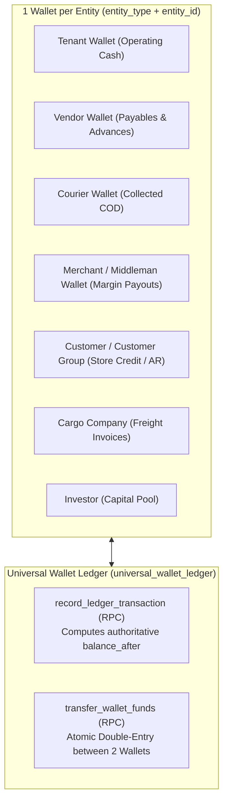
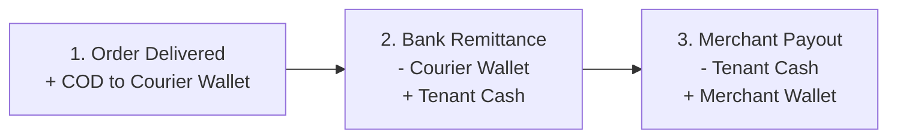

# Universal Multi-Currency Wallet & Ledger Module

The **Universal Wallet** domain is BrandWala's centralized, immutable financial ledger. It tracks money, receivables, payables, advances, and payouts across all entity types (Tenants, Vendors, Couriers, Merchants, Customers, Cargo Companies, Investors) without fragmented accounting tables.

---

## 1. Domain Architecture & The One-Wallet Rule

Every distinct business entity is assigned exactly **ONE** wallet identified by the tuple `(tenant_id, entity_type, entity_id)`:

### Answering Business Questions via Wallets

| Business Question | Ledger Query | Typical Meaning |
| :--- | :--- | :--- |
| **"What cash do we have?"** | `entity_type = 'tenant'` balance | Operating liquid balance in bank/cash drawers. |
| **"Who owes us money?"** | `entity_type IN ('courier', 'customer')` balance | Courier holding unremitted COD cash or customer on credit. |
| **"Who do we owe?"** | `entity_type IN ('vendor', 'merchant', 'cargo_company')` balance | Pending payable dues to suppliers, freight agents, or middleman margins. |
| **"What have we spent?"** | Sum of `debit` entries on Tenant wallet | Operating expenses, payouts, and purchase outflows. |

---

## 2. Core Ledger Engine & Atomic Operations

### 2.1 Immutable Ledger Principles
* **Append-Only**: Ledger rows are permanent. `universal_wallet_ledger` rows are **NEVER** updated, soft-deleted, or purged.
* **Corrections via Reversals**: Mistakes are corrected by inserting opposite reversing transactions with reference metadata.
* **Authoritative Balance**: The `balance_after` column is calculated deterministically inside the database transaction lock during `record_ledger_transaction`.

### 2.2 Dropship 3-Step Wallet Flow

### 2.4 Wholesale invoice vs customer store credit

Wholesale invoices **do not** bill the customer wallet on issue. Due is invoice AR.

| Event | Customer wallet | Tenant wallet |
| :--- | :--- | :--- |
| Issue wholesale | No write | No write |
| Collect cash/bank on invoice | No write | **Credit** (cash in). `metadata.method` set for Cash in report. |
| Apply store credit to invoice | **Debit** | No write |
| Return leftover after due is zero (overpaid) | **Credit** (store credit) | No write unless cash payout |
| Settlement write-off | No write | No write |

See [`doc/sales_invoice/SALES_INVOICE.md`](file:///Users/daviditc/Documents/personal_projects/brandwala-wholesale-quasar-v2/doc/sales_invoice/SALES_INVOICE.md) §2.4.

See [`doc/reporting_treasury/CASH_IN.md`](file:///Users/daviditc/Documents/personal_projects/brandwala-wholesale-quasar-v2/doc/reporting_treasury/CASH_IN.md). RPC `get_tenant_cash_in_report` is live. **UI later.**

---

## 3. Page & Component Inventory

| Route | Main Page | Key Child Components & Dialogs |
| :--- | :--- | :--- |
| `/:tenantSlug?/app/wallet` | [`WalletHomePage.vue`](file:///Users/daviditc/Documents/personal_projects/brandwala-wholesale-quasar-v2/web/src/modules/wallet/pages/WalletHomePage.vue) | Entity picker cards |
| `/:tenantSlug?/app/wallet/company/:tenantId` | [`UniversalWalletPage.vue`](file:///Users/daviditc/Documents/personal_projects/brandwala-wholesale-quasar-v2/web/src/modules/wallet/pages/UniversalWalletPage.vue) | [`UniversalWallet.vue`](file:///Users/daviditc/Documents/personal_projects/brandwala-wholesale-quasar-v2/web/src/modules/wallet/components/UniversalWallet.vue), ledger table, deposit/withdraw |
| `/:tenantSlug?/app/wallet/entities` | [`WalletEntityListPage.vue`](file:///Users/daviditc/Documents/personal_projects/brandwala-wholesale-quasar-v2/web/src/modules/wallet/pages/WalletEntityListPage.vue) | Directory list of all active entity wallets with balances |
| `/:tenantSlug?/shop/wallet` | [`MerchantWalletPage.vue`](file:///Users/daviditc/Documents/personal_projects/brandwala-wholesale-quasar-v2/web/src/modules/shop_order/pages/MerchantWalletPage.vue) | Storefront merchant earnings statement & payout withdrawal requests |
| Modal Embeds | In-Context Dialogs | [`VendorWalletDialog.vue`](file:///Users/daviditc/Documents/personal_projects/brandwala-wholesale-quasar-v2/web/src/modules/vendor/components/VendorWalletDialog.vue), [`CustomerGroupWalletDialog.vue`](file:///Users/daviditc/Documents/personal_projects/brandwala-wholesale-quasar-v2/web/src/modules/shop_order/components/CustomerGroupWalletDialog.vue) |

---

## 4. Page to API / RPC Matrix

| Component | Action / Trigger | Hook / Endpoint | Caching Strategy |
| :--- | :--- | :--- | :--- |
| **`UniversalWallet`** | Mount / Entity Select | `useWalletQuery.ledgerList` $\rightarrow$ `Table: universal_wallet_ledger` | `staleTime: 30s`, Key: `['wallet', 'ledgerList', params]` |
| **`UniversalWallet`** | Fetch Running Balance | `useWalletQuery.balance` $\rightarrow$ `walletRepository.fetchLatestBalance` | `staleTime: 15s`, Key: `['wallet', 'balance', params]` |
| **`WalletDepositModal`** | Record Deposit / Inflow | `useWalletMutations` $\rightarrow$ `RPC: record_ledger_transaction` | Invalidates ledger & balance caches |
| **`WalletWithdrawModal`** | Record Payout / Outflow | `useWalletMutations` $\rightarrow$ `RPC: record_ledger_transaction` | Invalidates ledger & balance caches |
| **`WalletTransferModal`** | Transfer between Wallets| `useWalletMutations` $\rightarrow$ `RPC: transfer_wallet_funds` | Invalidates both entity wallet caches |
| **`MerchantWalletPage`** | Storefront Statement | `merchantWalletRepository` $\rightarrow$ `RPC: get_my_dropship_wallet_summary` | `staleTime: 30s`, Key: `['shopOrder', 'merchant_wallet', tenantId]` |

---

## 5. Query Keys & Server State

Server state keys are centralized in [`walletQueryKeys.ts`](file:///Users/daviditc/Documents/personal_projects/brandwala-wholesale-quasar-v2/web/src/modules/wallet/shared/queryKeys/walletQueryKeys.ts):

* `walletQueryKeys.ledgerList(params)` $\rightarrow$ `['wallet', 'ledgerList', { tenantId, entityType, entityId }]`
* `walletQueryKeys.balance(params)` $\rightarrow$ `['wallet', 'balance', { tenantId, entityType, entityId }]`
* `walletQueryKeys.accountBalances(params)` $\rightarrow$ `['wallet', 'accountBalances', { tenantId, entityType, entityId }]`
* `walletQueryKeys.dashboardSummary(tenantId)` $\rightarrow$ `['wallet', 'dashboardSummary', tenantId]`
* `walletQueryKeys.statement(params)` $\rightarrow$ `['wallet', 'statement', params]`
