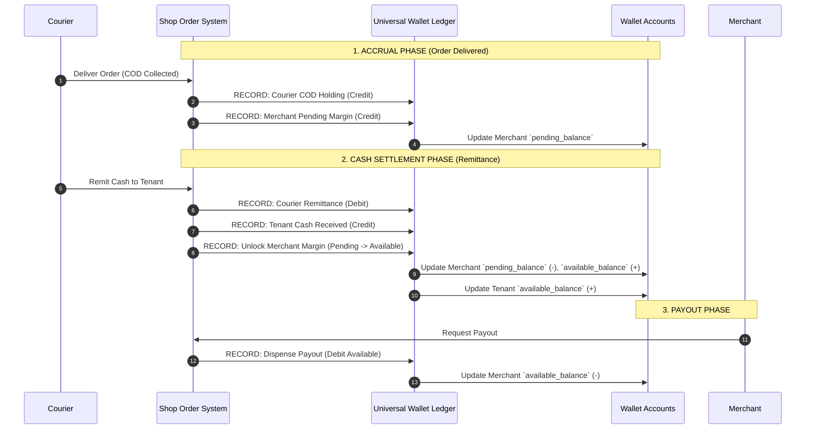
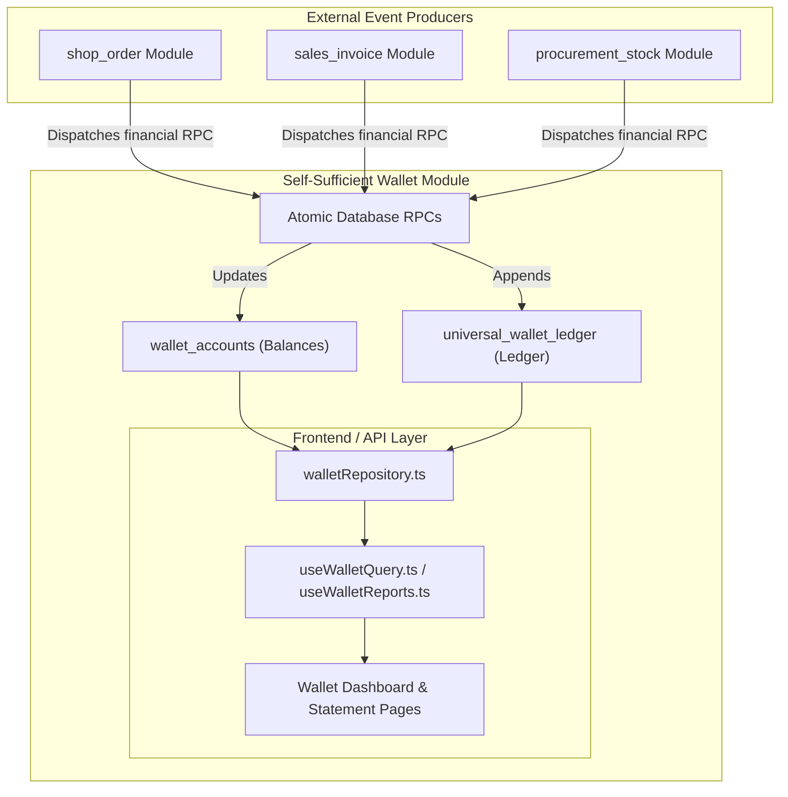

# Universal Wallet & Accounting Module Architecture

## Executive Summary
This document defines the architectural blueprint, database schema, accounting rules, and implementation roadmap for elevating the **Wallet** into a first-class, self-sufficient financial kernel. 

Rather than treating financial ledger transactions as scattered side-effects inside order processing routines, this architecture establishes an isolated, double-entry financial system capable of autonomous balance accounting, reporting, audit trails, and multi-entity reconciliation.

---

## 1. Domain Entities & Perspective-Based Accounting

Balances in the system are strictly **perspective-dependent**. A single financial transaction carries different accounting interpretations based on the entity viewing it.

### Core Entities (`entity_type` + `entity_id`)
* **Tenant / Platform**: Tracks actual bank cash received (`tenant_cash`), overall operational income, and platform liabilities.
* **Merchant / Reseller**: Tracks accrued profit margins, billing profile receivables/payables, and withdrawable balance.
* **Courier**: Tracks Cash-On-Delivery (COD) collected from customers owed to the platform vs. remitted amounts.
* **Customer / Buyer**: Tracks prepaid deposits, store credits, and invoice balances.
* **Vendor / Supplier**: Tracks payables owed for stock procurements.

### Perspective Matrix

| Action / Event | Courier Perspective | Merchant Perspective | Tenant / Platform Perspective |
| :--- | :--- | :--- | :--- |
| **Order Delivered (COD)** | `+COD Holding` (Liability owed to Tenant) | `+Pending Balance` (Accrued margin, non-withdrawable) | `+Accrued Revenue / AR` |
| **Courier Remits Cash** | `-COD Holding` (Settled) | Converts `Pending` $\rightarrow$ `Available Balance` | `+Tenant Bank Cash` (Settled) |
| **Payout Dispensed** | N/A | `-Available Balance` (Paid out) | `-Tenant Cash` (Payout outflow) |

---

## 2. Accrual vs. Cash Accounting Flow



---

## 3. Database Schema Blueprint

### 3.1 Materialized Accounts (`wallet_accounts`)
The `wallet_accounts` table provides $O(1)$ fast balance lookups and bucket isolation.

```sql
CREATE TABLE IF NOT EXISTS wallet_accounts (
  id                BIGINT GENERATED ALWAYS AS IDENTITY PRIMARY KEY,
  tenant_id         BIGINT NOT NULL REFERENCES tenants(id),
  entity_type       TEXT NOT NULL, -- 'tenant', 'customer', 'vendor', 'courier', 'middleman'
  entity_id         BIGINT NOT NULL,
  currency_code     TEXT NOT NULL DEFAULT 'BDT',
  
  -- Three-Bucket Financial Model
  available_balance NUMERIC(18,4) NOT NULL DEFAULT 0.0000,
  pending_balance   NUMERIC(18,4) NOT NULL DEFAULT 0.0000,
  locked_balance    NUMERIC(18,4) NOT NULL DEFAULT 0.0000,
  
  created_at        TIMESTAMPTZ NOT NULL DEFAULT now(),
  updated_at        TIMESTAMPTZ NOT NULL DEFAULT now(),
  
  CONSTRAINT wallet_accounts_entity_currency_key UNIQUE (tenant_id, entity_type, entity_id, currency_code),
  CONSTRAINT wallet_accounts_available_non_negative CHECK (available_balance >= 0)
);
```

### 3.2 Immutable Append-Only Ledger (`universal_wallet_ledger`)
Every financial transaction is recorded as an immutable ledger entry.

```sql
CREATE TABLE IF NOT EXISTS universal_wallet_ledger (
  id            UUID PRIMARY KEY DEFAULT gen_random_uuid(),
  tenant_id     BIGINT NOT NULL REFERENCES tenants(id),
  entity_type   TEXT NOT NULL,
  entity_id     BIGINT NOT NULL,
  type          TEXT NOT NULL CHECK (type IN ('credit', 'debit')),
  amount        NUMERIC(18,4) NOT NULL,
  currency_code TEXT NOT NULL DEFAULT 'BDT',
  exchange_rate NUMERIC(12,6) NOT NULL DEFAULT 1.000000,
  base_amount   NUMERIC(18,4) NOT NULL,
  balance_after NUMERIC(18,4) NOT NULL,
  source_type   TEXT NOT NULL, -- 'shop_order', 'vendor_purchase', 'payout', 'adjustment'
  source_id     TEXT,
  metadata      JSONB DEFAULT '{}'::jsonb,
  created_at    TIMESTAMPTZ NOT NULL DEFAULT now()
);
```

---

## 4. Decoupled Module Architecture

### 4.1 System Boundaries


### 4.2 Architectural Guarantees
1. **Zero Client-Side Balance Mutations**: All balance mutations are performed inside atomic Postgres RPC stored procedures with strict locking (`FOR UPDATE`).
2. **Single Source of Truth**: External modules (`shop_order`, `sales_invoice`) never maintain redundant balance fields; they query or event-trigger the wallet module.
3. **Auditability**: Running ledger balances (`balance_after`) combined with immutable rows guarantee exact historical point-in-time state reconstruction.

---

## 5. Reporting Capabilities

A self-sufficient wallet module exposes the following reporting stubs:

1. **Entity Account Statements**: Date-ranged transaction statement detailing opening balance, credits, debits, section breakdowns, and closing balance.
2. **Cash Flow & Inflow/Outflow Reports**: Real-time aggregated breakdown of platform revenue vs. courier holdings vs. payouts.
3. **Accrual Reconciliation Ledger**: Audit view comparing delivered pending margins against settled cash.
4. **Payout History & Compliance**: Detailed ledger logs for all merchant/middleman withdrawals and bank references.

---

## 6. Migration & Refactoring Strategy

### Phase 1: Database Kernel
* Deploy `wallet_accounts` schema and backfill initial balances from current `universal_wallet_ledger` entries.
* Create server-side aggregation RPCs (`get_wallet_dashboard_summary`, `get_wallet_entity_statement`).

### Phase 2: Frontend & Repository Consolidation
* Move merchant wallet code out of `shop_order` into the unified `web/src/modules/wallet` module.
* Replace client-side ledger iterations in `dropshipFinanceRepository.ts` with calls to server-side wallet RPCs.

### Phase 3: Reporting Hub & Extensibility
* Build `WalletReportsPage.vue` and `useWalletReports.ts` composables.
* Enable CSV exports and historical statement generation.
