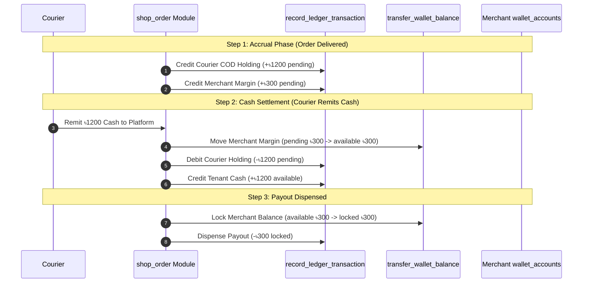

# Accounting & Universal Wallet RPC Integration Guide

## Executive Summary

This guide defines the authoritative contract, usage patterns, and integration rules for interacting with the **Universal Wallet & Accounting Module** from external modules (`shop_order`, `courier_remittance`, `payout_settlement`, `procurement_stock`, `sales_invoice`, etc.).

All financial state mutations **MUST** be executed through atomic PostgreSQL RPC stored procedures to guarantee consistency, row-level locking (`FOR UPDATE`), and immutable audit trails.

---

## 1. Core Financial Concepts

### 3-Bucket State Model (`wallet_accounts`)

Every entity in the system maintains up to 3 isolated financial balance buckets:

| Bucket Name | Description | Common Use Case |
| :--- | :--- | :--- |
| **`available`** | Settled, liquid funds | Withdrawable cash, settled merchant profits, bank cash |
| **`pending`** | Accrued, un-settled funds | Margin on delivered COD orders awaiting courier cash remittance |
| **`locked`** | Reserved, hold funds | Funds locked for active payout requests or dispute holds |

### Entity Types (`entity_type` + `entity_id`)

* **`tenant`**: Platform bank cash and platform operational revenues.
* **`customer`**: Resellers / Merchants / B2B Billing Profiles (accrued profits, withdrawable balances, deposits).
* **`courier`**: Delivery partners (COD collections owed to platform vs. remitted cash).
* **`vendor`**: Stock suppliers (payables owed for procurement).
* **`middleman`**: Affiliates / Sales Reps (commission earnings).

---

## 2. Main RPC Reference

### 2.1 `record_ledger_transaction`

**Purpose**: Appends an immutable transaction log to `universal_wallet_ledger` and atomically updates the specified target bucket in `wallet_accounts`.

#### Signature
```sql
record_ledger_transaction(
  p_tenant_id       BIGINT,
  p_entity_type     TEXT,                  -- 'tenant', 'customer', 'vendor', 'courier', 'middleman'
  p_entity_id       BIGINT,
  p_type            TEXT,                  -- 'credit' or 'debit'
  p_amount          NUMERIC(18,4),
  p_currency_code   TEXT DEFAULT 'BDT',
  p_exchange_rate   NUMERIC(12,6) DEFAULT 1.000000,
  p_source_type     TEXT DEFAULT 'adjustment', -- 'shop_order', 'vendor_purchase', 'payout', 'adjustment', 'bucket_transfer'
  p_source_id       TEXT DEFAULT NULL,
  p_metadata        JSONB DEFAULT '{}'::jsonb,
  p_target_bucket   TEXT DEFAULT 'available' -- 'available', 'pending', 'locked'
) RETURNS JSONB
```

#### Frontend Call Example (`walletRepository.ts`)
```typescript
import { supabase } from 'src/boot/supabase';

const entry = await supabase.rpc('record_ledger_transaction', {
  p_tenant_id: 1,
  p_entity_type: 'customer',
  p_entity_id: 42,
  p_type: 'credit',
  p_amount: 1500.00,
  p_currency_code: 'BDT',
  p_source_type: 'shop_order',
  p_source_id: 'ORD-10024',
  p_metadata: { section: 'payout_earned' },
  p_target_bucket: 'pending'
});
```

---

### 2.2 `transfer_wallet_balance`

**Purpose**: Atomically shifts funds between buckets for a single entity (e.g. converting `pending` $\rightarrow$ `available` upon courier cash remittance, or locking `available` $\rightarrow$ `locked` during payout requests).

#### Signature
```sql
transfer_wallet_balance(
  p_tenant_id     BIGINT,
  p_entity_type   TEXT,
  p_entity_id     BIGINT,
  p_from_bucket   TEXT, -- 'pending', 'available', 'locked'
  p_to_bucket     TEXT, -- 'pending', 'available', 'locked'
  p_amount        NUMERIC(18,4),
  p_currency_code TEXT DEFAULT 'BDT',
  p_notes         TEXT DEFAULT NULL,
  p_metadata      JSONB DEFAULT '{}'::jsonb
) RETURNS JSONB
```

#### Frontend Call Example (`walletAccountRepository.ts`)
```typescript
const updatedAccount = await supabase.rpc('transfer_wallet_balance', {
  p_tenant_id: 1,
  p_entity_type: 'customer',
  p_entity_id: 42,
  p_from_bucket: 'pending',
  p_to_bucket: 'available',
  p_amount: 1500.00,
  p_notes: 'Remittance confirmed by Steadfast Courier',
  p_metadata: { remittance_ref: 'REM-88412' }
});
```

---

### 2.3 `get_wallet_account_balances`

**Purpose**: Retrieves materialized 3-bucket balances (`available`, `pending`, `locked`) and total balance for a specific entity in $O(1)$ lookup time.

#### Signature
```sql
get_wallet_account_balances(
  p_tenant_id     BIGINT,
  p_entity_type   TEXT,
  p_entity_id     BIGINT,
  p_currency_code TEXT DEFAULT 'BDT'
) RETURNS JSONB
```

#### Return Payload
```json
{
  "tenant_id": 1,
  "entity_type": "customer",
  "entity_id": 42,
  "currency_code": "BDT",
  "available_balance": 3500.0000,
  "pending_balance": 1200.0000,
  "locked_balance": 500.0000,
  "total_balance": 5200.0000
}
```

---

### 2.4 `get_wallet_dashboard_summary`

**Purpose**: Computes aggregate financial totals across all entities for platform dashboard metrics.

#### Signature
```sql
get_wallet_dashboard_summary(
  p_tenant_id BIGINT
) RETURNS JSONB
```

---

### 2.5 `get_wallet_entity_statement`

**Purpose**: Generates a date-ranged account statement containing opening balance, total debits, total credits, closing balance, and transaction history.

#### Signature
```sql
get_wallet_entity_statement(
  p_tenant_id   BIGINT,
  p_entity_type TEXT,
  p_entity_id   BIGINT,
  p_start_date  TIMESTAMPTZ DEFAULT NULL,
  p_end_date    TIMESTAMPTZ DEFAULT NULL
) RETURNS JSONB
```

---

## 3. Integration Matrix: When to Use Which RPC

| Lifecycle Event / Action | Source Module | RPC to Call | Parameters & Arguments |
| :--- | :--- | :--- | :--- |
| **Order Delivered (COD Collected)** | `shop_order` | `record_ledger_transaction` | **1. Courier COD Holding**:<br>`entity_type: 'courier'`, `type: 'credit'`, `target_bucket: 'pending'`, `source_type: 'shop_order'`<br><br>**2. Merchant Accrued Margin**:<br>`entity_type: 'customer'`, `type: 'credit'`, `target_bucket: 'pending'`, `source_type: 'shop_order'` |
| **Courier Remits Cash to Tenant** | `courier_remittance` | `transfer_wallet_balance` & `record_ledger_transaction` | **1. Unlock Merchant Margin**:<br>`transfer_wallet_balance(from: 'pending', to: 'available')`<br><br>**2. Courier Settle Holding**:<br>`record_ledger_transaction(entity_type: 'courier', type: 'debit', target_bucket: 'pending')`<br><br>**3. Tenant Bank Cash Received**:<br>`record_ledger_transaction(entity_type: 'tenant', type: 'credit', target_bucket: 'available')` |
| **Merchant Requests Payout** | `payout_settlement` | `transfer_wallet_balance` | Lock funds for payout hold:<br>`entity_type: 'customer'`, `from_bucket: 'available'`, `to_bucket: 'locked'`, `notes: 'Payout requested'` |
| **Payout Dispensed (Bank Trx)** | `payout_settlement` | `record_ledger_transaction` | **1. Deduct Merchant Lock**:<br>`entity_type: 'customer'`, `type: 'debit'`, `target_bucket: 'locked'`, `source_type: 'payout'`<br><br>**2. Deduct Tenant Bank Cash**:<br>`entity_type: 'tenant'`, `type: 'debit'`, `target_bucket: 'available'`, `source_type: 'payout'` |
| **Payout Rejected / Cancelled** | `payout_settlement` | `transfer_wallet_balance` | Release lock back to available balance:<br>`entity_type: 'customer'`, `from_bucket: 'locked'`, `to_bucket: 'available'` |
| **Stock Procurement Received** | `procurement_stock` | `record_ledger_transaction` | Record supplier payable:<br>`entity_type: 'vendor'`, `type: 'credit'`, `target_bucket: 'available'`, `source_type: 'vendor_purchase'` |
| **Vendor Payment Made** | `vendor` | `record_ledger_transaction` | **1. Settle Supplier Payable**:<br>`entity_type: 'vendor'`, `type: 'debit'`, `target_bucket: 'available'`<br><br>**2. Tenant Outflow**:<br>`entity_type: 'tenant'`, `type: 'debit'`, `target_bucket: 'available'` |

---

## 4. Integration Workflow Examples

### 4.1 Complete Dropship Accrual & Remittance Sequence



---

## 5. Architectural Rules for Developers

1. **No Direct Balance Mutations**: Never write raw SQL `UPDATE billing_profiles SET balance = ...` or `UPDATE shop_orders SET ...`. Always call backend RPCs.
2. **Single Source of Truth**: Balance numbers shown in UI headers, order cards, or merchant profile sheets MUST read from `wallet_accounts` via `useWalletAccounts()` or `get_wallet_account_balances` RPC.
3. **Optimistic UI Updates**: When triggering a payout or manual adjustment, use TanStack Vue Query cache invalidation (`queryClient.invalidateQueries({ queryKey: walletQueryKeys.all })`) to refresh local component states without page reloads.
