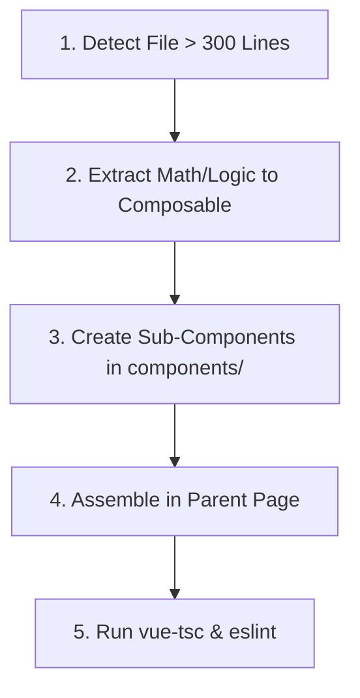

# Component Modularization & Refactoring Guide

> **TL;DR Quick Rules for AI Agents & Developers:**
> 1. **Size Limit:** Max **300 lines** per `.vue` page. Max **150 lines** per sub-component.
> 2. **Rule of 3:** If a single file contains >3 distinct visual blocks (e.g. Header, Table, Summary, Modals), extract each block into `components/`.
> 3. **No Math in Template:** Move calculations & state logic into custom composables (`composables/`).
> 4. **Parent is Container:** Parent page handles routes, query calls, and layout grid. Sub-components receive props.
> 5. **Token Efficiency:** Editing 100-line components costs ~87% fewer context tokens and runs 4x faster.

---

## 📏 Size & Responsibilities Reference

| File Type | Location | Target Lines | Max Lines | Responsibilities |
| :--- | :--- | :--- | :--- | :--- |
| **Parent Page** | `pages/[PageName].vue` | **150 – 180** | **250** | Route orchestrator, TanStack Query calls, layout grid |
| **Sub-Component** | `components/[PagePrefix][Section].vue` | **80 – 150** | **200** | Visual presentational block, explicit `defineProps` & `defineEmits` |
| **Composable** | `composables/use[Feature].ts` | **50 – 120** | **180** | Pure business math, reactive refs, formatting utilities |

---

## ⚡ 5-Step Low-Context Refactoring Checklist



- [ ] **Step 1: Audit Boundaries** — Identify visual sections (Header, Items Table, Financial Summary, Shipping Card, Modals).
- [ ] **Step 2: Extract Composables** — Move non-UI calculations, refs, and watch blocks to `composables/use[Feature].ts`.
- [ ] **Step 3: Build Sub-Components** — Create `components/[PagePrefix][Section].vue` with explicit TypeScript props.
- [ ] **Step 4: Connect Parent** — Replace template sections in `pages/[PageName].vue` with child components.
- [ ] **Step 5: Verify** — Run `npx vue-tsc --noEmit` and `npx eslint src/modules/[module]/`.

---

## 📂 Standard File Structure Pattern

```text
src/modules/[module_name]/
├── pages/
│   └── CustomerOrderDetailPage.vue       (Container Page: ~170 lines)
├── components/
│   ├── CustomerOrderHeader.vue           (Header & Status chips: ~160 lines)
│   ├── CustomerOrderItemsList.vue        (Items list & Counter form: ~160 lines)
│   ├── CustomerOrderSummaryCard.vue      (Pricing summary & profit math: ~165 lines)
│   └── CustomerOrderShippingCard.vue     (Shipping details: ~50 lines)
└── composables/
    └── useShopOrderDetailQuery.ts        (TanStack Query composable: ~80 lines)
```

---

## 💻 Compact Code Template

### 1. Child Component (`components/CustomerOrderShippingCard.vue`)
```vue
<script setup lang="ts">
defineProps<{ order: any }>();
</script>

<template>
  <q-card flat bordered class="details-card">
    <q-card-section class="q-px-lg q-py-md text-body2 text-grey-8">
      <div class="text-weight-bold text-grey-9">{{ order.recipient_name }}</div>
      <div>{{ order.recipient_phone }}</div>
      <div class="q-mt-sm text-grey-6 bg-grey-1 q-pa-sm rounded-borders">{{ order.shipping_address }}</div>
    </q-card-section>
  </q-card>
</template>

<style scoped>
.details-card { border-radius: 14px; background: #fff; }
</style>
```

### 2. Parent Container (`pages/CustomerOrderDetailPage.vue`)
```vue
<script setup lang="ts">
import { computed } from 'vue';
import { useRoute } from 'vue-router';
import { useShopOrderDetailQuery } from '../composables/useShopOrderDetailQuery';
import CustomerOrderHeader from '../components/CustomerOrderHeader.vue';
import CustomerOrderSummaryCard from '../components/CustomerOrderSummaryCard.vue';
import CustomerOrderShippingCard from '../components/CustomerOrderShippingCard.vue';

const route = useRoute();
const orderId = computed(() => Number(route.params.id || 0));
const { data: orderDetailsData, isLoading } = useShopOrderDetailQuery(orderId);
const currentOrder = computed(() => orderDetailsData.value?.order || null);
</script>

<template>
  <q-page class="q-pa-md">
    <q-spinner v-if="isLoading" color="primary" size="40px" />
    <div v-else-if="currentOrder" class="bw-page__stack">
      <CustomerOrderHeader :order="currentOrder" />
      <div class="row q-col-gutter-lg">
        <div class="col-xs-12 col-md-4">
          <CustomerOrderSummaryCard :order="currentOrder" />
          <CustomerOrderShippingCard :order="currentOrder" />
        </div>
      </div>
    </div>
  </q-page>
</template>
```

---

## 📊 Token & Performance Comparison

| Metric | Monolithic 700-line File | Modular 150-line File | Advantage |
| :--- | :--- | :--- | :--- |
| **Context Window Consumption** | ~12,500 tokens / request | ~1,600 tokens / request | **87% Token Savings** |
| **AI Processing Speed** | ~45 seconds / edit | ~10 seconds / edit | **4.5x Faster Execution** |
| **Bug Risk & Side Effects** | High (accidental edits to unrelated sections) | Low (isolated component contracts) | **Zero Regression** |
