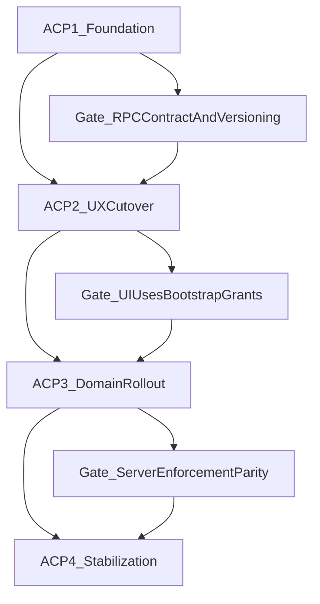

# Permission System Phased Breakdown Update

## Objective
Refine the permission implementation plan in [doc/PERMISSION_SYSTEM.md](/Users/daviditc/Documents/Personal Project/brandwala-wholesale-quasar-v2/doc/PERMISSION_SYSTEM.md) so each phase explicitly answers:
- what to do
- what files/components change
- what DB/RPC/frontend artifacts must be delivered
- what exit checks confirm completion

## Scope Assumption
- Keep existing architecture/decisions in sections `17` and `17A`.
- Replace or expand the current phase breakdown with a stricter execution playbook (no behavior redesign).

## Proposed Plan Structure (inside `doc/PERMISSION_SYSTEM.md`)
- Add/refresh a section immediately under `17A.5` as: `17A.6 Implementation Playbook (Detailed Change List)`.
- For each phase, use a fixed template:
  - **Goal**
  - **Implementation Tasks (ordered)**
  - **Required Changes** (`DB migrations`, `SQL functions/RPC`, `backend types/contracts`, `frontend/auth+UI`, `RLS/policies`)
  - **Dependencies / sequencing gates**
  - **Exit Criteria**
  - **Rollback/Safety notes** (where relevant)

## Phase Breakdown To Add

### Phase AC-P1 — Foundation and Contract Hardening
- Detail schema work (`tenant_permission_versions`, uniqueness/integrity constraints, last-admin guard constraints/triggers/RPC checks).
- Enumerate SQL function updates (`has_module_action`, role detail/read APIs, version bump helper).
- Enumerate RPC write-path requirements (every mutation bumps permission version in same transaction).
- Define bootstrap contract additions (`permissionVersion`, scoped grants, role ids, custom markers).
- Define exact validation checks for cross-tenant/scope-safe assignment and module disable dependencies.

### Phase AC-P2 — Access Control Admin UX Cutover
- Detail frontend module introduction (`access_control` routes + nav wiring).
- Detail deprecation/removal mapping of old settings entry points.
- Detail role matrix behavior constraints (active modules only, configurable actions only, platform filtered).
- Detail assignment/override UX requirements for app members + customer-group members, including custom badge logic.
- Detail auth store/session freshness behavior expectations in UI runtime.

### Phase AC-P3 — Domain Rollout and Server Enforcement
- Convert each domain batch into repeatable checklist steps:
  1) seed/verify `module_actions`
  2) migrate RLS/RPC authorization to `has_module_action`
  3) expose/validate UI configurability
  4) run scope matrix smoke checks
- Keep rollout order but add phase gates and fallback strategy per domain.
- Explicitly define done criteria as parity between UI grants and server enforcement.

### Phase AC-P4 — Stabilization and Legacy Cleanup (new)
- Document post-rollout cleanup tasks:
  - remove remaining runtime `MODULE_PERMISSION_MATRIX` dependencies
  - remove deprecated settings routes/components
  - lock down direct table access patterns (RPC-only)
  - reconcile docs (`LOGIN_NAV_PERMISSION_FLOW.md`, `MASTER_PLAN.md`, `SHOP_ORDER.md` references)
- Add final verification checklist and release-readiness criteria.

## Cross-Phase Tracking Additions
- Add a compact “deliverables checklist” block per phase with artifact-style IDs (`AC-P1-D1`, etc.).
- Add a “blocking issues” subsection documenting hard blockers that prevent starting the next phase.
- Add a single mermaid flowchart to show phase dependencies and handoff gates.

## Implementation Notes For Editing Pass
- Keep existing historical stage notes (`PERM P1–P3`) intact, but make the new breakdown the execution source of truth.
- Preserve existing terminology and table/function names to avoid drift.
- Keep wording imperative and checklist-driven so implementation agents can execute phase-by-phase without reinterpretation.
