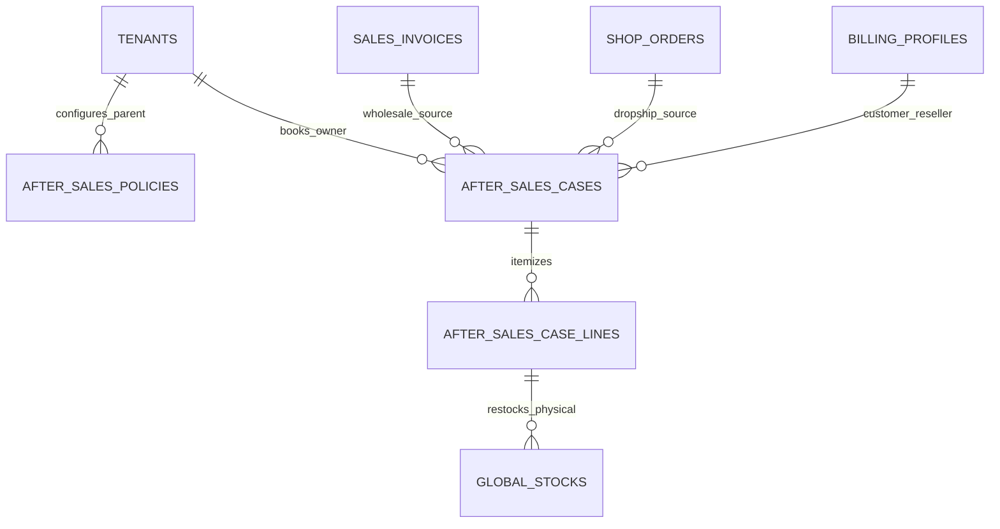

# After-Sales & Returns — Data Model & Schema Specification

> **Module Schema Target**: `supabase/schemas/after_sales/` or `supabase/schemas/sales_invoice/`  
> **Source Tables**: `after_sales_policies`, `after_sales_cases`, `after_sales_case_lines`

---

## 1. Entity Relationship Diagram



---

## 2. Declarative SQL Schema & Types

### 2.1 Domain Enums

```sql
-- After-sales program categories
create type public.after_sales_program as enum (
  'return_credit',
  'doa',
  'replacement',
  'warranty'
);

-- Case resolution outcomes
create type public.after_sales_outcome as enum (
  'pending',
  'credit',
  'replace',
  'repair',
  'reject'
);

-- RMA lifecycle status
create type public.after_sales_status as enum (
  'draft',
  'pending_approval',
  'approved',
  'awaiting_receipt',
  'received',
  'inspecting',
  'executing',
  'closed',
  'rejected'
);
```

### 2.2 Primary Database Tables

```sql
-- 1. Parent Configurable Policies
create table if not exists public.after_sales_policies (
  id uuid primary key default gen_random_uuid(),
  parent_tenant_id uuid not null references public.tenants(id) on delete cascade,
  program public.after_sales_program not null,
  window_days int not null default 7,
  window_anchor text not null default 'invoice_date', -- 'invoice_date' or 'delivery_date'
  allowed_outcomes public.after_sales_outcome[] not null default '{credit}',
  restock_fee_type text not null default 'none', -- 'none', 'percent', 'flat_bdt'
  restock_fee_value numeric(12, 2) default 0,
  requires_approval boolean not null default false,
  approval_threshold_bdt numeric(14, 2) default 0,
  is_active boolean not null default true,
  created_at timestamptz not null default now(),
  constraint uq_parent_program unique (parent_tenant_id, program)
);

-- 2. After-Sales Case (RMA) Header
create table if not exists public.after_sales_cases (
  id uuid primary key default gen_random_uuid(),
  parent_tenant_id uuid not null references public.tenants(id) on delete cascade,
  operating_tenant_id uuid references public.tenants(id) on delete set null,
  case_no text not null,
  status public.after_sales_status not null default 'draft',
  source_channel text not null, -- 'wholesale' or 'dropship'
  program public.after_sales_program not null,
  reason_code text not null, -- 'unused', 'wrong_item', 'doa', 'warranty', 'defect'
  
  -- Document Sources
  sales_invoice_id uuid references public.sales_invoices(id) on delete set null,
  shop_order_id uuid references public.shop_orders(id) on delete set null,
  billing_profile_id uuid references public.billing_profiles(id) on delete set null,
  
  -- Dropship External Intake Metadata
  intake_source text, -- 'phone', 'whatsapp', 'in_person', 'email'
  reported_to text, -- 'company', 'merchant'
  reporter_name text,
  reporter_phone text,
  intake_note text,
  
  -- Immutable Policy Snapshot
  policy_snapshot jsonb not null default '{}'::jsonb,
  
  approved_by uuid references auth.users(id),
  closed_at timestamptz,
  created_by uuid references auth.users(id),
  created_at timestamptz not null default now(),
  constraint uq_case_no_per_tenant unique (parent_tenant_id, case_no)
);

-- 3. Case Itemized Line Items
create table if not exists public.after_sales_case_lines (
  id uuid primary key default gen_random_uuid(),
  case_id uuid not null references public.after_sales_cases(id) on delete cascade,
  sales_invoice_item_id uuid references public.sales_invoice_items(id) on delete set null,
  shop_order_item_id uuid references public.shop_order_items(id) on delete set null,
  requested_quantity numeric(12, 3) not null check (requested_quantity > 0),
  received_quantity numeric(12, 3) default 0,
  outcome public.after_sales_outcome not null default 'pending',
  restock_fee_amount numeric(14, 2) default 0,
  replacement_stock_id uuid references public.global_stocks(id) on delete set null,
  notes text,
  created_at timestamptz not null default now()
);
```

---

## 3. Row Level Security (RLS) Policies

```sql
alter table public.after_sales_policies enable row level security;
alter table public.after_sales_cases enable row level security;
alter table public.after_sales_case_lines enable row level security;

create policy "Staff can view tenant after-sales cases"
  on public.after_sales_cases for select
  using (
    parent_tenant_id in (
      select tm.tenant_id from public.tenant_members tm where tm.user_id = auth.uid()
    )
  );
```
