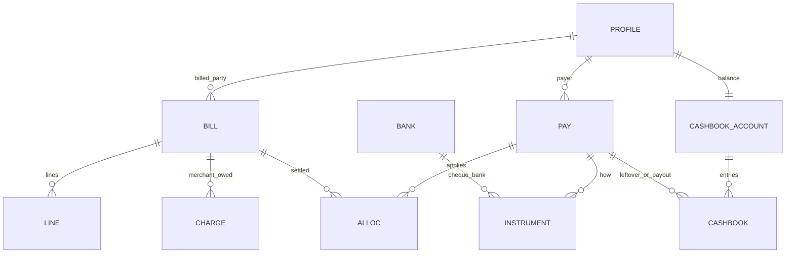
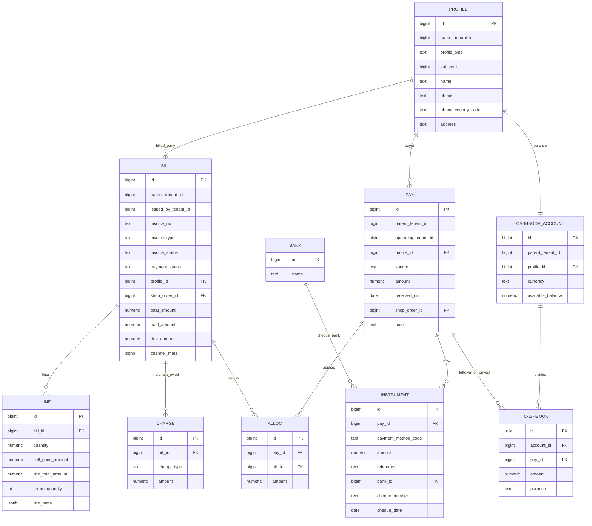

# Bills & pays — data model

Live SQL still uses old names (map below). Gaps: [00-gaps](00-gaps.md) BP3–BP4. Spec names are **target**.

Not on this ERD: delivery paper (procurement **Delivery paper** desk); **shop_order** — optional `shop_order_id` on bill/pay. `draft` / `proforma_generated` = maybe-bill, not issued.

---

## Rename map (spec → live)

| Spec table | Live today |
| :--- | :--- |
| `profiles` | `billing_profiles` |
| `bills` | `sales_invoices` |
| `bill_lines` | `sales_invoice_items` |
| `bill_charges` | `sales_invoice_charges` |
| `pays` | `global_payments` |
| `pay_instruments` | `global_payment_instruments` |
| `pay_allocations` | `invoice_payments` |
| `cashbook_accounts` | `wallet_accounts` |
| `cashbook_entries` | `universal_wallet_ledger` |
| `banks` | `bd_banks` |

FKs: `profile_id` (live `billing_profile_id`); allocations `bill_id` (live `invoice_id`). There is **no wallet product**. Ledger RPCs keep old names until BP4.

---

## 1. ERD

Short names = spec tables ([rename map](#rename-map-spec--live)). Columns on the details boxes (no timestamps).

Pay **out** writes CASHBOOK (tenant + party). Not ALLOC. AP vendor/cargo bills later ([WA15](00-gaps.md)).

**Not here:** `recipient_profiles` (delivery). `customer_groups` until [BP3](00-gaps.md). `shop_orders` — optional `shop_order_id` on BILL / PAY only.

### Overview

### Details

---

## Profile (`profiles`)

One party row. Bills, pays, cashbook hang off **`profile_id`**. Not `customer_groups`.

| `profile_type` | `subject_id` | Use |
| :--- | :--- | :--- |
| `tenant` | `tenants.id` | Our letterhead / “us” |
| `customer` | group id today; later self | AR buyer **and** dropship shop (reseller) |
| `vendor` / `cargo` | vendor or cargo id | AP later ([WA15](00-gaps.md)) |
| `courier` | `courier_services.wallet_entity_id` | COD cashbook entity id (not UUID `id`) |
| `company` | — | Only if product needs a split from `customer`. Prefer `customer`. |

**Live:** `profiles` + party sync (`20271001120000_profiles_table.sql`, `20271001130000_profile_party_sync_triggers.sql`, `20271001140000_drop_vendor_cargo_tenant_id.sql`). **Customer:** `billing_profiles` → `profiles` (same `id`). **Vendor / cargo:** party row keyed by `parent_tenant_id` + `subject_id` (vendors/cargo tables no longer carry `tenant_id`). **Courier / tenant:** `upsert_profile_for_party` via triggers. **Customer hub fields:** `customer_groups` update → `profiles` via `billing_profiles` link. Bills/pays still FK `billing_profile_id` until cutover.

**Target:** `parent_tenant_id` only; `unique (parent_tenant_id, profile_type, subject_id)`; phone unique per books when `is_phone_unique`. Recipient stays its own table.

---

## Bill kinds (`bills`)

Same table. Different paper. Never mix with packing slip / delivery paper / COD face.

| Kind | `invoice_type` / meta | Who | Issued when | Sales |
| :--- | :--- | :--- | :--- | :--- |
| Take | wholesale/retail + take | Buyer | Walk-in now, or after delivery paper | At issue |
| Condition | wholesale + condition | Buyer | After paper; stock may stay `held` | When **paid** |
| Dropship merchant | `dropship` | Shop profile | At ship | Issued merchant total |
| AP | later | Vendor / cargo | WA15 | Not AR |
| Proforma | `proforma_generated` | — | Composer / Delivery paper | **No** — not issued |

Statuses: `draft`, `proforma_generated`, `issued`, `voided`. Never `posted`. Payment: `due`, `partially_paid`, `paid`, `settled_with_write_off`.

`total_amount` = subtotal − discount + charges. Lines = tenant sell only (no cost columns on the bill). GP = shipment P&L ([reporting 01](../reporting_treasury/01-prd.md)). Charges = merchant-owed only. `channel_meta` = recipient / COD / `delivery_kind` — not sales.

**Dropped:** `sales_invoice_item_costs` — do not store per-line cost on the bill ([SI5](00-gaps.md)).

---

## Pay

| Layer | Spec | Job |
| :--- | :--- | :--- |
| Header | `pays` | One visit. Amount = instruments. Dropship = **net bank in**. |
| Instruments | `pay_instruments` | cash / cheque (`banks`) / bKash |
| Allocation | `pay_allocations` | Apply to **open bills** only. Sum ≤ header. |

**Pay in** sources: cash, bank, store credit (cashbook), courier remittance. **Pay out:** merchant now; vendor later. Pay out = cashbook, not ALLOC.

COD face is not a pay. Cheque bounce = reversing pay ([WA13](00-gaps.md)).

---

## Cashbook (not a wallet)

Account per `(parent_tenant_id, profile, currency)`. **Only** `record_ledger_transaction` (live name until BP4).

| Party on account | Meaning |
| :--- | :--- |
| Tenant | Operating cash |
| Customer / shop | Leftover we owe them (credit / merchant payable) |
| Courier | COD they hold at deliver; down at remittance |
| Investor | Capital |
| Vendor / cargo | AP leftover later |

**Rule:** open bill due = they owe us. Pay minus ALLOC = leftover on that **profile** cashbook = we owe them. Next collect may apply leftover. Pay out settles cashbook.

Vendor cheaper stock today = shipment **outcomes** (cost). Not cashbook. Not a customer bill.

---

## Leftover examples

**Customer extra cash.** Take bill 15,000. Pay 20,000. ALLOC 15,000. Cashbook customer **+5,000**. No second bill.

**Dropship.** Merchant bill 1,500. Bank 2,120. ALLOC 1,500. Cashbook shop **+620**. Pay out 620 later. No ALLOC on payout. COD 2,200 is courier cashbook at deliver, not the bill.

**Vendor credit.** Live: outcome/cost only. Target: vendor profile + AP bill and/or cashbook. Never a take bill.

Numbers: [money-story](money-story.md).
