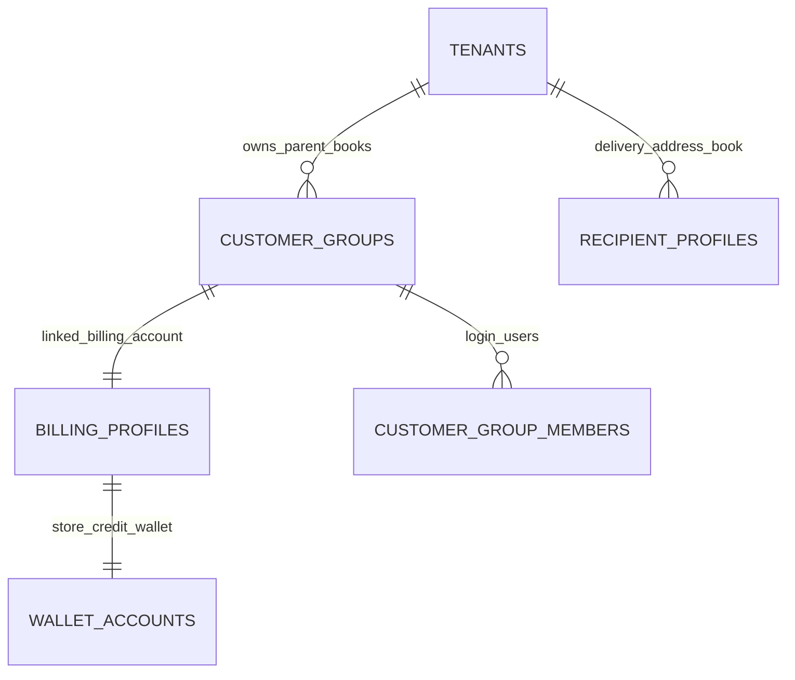

# Customer Hub — Data Model & Schema Specification

> **Module Schema Target**: `supabase/schemas/customer/` or `supabase/schemas/tenants/`  
> **Source Tables**: `customer_groups`, `billing_profiles`, `customer_group_members`, `recipient_profiles`

---

## 1. Entity Relationship Diagram



---

## 2. Declarative SQL Schema & Types

### 2.1 Domain Enums

```sql
-- Storefront member permission roles inside customer group
create type public.customer_group_role as enum (
  'admin',
  'manager',
  'staff'
);
```

### 2.2 Primary Database Tables

```sql
-- 1. B2B Customer Groups (Parent Books Owned)
create table if not exists public.customer_groups (
  id uuid primary key default gen_random_uuid(),
  parent_tenant_id uuid not null references public.tenants(id) on delete cascade,
  name text not null,
  accent_color text not null default '#2563EB',
  is_active boolean not null default true,
  deleted_at timestamptz,
  created_at timestamptz not null default now(),
  updated_at timestamptz not null default now(),
  constraint uq_group_name_per_parent unique (parent_tenant_id, name)
);

-- 2. Billing Profiles (Financial Counterparty)
create table if not exists public.billing_profiles (
  id uuid primary key default gen_random_uuid(),
  parent_tenant_id uuid not null references public.tenants(id) on delete cascade,
  customer_group_id uuid unique references public.customer_groups(id) on delete set null,
  name text not null,
  phone_country_code text not null default '+880',
  phone text not null,
  email text,
  address text,
  credit_limit numeric(14, 2) default 0,
  created_at timestamptz not null default now(),
  updated_at timestamptz not null default now(),
  constraint uq_phone_per_parent unique (parent_tenant_id, phone_country_code, phone)
);

-- 3. Customer Group Storefront Login Members
create table if not exists public.customer_group_members (
  id uuid primary key default gen_random_uuid(),
  customer_group_id uuid not null references public.customer_groups(id) on delete cascade,
  user_id uuid references auth.users(id) on delete set null,
  email text not null,
  name text not null,
  role public.customer_group_role not null default 'staff',
  is_active boolean not null default true,
  created_at timestamptz not null default now(),
  constraint uq_member_email_per_group unique (customer_group_id, email)
);

-- 4. Recipient Delivery Profiles
create table if not exists public.recipient_profiles (
  id bigint primary key generated always as identity,
  tenant_id bigint references public.tenants(id) on delete set null,
  parent_tenant_id bigint references public.tenants(id) on delete set null,
  name text not null,
  phone text not null,
  secondary_phone text,
  address text not null,
  district text,
  thana text,
  addresses jsonb not null default '[]'::jsonb,
  created_at timestamptz not null default now(),
  updated_at timestamptz not null default now()
);

-- Trigger: auto-set parent_tenant_id from tenants.parent_id or tenant_id
create trigger trg_recipient_profiles_set_parent_tenant_id
  before insert or update of tenant_id on public.recipient_profiles
  for each row execute function public.set_parent_tenant_id_from_tenant();
```

---

## 3. Row Level Security (RLS) & Parent Tenant Rules

- **Child Tenant Mode**: Queries and payloads use `tenant_id = active_tenant_id`.
- **Parent Tenant Mode**:
  - **Queries**: Filter strictly by `parent_tenant_id = parent_tenant_id` (do not send `tenant_id`).
  - **Payloads / Upserts**: Omit `tenant_id` and send `parent_tenant_id` only (`tenant_id` is stored as `null`).
- **Tenant Name Resolution**: When viewed by a parent workspace, `tenants:tenant_id(name)` is joined so each recipient profile shows the issuing child tenant name (`tenant_name`), with interactive child tenant dropdown filtering in the UI.

```sql
alter table public.recipient_profiles enable row level security;

create policy "recipient_profiles_select" on public.recipient_profiles
  for select to authenticated using (
    public.has_active_tenant_membership(tenant_id)
    or (parent_tenant_id is not null and (
      public.has_active_tenant_membership(parent_tenant_id)
      or public.user_can_manage_parent_tenant(parent_tenant_id)
    ))
  );
```
