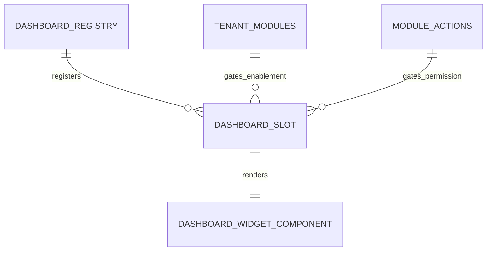

# Dashboard & Insights — Data Model & Schema Specification

> **Module Schema Target**: Read-Side Aggregated Views & Dashboard Slot Contracts  
> **Source Functions**: `get_procurement_dashboard_metrics`, `get_sales_invoice_dashboard_metrics`, `get_customer_dashboard_summary`

---

## 1. Entity & Slot Architecture



---

## 2. TypeScript Slot Definition & Registry Contract

```typescript
export type DashboardSlotKind = 'section' | 'stat' | 'attention' | 'shortcut';

export interface DashboardSlot {
  id: string;
  kind: DashboardSlotKind;
  order: number;
  parentGroupKey?: string;
  activeModuleKey?: string;
  requiredAction?: 'view' | 'create' | 'edit' | 'manage';
  component: () => Promise<any>;
  title?: string;
  subtitle?: string;
  isStub?: boolean;
}
```

---

## 3. Customer Dashboard Response Schema

```json
{
  "tenant_id": "3fa85f64-5717-4562-b3fc-2c963f66afa6",
  "customer_group_id": "7fa85f64-5717-4562-b3fc-2c963f66af10",
  "order_glance": {
    "buckets": {
      "needs_you": 2,
      "in_progress": 5,
      "done": 28,
      "total": 35
    },
    "segments": {
      "needs_you": 2,
      "in_progress": 5,
      "delivered": 20,
      "paid": 8
    }
  },
  "recent_orders": [
    {
      "id": "ord-001",
      "order_no": "ORD-202609-1001",
      "status": "in_transit",
      "total_amount": 14500.00,
      "created_at": "2026-09-17T10:00:00Z"
    }
  ]
}
```
