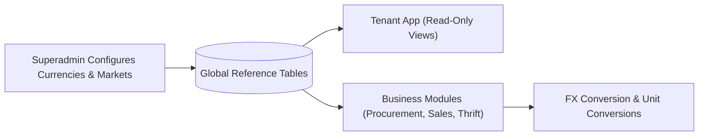
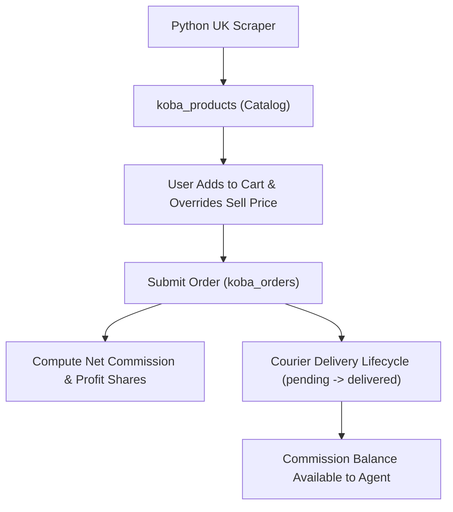
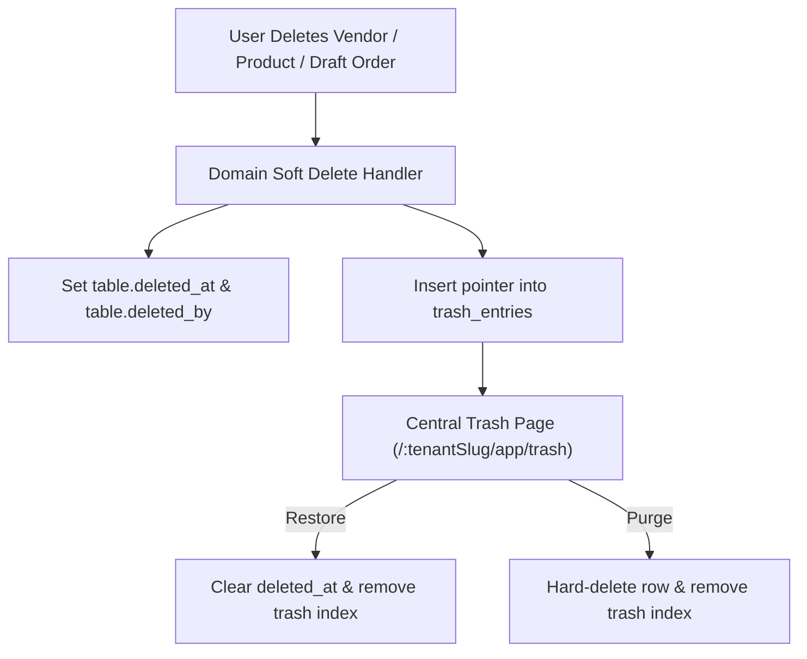

# Global Reference, Koba Vertical & Central Trash — PRD

## As-built

| | |
| :--- | :--- |
| Spec | `docs/features/global_reference/` |
| UI | `web/src/modules/global_reference/`, `global/`, `tag/`, `koba/` |
| SQL | Mostly `public.sql`; stubs `global_reference/`, `tag/` |
| K-beauty | Code name **Koba** — `web/src/modules/koba/`, tables `koba_*`. Not `global_stocks`. |
| Access | Superadmin for catalogs; `app`/`shop` for Koba (`koba_retail` / `koba_wholesale`) |

## Scope

| | |
| :--- | :--- |
| Surfaces | `platform` catalogs; `app` + `shop` Koba; `app` trash |
| In | Currencies, markets, payment methods, **BD banks**, units; `koba_*`; `trash_entries` |
| Out | `global_stocks`, thrift SKUs, wholesale invoices |

See [scopes](../../architecture/scopes.md).

## 1. Executive Summary & Vision
The **Global Reference, Koba Sourcing Vertical & Central Trash Management** domain provides foundational reference catalogs, vertical cross-border sourcing capabilities, and cross-platform soft-delete recovery mechanisms for TradeFlow BD. It unifies:
1. **Global Reference Catalogs**: System-wide reference master data (currencies, geographic markets, payment methods, and units of measure) shared across all tenant environments without domain cross-pollution.
2. **Koba Sourcing & Commerce Vertical**: A specialized UK cross-border product sourcing and fulfillment engine featuring automated catalog scraping, commission/profit-sharing formulas, customer profiling, and multi-channel order processing (staff app and customer storefront).
3. **Central Trash & Soft Delete System**: A tenant-partitioned directory index (`trash_entries`) providing instant search, safe audit trail restoration, and 30-day retention purge capabilities for business records without running costly multi-table `UNION ALL` queries.

---

## 2. Business Architecture & Sub-Domains

### 2.1 Global Reference Data
- **Platform Scope Superadmin Control**: Superadmins maintain authoritative global currency rates, geographic market boundaries, payment method scopes, and standard measurement units.
- **Tenant Scope Read-Only Consumption**: Tenants consume global reference data seamlessly in drop-downs and pricing calculation engines without direct schema modification permissions.
- **Module Gating**: Granular submodule permissions (`global_reference_currency`, `global_reference_market`, `global_reference_payment_method`, `global_reference_bd_bank`, `global_reference_unit_of_measure`) dictate sidebar link visibility and tenant views.

### 2.2 Koba Cross-Border Vertical
- **UK Product Scraping Pipeline**: External Python automation scrapes UK retail catalogs into `koba_products` with rich media, exchange rates, and base GBP list pricing.
- **Dynamic Retail Profit & Commission Engine**: Computes user profit shares, company profit shares, COD deductions, packaging fees, and net commission authoritatively per tenant configuration (`koba_retail_settings`).
- **Customer CRM & Repeat Buyer Profiling**: Real-time lookup by phone number tracking customer delivery success rates, total spend, return frequency, and default courier addresses.
- **Dual-Surface Commerce**: Accessible via Staff Cart (`/:tenantSlug/app/koba/retail/cart`) and Customer Storefront (`/:tenantSlug/shop/koba/retail/cart`).

### 2.3 Central Soft Delete & Trash Hub
- **Universal Deletion Hook**: Master records and transactional drafts trigger soft deletion (`deleted_at = now()`, `deleted_by = actor`), simultaneously creating a lightweight pointer in `trash_entries`.
- **Central Recovery Hub**: Unified view at `/:tenantSlug/app/trash` with entity-type filtering, search, single-click restoration, and permanent purge options.
- **Immutable Financial Protection**: Strict rule enforcement preventing financial ledger items, posted invoices, and active global shipments from ever being soft-deleted into trash.

---

## 3. User Personas & Permissions

| Persona | Scope | Key Capabilities |
| :--- | :--- | :--- |
| **Platform Superadmin** | Global (`/platform/*`) | Manage currency rates, create markets, configure payment methods, maintain BD bank list, define units of measure. |
| **Tenant Admin** | Tenant (`/app/*`) | Configure Koba retail commission settings, restore trashed catalog items, manage staff orders. |
| **Sales & Operations Staff** | Tenant (`/app/*`) | Search Koba catalog, build staff cart orders, verify customer delivery addresses, view global references. |
| **Storefront Customer** | Public Shop (`/shop/*`)| Browse Koba products, build cart, place COD/online orders, track fulfillment status. |

---

## 4. Key Workflows & User Journeys

### 4.1 Global Reference Consumption

### 4.2 Koba Commerce & Commission Workflow

### 4.3 Central Soft Delete & Restore Flow

---

## 5. Non-Functional Requirements & Governance
- **Performance**: Central trash list must query against the single indexed `trash_entries` table with sub-50ms latency regardless of underlying table counts.
- **Data Integrity**: Soft-delete restoration must verify unique key constraints before clearing `deleted_at`.
- **Security & RLS**: All tenant operations strictly isolated by `tenant_id`; global references accessible via public read RLS with superadmin write restrictions.
