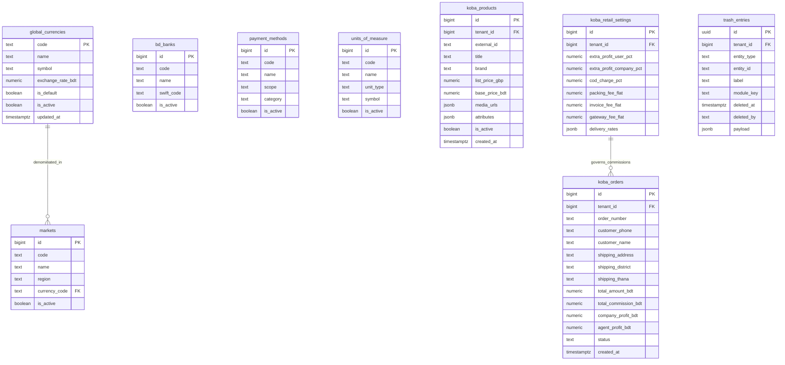

# Global Reference, Koba Vertical & Central Trash — Data Model

## 1. Entity-Relationship Overview

---

## 2. Table Schemas & Definitions

### 2.1 `global_currencies`
Global currency reference master table (system-wide).

| Column | Type | Constraints | Description |
| :--- | :--- | :--- | :--- |
| `code` | `text` | `PRIMARY KEY` | ISO 3-letter currency code (e.g. `USD`, `GBP`, `BDT`). |
| `name` | `text` | `NOT NULL` | Currency display name (e.g., British Pound, US Dollar). |
| `symbol` | `text` | `NOT NULL` | Currency symbol (e.g., `£`, `$`, `৳`). |
| `exchange_rate_bdt`| `numeric(12,4)` | `NOT NULL, DEFAULT 1.0` | Exchange rate relative to base BDT currency. |
| `is_default` | `boolean` | `NOT NULL, DEFAULT false` | Indicates platform default currency (`BDT`). |
| `is_active` | `boolean` | `NOT NULL, DEFAULT true` | Active toggle for dropdown availability. |
| `updated_at` | `timestamptz` | `DEFAULT now()` | Last rate update timestamp. |

### 2.2 `markets`
Geographic trading regions and source market origins.

| Column | Type | Constraints | Description |
| :--- | :--- | :--- | :--- |
| `id` | `bigint` | `PRIMARY KEY GENERATED ALWAYS AS IDENTITY` | Internal market ID. |
| `code` | `text` | `NOT NULL, UNIQUE` | Market identifier (e.g. `UK`, `US`, `CN`, `BD`). |
| `name` | `text` | `NOT NULL` | Market name (e.g., United Kingdom, China). |
| `region` | `text` | `NULL` | Geographic continent/region grouping (e.g., Europe, Asia). |
| `currency_code` | `text` | `REFERENCES global_currencies(code)` | Primary operating currency for the market. |
| `is_active` | `boolean` | `NOT NULL, DEFAULT true` | Active status indicator. |

### 2.3 `payment_methods`
Platform-wide payment channels and checkout options.

| Column | Type | Constraints | Description |
| :--- | :--- | :--- | :--- |
| `id` | `bigint` | `PRIMARY KEY GENERATED ALWAYS AS IDENTITY` | Internal payment method ID. |
| `code` | `text` | `NOT NULL, UNIQUE` | Unique identifier (e.g. `cod`, `bkash`, `bank_transfer`, `card`). |
| `name` | `text` | `NOT NULL` | Display name for invoices and checkout. |
| `scope` | `text` | `NOT NULL` | Usage scope (`all`, `pos`, `online`, `wholesale`). |
| `category` | `text` | `NOT NULL` | Category grouping (`cash`, `mfs`, `bank`, `card`, `credit`). |
| `is_active` | `boolean` | `NOT NULL, DEFAULT true` | Active toggle. |

### 2.4 `bd_banks`
Platform-wide Bangladesh bank catalog for cheque receipt lines. Consumed read-only by tenant desks ([wallet instrument lines](../wallet/02-data-model.md)). Not the same as `payment_methods` (cash / cheque / bKash channel).

| Column | Type | Constraints | Description |
| :--- | :--- | :--- | :--- |
| `id` | `bigint` | `PRIMARY KEY GENERATED ALWAYS AS IDENTITY` | Internal bank ID. |
| `code` | `text` | `NOT NULL, UNIQUE` | Short code (e.g. `SONALI`, `BRAC`, `CITY`). |
| `name` | `text` | `NOT NULL` | Display name (e.g. Sonali Bank, BRAC Bank). |
| `swift_code` | `text` | `NULL` | Optional SWIFT/BIC for exports. |
| `is_active` | `boolean` | `NOT NULL, DEFAULT true` | Active toggle for collect dropdowns. |

Seed: platform superadmin loads standard BD banks once; tenants pick from list when posting cheque instrument lines.

### 2.5 `units_of_measure`
Standard measurement units for inventory, shipping, and costing.

| Column | Type | Constraints | Description |
| :--- | :--- | :--- | :--- |
| `id` | `bigint` | `PRIMARY KEY GENERATED ALWAYS AS IDENTITY` | Unit ID. |
| `code` | `text` | `NOT NULL, UNIQUE` | Measurement code (e.g. `pcs`, `kg`, `meter`, `box`, `cbm`). |
| `name` | `text` | `NOT NULL` | Unit display name (e.g., Pieces, Kilogram). |
| `unit_type` | `text` | `NOT NULL` | Type classification (`quantity`, `weight`, `volume`, `length`). |
| `symbol` | `text` | `NOT NULL` | Short symbol display. |
| `is_active` | `boolean` | `NOT NULL, DEFAULT true` | Active toggle. |

### 2.6 `koba_products`
UK cross-border merchandise scraped catalog items.

| Column | Type | Constraints | Description |
| :--- | :--- | :--- | :--- |
| `id` | `bigint` | `PRIMARY KEY GENERATED ALWAYS AS IDENTITY` | Primary key. |
| `tenant_id` | `bigint` | `NOT NULL, REFERENCES tenants(id)` | Tenant boundary. |
| `external_id` | `text` | `NOT NULL` | External scraped retailer SKU/ID. |
| `title` | `text` | `NOT NULL` | Product title. |
| `brand` | `text` | `NULL` | Brand / manufacturer. |
| `list_price_gbp`| `numeric(12,2)` | `NOT NULL` | Original list price in GBP. |
| `base_price_bdt`| `numeric(12,2)` | `NOT NULL` | Converted base wholesale/retail price in BDT. |
| `media_urls` | `jsonb` | `DEFAULT '[]'::jsonb` | Scraped image and thumbnail URLs. |
| `attributes` | `jsonb` | `DEFAULT '{}'::jsonb` | Sizes, colors, fabric, and UK size conversions. |
| `is_active` | `boolean` | `NOT NULL, DEFAULT true` | Active catalog visibility. |
| `created_at` | `timestamptz` | `DEFAULT now()` | Ingestion timestamp. |

### 2.7 `koba_orders`
Customer and agent orders placed for Koba merchandise.

| Column | Type | Constraints | Description |
| :--- | :--- | :--- | :--- |
| `id` | `bigint` | `PRIMARY KEY GENERATED ALWAYS AS IDENTITY` | Order ID. |
| `tenant_id` | `bigint` | `NOT NULL, REFERENCES tenants(id)` | Tenant boundary. |
| `order_number` | `text` | `NOT NULL, UNIQUE` | Human-readable order sequence (e.g. `KOB-2026-0001`). |
| `customer_phone`| `text` | `NOT NULL` | Buyer contact phone for delivery and profiling. |
| `customer_name` | `text` | `NOT NULL` | Buyer full name. |
| `shipping_address`| `text` | `NOT NULL` | Full street delivery address. |
| `shipping_district`| `text` | `NULL` | Delivery district (e.g. Dhaka, Chittagong). |
| `shipping_thana` | `text` | `NULL` | Delivery police station/thana. |
| `total_amount_bdt`| `numeric(12,2)` | `NOT NULL` | Final customer payable amount. |
| `total_commission_bdt`| `numeric(12,2)` | `DEFAULT 0` | Agent net commission earned. |
| `company_profit_bdt`| `numeric(12,2)` | `DEFAULT 0` | Company profit split. |
| `agent_profit_bdt`| `numeric(12,2)` | `DEFAULT 0` | Agent profit split. |
| `status` | `text` | `NOT NULL, DEFAULT 'pending'` | Lifecycle: `pending`, `confirmed`, `processing`, `shipped`, `delivered`, `cancelled`. |
| `created_at` | `timestamptz` | `DEFAULT now()` | Order timestamp. |

### 2.8 `koba_retail_settings`
Tenant commission, profit share, and delivery fee configurations.

| Column | Type | Constraints | Description |
| :--- | :--- | :--- | :--- |
| `id` | `bigint` | `PRIMARY KEY GENERATED ALWAYS AS IDENTITY` | Settings ID. |
| `tenant_id` | `bigint` | `NOT NULL, UNIQUE, REFERENCES tenants(id)` | Tenant boundary. |
| `extra_profit_user_pct`| `numeric(5,2)` | `DEFAULT 70.00` | Percentage of extra markup allocated to selling agent. |
| `extra_profit_company_pct`| `numeric(5,2)` | `DEFAULT 30.00` | Percentage of extra markup retained by company. |
| `cod_charge_pct`| `numeric(5,2)` | `DEFAULT 1.00` | Cash-on-delivery gateway fee percentage. |
| `packing_fee_flat`| `numeric(10,2)` | `DEFAULT 30.00` | Fixed packaging cost deduction in BDT. |
| `invoice_fee_flat`| `numeric(10,2)` | `DEFAULT 10.00` | Fixed invoice processing fee in BDT. |
| `gateway_fee_flat`| `numeric(10,2)` | `DEFAULT 0.00` | Fixed digital gateway surcharge in BDT. |
| `delivery_rates`| `jsonb` | `DEFAULT '{}'::jsonb` | Tiered delivery rate matrix by district/weight. |

### 2.9 `trash_entries`
Centralized directory index for soft-deleted tenant entities.

| Column | Type | Constraints | Description |
| :--- | :--- | :--- | :--- |
| `id` | `uuid` | `PRIMARY KEY, DEFAULT gen_random_uuid()` | Unique trash pointer entry ID. |
| `tenant_id` | `bigint` | `NOT NULL, REFERENCES tenants(id)` | Tenant isolation boundary. |
| `entity_type` | `text` | `NOT NULL` | Target table (e.g., `vendor`, `product`, `shop_order`, `costing_file`). |
| `entity_id` | `text` | `NOT NULL` | Primary key identifier of soft-deleted record. |
| `label` | `text` | `NOT NULL` | Human-readable title or reference code. |
| `module_key` | `text` | `NULL` | Business module key for permission access control. |
| `deleted_at` | `timestamptz` | `NOT NULL, DEFAULT now()` | Timestamp when item was moved to trash. |
| `deleted_by` | `text` | `NULL` | User identity/email who initiated deletion. |
| `payload` | `jsonb` | `DEFAULT '{}'::jsonb` | Metadata snapshot for lightweight preview rendering. |
