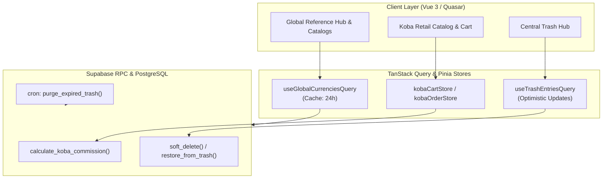
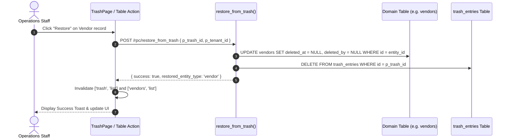

# Global Reference, Koba Vertical & Central Trash — Technical Design Document (TDD)

## 1. System Architecture & High-Level Design

---

## 2. Core Business Algorithms & State Machines

### 2.1 Koba Profit Sharing & Fee Deductions
When an order item is customized with an adjusted sell price:

$$\text{Markup GBP} = \max(0, \text{Sell Price GBP} - \text{Base List Price GBP})$$

$$\text{Agent Markup Share} = \text{Markup GBP} \times \left(\frac{\text{extra\_profit\_user\_pct}}{100}\right) \times \text{FX Rate}$$

$$\text{Company Markup Share} = \text{Markup GBP} \times \left(\frac{\text{extra\_profit\_company\_pct}}{100}\right) \times \text{FX Rate}$$

$$\text{COD Deduction} = \text{Order Total BDT} \times \left(\frac{\text{cod\_charge\_pct}}{100}\right)$$

$$\text{Net Agent Commission} = \text{Agent Markup Share} - (\text{COD Deduction} + \text{packing\_fee\_flat} + \text{invoice\_fee\_flat})$$

---

### 2.2 Soft Delete & Central Trash Directory Lifecycle

---

## 3. Frontend Architecture & Caching Strategy

| Domain Query Key | Stale Time | Cache Time | Invalidation Triggers |
| :--- | :--- | :--- | :--- |
| `['global-reference', 'currencies']` | 24 hours | 24 hours | Currency exchange rate update by Superadmin |
| `['global-reference', 'markets']` | 10 minutes | 30 minutes | Market configuration changes |
| `['koba', 'products', filters]` | 60 seconds | 5 minutes | Ingestion of newly scraped catalog items |
| `['koba', 'cart', tenantId]` | 15 seconds | 2 minutes | Item addition, price override, quantity update |
| `['trash', 'list', tenantId]` | 30 seconds | 5 minutes | Move to trash, restore, or permanent purge |

---

## 4. Security, RLS & Edge Cases

### 4.1 Unique Constraint Collision on Restore
- **Problem**: A user deletes a product with SKU `TSHIRT-01`, creates a new product with the same SKU `TSHIRT-01`, and subsequently attempts to restore the original trashed product.
- **Handling**: `restore_from_trash` checks uniqueness before execution. If a conflict occurs, it halts with error code `ERR_DUPLICATE_KEY` and prompts the user to rename or resolve the conflict prior to restoration.

### 4.2 Immutable Financial Trail
- Financial ledgers (`universal_wallets`, `ledger_transactions`), issued invoices (`sales_invoices`), and active in-transit shipments (`global_shipments`) are explicitly barred at the database trigger level from soft-deletion. Any attempt throws an unhandled database exception `ERR_IMMUTABLE_FINANCIAL_RECORD`.
