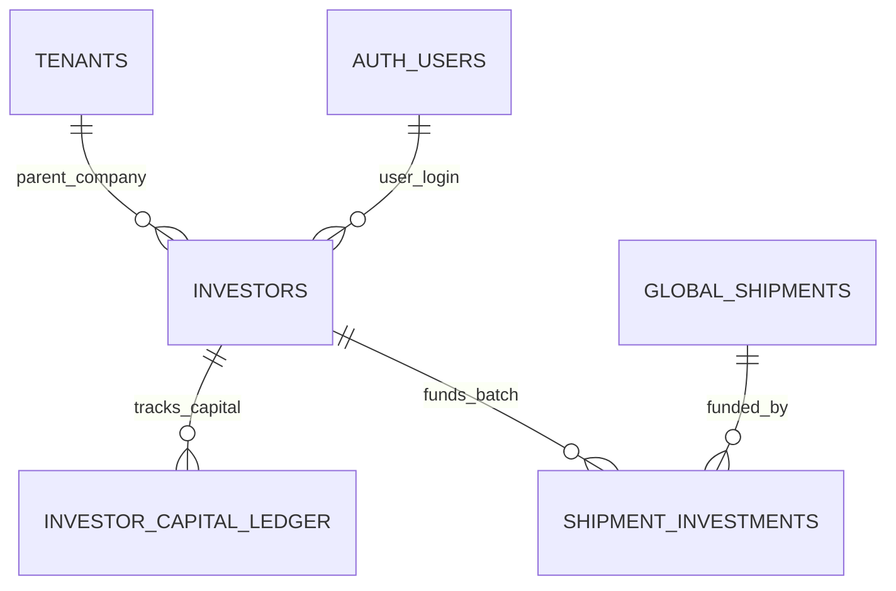

# Investor Portal & Capital — Data Model & Schema Specification

> **Module Schema Target**: `supabase/schemas/investor/`  
> **Source Tables**: `investors`, `investor_capital_ledger`, `shipment_investments`

---

## 1. Entity Relationship Diagram



---

## 2. Declarative SQL Schema & Types

### 2.1 Domain Enums

```sql
-- Capital transaction types
create type public.investor_transaction_type as enum (
  'capital_in',
  'withdrawal_paid',
  'profit_credit',
  'adjustment'
);
```

### 2.2 Primary Database Tables

```sql
-- 1. Investor Partner Profiles
create table if not exists public.investors (
  id uuid primary key default gen_random_uuid(),
  parent_tenant_id uuid not null references public.tenants(id) on delete cascade,
  user_id uuid references auth.users(id) on delete set null,
  name text not null,
  email text,
  phone text,
  total_deposited numeric(16, 2) not null default 0,
  current_balance numeric(16, 2) not null default 0,
  is_active boolean not null default true,
  created_at timestamptz not null default now(),
  updated_at timestamptz not null default now(),
  constraint uq_investor_name unique (parent_tenant_id, name)
);

-- 2. Capital Partner Ledger
create table if not exists public.investor_capital_ledger (
  id uuid primary key default gen_random_uuid(),
  parent_tenant_id uuid not null references public.tenants(id) on delete cascade,
  investor_id uuid not null references public.investors(id) on delete cascade,
  transaction_type public.investor_transaction_type not null,
  amount numeric(16, 2) not null check (amount > 0),
  balance_before numeric(16, 2) not null,
  balance_after numeric(16, 2) not null,
  reference_no text,
  notes text,
  created_by uuid references auth.users(id),
  created_at timestamptz not null default now()
);

-- 3. Shipment Batch Cost-Share Allocations
create table if not exists public.shipment_investments (
  id uuid primary key default gen_random_uuid(),
  parent_tenant_id uuid not null references public.tenants(id) on delete cascade,
  shipment_id uuid not null references public.global_shipments(id) on delete cascade,
  investor_id uuid not null references public.investors(id) on delete cascade,
  cost_share_pct numeric(6, 4) not null check (cost_share_pct > 0 and cost_share_pct <= 1.0),
  allocated_capital_amount numeric(16, 2) default 0,
  realized_profit_share numeric(16, 2) default 0,
  created_at timestamptz not null default now(),
  updated_at timestamptz not null default now(),
  constraint uq_investor_shipment unique (shipment_id, investor_id)
);
```

---

## 3. Row Level Security (RLS) Policies

```sql
alter table public.investors enable row level security;
alter table public.investor_capital_ledger enable row level security;
alter table public.shipment_investments enable row level security;

create policy "Investors can view their own profile"
  on public.investors for select
  using (user_id = auth.uid());

create policy "Staff can manage tenant investors"
  on public.investors for all
  using (
    parent_tenant_id in (
      select tm.tenant_id from public.tenant_members tm where tm.user_id = auth.uid()
    )
  );
```
