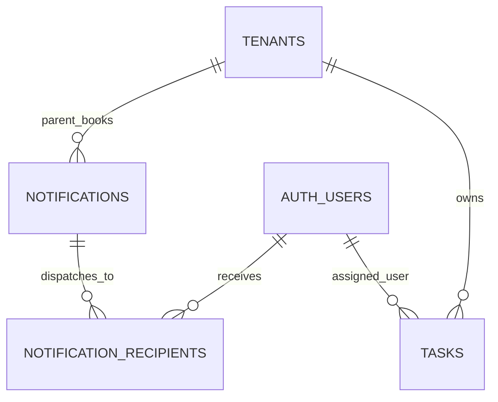

# Tasks & Notifications — Data Model & Schema Specification

> **Module Schema Target**: `supabase/schemas/notifications/`  
> **Source Tables**: `notifications`, `notification_recipients`, `tasks`, `user_notification_preferences`

---

## 1. Entity Relationship Diagram



---

## 2. Declarative SQL Schema & Types

### 2.1 Domain Enums

```sql
-- Task priority levels
create type public.task_priority as enum (
  'low',
  'medium',
  'high',
  'urgent'
);

-- Task completion status
create type public.task_status as enum (
  'pending',
  'in_progress',
  'completed',
  'cancelled'
);
```

### 2.2 Primary Database Tables

```sql
-- 1. Notifications Event Log
create table if not exists public.notifications (
  id uuid primary key default gen_random_uuid(),
  parent_tenant_id uuid not null references public.tenants(id) on delete cascade,
  operating_tenant_id uuid references public.tenants(id) on delete set null,
  event_type text not null, -- 'order.created', 'shipment.received', 'task.assigned', etc.
  title text not null,
  message text not null,
  action_url text,
  metadata jsonb not null default '{}'::jsonb,
  created_at timestamptz not null default now()
);

-- 2. Notification Recipients (Per-User Inbox & Read State)
create table if not exists public.notification_recipients (
  id uuid primary key default gen_random_uuid(),
  notification_id uuid not null references public.notifications(id) on delete cascade,
  user_id uuid not null references auth.users(id) on delete cascade,
  read_at timestamptz,
  is_dismissed boolean not null default false,
  created_at timestamptz not null default now(),
  constraint uq_notification_user unique (notification_id, user_id)
);

-- 3. Operational Tasks
create table if not exists public.tasks (
  id uuid primary key default gen_random_uuid(),
  parent_tenant_id uuid not null references public.tenants(id) on delete cascade,
  operating_tenant_id uuid references public.tenants(id) on delete set null,
  title text not null,
  description text,
  priority public.task_priority not null default 'medium',
  status public.task_status not null default 'pending',
  assigned_to_user_id uuid references auth.users(id) on delete set null,
  due_date date,
  
  -- Entity Association
  entity_type text, -- 'shipment', 'sales_invoice', 'shop_order', 'customer'
  entity_id uuid,
  
  completed_at timestamptz,
  completed_by_user_id uuid references auth.users(id),
  created_by uuid references auth.users(id),
  created_at timestamptz not null default now(),
  updated_at timestamptz not null default now()
);
```

---

## 3. Row Level Security (RLS) Policies

```sql
alter table public.notifications enable row level security;
alter table public.notification_recipients enable row level security;
alter table public.tasks enable row level security;

create policy "Users can view their own notification recipients"
  on public.notification_recipients for select
  using (user_id = auth.uid());

create policy "Staff can view tenant tasks"
  on public.tasks for select
  using (
    parent_tenant_id in (
      select tm.tenant_id from public.tenant_members tm where tm.user_id = auth.uid()
    )
  );
```
