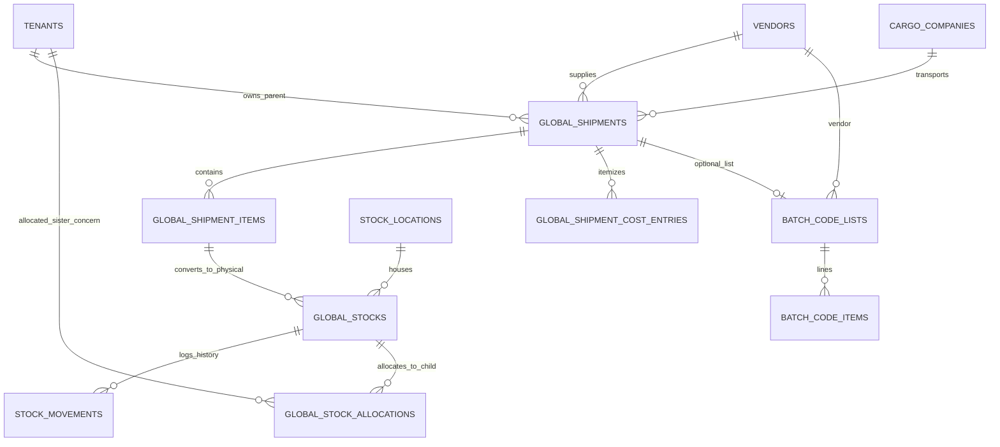

# Procurement & Stock — Data Model & Schema Specification

> **Module Schema Target**: `supabase/schemas/procurement/`  
> **Tables Target**: `supabase/schemas/procurement/02_tables.sql`  
> **RLS Policies Target**: `supabase/schemas/procurement/04_rls.sql`  
> **Types Target**: `supabase/schemas/procurement/01_types.sql`  

---

## 1. Entity Relationship Diagram



---

## 2. Declarative SQL Schema & Types

### 2.1 Domain Enums

```sql
-- Lifecycle status of inbound batch
create type public.global_shipment_status as enum (
  'draft',
  'in_transit',
  'received',
  'cancelled'
);

-- Stock inventory availability state
create type public.stock_availability as enum (
  'sellable',
  'held',
  'unsellable'
);

-- Hierarchical warehouse location type
create type public.stock_location_type as enum (
  'warehouse',
  'room',
  'shelf',
  'bin'
);

-- Immutable stock movement action types
create type public.stock_movement_type as enum (
  'inbound_receive',
  'transfer_location',
  'grade_change',
  'allocation_change',
  'sale_outbound',
  'return_inbound',
  'audit_adjustment'
);
```

### 2.2 Primary Database Tables

```sql
-- 1. Inbound International Shipments
create table if not exists public.global_shipments (
  id uuid primary key default gen_random_uuid(),
  tenant_id uuid not null references public.tenants(id) on delete cascade,
  vendor_id uuid references public.vendors(id) on delete set null,
  cargo_company_id uuid references public.cargo_companies(id) on delete set null,
  shipment_no text not null,
  status public.global_shipment_status not null default 'draft',
  progress_tag_id uuid references public.tags(id) on delete set null,
  
  -- Financial & Book Locking
  costs_locked boolean not null default false,
  costs_locked_at timestamptz,
  costs_locked_by uuid references auth.users(id),
  
  -- Archiving Governance
  is_archived boolean not null default false,
  archived_at timestamptz,
  archived_by uuid references auth.users(id),
  
  -- Totals & Logistics
  total_weight_kg numeric(12, 3) default 0,
  goods_total_bdt numeric(14, 2) default 0,
  freight_total_bdt numeric(14, 2) default 0,
  customs_total_bdt numeric(14, 2) default 0,
  landed_cost_total_bdt numeric(14, 2) default 0,
  
  assigned_child_tenant_id uuid references public.tenants(id) on delete set null,
  note text,
  metadata jsonb not null default '{}'::jsonb,
  created_at timestamptz not null default now(),
  updated_at timestamptz not null default now(),
  
  constraint uq_shipment_no_per_tenant unique (tenant_id, shipment_no)
);

-- 2. Line Items inside Shipment
create table if not exists public.global_shipment_items (
  id uuid primary key default gen_random_uuid(),
  shipment_id uuid not null references public.global_shipments(id) on delete cascade,
  product_id uuid references public.products(id) on delete set null,
  sku text,
  name text not null,
  quantity numeric(12, 3) not null check (quantity > 0),
  purchase_price numeric(14, 2) not null check (purchase_price >= 0),
  purchase_currency text not null default 'BDT',
  purchase_fx_rate numeric(12, 6) not null default 1.0,
  unit_weight_kg numeric(12, 3) default 0,
  landed_cost_bdt numeric(14, 2), -- Stamped by Landed Cost Engine
  created_at timestamptz not null default now(),
  updated_at timestamptz not null default now()
);

-- 3. Itemized Cost Entries for Apportionment
create table if not exists public.global_shipment_cost_entries (
  id uuid primary key default gen_random_uuid(),
  shipment_id uuid not null references public.global_shipments(id) on delete cascade,
  cost_type text not null, -- 'goods', 'freight', 'customs', 'handling', 'insurance'
  amount numeric(14, 2) not null check (amount >= 0),
  currency text not null default 'BDT',
  fx_rate numeric(12, 6) not null default 1.0,
  amount_bdt numeric(14, 2) not null check (amount_bdt >= 0),
  apportionment_method text not null default 'by_weight', -- 'by_weight', 'by_value', 'manual'
  notes text,
  created_at timestamptz not null default now()
);

-- 4. Warehouse Physical Stock Pool
create table if not exists public.global_stocks (
  id uuid primary key default gen_random_uuid(),
  tenant_id uuid not null references public.tenants(id) on delete cascade,
  shipment_item_id uuid not null references public.global_shipment_items(id) on delete cascade,
  product_id uuid references public.products(id) on delete set null,
  location_id uuid references public.stock_locations(id) on delete set null,
  quantity numeric(12, 3) not null check (quantity >= 0),
  available_atp numeric(12, 3) not null check (available_atp >= 0),
  availability public.stock_availability not null default 'sellable',
  landed_unit_cost_bdt numeric(14, 2) not null,
  created_at timestamptz not null default now(),
  updated_at timestamptz not null default now()
);

-- 5. Warehouse Tree Locations
create table if not exists public.stock_locations (
  id uuid primary key default gen_random_uuid(),
  tenant_id uuid not null references public.tenants(id) on delete cascade,
  parent_id uuid references public.stock_locations(id) on delete cascade,
  name text not null,
  code text not null,
  location_type public.stock_location_type not null,
  is_leaf boolean not null default false,
  is_active boolean not null default true,
  created_at timestamptz not null default now(),
  constraint uq_location_code_per_tenant unique (tenant_id, code)
);

-- 6. Stock Movements Audit Ledger
create table if not exists public.stock_movements (
  id uuid primary key default gen_random_uuid(),
  tenant_id uuid not null references public.tenants(id) on delete cascade,
  stock_id uuid not null references public.global_stocks(id) on delete cascade,
  movement_type public.stock_movement_type not null,
  quantity numeric(12, 3) not null,
  from_location_id uuid references public.stock_locations(id) on delete set null,
  to_location_id uuid references public.stock_locations(id) on delete set null,
  from_availability public.stock_availability,
  to_availability public.stock_availability,
  reference_type text, -- 'shipment', 'invoice', 'transfer', 'manual'
  reference_id uuid,
  notes text,
  created_by uuid references auth.users(id),
  created_at timestamptz not null default now()
);
```

---

## 3. Row Level Security (RLS) Policies

```sql
alter table public.global_shipments enable row level security;
alter table public.global_stocks enable row level security;
alter table public.stock_locations enable row level security;
alter table public.stock_movements enable row level security;

-- Parent Tenant and Authorized Members Access
create policy "Staff can view tenant shipments"
  on public.global_shipments for select
  using (
    tenant_id in (
      select tm.tenant_id from public.tenant_members tm where tm.user_id = auth.uid()
    )
  );

create policy "Staff can view warehouse stocks"
  on public.global_stocks for select
  using (
    tenant_id in (
      select tm.tenant_id from public.tenant_members tm where tm.user_id = auth.uid()
    )
  );
```

---

## 4. Batch Code Analyze (live SQL in `supabase/schemas/procurement/`)

Not `batch_code_pc`. Parent-owned like `global_shipment_boxes`.

**`batch_code_lists`:** `id`, `parent_tenant_id`, `name` (required), `shipment_id` (optional → `global_shipments`), `vendor_id` (`vendors`), `created_at`, `updated_at`. At most one row per non-null `shipment_id`.

**`batch_code_items`:** `id`, `list_id` (required), `barcode`, `product_code`, `batch_id`, `manufacturing_date`, `expire_date`, timestamps. Duplicates allowed. No unique on barcode/batch.

**Expiry:** empty expire + mfg → mfg + 36 calendar months. Hand-edited expire is kept until cleared. **Expires in** is not a column.

**RLS:** parent staff who can manage the tenant (same pattern as shipment boxes).
