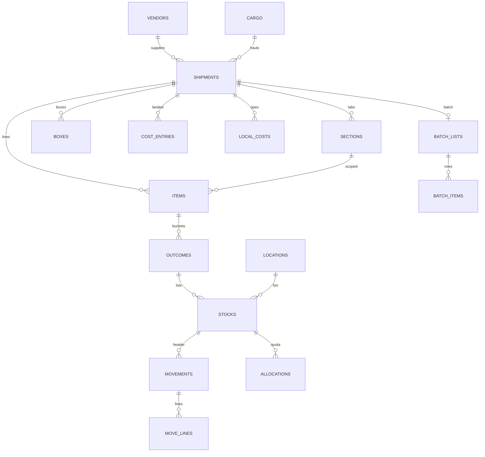
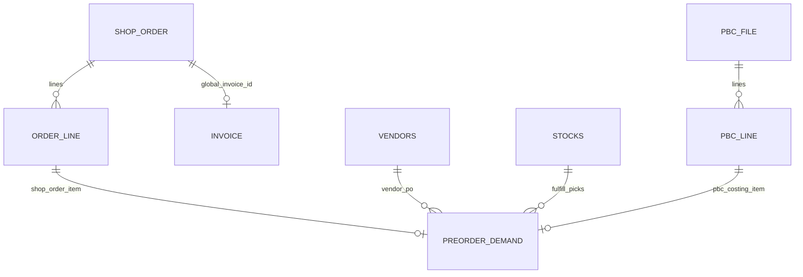
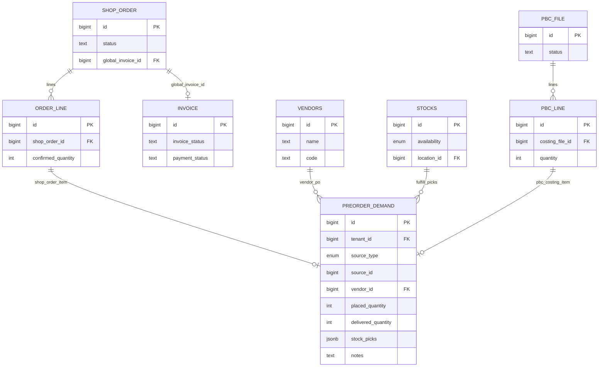

# Procurement & Stock — Data Model & Schema Specification

> **Module Schema Target**: `supabase/schemas/procurement/`  
> **Tables Target**: `supabase/schemas/procurement/02_tables.sql`  
> **RLS Policies Target**: `supabase/schemas/procurement/04_rls.sql`  
> **Types Target**: `supabase/schemas/procurement/01_types.sql`  

---

## 1. ERD

Short names = `global_*`. `OUTCOMES` is target. Live SQL: `supabase/schemas/procurement/02_tables.sql`. **Demand / Delivery paper** has its own ERD in [§1b](#1b-demand--delivery-paper-erd) (not mixed with inbound).

### Inbound & warehouse — overview


```mermaid
%%{init: {"er": {"useMaxWidth": true, "layoutDirection": "TB", "minEntityWidth": 220, "minEntityHeight": 90, "entityPadding": 24, "fontSize": 16, "diagramPadding": 32}}}%%
erDiagram
    direction TB
    VENDORS ||--o{ SHIPMENTS : supplies
    CARGO ||--o{ SHIPMENTS : hauls
    SHIPMENTS ||--o{ SECTIONS : tabs
    SHIPMENTS ||--o{ ITEMS : lines
    SECTIONS ||--o{ ITEMS : scoped
    SHIPMENTS ||--o{ BOXES : boxes
    SHIPMENTS ||--o{ COST_ENTRIES : landed
    SHIPMENTS ||--o{ LOCAL_COSTS : opex
    SHIPMENTS ||--o| BATCH_LISTS : batch
    BATCH_LISTS ||--o{ BATCH_ITEMS : rows
    ITEMS ||--o{ OUTCOMES : buckets
    OUTCOMES ||--o{ STOCKS : lots
    LOCATIONS ||--o{ STOCKS : bin
    STOCKS ||--o{ MOVEMENTS : header
    MOVEMENTS ||--o{ MOVE_LINES : lines
    STOCKS ||--o{ ALLOCATIONS : quota
```

### Inbound & warehouse — details

Columns on the box (no `created_at` / `updated_at`). Same links as overview.


```mermaid
%%{init: {"er": {"useMaxWidth": true, "layoutDirection": "TB", "minEntityWidth": 220, "minEntityHeight": 90, "entityPadding": 24, "fontSize": 16, "diagramPadding": 32}}}%%
erDiagram
    direction TB
    VENDORS ||--o{ SHIPMENTS : supplies
    CARGO ||--o{ SHIPMENTS : hauls
    SHIPMENTS ||--o{ SECTIONS : tabs
    SHIPMENTS ||--o{ ITEMS : lines
    SECTIONS ||--o{ ITEMS : scoped
    SHIPMENTS ||--o{ BOXES : boxes
    SHIPMENTS ||--o{ COST_ENTRIES : landed
    SHIPMENTS ||--o{ LOCAL_COSTS : opex
    SHIPMENTS ||--o| BATCH_LISTS : batch
    BATCH_LISTS ||--o{ BATCH_ITEMS : rows
    ITEMS ||--o{ OUTCOMES : buckets
    OUTCOMES ||--o{ STOCKS : lots
    LOCATIONS ||--o{ STOCKS : bin
    STOCKS ||--o{ MOVEMENTS : header
    MOVEMENTS ||--o{ MOVE_LINES : lines
    STOCKS ||--o{ ALLOCATIONS : quota

    VENDORS {
        bigint id PK
        text name
        text code
        text market_code
        bigint parent_tenant_id
        text email
        text phone
        text address
        text website
        bool is_default
    }
    CARGO {
        bigint id PK
        bigint parent_tenant_id
        text name
        text code
        text phone
        text email
        text address
        text notes
        bigint wallet_entity_id
        bool is_active
        bool is_default
    }
    SHIPMENTS {
        bigint id PK
        bigint parent_tenant_id FK
        text name
        int tenant_shipment_id
        enum type
        text status
        bigint purchase_currency_id
        bigint cost_currency_id
        numeric received_weight
        numeric total_weight_kg
        bool stock_ready
        date received_date
        numeric cargo_invoice_total
        numeric purchase_invoice_total
        bigint assigned_child_tenant_id
        bigint vendor_id FK
        bigint cargo_company_id FK
        bigint progress_tag_id
        bigint progress_flow_id
        text public_tracking_token
        bool is_archived
        timestamptz archived_at
        bool costs_locked
        timestamptz costs_locked_at
        uuid costs_locked_by
        bool is_closed
    }
    SECTIONS {
        bigint id PK
        bigint parent_tenant_id FK
        bigint shipment_id FK
        bigint vendor_id FK
        text title
        int sort_order
        jsonb metadata
    }
    BOXES {
        bigint id PK
        bigint parent_tenant_id
        bigint shipment_id FK
        text box_number
        numeric received_weight
        numeric shipping_weight
    }
    ITEMS {
        bigint id PK
        bigint shipment_id FK
        bigint product_id
        text name
        int ordered_quantity
        int received_quantity
        text image_url
        enum add_method
        numeric purchase_price
        numeric product_weight
        numeric package_weight
        text barcode
        text product_code
        bigint source_child_tenant_id
        bigint vendor_id
        int sort_order
        numeric landed_cost_bdt
        bigint section_id
    }
    OUTCOMES {
        bigint id PK
        bigint shipment_item_id FK
        int quantity
        text kind
        text reason
        numeric purchase_price
        numeric cost
        text description
        text batch_label
    }
    COST_ENTRIES {
        bigint id PK
        bigint parent_tenant_id
        bigint shipment_id FK
        enum cost_type
        numeric amount
        bigint currency_id
        numeric exchange_rate
        text payment_source
        text entity_type
        bigint entity_id
        text allocation
        jsonb metadata
        timestamptz settled_at
        uuid settlement_ledger_id
        bigint section_id
    }
    LOCAL_COSTS {
        bigint id PK
        bigint parent_tenant_id
        bigint shipment_id FK
        bigint section_id FK
        text description
        numeric amount
        bigint currency_id FK
    }
    BATCH_LISTS {
        bigint id PK
        bigint parent_tenant_id
        bigint shipment_id FK
    }
    BATCH_ITEMS {
        bigint id PK
        bigint list_id FK
        text barcode
        text product_code
        text batch_id
        date manufacturing_date
        date expire_date
        bool is_arrived
    }
    STOCKS {
        bigint id PK
        bigint parent_tenant_id
        bigint outcome_id FK
        bigint stock_type_id
        int quantity
        bool is_usable
        enum availability
        bigint location_id FK
        bigint grade_tag_id
    }
    LOCATIONS {
        bigint id PK
        bigint parent_tenant_id
        text code
        text name
        enum kind
        bool is_default
        bool is_pickable
        int sort_order
        bool is_active
        bigint parent_location_id FK
    }
    MOVEMENTS {
        bigint id PK
        bigint tenant_id
        text movement_no
        enum movement_type
        text reference_type
        text reference_id
        text notes
        text created_by_email
        bool is_posted
        timestamptz posted_at
    }
    MOVE_LINES {
        bigint id PK
        bigint movement_id FK
        bigint stock_id FK
        bigint from_location_id
        bigint to_location_id
        enum from_availability
        enum to_availability
        numeric quantity
        bigint from_grade_tag_id
        bigint to_grade_tag_id
    }
    ALLOCATIONS {
        bigint id PK
        bigint parent_tenant_id
        bigint child_tenant_id FK
        bigint stock_id FK
        int quantity
    }
```

Map (inbound): `VENDORS` · `CARGO` · `SHIPMENTS` · `SECTIONS` · `ITEMS` · `BOXES` · `OUTCOMES` · `COST_ENTRIES` · `LOCAL_COSTS` · `BATCH_LISTS` · `BATCH_ITEMS` · `STOCKS` · `LOCATIONS` · `MOVEMENTS` · `MOVE_LINES`. **Retire** `ALLOCATIONS` / `global_stock_allocations` ([PS9](00-gaps.md)).

### 1 inbound — warehouse stock locations

Table: `public.stock_locations` (one row per node). Tree via `parent_location_id`. Scoped by `parent_tenant_id` (stock-owning parent tenant).

| Kind | Parent | Role |
| :--- | :--- | :--- |
| `warehouse` | — (root) | Site / building |
| `returns` | — (root) | Returns area (not pickable by default) |
| `zone` | `warehouse` or `returns` | Aisle / zone |
| `shelf` | `zone` | Shelf row |
| `level` | `shelf` | Shelf level |
| `bin` | `level` | **Leaf** — `global_stocks.location_id` points here; default put-away |

Enforced in `_validate_stock_location_nesting`. Leaf = no active children (`_stock_location_is_leaf`). RPCs: `list_stock_locations`, `upsert_stock_location`, `delete_stock_location`, `set_default_stock_location`, `ensure_default_stock_location` (bootstrap `MAIN` → … → `MAIN-BIN`).

---

## 1b. Demand & Delivery paper ERD

One table `preorder_demand`, two desks ([01 US-4](01-prd.md)). Live SQL: `public.preorder_demand` in `supabase/schemas/public.sql`. Touches warehouse **STOCKS** (§1) via `stock_picks` jsonb, not shipment receive.

Map: `SHOP_ORDER` shop_orders · `ORDER_LINE` shop_order_items · `PBC_FILE` product_based_costing_files · `PBC_LINE` product_based_costing_items · `PREORDER_DEMAND` preorder_demand · `VENDORS` vendors · `STOCKS` global_stocks · `INVOICE` sales_invoices (handoff from Delivery paper; live proforma, target take/condition bills after close). No separate checklist table.

### Demand & Delivery paper — overview


```mermaid
%%{init: {"er": {"useMaxWidth": true, "layoutDirection": "TB", "minEntityWidth": 220, "minEntityHeight": 90, "entityPadding": 24, "fontSize": 16, "diagramPadding": 32}}}%%
erDiagram
    direction TB
    SHOP_ORDER ||--o{ ORDER_LINE : lines
    PBC_FILE ||--o{ PBC_LINE : lines
    ORDER_LINE ||--o| PREORDER_DEMAND : shop_order_item
    PBC_LINE ||--o| PREORDER_DEMAND : pbc_costing_item
    VENDORS ||--o{ PREORDER_DEMAND : vendor_po
    STOCKS ||--o{ PREORDER_DEMAND : fulfill_picks
    SHOP_ORDER ||--o| INVOICE : global_invoice_id
```

### Demand & Delivery paper — details


```mermaid
%%{init: {"er": {"useMaxWidth": true, "layoutDirection": "TB", "minEntityWidth": 220, "minEntityHeight": 90, "entityPadding": 24, "fontSize": 16, "diagramPadding": 32}}}%%
erDiagram
    direction TB
    SHOP_ORDER ||--o{ ORDER_LINE : lines
    PBC_FILE ||--o{ PBC_LINE : lines
    ORDER_LINE ||--o| PREORDER_DEMAND : shop_order_item
    PBC_LINE ||--o| PREORDER_DEMAND : pbc_costing_item
    VENDORS ||--o{ PREORDER_DEMAND : vendor_po
    STOCKS ||--o{ PREORDER_DEMAND : fulfill_picks
    SHOP_ORDER ||--o| INVOICE : global_invoice_id

    SHOP_ORDER {
        bigint id PK
        text status
        bigint global_invoice_id FK
    }
    PBC_FILE {
        bigint id PK
        text status
    }
    ORDER_LINE {
        bigint id PK
        bigint shop_order_id FK
        int confirmed_quantity
    }
    PBC_LINE {
        bigint id PK
        bigint costing_file_id FK
        int quantity
    }
    PREORDER_DEMAND {
        bigint id PK
        bigint tenant_id FK
        enum source_type
        bigint source_id
        bigint vendor_id FK
        int placed_quantity
        int delivered_quantity
        jsonb stock_picks
        text notes
    }
    VENDORS {
        bigint id PK
        text name
        text code
    }
    STOCKS {
        bigint id PK
        enum availability
        bigint location_id FK
    }
    INVOICE {
        bigint id PK
        text invoice_status
        text payment_status
    }
```

| Desk | Writes on `preorder_demand` | Parent document status |
| :--- | :--- | :--- |
| **Demand** | `vendor_id`, `placed_quantity` | `procuring` on shop order / PBC file |
| **Delivery paper** | `stock_picks` → `delivered_quantity` | → `packed` → close (take / condition / return) → `delivered` |

Unique `(source_type, source_id)`. Open need: `get_procurement_demand_open_qty`. `stock_picks[]`: `global_stock_id`, `quantity` (→ **STOCKS**). List RPCs group by shop order or PBC file ([03 §5](03-api-contract.md)). Dropship merchant bill at ship: [shop_order](../shop_order/01-prd.md), not this diagram.

---

## 2. Declarative SQL Schema & Types

### 2.1 Domain Enums

```sql
-- Lifecycle status of inbound batch
create type public.global_shipment_status as enum (
  'draft',
  'in_transit',
  'received',
  'cancelled'
);

-- Stock inventory availability state
create type public.stock_availability as enum (
  'sellable',
  'held',
  'unsellable'
);

-- Warehouse location kind (`stock_locations.kind`)
create type public.stock_location_kind as enum (
  'warehouse',
  'zone',
  'shelf',
  'level',
  'bin',
  'returns'
);

-- Immutable stock movement action types
create type public.stock_movement_type as enum (
  'inbound_receive',
  'transfer_location',
  'grade_change',
  'allocation_change',
  'sale_outbound',
  'return_inbound',
  'audit_adjustment'
);
```

**Wholesale delivery (target):** pack-out is not `sale_outbound`. Units go `sellable` → `held` on the Delivery paper desk. Close each packed qty (dropdown): **take** → `sale_outbound` + take invoice; **condition** stays `held` + condition invoice (may be unpaid); goods on condition may later return → `sellable` and that bill is voided/credited; **return** at close → `sellable`, no bill. Dropship picks already use `held` until ship.

**Receive outcomes (target):** [US-7](01-prd.md). Child table `global_shipment_item_outcomes`. Paste → first row **kind `sellable`**, **reason `ordered`** (paper qty). After land, **add** rows beside it (`general` = default received). Do not shrink ordered. **Receive / post** requires land extras (not `ordered`, not `vendor_discount`) to sum to `ordered_quantity` per line — staff book leftover; do not auto-fill ([PS11](00-gaps.md)). Optional `description`, batch **text** (no FK). No `stock_id`.

- **`kind`:** `sellable` \| `unsellable` — lot vs loss.
- **`reason`:** `ordered` \| `general` \| `vendor_discount` \| `missing` \| `damaged` \| `other`. `other` → `description`.

**Stock:** only **non-ordered** rows. `sellable` → lot (`outcome_id`). `unsellable` → loss (no sellable lot). Damaged may still be sellable. Warehouse later damage/expire → `stock_movements`, not a rewrite of ordered. Leftover vs ordered is **not** auto-filled; receive is blocked until staff book it ([PS11](00-gaps.md)).

**Ownership**

| Live today (`global_shipment_items`) | After US-7 |
| :--- | :--- |
| One `purchase_price` + `received_quantity` + `landed_cost_bdt` per line | **Outcomes** hold qty, purchase price, landed `cost`, kind/reason. Line is product + ordered qty + weights + section. |

**Live:** lots FK `outcome_id`; unique grain `(outcome_id, availability, location_id, grade_tag_id)`. Keep `shipment_item_id` for joins until wean complete.

**Cargo:** never reduce cargo/duty on `global_shipment_cost_entries`. Vendor price agreements → `global_shipment_outcome_vendor_credits` (record only; does not change outcomes or lots). Cost entries: optional `section_id`; **no** pay/settle in this module ([PS12](00-gaps.md)).

**Restamp:** post/receive paths only (not vendor credit). Qty still out: return inbound first, or **stop**.

**Close:** `global_shipments.is_closed` ([US-9](01-prd.md)). Writes blocked.

**Local costs (target):** [US-8](01-prd.md). `global_shipment_local_costs`: `shipment_id`, optional `section_id`, `description`, `amount` ≥ 0, `currency_id`. Stamp ignores. Profit subtracts. Not wallet.

**Allocations:** live `ALLOCATIONS` box below is **retire** ([PS9](00-gaps.md)). Not a product feature.

Vendor AP ledger = later, not this cut.


## 3. Row Level Security (RLS) Policies

```sql
alter table public.global_shipments enable row level security;
alter table public.global_stocks enable row level security;
alter table public.stock_locations enable row level security;
alter table public.stock_movements enable row level security;

-- Parent Tenant and Authorized Members Access
create policy "Staff can view tenant shipments"
  on public.global_shipments for select
  using (
    tenant_id in (
      select tm.tenant_id from public.tenant_members tm where tm.user_id = auth.uid()
    )
  );

create policy "Staff can view warehouse stocks"
  on public.global_stocks for select
  using (
    tenant_id in (
      select tm.tenant_id from public.tenant_members tm where tm.user_id = auth.uid()
    )
  );
```

---

## 3b. `global_shipment_boxes` (live SQL in `supabase/schemas/procurement/02_tables.sql`)

Parent-owned physical box weights for inbound shipments (optional; does not drive landed-cost RPCs).

| Column | Type | Notes |
|--------|------|--------|
| `id` | bigint | PK |
| `parent_tenant_id` | bigint | FK `tenants` |
| `shipment_id` | bigint | FK `global_shipments` |
| `box_number` | text | Unique per `(shipment_id, box_number)` |
| `received_weight` | numeric | kg, ≥ 0 |
| `shipping_weight` | numeric | kg, ≥ 0 |
| `created_at`, `updated_at` | timestamptz | |

**RLS:** same pattern as other parent-scoped procurement tables (`user_can_manage_parent_tenant`).

**`vendors` / `cargo_companies` scope:** parent books only (`parent_tenant_id`; no per-row `tenant_id`). **Global vendors:** `parent_tenant_id` null (superadmin). **Tenant vendors / cargo:** `parent_tenant_id` = stock parent. Write RLS: superadmin on globals; `is_network_owner(parent_tenant_id)` or parent **admin** membership on scoped rows.

---

## 3c. `global_shipment_sections` (shipment line-item tabs)

On **`ShipmentLineItemsV2Page`**, the bottom **section tabs** (sheet bar) are persisted rows — not a separate “tab” table. UI label **All** (`sheet_all`) is client-only and shows every line; it has no row.

| Column | Type | Notes |
|--------|------|--------|
| `id` | bigint | PK |
| `parent_tenant_id` | bigint | FK `tenants` (stock parent) |
| `shipment_id` | bigint | FK `global_shipments` (CASCADE delete) |
| `vendor_id` | bigint | FK `vendors` — supplier for this section / invoice slice |
| `title` | text | Tab label; non-blank |
| `sort_order` | int | Tab order (0-based); updated by `reorder_shipment_sections` |
| `metadata` | jsonb | Invoice slice: `invoice_number`, `invoice_date`, `notes`, `carton_ids`, … (`ShipmentSectionMetadata` in UI) |
| `created_at`, `updated_at` | timestamptz | |

**Relations**

- **`global_shipment_items.section_id`** → optional FK to a section. Lines with `section_id` null behave as belonging to the **first** section in tab order when the UI filters by tab. New catalog / paste / manual adds target the **active** section tab.
- **`global_shipment_cost_entries.section_id`** → optional; scopes a landed-cost row to one section when set.
- **`global_shipment_local_costs.section_id`** → optional; same for local opex ([US-8](01-prd.md)).

**Lifecycle**

- `create_shipment_draft` inserts **Section 1** (`sort_order` 0, shipment header `vendor_id`, empty `metadata`).
- Staff add / rename / delete sections and drag-reorder tabs via `shipmentSectionRepository` → table CRUD + `RPC: reorder_shipment_sections`.
- Overview load: `get_shipment_overview_details` returns `sections[]` with items; Pinia `currentShipmentSections`.

**RLS:** same parent-scoped procurement pattern as `global_shipment_items` (`user_can_manage_parent_tenant` on `parent_tenant_id`).

---

## 4. Batch Code Analyze

See **Details** ERD (`BATCH_LISTS` / `BATCH_ITEMS`). One list per shipment. Empty expire + mfg → mfg + 36 months. **Expires in** is UI-only. Demand / Delivery paper: [§1b](#1b-demand--delivery-paper-erd).
