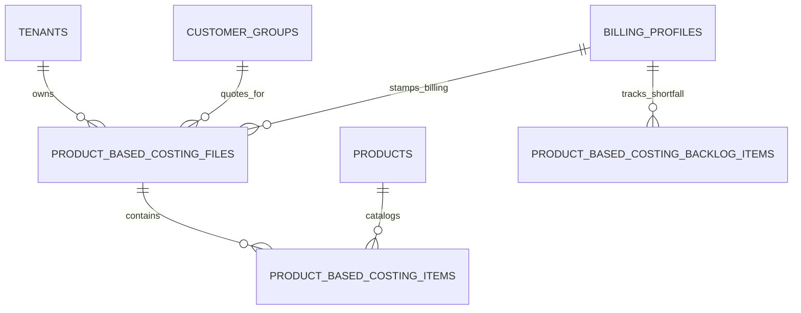

# Product-Based Costing (PBC) — Data Model & Schema Specification

> **Module Schema Target**: `supabase/schemas/costing/` or `supabase/schemas/shop/`  
> **Source Tables**: `product_based_costing_files`, `product_based_costing_items`, `product_based_costing_backlog_items`

---

## 1. Entity Relationship Diagram



---

## 2. Declarative SQL Schema & Types

### 2.1 Domain Enums

```sql
-- PBC File status lifecycle
create type public.product_based_costing_file_status as enum (
  'pending',
  'offered',
  'confirmed',
  'procuring',
  'ready_for_shipment',
  'delivered',
  'cancelled'
);

-- PBC item line outcome
create type public.product_based_costing_item_status as enum (
  'pending',
  'offered',
  'accepted',
  'partial',
  'unavailable',
  'rejected'
);
```

### 2.2 Primary Database Tables

```sql
-- 1. Costing File Header
create table if not exists public.product_based_costing_files (
  id uuid primary key default gen_random_uuid(),
  tenant_id uuid not null references public.tenants(id) on delete cascade,
  file_no text not null,
  title text not null,
  status public.product_based_costing_file_status not null default 'pending',
  
  -- Customer Identity
  customer_group_id uuid not null references public.customer_groups(id) on delete cascade,
  billing_profile_id uuid not null references public.billing_profiles(id) on delete cascade,
  
  -- Currency & FX Configuration
  base_currency text not null default 'GBP',
  target_currency text not null default 'BDT',
  fx_rate numeric(12, 6) not null default 154.50,
  markup_percentage numeric(8, 4) not null default 0.18, -- 18%
  
  -- Totals
  total_base_cost numeric(14, 2) default 0,
  total_quoted_amount_bdt numeric(14, 2) default 0,
  total_items_count int default 0,
  
  note text,
  created_by uuid references auth.users(id),
  created_at timestamptz not null default now(),
  updated_at timestamptz not null default now(),
  constraint uq_pbc_file_no unique (tenant_id, file_no)
);

-- 2. Costing Line Items
create table if not exists public.product_based_costing_items (
  id uuid primary key default gen_random_uuid(),
  costing_file_id uuid not null references public.product_based_costing_files(id) on delete cascade,
  product_id uuid references public.products(id) on delete set null,
  product_name text not null,
  product_url text,
  image_url text,
  
  -- Surcharges & Formula Components
  web_base_price numeric(14, 2) not null check (web_base_price >= 0),
  delivery_surcharge numeric(14, 2) default 0,
  item_type_surcharge numeric(14, 2) default 0,
  item_unit_cost_base numeric(14, 2) not null,
  quoted_unit_price_bdt numeric(14, 2) not null,
  
  -- Quantities & Outcomes
  confirmed_quantity numeric(12, 3) not null default 1 check (confirmed_quantity > 0),
  ordered_quantity numeric(12, 3) default 0,
  delivered_quantity numeric(12, 3) default 0,
  status public.product_based_costing_item_status not null default 'pending',
  
  created_at timestamptz not null default now()
);

-- 3. Demand Backlog Waiting List
create table if not exists public.product_based_costing_backlog_items (
  id uuid primary key default gen_random_uuid(),
  tenant_id uuid not null references public.tenants(id) on delete cascade,
  billing_profile_id uuid not null references public.billing_profiles(id) on delete cascade,
  product_id uuid references public.products(id) on delete set null,
  product_name text not null,
  backlog_quantity numeric(12, 3) not null check (backlog_quantity > 0),
  source_file_id uuid references public.product_based_costing_files(id) on delete set null,
  is_consumed boolean not null default false,
  consumed_file_id uuid references public.product_based_costing_files(id) on delete set null,
  created_at timestamptz not null default now()
);
```

---

## 3. Row Level Security (RLS) Policies

```sql
alter table public.product_based_costing_files enable row level security;
alter table public.product_based_costing_items enable row level security;
alter table public.product_based_costing_backlog_items enable row level security;

create policy "Staff can view tenant costing files"
  on public.product_based_costing_files for select
  using (
    tenant_id in (
      select tm.tenant_id from public.tenant_members tm where tm.user_id = auth.uid()
    )
  );
```
